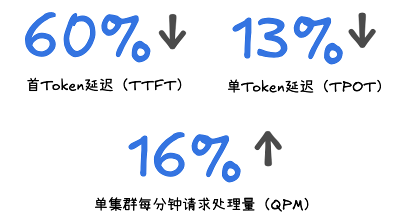
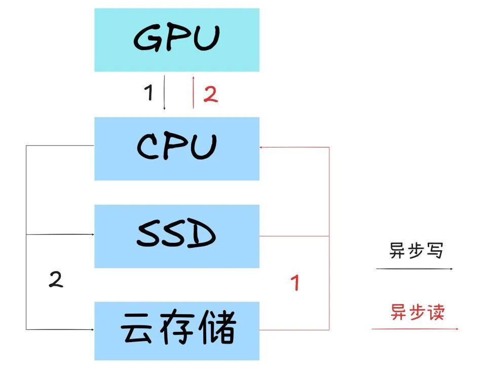

# 腾讯这项省Token技术，成为全球主流推理框架官方方案

> 公众号: 腾讯云
> 发布时间: 2026-04-10 17:59
> 原文链接: https://mp.weixin.qq.com/s/tGJuYAK23ALNDAUSFXw9Mg

---

向大家汇报，全球AI社区携手把Token消耗打下来的最新成果👇

腾讯云一项面向大模型推理优化的关键技术FlexKV，正式合入NVIDIA Dynamo、vLLM、TensorRT-LLM全球三大主流推理技术栈和框架官方主线，成为其官方支持的KV Cache卸载方案。

全球开发者无需改造系统或打补丁，通过基础配置即可启用。

实测数据显示，启用FlexKV后，降本与性能提升显著，尤其是在LLM大规模推理部署场景👇

FlexKV瞄准的KV Cache，是过去几年让AI圈又爱又恨的存在。

一方面，它是大模型推理的必需品。当前主流模型基于Transformer架构，每生成一个新Token，都需要依赖之前的上下文信息。为了避免每次都从头计算，这些中间结果必须被缓存下来——这就是 KV Cache。

但另一方面，它也成了最大的资源黑洞。并发一上来，显存很快被挤满。行业实测显示，在高并发场景下，超过70%的GPU显存都在被KV Cache占用，直接限制了单卡并发能力和上下文长度。

更麻烦的是，一旦缓存装不下被驱逐，再遇到相同上下文就只能重新计算。这些“已经算过但没留下”的内容，反而成为推理成本的主要来源。

在极端情况下，这种重复计算会让单位Token成本提升2–3倍，峰值甚至达到3.5倍。

FlexKV 的思路是：不跟显存死磕容量，而是从存储、复用、调度三个层面系统性地解决问题👇

### //四级KV缓存卸载：容量扩展至百倍

###

既然GPU显存装不下所有缓存，那就不该让所有缓存都挤在显存里。

腾讯云TACO团队研发的FlexKV 构建了GPU → CPU → SSD → 远程存储的四级缓存体系，热数据留在高性能层保证速度，冷数据自动下沉，通过异步流水线机制在不同存储层之间动态流转，全程不阻塞推理计算。

在这一架构下，可用缓存容量最高可扩展至GPU显存的 100 倍以上，把原本受限于显存的容量瓶颈，转化为可调度的分层存储问题。

底层结合高性能I/O技术实现硬件加速，确保数据搬运本身不会成为新的性能瓶颈。

### //分布式 KV 复用：跨节点共享，全局缓存

存得下之后，下一个问题是：不同机器之间的缓存能不能共享？

传统方案中，KV Cache只在单台机器内有效。一旦请求被调度到其他节点，之前算好的缓存就作废了，相同内容照样得重新跑 Prefill(预填充)。

FlexKV基于分布式RadixTree结构，实现了KV Cache在多节点间的统一索引与共享，无需中心化组件即可完成高效访问与同步。

集群规模越大，前缀复用覆盖的请求越多，重复计算的比例就越低——缓存从单机优化能力，演进为整个推理集群的共享资源。

### //KV 感知路由：全链路协同

缓存能力本身并不足以提升整体效率，关键在于能否被调度系统有效利用。

这也是FlexKV合入三大推理框架官方主线之后，真正发挥价值的地方。

在完整链路中：Dynamo负责GPU资源调度 、vLLM/TensorRT-LLM负责推理执行、FlexKV 负责缓存管理与复用 。

系统会优先将请求路由到缓存命中率更高的节点：命中缓存直接加载，未命中部分再计算，新缓存异步下沉并同步全局。

这个端到端的协同闭环，从源头减少冗余计算，在典型业务场景下显著压缩首Token延迟，并提升整体吞吐能力。

以上，是FlexKV面对浩瀚的大模型世界所做的一点工作。

除此之外，FlexKV即插即用的能力，可以灵活适配各类主流推理框架。目前还在持续拓展生态，与SGLang、Mooncake等社区共同建设相关能力。

欢迎关注👉[FlexKV](https://github.com/taco-project/FlexKV)项目进展，或者加入官方技术交流群

拥抱开源，回馈开源。

腾讯一直在路上。

---

