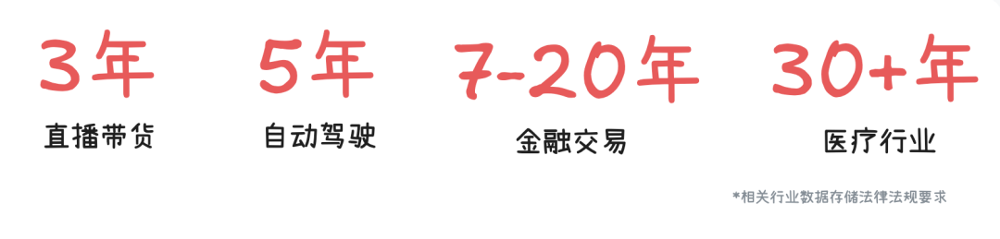
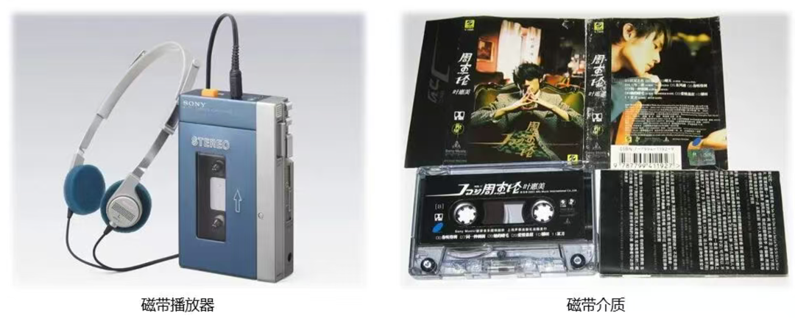

# 买磁带，存冷冷冷冷冷冷冷数据

> 公众号: 腾讯云
> 发布时间: 2026-04-13 21:14
> 原文链接: https://mp.weixin.qq.com/s/pBlUqSeTzJcwZyxB6aDRVg

---

存储太贵？不允许还有人不知道这款良心产品👇

腾讯云“磁带库”（COS -深度归档存储），价格低至 0.01元起/GB/月。

这是专门为极冷数据设计的企业级存储服务，适合一年几乎不访问，但必须长期保存180天以上的历史数据。

这些年，HDD越来越贵，冷数据却只会越来越多。一边是AI大模型扩建，全球都在抢硬盘产能，HDD供应趋紧、价格上涨。

另一边是各行各业的数据持续堆积，金融、政务、医疗、自动驾驶等领域都面临明确的数据留存年限要求。这些数据写完几乎不会再被访问，但一个字节都不能丢。

用越来越贵的硬盘去存这些落灰数据显然不合算，而看起来复古的磁带其实是更具性价比的选择（保存寿命一般30–50 年，满满的安全感）。

（就是那个存放CD的磁带）

这也是为什么，全球磁带存储规模正以25%的速度逐年增长。

但磁带一直有个老问题：慢。存进去容易，取出来要等，很多企业处在想用不敢用的状态。

作为国内首批推动磁带上云的云厂商，腾讯云自研底层架构和存储引擎，把磁盘的性价比拉到行业顶尖👇

//极致性价比：存储刊例降低超90%

得益于磁带介质成本优势和底层架构技术创新，腾讯云COS深度归档提供了极具竞争力的定价，刊例价仅为标准存储的 1/12。

|  |  |  |  |
| --- | --- | --- | --- |
| 存储类型 | 介质 | 访问状态 | 价格 |
| 标准存储 | HDD | 在线 | 0.118元/GB |
| 低频存储 | HDD | 在线 | 0.08元/GB |
| 归档存储 | HDD | 离线 | 0.033元/GB |
| 深度归档存储 | 磁带 | 离线 | 0.01元/GB |

更关键的是：磁带是离线介质，非读写状态下无需通电。按设备5年生命周期折旧计算，单位成本还能再降一截。

腾讯云在国内独家将纠删码（EC）技术应用于磁带存储，在保障数据高可靠性的前提下，相比行业普遍采用的副本冗余方案，物理存储空间再省25%。

//自研引擎：数据回热性能提升10倍

传统磁带是顺序读写介质：机械臂寻址、倒带，回热时间可能从十几秒到 3 分钟不等。

尤其是小文件场景，效率极低，例如合规审计批量调取交易凭证，过去每小时只能取回几百个文件。

腾讯云自研磁带存储引擎，从数据组织、读写调度、并发机制重新设计，数据回热性能提升了10倍。

冷数据，可以放心存，也能安心取。

//现货资源：下单即用，不和硬盘抢产能

磁带库依赖物理机房、机械臂和大量磁带槽位，其交付逻辑更像“现房”，无法像云硬盘那样在线瞬间扩容。

为了保障供应，腾讯云已提前在北京、上海、广州、重庆四大核心园区完成了底层物理布局。

今年，腾讯云建成的磁带可用资源规模达到10EB级，在HDD供应紧张的行情下，企业和开发者能够实现即开即用，无需排队等货 。

快点击「阅读原文」，给冷数据找个极致性价比的舒适区。

---

---

