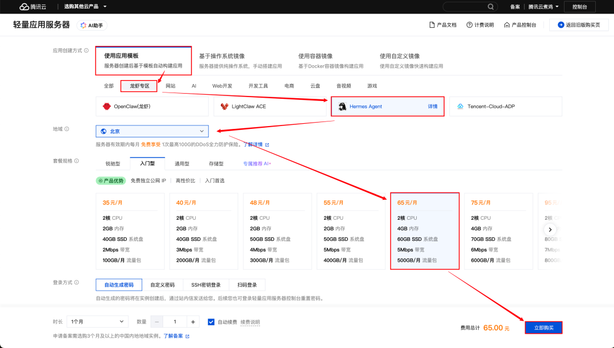
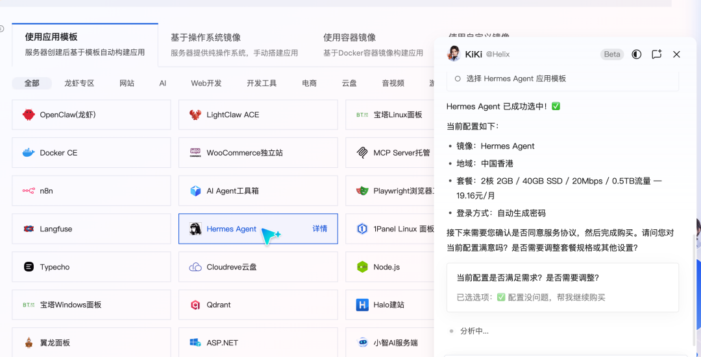
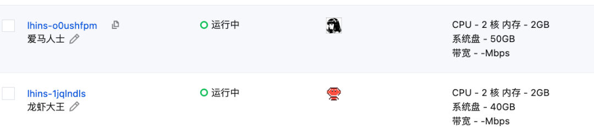
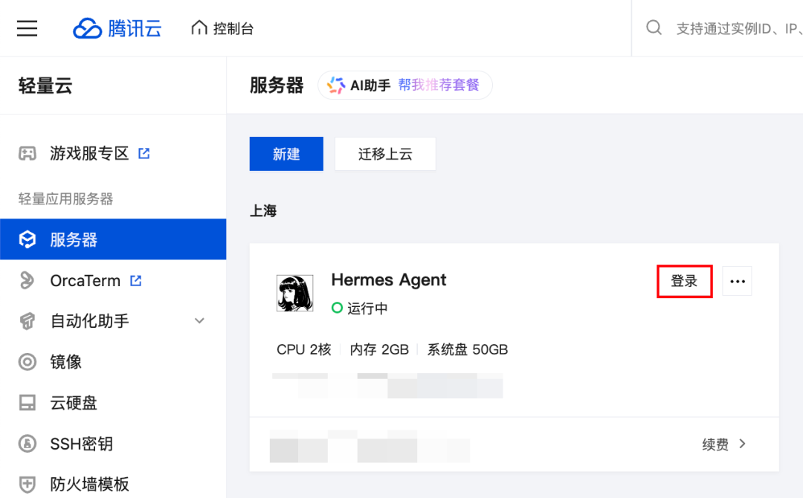
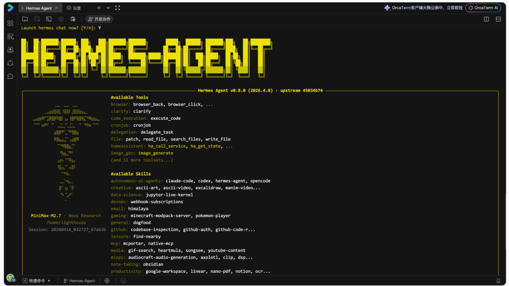
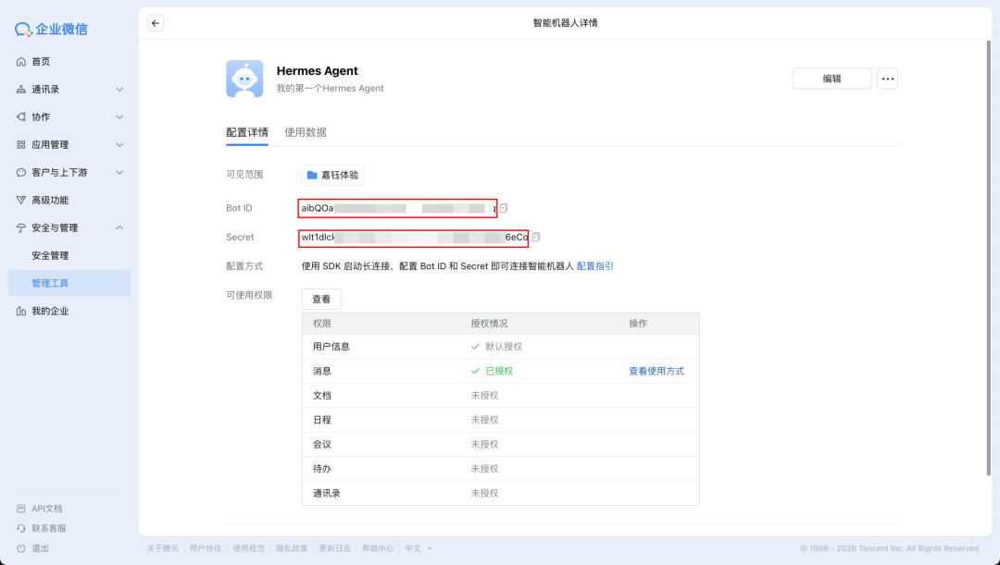
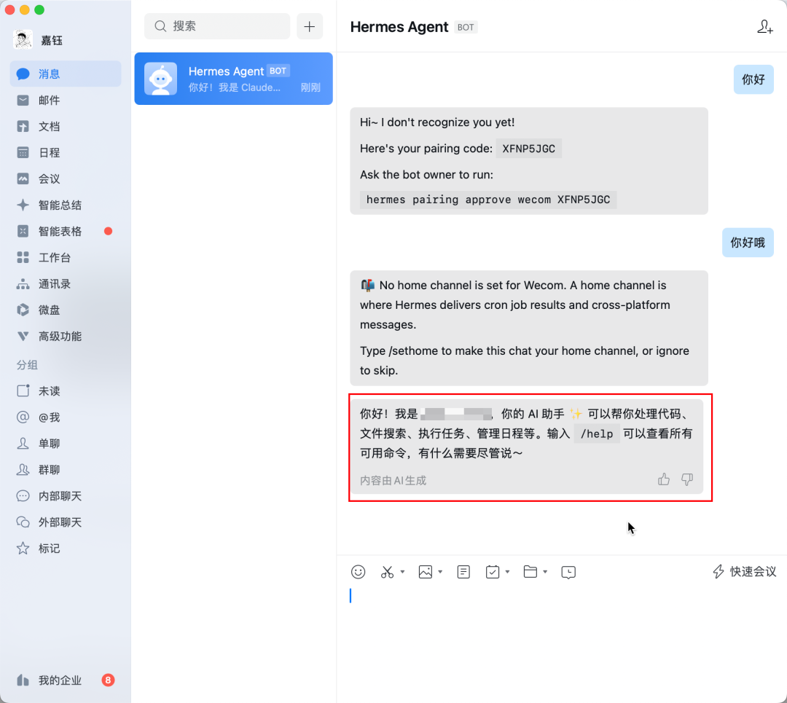

# 腾讯云率先支持Hermes Agent云端快速部署

> 公众号: 腾讯云
> 发布时间: 2026-04-14 15:59
> 原文链接: https://mp.weixin.qq.com/s/GN4nKGBKnLWhKZV6MAdgsQ

---

左手精养“小龙虾”，右手接住“爱马仕”。

刚刚，腾讯轻量应用服务器Lighthouse率先上线Hermes Agent专属应用模板，支持云端一键快速部署（企业级ClawPro产品也将在本周内支持）。

和龙虾一样，Hermes Agent也是今年发布后就迅速走红的开源项目，不到两个月即斩获8万+Stars。

Hermes Agent更强调可成长性：它不仅具备更持久的记忆与更精准的回忆能力，还引入了完整的自我学习机制，能够在使用过程中自主创建与优化技能，在越用越聪明的方向上提供了一种可落地路径。

但这也对部署方式提出了新的要求。Hermes Agent 官方强调其「不依赖本地设备」，支持在任意环境运行，并优先适配 Linux，这使其更适合云端长期运行。

部署在云服务器后，Agent与本地环境隔离，并具备7×24小时在线能力。通过企业微信等消息通道，即可实现持续交互与任务调用。

\*Hermes Agent目前不支持Windows原生环境，Windows用户需先安装WSL2后在其中运行。

三步开启「爱马仕」体验之旅👇

安装Agent、配模型、接通道，和部署龙虾的步骤一样，依托Lighthouse应用镜像，开发者快速完成从云端底座到对话通道的全链路搭建

//云端安装Hermes Agent

无需手动拉取源码或配置基础依赖。在Lighthouse控制台选择 Hermes Agent 应用镜像，即可在数分钟内完成服务器创建与运行环境初始化。

腾讯云提供三种开通方式：

1.新购服务器：直接创建新实例，选择 Hermes Agent 镜像，推荐 2 核 4G 及以上配置

2.重装系统：已有 Lighthouse 实例的用户，可通过重装系统切换至 Hermes Agent 镜像

3.不想动手的朋友，也可通过一句话让腾讯云内置AI助手——“[AAA云服务K姐](https://mp.weixin.qq.com/s?__biz=MjM5MDgwMzc4MA==&mid=2654906946&idx=1&sn=df0491ecb19d1ee339c2829a444f5d90&scene=21#wechat_redirect)”帮你安装

直接选择从龙虾重装为hermes的用户也不用担心迁移门槛。Hermes Agent内置了 hermes claw migrate 命令，支持一键迁移 OpenClaw 的设置、记忆、技能和 API 密钥，大幅降低过渡成本。

（小编一个龙虾一个爱马仕）

//配模型

服务器就绪后，需要为Hermes Agent明确指定可用的大模型能力。与龙虾内置模型、开箱即用不同，Hermes 将模型选择与密钥管理交还给用户，以换取更高的灵活性与可控性，也更适合长期运行与多场景扩展。

通过腾讯云 Web 终端（OrcaTerm）直接进入服务器环境，执行内置的 hermes setup 命令行向导，按提示完成模型配置：

-选择模型提供商：支持 MiniMax、DeepSeek 等主流厂商

-填入 API Key：将对应提供商的密钥安全注入配置

-验证模型连通性：配置完成后，可直接在终端 TUI 界面（一种带排版的可视化命令行界面）发送一条消息，确认模型是否正常响应

//连通道

这是 Hermes Agent 落地的关键一环——为它接上一个可以对话的入口。以企业微信为例，可以按照以下步骤：

-注册企业微信组织：如果还没有企微组织，需先前往企业微信官网完成注册；

-创建企业微信机器人：在企业微信管理后台创建一个机器人，完成后获取机器人的Bot ID 和 Secret 等关键凭证（QQBot插件目前已合入Hermes Agent官方，也可到QQ开放平台快速创建获取appid进行绑定）；

-将密钥写入 Hermes 配置：回到 Lighthouse 服务器，编辑 ~/.hermes/.env 配置文件，将上一步获取的凭证填入对应字段；

-启动网关服务：执行 hermes gateway install，将网关注册为后台常驻服务，Agent 即刻上线。

点击👉[完整部署实践指南](https://cloud.tencent.com/developer/article/2653159)

整体部署流程相比部署龙虾复杂了一点点

但冲Hermes Agent这个名字，不值得试试吗？

评论区聊聊你对龙虾 vs 爱马仕的感受

随机抽十名用户送上Lighthouse代金券

---

