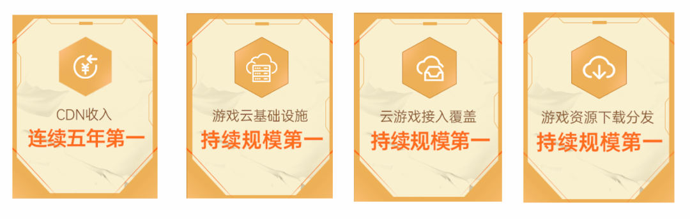
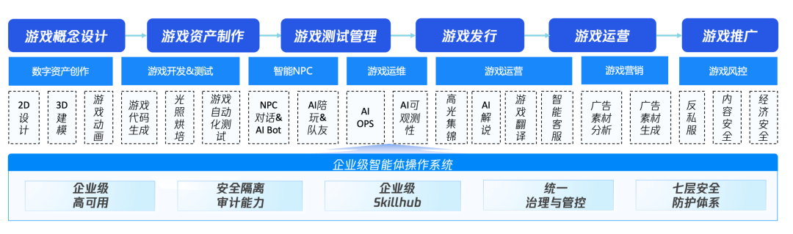
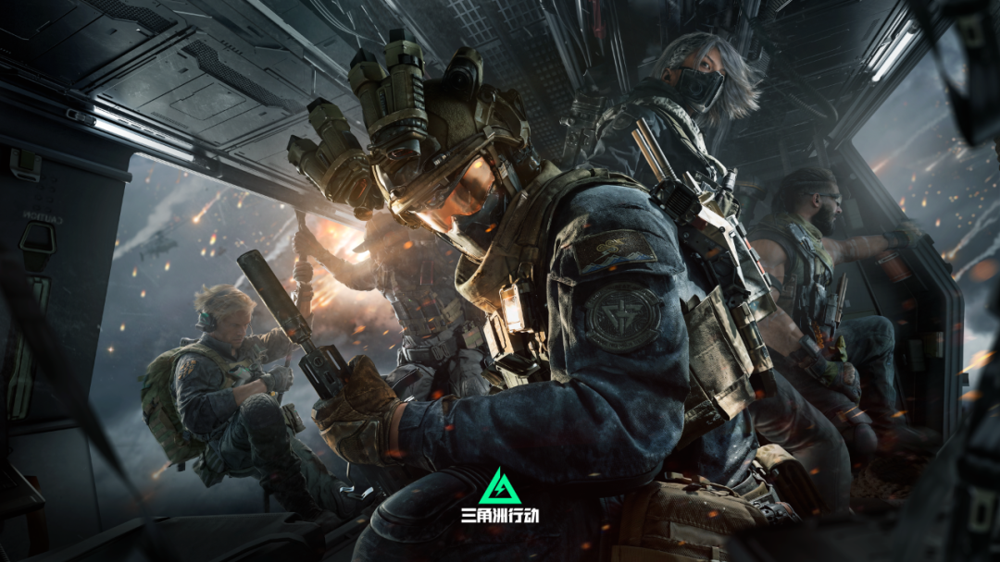
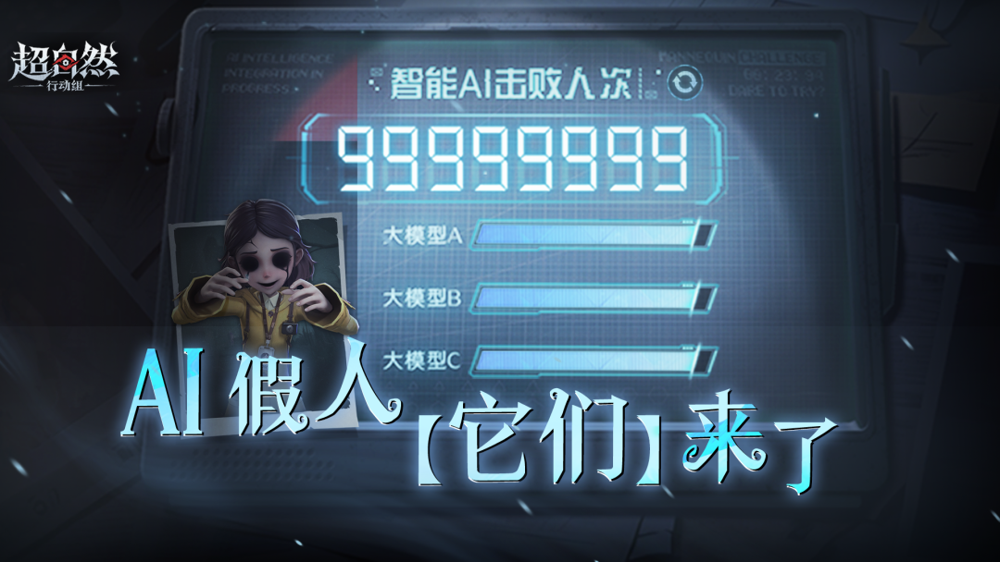
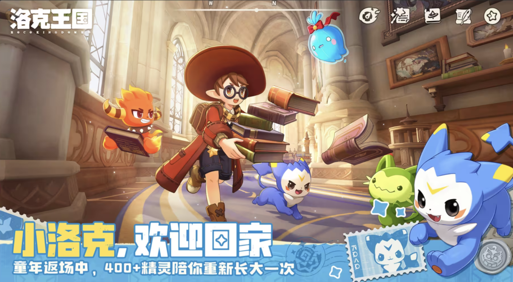

# 腾讯云，五冠王！

> 公众号: 腾讯云
> 发布时间: 2026-04-15 12:47
> 原文链接: https://mp.weixin.qq.com/s/xsrE05kcbLkSVhR4L-Fy9w

---

汇报好消息！

根据IDC最新发布的《中国游戏云市场跟踪研究，2025H2》

腾讯云在中国游戏云市场用量持续多年排名第一，同时还在 CDN 收入、游戏云基础设施、云游戏接入覆盖、游戏资源下载分发等四个细分赛道，包揽第一。

五年领跑的背后，是腾讯云“生于游戏、精于游戏”的行业基因 。

依托自身超过二十年的游戏研发与运营实践，腾讯云构建了从底层基础设施到场景化解决方案的全栈服务体系 。在Omdia《2025全球游戏云平台》报告中，腾讯云还是唯一入选[“领导者阵营”](https://mp.weixin.qq.com/s?__biz=MjM5MDgwMzc4MA==&mid=2654902456&idx=1&sn=3c485cd25d1bd4c195f24bb574e6f3ea&scene=21#wechat_redirect)的中国云服务商 。

这几年，腾讯云还在不断打磨AI技术对游戏产业的实际价值。通过构建覆盖全流程技术支撑体系，深入内容、代码与运营等关键环节，帮助开发者提升生产效率，让AI技术深度赋能游戏开发全流程。

（腾讯云全栈AI解决方案，赋能游戏研发全生命周期）

看几个腾讯游戏和行业客户应用AI的案例👇

//《三角洲行动》：全链路安全

在旗舰大作《三角洲行动》的全球发行中，腾讯云提供了坚实的安全与通信保障 。

安全层面，腾讯云EdgeOne以“安全加速一体化”能力构建全链路防护体系，通过四层TCP加速及独立DDoS防护等技术，有效抵御数百次DDoS攻击，保障全球海量玩家的流畅体验 。

//《超自然行动组》：AI原生玩法规模化落地

巨人网络旗下现象级手游《超自然行动组》，腾讯云提供从AI创新到基础架构的全栈支撑。

容器化弹性计算实现高峰秒级扩容、低峰无损缩容，全球3200+边缘节点与TB级带宽保障分发稳定，T级DDoS防护与ACE反外挂能力，为千万DAU级运营筑牢安全底座。

通过ASR语音识别及音色匹配与TTS声音复刻能力，让AI在听觉上与真人玩家高度相似，实现更加沉浸的游戏体验。

//《龙之谷世界》：构筑大DAU全球化基建底座

在盛趣游戏旗下经典IP手游《龙之谷世界》项目中，腾讯云以容器化弹性计算实现高峰秒级扩容、低峰无损缩容，依托全球3200+边缘节点与TB级带宽。

同时提供DDoS防护与ACE反外挂能力，为大DAU游戏的运营筑牢安全底座，助力游戏上线首月登顶畅销榜Top10，最终实现游戏全量在腾讯云落地。

//《洛克王国·世界》：跨端画质与动态光照的工程化

今年GDC期间，《洛克王国·世界》同款的跨引擎光照方案MagicDawn亮相全球。它借助云端分布式计算，将光照烘焙效率提升数十倍，实现移动端与PC端光影效果高度统一——手游也能跑出3A级光影，搭配空间音频打造"视听一体"的沉浸体验。

在《洛克王国·世界》中，MagicDawn与游戏项目组共建了一套完整的24小时昼夜动态全局光照，移动端与PC端画质保持一致，解决了传统方案下昼夜变化存储压力大、烘焙流程拖慢迭代的行业难题。

目前，腾讯云已服务国内95%以上的出海头部游戏公司，成为包括创梦天地、库洛游戏、西山居、莉莉丝、完美世界、巨人网络等知名厂商的首选合作伙伴 。

游戏产业拥抱AI，掘金海外。

腾讯云一直在第一线保驾护航。

---

