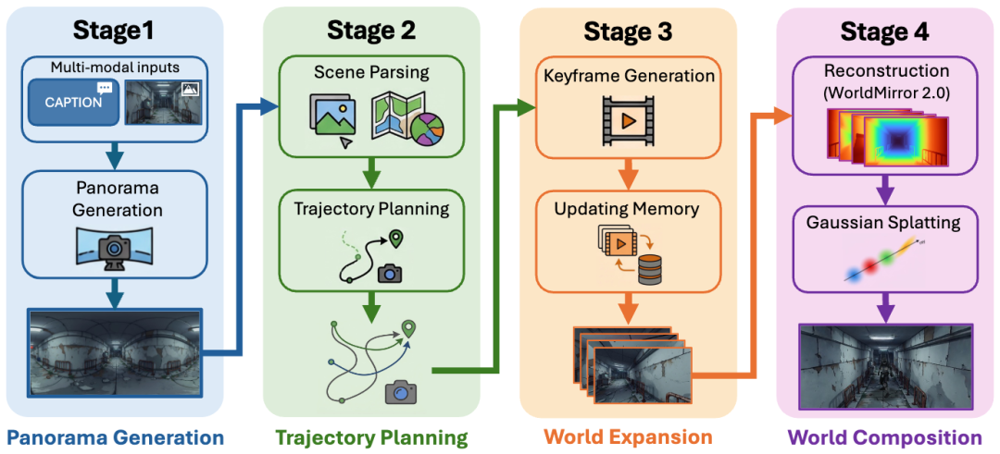

# 混元世界模型2.0发布丨一句话，让“龙虾鹅”跑进3D游戏里！

> 公众号: 腾讯云
> 发布时间: 2026-04-16 10:32
> 原文链接: https://mp.weixin.qq.com/s/U4N_F0DZM5BzGITU_J2a6g

---

这是龙虾鹅👇🏻

这是跑进3D游戏里的龙虾鹅👇🏻

最近，咱们腾讯的小龙虾估计天天都在搬砖干活。今天小编决定给它放个假，把它送进中世纪的酒馆里度个假。

看着这光影和质感，你可能会以为是找了哪位3D建模大师熬夜肝出来的。但实际上，现在只需要敲一句话，就能把一张2D图片变成能跑、能撞、能漫游的3D游戏资产。

今天，腾讯正式发布并开源混元3D世界模型2.0（HY-World 2.0）。一句话就能生成3D资产，并直接导入到游戏制作或具身仿真引擎，实现真正的可玩、可用。

[1、申请](https://3d.hunyuan.tencent.com/sceneTo3D)[体验地址](https://3d.hunyuan.tencent.com/sceneTo3D)（👈🏻详情请戳）

[2、开源代码地址](https://github.com/Tencent-Hunyuan/HY-World-2.0)（👈🏻详情请戳）

// 支持多种模态输入，无缝兼容游戏引擎

把平面的龙虾鹅塞进3D游戏里，创作门槛低得超乎想象。

你完全不需要懂任何复杂的3D软件，只要像平时说话一样输入一句文字描述，或者直接上传一张图片，模型就能精准解析复杂的语义。

实机演示：输入“生成一个日式RPG风格的中世纪地牢”，即可生成一个3D空间资产

随后，它会一键生成混合了3D高斯泼溅（3DGS）与Mesh表征的真实3D资产。

熟悉AI生成的朋友都知道，此前不少世界模型（比如谷歌Genie 3 和咱们的混元世界模型1.5），本质上生成的还只是一段视频文件。而具备3DGS与Mesh表征的3D资产才能让用户有在真实游戏里的体验。

这些多格式的3D资产还能直接无缝导入到Unity、UE等主流游戏引擎中进行二次编辑，用于快速生成游戏地图和关卡原型。

你可以轻松地给龙虾鹅加个小背包，或者按需调整整个场景的光影。

更爽的是，模型还支持角色模式：你可以操作角色在街道、建筑、场景中自由探索，不限时间，具有物理碰撞，体验就像在真实游戏里一样。

// 生成的不是视频，而是可用的3D资产

这一次，混元世界模型2.0实现了SOTA级的生成效果。与其他世界模型相比，它在场景完整度（比如极难还原的物体侧面和背面）以及对输入图片的遵循程度上表现更优。

这不仅是因为它以3D生成为主轴，统一了空间理解、生成、重建的架构，更在于其底层多项核心组件的全面提升：

拼得全，单张普通图片秒变全景。传统方法极其依赖精确的相机参数才能生成全景图。混元2.0全新升级了HY-Pano-2.0模型，采用端到端隐式学习方案。单凭普通像素图片，就能自动脑补并推算出360度全景空间。

走得稳，智能寻路拒绝穿墙、跑飞。为了解决漫游过程中的痛点，混元团队结合了VLM与游戏自动寻路算法常用的navmesh表征，自研空间Agent技术。它能智能规划出“环绕物体”、“最大漫游”等五类运镜轨迹，避免角色穿墙、跑飞。

接得顺，画面延展真实不穿帮。针对场景扩展容易断层的问题，混元团队打造了目前业界最强的新视角生成（NVS）模型HY-WorldStereo。靠着强大的空间一致性记忆，让新老场景视觉充分缝合，极速生成且画质不掉。

更沉浸，支持物理碰撞、真交互。所有片段通过HY-WorldMirror 2.0以及自适应Mask gaussian等场景优化算法，最终生成3DGS与Mesh混合表征。这也是能开启角色模式、实现真实物体碰撞交互的核心原因。

实机演示：输入“生成一个温馨的绘本风格小木屋”，游戏角色可以自穿行在生成的3D场景中

// 发布即开源，人人都能“一句话造世界”

让复杂的3D资产生成变得像聊天一样简单。

混元世界模型（HY-World 系列）自发布以来持续进化：从首个开源3D世界模型 HY-World 1.0，到可实时在线交互的HY-World 1.5，再到如今一键生成3D空间资产的 HY-World 2.0，腾讯混元正在一步步把“AI造世界”从概念变为现实。

目前，混元世界模型2.0已正式开源。不管是萌趣的“龙虾鹅”、游戏开发者的关卡原型，还是设计师的数字孪生场景，曾经需要巨大成本的3D创作，如今都能一句话搞定。

未来，腾讯云将持续以混元AI能力，降低3D内容创作门槛，让每个人都能轻松创造属于自己的3D世界。

---

