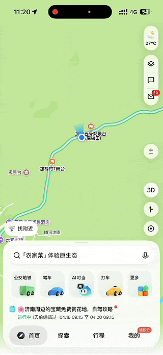

# 215万个快消失的地名，被一个小程序救回来了

> 公众号: 腾讯云
> 发布时间: 2026-04-20 11:32
> 原文链接: https://mp.weixin.qq.com/s/3Vq2-qde6XrL60e_w-0z6Q

---
金屏村、丰年村、小和村、苏家坡村大桥、广运桥、小水井村、新村、邱完角村、石坡头村、新濮村、犬头山、观鹭桥、章山老村、王槐桥、西南院桥、平安街、幸福路、西风路、果园路、河东路、康顺街、阳秋路、六叶路、峡谷路、秋阳路、凯旋路、引水路、同心路、刘徐路、邱纬路、邱经路、雅芬桥、楼溪桥、楼下桥、寨下村、振富路、长山下柏树村、马蹄山、龟山、袁家湾、大栗村、琅琳村、凌家屋路、农科路、春武路、沈家村、荷田岗村、彭家村、陈油村、洽村、上甘老街、罗湖镇华溪街、新园村、新窑村、何家村、卢家村、高岭湾村、下家岭村、新屋场村、柴棚新村、湖塘无名河、杨垅村、北舍村、曹佰肆村、普济桥、来龙新村、北头新村、富家垅新村、向家坂村、马矶新村、柘村公墓山、下道湖新村、村里路中心塘、以格落村、中牛宿村、纸厂村、新发村、硝水塘、勐主河、芒旺河、大户那茶山、凤山镇凤凰路、大公山、大头山、平毫河、金山路、高庄东路、民富街、富兴路、笃志街、福东路、向前街、通郑路、赖建明竹山

.......

这里有超过200万个乡村地名，2年前，它们无法在任何一张数字地图上被搜索到。

城镇化背后，乡村的老地名正在指数级消失，随之而来的“最后一公里”问题越来越多：

快递进了村但到不了家，土特产要出村快递却上不了门：快递延误，错投，囤积没人拿是常态;

救护车进村争分夺秒，但导航终点不准，“山那边”甚至能定位到“山这边”;

发展旅游，游客找不到打卡点，体验大打折扣......

2024年，腾讯助力民政部，上线了“乡村著名行动”小程序，提供一站式地名信息采集服务，每个人都可以上传“无名”的乡村地点，为其“著名”。

今天，已有40万用户注册小程序，推动215万条乡村地名信息上图。

这里边，有23万个村，2万个屯，1.7万个沟，3.6万座山，2.7万条河，35万条道路...... 拼凑出一个个数字世界里“消失”的故乡。

贵州加榜梯田开秧门活动上，腾讯地图公布“乡村著名行动”小程序数据共建成果。图为当地侗族非遗表演。

贵州从江县的“著名”成果尤其亮眼，2年多共上传地名数据4000余条。快递进村、农产品出村、游客进村方便了许多。

例如，从江将当地的百香果种植基地、农户种植地块以及果品集中销售点等，进行了地名规范和精准上图。果农以前要雇车把果子运到县城卖，现在直接到集中点，水果商精准采购，成本时间大大节省，实现了销量翻倍。

在丰富的地名信息上图之后，腾讯地图联合贵州从江，在贵州加榜梯田开秧门上，正式发布了全国首个AI“村游”地图：

游客可以通过一张地图完成村游AI规划、AI导航、AI景点讲解、预约订票等服务，包含600多篇少数民族地名故事，涵盖历史、村落、民俗、服饰等15个子项目的10000余条实用问答。

全国首个AI“村游”地图，让AI做村游规划

AI让从江优质的旅游资源被更多人看到、体验到。腾讯地图App搜索“从江村游地图”，就能用上。

感谢点亮每一个地名的你，欢迎大家继续为乡村“著名”。那山、那屯、那沟，其实一直在。

你还希望我们推出哪里的AI“村游”地图，评论区里分享你的村、你的屯。

