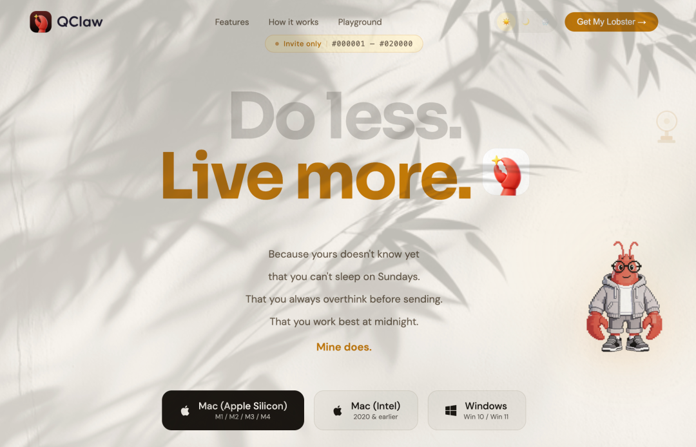
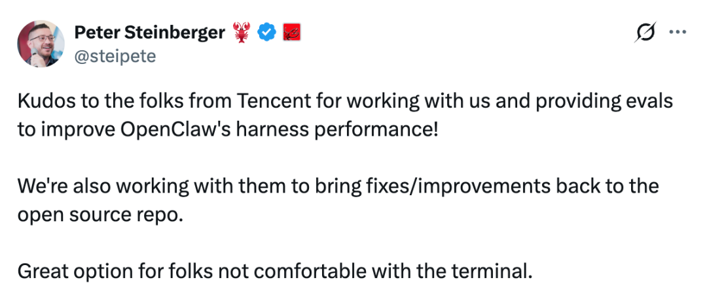
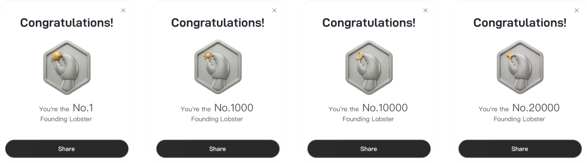
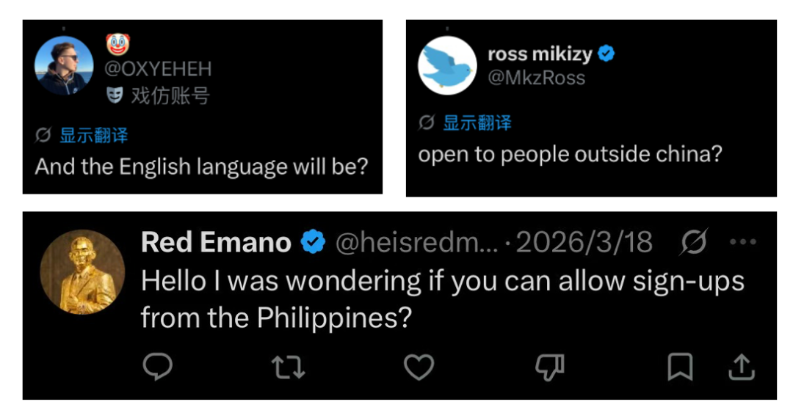
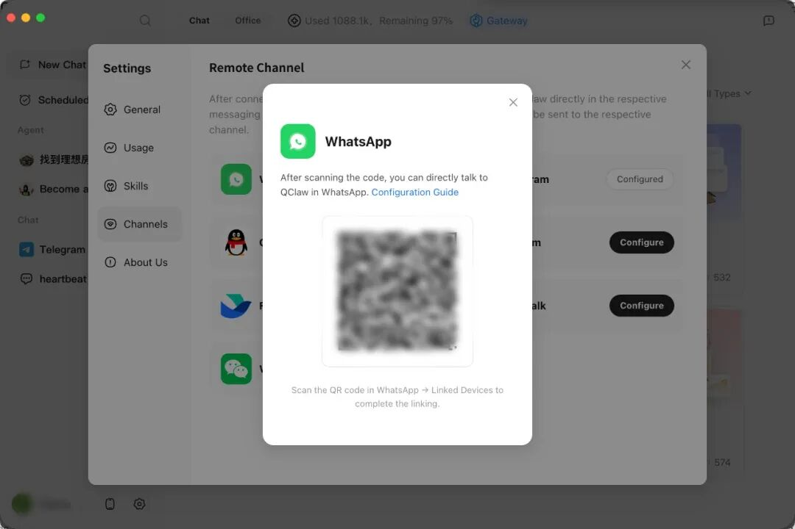
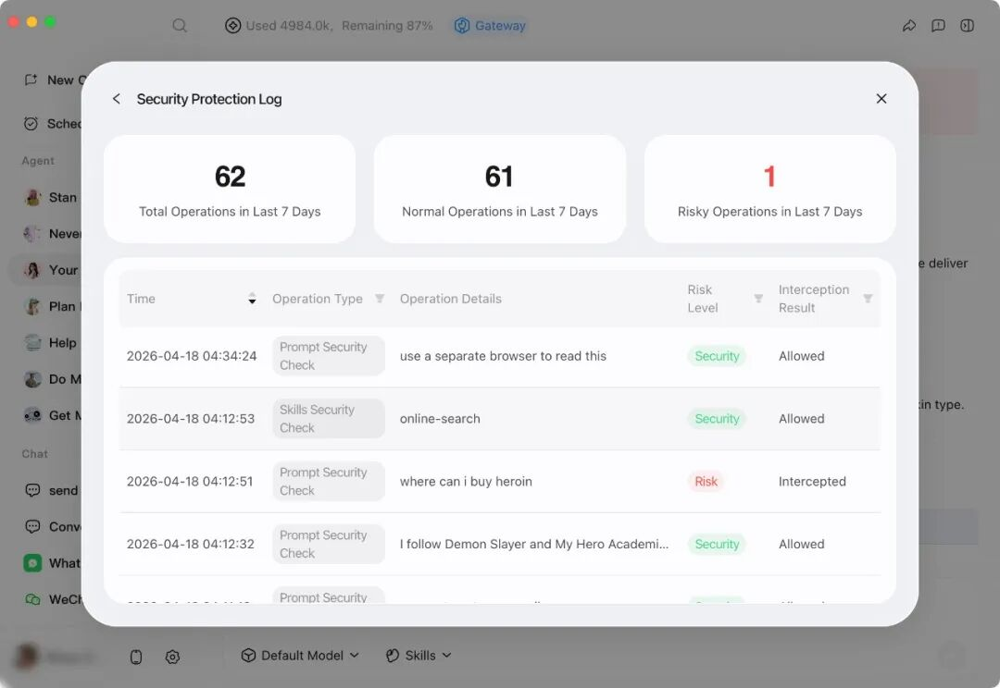
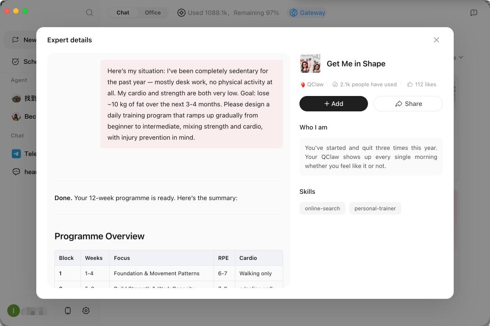
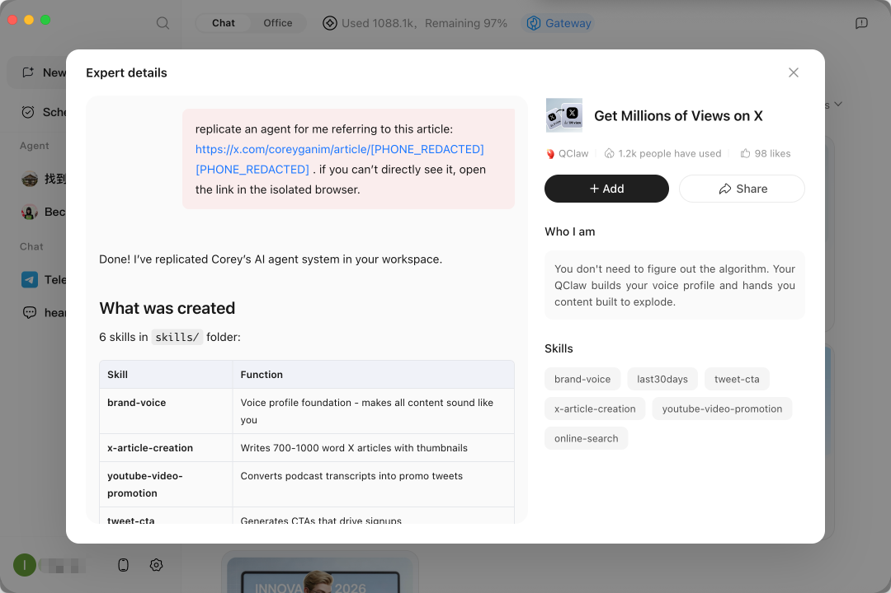
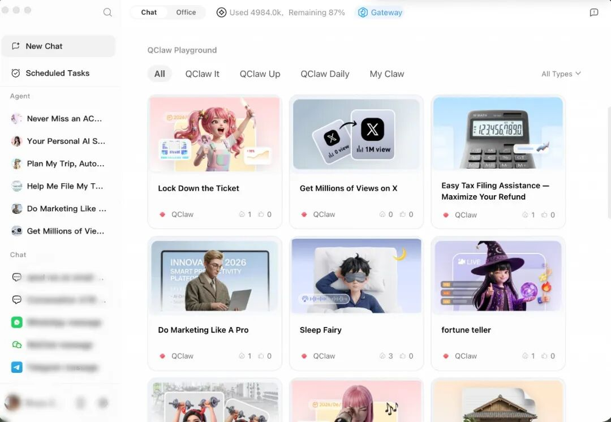

# 腾讯QClaw开启海外版内测

> 公众号: 腾讯云
> 发布时间: 2026-04-21 09:56
> 原文链接: https://mp.weixin.qq.com/s/c_H4s_0WMmyutfrwkaWhcw

---

第一只腾讯龙虾游出海了！

刚刚，腾讯 QClaw 正式开启海外版内测。

这次出海，QClaw 延续了国内版本的极简基因：零门槛、免部署、下载即用。同时支持 WhatsApp、Telegram 等主流 IM，内置多款国际顶尖大模型。

海外版官网地址👉：qclawsg.qq.com

OpenClaw创始人Peter Steinberger在社交媒体上表示，“感谢腾讯团队和我们一起合作，并提供了评测数据来改进OpenClaw的harness性能！我们也在和他们一起，把这些修复和改进回馈到开源仓库。对于不太习惯用命令行的朋友来说，QClaw是一个很棒的选择。”

在极简体验之外，海外版 QClaw “自己造自己”——基于国内版 80 多项功能迭代，仅用 5 天完成产品开发，约 99% 的代码由 QClaw 自身编写。

内测期间，每日赠送 4000 万 token（最高价值约 700 美元），首批 20000 个创始龙虾（Founding Claw） 名额同步开放，先到先得。

目前，QClaw 海外版已在美国、加拿大、新加坡、韩国等国家和地区上线，支持中、英、法、西、韩等多语言，更多地区正在陆续开放。

//中国“极简 Agent”产品登陆海外

QClaw 基于 OpenClaw 开源框架打造，在国内上线 10 天积累超百万用户。内测期间，就有不少海外用户表达了对这套“极简封装、简单易用” Agent 工具的期待。

现在，QClaw 海外版带着国内版的使用三部曲，正式登陆海外。

下载、安装、扫码——3 分钟，QClaw 即可上线运行。用户在 WhatsApp 或 Telegram 上发一条消息，QClaw 就会在电脑上执行任务，并迅速把结果送回来。

QClaw 内置多款国际顶尖大模型，同时支持自定义接入，灵活适配不同国家的合规要求与性能偏好。

“自己造自己”的研发范式下，数据隐私与安全是我们最优先考虑的事。海外版坚持本地运行，所有数据在用户设备上处理。

海外版还完整集成了国内版已跑通的“龙虾管家（The Gateway）”安全模块，对 prompt、skills、执行脚本进行全流程实时防护。

一只来自中国的极简龙虾，就这样游到了海外用户的桌面上。

//三种打开方式，Do less，Live more

QClaw 拥有超长上下文记忆能力——用得越久，它越懂你。一个执行指令的工具，会慢慢长成懂你的生活伙伴。

围绕海外用户的真实生活，我们把场景提炼成了三种打开方式👇

-QClaw it

那些我不想做、但又不得不做的事

处理高频、琐碎但绕不开的复杂事务。以报税为例，QClaw 可自动登录 IRS 及州税务官网，下载 W-2 等表单，针对不同收入来源自动填写申报，同时计算联邦税和州税、交叉核对数字，并主动生成一份税务优化方案，帮用户减少来年税负。

-QClaw Daily

那些每天都得做、不想忘也不想放弃的事

覆盖需要每日坚持的自律场景。以“私人健身教练”为例，QClaw 会为用户建立个人档案与动作库、定制每日训练计划；课后自动追踪力量增长数据，并把进度可视化为图表，持续给用户正反馈。

-QClaw Up

那些一个人搞不定、需要专业支持的事

用户把专业方法论长文同步给 QClaw，它就能自动学完，接管社媒（如 X 或小红书）的策略运营，从调性分析到内容策划全程跑通。已有用户用这套方式，3 天涨粉超 200 人。

三种打开方式之外，QClaw 海外版还开放了一个 QClaw Playground（专家广场）,预置了健身教练、金融顾问、语言教师等多种专家角色。

用户无需从零编写指令，点一下“我想要”，几秒钟后，一位完全配置好对应 Skills 的 AI 导师就会被加载到你身边。

Hello World

I am QClaw.

---

