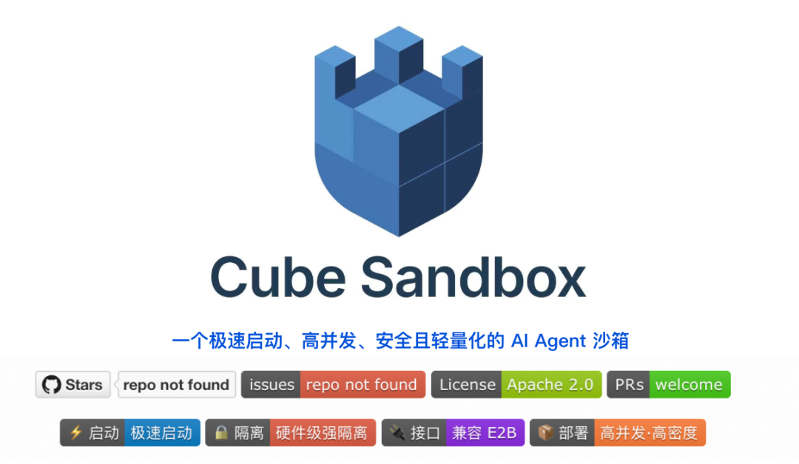
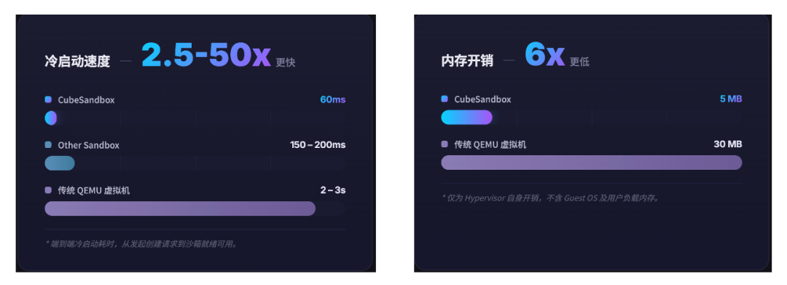
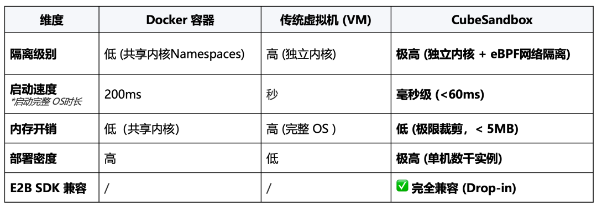
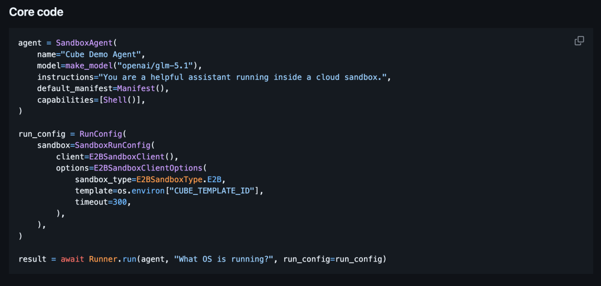

# 腾讯云开源OpenAI、Manus同款Agent底座

> 公众号: 腾讯云
> 发布时间: 2026-04-21 16:45
> 原文链接: https://mp.weixin.qq.com/s/5rWKipAQdibiBmmQBHXVWg

---


今天，腾讯云宣布正式开源 Cube Sandbox。

一套面向 AI Agent 的执行环境底座，也是业内首个兼顾硬件级隔离与亚百毫秒启动的开源沙箱服务。



🌟项目主页：https://github.com/TencentCloud/CubeSandbox

在当前主流的 Agent 架构中，SandBox 这类执行环境已经成为“标配组件”。

无论是 Manus、OpenAI Agents SDK，还是 Perplexity、Hugging Face 等产品，底层都依赖类似的“虚拟电脑”来承载代码执行与工具调用——并逐渐收敛到统一的接口标准 E2B。

这也是 Cube Sandbox 此次开源的意义所在。它原生兼容 E2B 接口标准，开发者无需改动业务代码，只需更改一个环境变量，就可以将现有 Agent 应用从海外闭源方案平滑迁移到 Cube Sandbox。

在此基础上，Cube Sandbox 不仅支持单次代码执行与工具调用，还可以连续支撑 Agent 的“思考—执行—反馈”循环（Harness Loop），覆盖从 Agent 应用到 Agent RL 训练的完整场景。

根据我们的严格测试，Cube的性能表现强劲，冷启动 <60 毫秒，比行业均值提升 2.5~50 倍；单实例内存开销 <5MB，单台服务器可同时运行 2000+ 个沙箱实例。



这些性能背后，凝聚了腾讯云上大规模的生产级验证。

Cube Sandbox 诞生于腾讯云 Serverless 体系，承载过百亿级调用，支撑元宝等亿级用户产品稳定运行；在更复杂的场景中，也支持了 [MiniMax](https://mp.weixin.qq.com/s?__biz=MjM5MDgwMzc4MA==&mid=2654906813&idx=1&sn=a695013e260994bfbc6468f0588015e3&scene=21#wechat_redirect)在 Agentic RL 训练下实现分钟级调度数十万沙箱实例。

每一项你关心的指标，Cube都能打👇

//安全：每个 Agent，一台独立“电脑”

传统 Agent 沙箱大部分基于 Docker 容器构建，启动快、占资源少，但所有容器共享同一个操作系统内核。

一旦 Agent 执行的代码触发内核漏洞，就可能穿出容器、波及整台机器。

Cube Sandbox 没有走这条路。每个沙箱都运行在一套完整、独立的操作系统内核之上，在硬件层面实现彻底隔离——单个沙箱的异常，不会影响其他沙箱和宿主机。

网络层面也配有独立机制：Agent 能访问哪些地址、不能访问哪些地址，由开发者自行定义、精细控制。

//性能：目前最快的60ms

过去，“更安全的沙箱”往往意味着“更慢的沙箱”——传统虚拟机启动通常需要数秒。

但 Agent 是按次调起、按毫秒计费的，启动慢一秒，就是成本和体验的双重损失。

Cube Sandbox 通过资源池化预置、快照克隆、底层锁优化等一整套技术，把一个带完整内核的安全沙箱，冷启动压缩至 60 毫秒以内。50 并发场景下平均 67 毫秒，P95 稳定在 90 毫秒。

为什么要分毫必争？

Cube的专家工程师金峰说，在单次任务执行上，60ms和200ms可能对用户体验差距不大，但对于连续任务执行和大规模的并发，每一毫秒都影响着成本和体验。

//规模：一台机器，跑上千个 Agent

启动快之外，大规模部署的单位成本同样关键。

传统虚拟机单实例内存开销 20MB 起步，Cube Sandbox 通过 Rust 底层重写、CoW 内存复用、reflink 磁盘共享三项关键技术，把这一开销压至 5MB 以内。

一台 96 核物理服务器，可同时运行 2000 多个沙箱。

这套能力已在腾讯内部经历大规模生产验证——元宝 AI 编程场景迁移至 Cube 后，资源核时消耗降低 95.8%。



Cube Sandbox 测试数据说明：其中，启动速度项基于裸金属环境测试，单并发下为 60ms，50 并发场景下平均 67ms（P95 90ms，P99 137ms），整体保持在百毫秒级。内存开销项基于 ≤ 32GB 规格沙箱实测，更大规格下开销会略有上升，但幅度极小。

//兼容：无缝接入现有 Agent 体系

Cube Sandbox 对 E2B 接口的兼容是 Drop-in 级别的——无论基于 Manus 技术栈、OpenAI Agents SDK，还是其他 E2B 生态框架构建的 Agent 应用，都可以在不修改业务代码的前提下，直接指向 Cube 完成运行。

极简部署示例👇

设置环境变量CUBE\_TEMPLATE\_ID、E2B\_API\_URL、E2B\_API\_KEY后运行：

```
import os
from e2b_code_interpreter import Sandbox

with Sandbox.create(template=os.environ["CUBE_TEMPLATE_ID"]) as sandbox:
    result = sandbox.run_code("print('Hello from Cube Sandbox!')")
    print(result)
```

GitHub 仓库中还提供了 OpenAI Agents SDK 接入 Cube 的三个可运行示例，覆盖命令执行、Python 脚本、数据分析与图表生成等典型场景，开箱即跑。



希望开源的这一小“块”，能帮助更多Agent安心运行。

Cube Sandbox 也在持续扩展生态能力，与主流 Agent 框架及开源社区共同建设兼容与集成方案。

事件级快照回滚能力也即将开源——百毫秒级的状态回滚，为 Agent 的不可预测行为提供额外的保障。

欢迎来 GitHub 给 Cube Sandbox 点个 Star🌟。

我们欢迎任何形式的贡献，无论是提交 Bug、改进文档，还是为一个新的 AI 框架编写接入插件。

戳👉[发现BUG](https://github.com/tencentcloud/CubeSandbox/issues)

戳👉[有新想法](https://github.com/tencentcloud/CubeSandbox/discussions)

戳👉 查看我们的[贡献指南](https://github.com/TencentCloud/CubeSandbox/blob/master/CONTRIBUTING.md)，了解如何提交Pull Requst

扫👉添加CubeGirl小助手，加入CubeSandBox官方交流群


-END-

---

