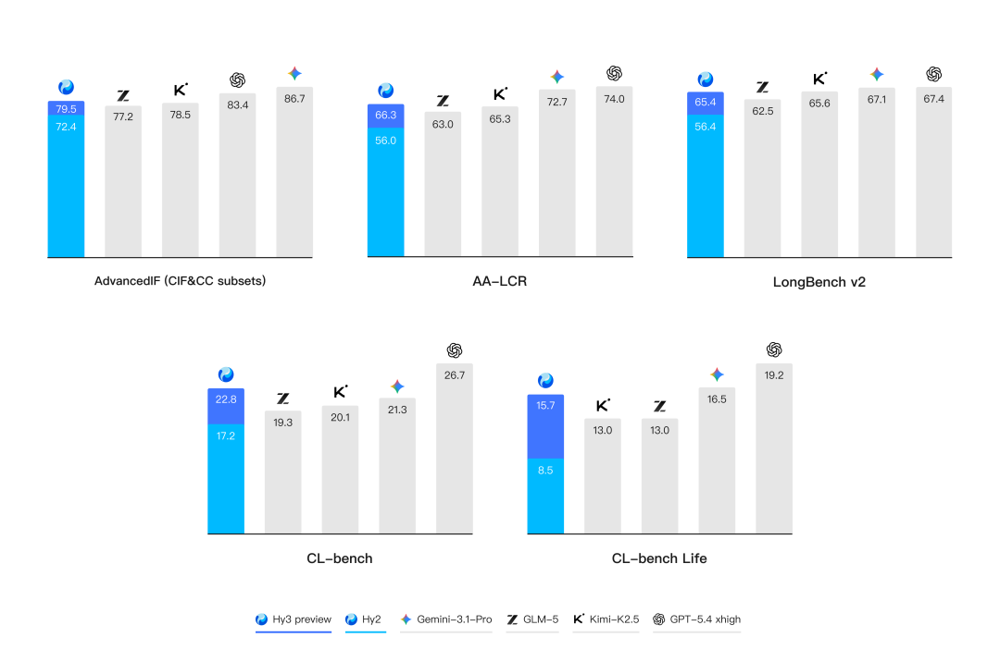
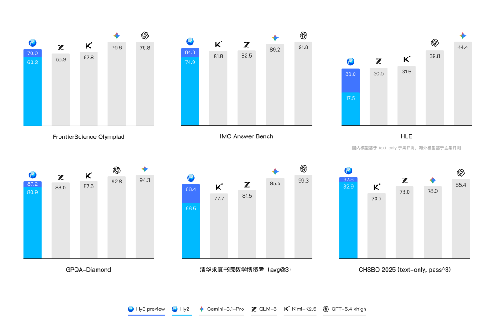
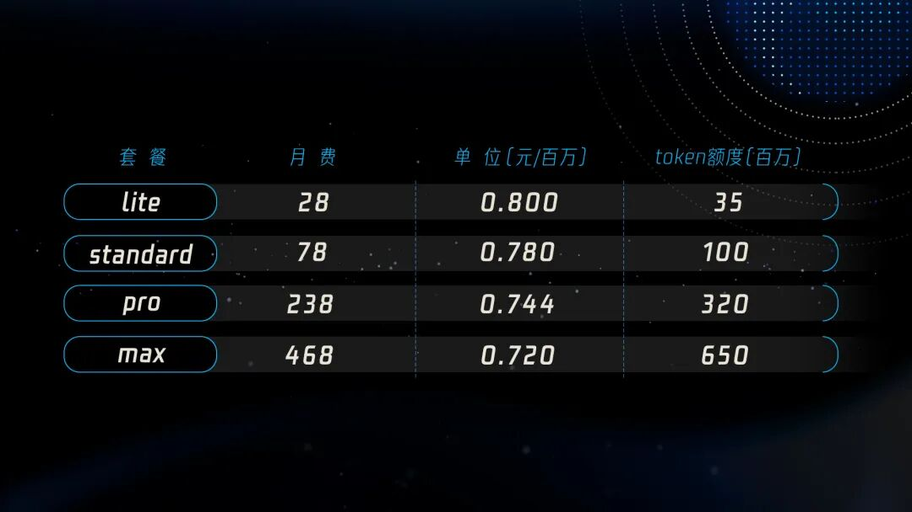

# 混元Hy3 preview发布！实测性价比拉满，TokenPlan套餐首发上线

> 公众号: 腾讯云
> 发布时间: 2026-04-23 17:58
> 原文链接: https://mp.weixin.qq.com/s/ivkilS9skN5tvueFc_COzQ

---

今天，腾讯混元Hy3 preview语言模型正式发布并开源。

最近几个月，混元团队一直在埋头做一件事：重建预训练和强化学习的底层基础设施。而Hy3 preview，正是基于这套新基建的第一个对外发布的模型。

Hy3 preview的定位也非常明确：走「实用主义」路线。

这是一个快慢思考融合的MoE语言模型，总参数295B，激活参数21B，最大支持256K超长上下文。它在复杂推理、指令遵循、上下文学习、代码、智能体等能力及推理性能上实现了大幅的提升。

检验模型实不实用，最好的办法就是先放进自家业务里跑一跑。

目前，Hy3 preview已在元宝、ima、CodeBuddy、WorkBuddy、QQ、QQ浏览器、腾讯文档、腾讯乐享、腾讯地图、腾讯电子签等首发上线，微信公众号、和平精英、腾讯新闻、腾讯自选股、腾讯客服、微信读书等多个主线产品也在陆续上线。

同时，腾讯云也已上线相关API及平台服务，TokenHub首发上架Hy3 preview，助力企业和开发者第一时间获取更聪明、更实用、更具性价比的AI能力。

// 长文、推理与智能体能力全面提升

AI现阶段的焦点，正在从“解决测试集里的问题”转向“解决真实世界的问题”。

在Agent时代，跑通一个工作流动辄消耗几十万Tokens。很多开发者发现，不少在跑分榜单上遥遥领先的旗舰模型，一到真实业务部署，就会被极高的调用成本和延迟按在地上摩擦。质量、速度、价格，成了Agent时代的不可能三角。

Hy3 preview希望能够更好地解决这些痛点问题。不盲目追求实验室里的极限跑分，而是让你能在真实的Agent工作流中算得清楚账、跑得快且稳定。

首先，在决定大模型“质量”的核心能力维度，它实现了较大进步：

- 复杂上下文的极强理解力：在各种真实的生产与生活场景，理解杂乱冗长的上下文并遵从复杂多变的规则是模型的首要挑战。腾讯混元提出了 CL-bench和 CL-bench-Life 来创新性地评估模型的上下文学习能力，并在 Hy3 preview 显著地提升了模型上下文学习和指令遵循能力。

- 极高的复杂推理上限：复杂推理能力是模型解决各种问题的基础。Hy3 preview 在FrontierScience-Olympiad、IMOAnswerBench 等高难度理工科推理任务中表现突出，并在最新的清华大学求真书院数学博资考(26春)  和 全国中学生生物学联赛(CHSBO 2025) 中取得优异成绩，展现了可泛化的强推理能力。

- #### 代码与智能体提升最为显著：代码和智能体是 Hy3 preview 提升最为显著的方向。得益于预训练及强化学习框架的重建和强化学习任务规模的提升，腾讯混元以较快的速度在SWE-Bench Verified、Terminal-Bench 2.0 等主流代码智能体基准以及 BrowseComp、WideSearch 等主流搜索智能体基准中取得了有竞争力的结果。

其次，在决定能否大规模部署的“速度与成本”维度，混元团队针对Hy3 preview，在推理框架、算子性能、量化算法等全方面进行了优化。Hy3 preview的成本相比上一代模型大幅下降，推理效率提升40%。

开发者真实反馈：一位独立开发者在制作教育智能体（TeachAny）时发现，若全程调用海外某旗舰模型，成本会非常高昂。而将长文解析、知识抽取等长尾重度任务切换至Hy3 preview后，“同样的任务量，速度明显提升，Token消耗显著下降。”

// 核心AI产品已全量接入

模型好不好用，真实业务场景说了算。

正式对外发布前，Hy3 preview已与腾讯内部各大核心AI产品完成深度联合设计（Co-Design）与全量验证：

- 元宝：结合海量用户使用反馈，模型在文风、情商、专业度上进行了精细化调优。现在的元宝不仅意图理解更精准，交互也更具“活人感”。
- WorkBuddy：实际工作场景交付稳定性大幅提升，在国内同尺寸模型用户盲评中胜率高达56%。
- CodeBuddy：实现了从“代码补全”到“自主进化”的跨越。模型现在能够自主检索庞大的项目仓库，完成跨文件的Bug修复与逻辑重构。
- ima ：在知识库问答和通用问答两个场景下，Hy3 preview处理长文的能力出色，特别是检索类任务，在回答信息覆盖度和全面性上表现较好。
- 腾讯文档：其AI助手“开物AI”第一时间接入，PPT生成速度大幅提升，且版式设计与信息排版更加专业美观；长文摘要更准、复杂文档拆解更快。

图注：腾讯文档PPT演示Demo为测试调试模式

- QQ浏览器：在网页浏览与内容消费场景下，模型在创作、问答、共情等方面表现优秀，长上下文理解能力强，输出结构清晰、可读性高。其在工具调用等智能体能力上稳定性显著提升。

此外，搜狗输入法、腾讯电子签等产品均已接入，在AI输入服务、合同审查准确率等方面都有显著提升；腾讯游戏、社交、广告等核心业务线也在逐步接入中。

C 端用户之外，腾讯云也为企业和开发者备好了全链路服务，能够低成本快速接入Hy3 preview。

- 腾讯乐享：通过快慢思考双模式与长上下文能力，实现企业知识处理与协作场景的智能化升级。
- TokenHub：首发上架并提供API服务，还将面向个人/开发者的订阅制特供套餐。
- TI-ONE：提供一站式模型精调、训练部署与全流程开发能力，快速构建全链路AI生产力体系。

- 腾讯云ADP：腾讯云智能体开发平台（ADP）基于应用开发工具、智能工作台和新模型能力，轻松搭建高质量智能体。

// 腾讯云同步上线高性价比定制套餐

为了降低大家的使用门槛，Hy3 preview在腾讯云TokenHub上的定价极具性价比：按量计费的输入价格最低1.2元/百万Tokens，输出最低4元/百万Tokens。

针对需要高频调用API的Agent开发者，腾讯云还同步推出了Hy TokenPlan套餐，个人版最低只要28元/月，能为大家省下不少算力成本。同时，还将通过TokenPlan企业版，逐步为企业客户提供Hy3 preview相关能力。

## 附：开源&使用入口，欢迎体验和反馈：

Hy3 preview的模型权重、代码已在GitHub、HuggingFace、ModelScope、GitCode等平台开源，支持vLLM、SGLang 等主流推理框架。

开发者可以轻松对其进行微调与二次开发，快速打造符合自身业务需求的专属大模型应用，让AI在真实场景中发挥价值。

[腾讯云API接入：](https://cloud.tencent.com/product/tokenhub)详情可戳👈🏻

[Github开源仓库：](https://github.com/Tencent-Hunyuan/Hy3-preview)详情可戳👈🏻

[Hugging Face下载](https://huggingface.co/tencent/Hy3-preview)：详情可戳👈🏻

-END-

---

