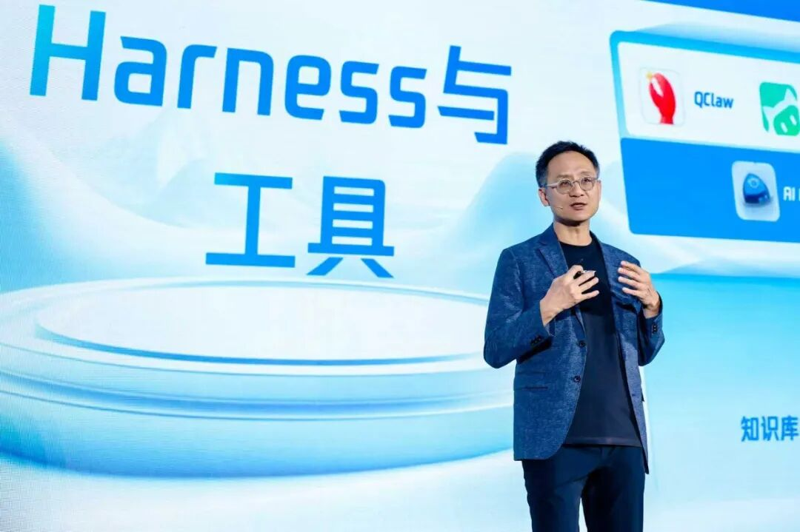

# 腾讯汤道生：汽车智能化不止是“把AI装上车”，更是“用AI重构车企”

> 公众号: 腾讯云
> 发布时间: 2026-04-23 19:03
> 原文链接: https://mp.weixin.qq.com/s/hEKLo3-KMeq_R3G4YtTA6g

---

4月23日，在TIMEDAY·腾讯智慧出行技术开放日活动上，腾讯集团高级执行副总裁、云与智慧产业事业群CEO汤道生表示，汽车产业竞争正在被AI重新定义。未来，车企之间的差距，将不再取决于是否拥有智能化本身，而是谁能更快把AI规模化、系统化地落地。

腾讯集团高级执行副总裁、云与智慧产业事业群CEO 汤道生

腾讯智慧出行基于“车云一体”战略，为车企提供了可靠的基础模型、扎实的工程化能力，以及丰富的应用生态，推动汽车从传统交通工具，向“可感知、会思考、能执行”的移动智能体演进。

目前业务已覆盖100%的头部车企及泛出行公司，并与40多家主流车企在AI领域展开了深度合作，智能驾驶云增速规模超过300%。智能座舱搭载量超过1800万量车。腾讯也为比亚迪、广汽、上汽等50多家中国主流车企和自动驾驶科技公司，提供了海外云服务。

汤道生指出，AI对汽车行业的影响，已超越单一功能，正在深度重塑企业经营全链路。车企需要同步构建数据闭环、模型应用与组织化使用AI的能力。在这场系统性竞赛中，谁能率先实现AI的规模化、系统化落地，谁就更可能掌握竞争主动权。而云厂商，将在其中发挥关键的支撑作用。

“AI的核心价值不是制造更多的概念，而是帮助企业把效率做深、把体验做实、把能力做成长期壁垒。”汤道生表示，腾讯未来也将继续携手行业伙伴，推动好用的AI在汽车场景深入落地，成为车企转型的智能化助手，共同构筑产业智能化发展的新引擎。

以下为演讲全文：

以全栈智能，助力车企全域进化

欢迎来到TIMEDAY，很高兴与大家共同探讨智能汽车的变革与机遇。

最近这段时间，大家可能都被各种"龙虾”、爱马仕Hermès等概念刷屏，既焦虑又兴奋。我自己也深有体会，明显感受到，AI进化的速度在不断加快。

一方面，主流模型的复杂推理能力，普遍达到了很高的水平，不同模型间的差距在缩小，企业拥有了更多的灵活选择。另一方面，AI应用从只会“回答问题”的ChatBot，升级成能够“完成任务”的AI Agent，每个普通人都能轻松地拥有自己的“智能助理”，在工作和生活中提效。

大家最近经常开玩笑说，“我们不怕被AI取代，怕的是被更会用AI的人取代”。所以在腾讯，我们每个月都给员工大量的Token免费使用，鼓励大家先用起来，大家的积极性都很高。

汽车行业，是AI驱动产业变革的最前沿。过去一年我们看到，智驾正在迈向规模化量产，VLA（视觉语言动作模型）与世界模型，开始定义新的技术范式；智能座舱应用，也从传统的“语音助手”升级为“车端智能体”；从车内到车外，AI正在重塑汽车企业研发、生产、营销、服务的全链条。未来，车企之间拉开差距的，将不再是有没有智能化能力，而是谁能更快把AI规模化、系统化地落地。

在这个过程中，腾讯也通过“车云一体”战略，为车企提供了可靠的基础模型、扎实的工程化能力，以及丰富的应用生态，帮助大家把智能化，从“能演示”推进到“可量产”、“可复制”，让汽车进化为具备全域感知与执行能力的移动智能体。目前，腾讯智慧出行服务已覆盖100%头部车企及泛出行公司，与40余家头部车企在AI领域展开了深度合作。

接下来，我简单分享一些实践和思考：

首先是夯实智能底座，助力智驾研发的规模化量产落地。

智能辅助驾驶正在快速迈向规模化量产。目前，L2级以上功能的新车占比，已达到了60%。这些车辆行驶中产生的数据，以前是PB级，现在是EB级。海量数据要实时采集、传输、标注、训练，对云资源的弹性、高并发、稳定与安全，构成了巨大的压力。

腾讯云面向车企提供了全链路的智算解决方案，可以实现算力的灵活调度与极致利用，混合算力集群利用率达98.4%，推理场景GPU效率提升超60%。在算力稀缺、成本承压的情况下，帮助企业节约了大量的卡资源。

针对数据与合规的难题，我们也打造了国内最大的智驾云专区，四大专区之间，能够实现数据高效、安全的跨区传输，同时支持远程灵活容灾，保障智驾业务连续性，去年规模增长超过300%。在与长安汽车合作过程中，我们成功支撑了百PB级数据的预处理、仿真训练与模型挖掘，帮助长安智驾全流程研发提效。

我们还专门为智驾场景，打造了轻量化、可运营、可共建的云图方案，已服务博世、长安、长城等企业，助力训练与量产提效。高工智能汽车研究院数据显示，腾讯在新能源乘用车标配“城市NOA智驾地图”中，占据49%的市场份额。过去一年，腾讯智驾云图新增搭载量同比增长了三倍。

其次，打造全域智能体，从“汽车智能”到“车企全业务链提效”。

当前，Agent日益普及，而汽车作为软硬一体、与物理世界强连接的智能载体，天然适合Agent场景落地。

以智能座舱为例，过去的车载语音助手更多是“被动回应”，现在通过整合社交、娱乐、生活等服务生态，我们推动AI智能体上车，为用户提供“主动服务”，已经搭载了1800多万辆汽车。

零跑汽车就基于腾讯智能座舱解决方案，打造了100多项车载服务，并首发搭载智能体能力。行车途中，车主说一句“来份昨天的早餐”，系统能够结合记忆并精准理解意图，筛选最优门店、完成点单到支付的全流程操作，并自动规划路线、匹配时间，实现到店即取。

汽车智能化不止是“把AI装进车里”，更是“用AI重构企业”。在座舱之外，AI智能体也已经延伸到汽车研发、生产、营销与服务等全场景。

比如研发环节，随着智能汽车功能增多、迭代变快，代码更新的频率和量级也快速增长。腾讯云代码助手CodeBuddy被上汽等很多车企采纳，从需求分析、代码生成，到测试验证、代码评审，再到知识沉淀，实现全链路的开发提效。在腾讯内部，工程师都在使用CodeBuddy，有些产品90%以上的新增代码都由AI生成。

在车企办公和营销场景，CodeBuddy也支持快速分析竞品、监控每一场直播的质量，以及分析财务数据。我们马上还将上线企业桌面智能体WorkBuddy（企业版），非技术类同事如产品经理与运营人员也能够轻松使用，过去一个项目需要三五个人协作，现在“一个人带着一群AI助手”就能完成。同时，企业微信作为连接企业与外部客户的关键平台，也全面融合AI能力，并与WorkBuddy、ClawPro深度协同，助力上汽、吉利等头部车企办公和经营提效。

在营销与服务场景，腾讯企点营销云也接入“龙虾”技能。可以把针对不同用户群的车型推荐策略、营销话术、活动方案，以及CDP、MA等工具能力，转化为标准Skills，供智能体调用并执行，辅助营销获客与转化。通过腾讯企点AI大模型，一汽大众的销售线索成本，降低了25%以上，到店转化率提升了30%以上。

汽车产业的智能化跃迁，底层是AI技术的范式革命。而支撑我们提供这些服务的，是腾讯在AI领域的持续投入和能力建设。

腾讯混元最新版本Hy3 preview模型，以更低的激活参数，实现了复杂推理、Agent等核心能力的显著提升，在元宝、WorkBuddy、ima等产品中，得到很好的验证。

最近，我们也在和车企探索，将混元定制的1.8B“小体量、强推理”端侧模型用于智能座舱，提升交互体验。在多模态领域，混元3D模型全球开源下载量超过300万，是全球最受欢迎的3D模型，目前也有不少车企伙伴的团队把混元3D模型应用到汽车原型设计环节。在车企伙伴同样关注的具身智能领域，我们与英伟达进行生态共建，将混元3D模型集成至英伟达全球领先的开放仿真框架，显著提升了建模效率。

如果把模型比作发动机，那么Harness（大模型脚手架）就像汽车的线束，把模型的能力无损地传递出来，起到智能“方向盘”的作用。腾讯也构建了完备的Harness体系，涵盖企业知识库、安全沙箱、SkillHub以及全链路安全等关键能力，通过工程优化，最大化释放模型效能。

以企业知识库为例，模型推理效果，很大程度上取决于输入上下文的质量。腾讯云通过智能体开发平台ADP、腾讯乐享等产品，帮助企业搭建知识中台，让企业专属知识与业务流程，成为智能体的决策参考和行动指南，并且确保知识的精准、详细和实时，支撑多个数字员工高效协同。

在应用侧，腾讯发起的“小龙虾”装机活动，引发了全国媒体关注。最近一个月，我们快速上线了WorkBuddy、QClaw、ClawPro等十余款龙虾产品，覆盖个人用户、开发者和企业级市场；同时打通了微信、QQ、企业微信等IM渠道，并将腾讯文档、地图、会议等产品能力封装为Skills，形成了完善的智能体产品生态。

我们还在全国陆续举办了150多场“装虾”活动，我们的同事也在积极地把日常使用的产品skill化，打造出一些创新的服务与有趣的产品，希望把智能体推向千行百业、千家万户，不仅用得上、用得起，更要用得放心。

最后谈谈车企国际化。数据显示，2025年中国汽车出口蝉联全球冠军，今年前两个月，增速更是高达49%，海外市场已成为车企新的战略重心。

腾讯云为比亚迪、广汽、上汽等50多家中国主流车企和自驾科技公司，提供了本地云服务与合规支持，也通过腾讯会议助力跨国企业全球协作。目前，腾讯在全球运营着22个地理区域、拥有3200+全球加速节点，能够满足车企海外营销、供应链协同、车联网运营等对实时性的高要求。今年3月，我们又宣布在法兰克福新增第三个可用区。欧洲作为全球汽车产业的核心阵地，也是中国车企出海的重点区域，这一布局将极大便利中国车企深耕欧洲市场。

我们也观察到，智驾出海正成为中国车企国际化的核心竞争力。但也面临数据合规、生态接入、全球协同研发等复杂挑战。为此，腾讯与头部车企合作打造了“云原生跨境合规网关”，有效解决了智驾研发过程中，跨境数据流动的合规难题，助力车企实现“研发出海”。在合规领域，腾讯已获得400多项国内外专业认证和20多项合规资质，是国内首家获得CISPE牌照（欧洲云服务数据保护的权威标准）的云服务厂商，也完全符合欧盟GDPR等国际数据保护的最高要求。

各位伙伴，AI正在以前所未有的速度与力度，重塑汽车产业格局，AI最核心的价值，不是制造更多的概念，而是帮助企业把效率做深、把体验做实、把能力做成长期的壁垒。未来，腾讯将继续立足“车云一体”优势，携手行业伙伴，推动好用的AI在汽车场景深入落地，成为车企转型的智能化助手，助力产业高质量发展。

