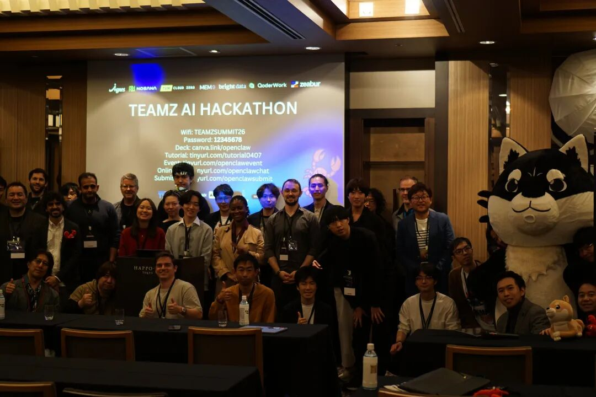

# 海外爆火AI“小龙虾”背后的腾讯云底座

> 公众号: 腾讯云
> 发布时间: 2026-04-24 18:38
> 原文链接: https://mp.weixin.qq.com/s/65BvP5qW_hqYPASfMS4Gtw

---

在东南亚、北美及拉美市场，一款代号「小龙虾」（AgnesClaw）的AI Agent应用正迅速走红，覆盖180多个国家，服务超800万全球用户。

这波现象级增长的背后，是 Agnes AI与腾讯云的深度共创。

双方基于腾讯云Lighthouse轻量应用服务器，落地了创新的「1美元养龙虾」模式，并完成了海外业务从GCP（谷歌云平台）到腾讯云的全面平滑迁移，打造了又一个规模领先的海外AI Agent标杆案例。

// 1 美元开启智能体时代

AgnesClaw是一个支持任务自动化、跨平台检索及复杂文件处理的多Agent协作平台。

为了让智能体真正实用且好用，AgnesClaw采用了Agent实例的轻量化架构：每一只“小龙虾”智能体，都独立绑定一台腾讯云Lighthouse服务器。

极低成本：借助腾讯云海外Lighthouse实例低至1美元/月的起步价，开发者和个人用户可以零门槛部署。没有复杂的汇率中转损耗，真正支撑起了产品的全球规模化。

极致部署：支持一键部署与全球多地域覆盖。Lighthouse的简易运维特性，让非技术用户也能快速搭建AI Agent运行环境。

爆发增长：依托Lighthouse稳定的底座能力，AgnesClaw龙虾实例上线仅半个月，部署数量即突破1000台，并正向万级规模快速增长。

// 从GCP平滑迁移，构建更实用的AI底座

随着业务加速全球化，Agnes A于今年4月开始迁移，预计5月完成海外业务六阶段割接，全面从GCP迁移至腾讯云。依托腾讯云全栈基础设施，Agnes将实现海外基建的统一管控与成本优化：

全球加速安全：接入腾讯云EdgeOne边缘安全加速平台，整合CDN加速、WAF与DDoS 防护，保障海外用户访问低延迟。

弹性云原生：TKE运行客户业务逻辑应用，结合CLB负载均衡与TSE网关，实现流量智能调度。

全场景数据矩阵：采用TDSQL-C、PostgreSQL、Redis 覆盖交易与缓存，用于存放图片、音频、文档等素材资源与用户生成内容。

//从NUS黑客松看Agent落地全景

模型好不好用，实战说了算。腾讯云携手Agnes AI持续深耕新加坡、日本、印尼等海外开发者生态。

在近期举办的新加坡国立大学（NUS）黑客松上，腾讯云作为官方唯一云平台伙伴，为174多名开发者统一提供Lighthouse云端实验环境。开发者们无需繁琐的底层搭建，即可快速验证AI Agent的实用性。

现场诞生的多款获奖应用，均基于Agnes模型+OpenClaw开源框架+腾讯云 Lighthouse搭建：

学业助手AGNES（冠军）：打通Canvas、Notion、Google Drive等平台，一键输出学业规划建议。

金融助手Banker.AI：实时监控 IPO、股权变更等关键信号，辅助高效决策。

旅游助手TravelSoul：结合价格监控与个性化偏好，实现“时机驱动”的精准推荐。

//打造“弹性龙虾”，应对复杂算力洪峰

随着这类Agent应用向深水区发展，智能体要处理的任务正从简单的文本问答，迅速向多模态推理、复杂代码执行与高并发调用演进。此时，单一轻量实例的算力瓶颈开始显现。

为了迎接这一挑战，腾讯云与Agnes AI深度共创，正式规划了「弹性龙虾」升级方案，通过构建三层协同架构，实现成本与性能的有效平衡：

轻量打底（严控成本）：在日常低负载场景下，龙虾智能体继续依托Lighthouse驻留运行，守住“低成本”的核心优势。

弹性突击（随取随用）：遇到极耗算力的复杂任务时，系统自动调度TKE容器弹性算力池，按需分配资源，任务结束即刻释放。

沙箱护航（绝对隔离）：搭载云端安全沙箱，确保AI自主生成的代码和脚本都在隔离环境中执行，在释放Agent能力的同时彻底规避底层风险。

该方案计划于2026年Q4正式全量上线，届时将作为AgnesClaw 2.0的核心底座，全面跨越算力瓶颈。

从一场黑客松的创新火花，到千万级用户的产业落地，AI Agent正在重构海外的数字化服务模式。凭借极低的试错成本与极速的部署体验，腾讯云Lighthouse不仅是AgnesClaw的专属底座，更已成为全球开发者落地AI应用的「第一台轻量服务器」。

未来，腾讯云将持续输出轻量化云服务与全栈云原生能力，助力更多中国技术、中国方案走向全球。

---

