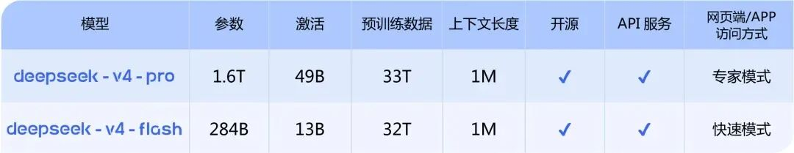

# 腾讯云TokenHub上架DeepSeek-V4

> 公众号: 腾讯云
> 发布时间: 2026-04-24 16:07
> 原文链接: https://mp.weixin.qq.com/s/-_UzxwK5ZYRxfcSkHI5T3A

---

今天，DeepSeek 发布 V4 预览版，支持百万上下文长度。

腾讯云TokenHub完成Day 0同步上架，首发提供 DeepSeek-V4 预览版 API 服务，对外定价与 DeepSeek 官方保持一致。

海外同步上线腾讯云国际站新加坡节点，全球用户可用。

腾讯云ADP、EdgeOne也已接入DeepSeek-V4 。支持用户快速构建基于新模型的Agent，零成本让DeepSeek V4嵌入现有网站服务。

同时，腾讯云 TI-ONE、HCC 高性能计算集群完成适配，为企业提供从模型训练、精调到安全推理的完整底座服务。

//TokenHub：首发上架 API，价格持平官方

腾讯云 TokenHub 在同步上线 DeepSeek-V4 预览版 API 的同时，进一步强化了企业级服务能力，实现统一鉴权与计费，简化企业的接入与管理流程。

TokenPlan 很快也会将 DeepSeek-V4 纳入旗舰模型资源池。配合 Auto 智能路由技术，用户无需更改代码即可直接调度，实现不同大模型间的无缝切换与灵活供给。

目前，TokenHub模型广场已覆盖[混元](https://mp.weixin.qq.com/s?__biz=MjM5MDgwMzc4MA==&mid=2654907403&idx=1&sn=571ee3baba7a34818859eb36739b286a&scene=21#wechat_redirect)、智谱、月之暗面、MiniMax、DeepSeek 等系列大模型。

//TI-ONE：支持快速部署专属推理服务

腾讯云TI-ONE大模型训推平台第一时间上架DeepSeek V4-Pro 与 DeepSeek V4-Flash，提供一站式部署与全流程开发能力。

基于DeepSeek-V4，企业和开发者可获得顶尖的编程、代码生成与复杂推理能力，并可借助 Think Max 深度思考模式与超长上下文支持，构建从代码开发到文档处理、从智能客服到经营决策的全链路 AI 生产力体系。

作为面向实战的大模型训推平台，TI-ONE提供完善的工具链、高效的算力管理与领先的训推加速技术，帮助企业以更低成本构建专属大模型。

//腾讯云智能体开发平台ADP：快速构建AI应用

腾讯云智能体开发平台（ADP）接入DeepSeek-V4后，用户可以快速基于平台工具、智能工作台和模型能力，搭建高质量的智能体。

ADP平台深度整合了 LLM+RAG 增强检索、自动化工作流、多 Agent 协作架构等核心能力，支持从配置、开发、调试、评测到发布的全链路一站式开发。

新上线的智能工作台，还支持用自然语言快速搭建企业级智能体，帮助企业在智能客服、知识助手、经营分析等场景快速接入AI能力。

//HCC 高性能计算集群：完成全面适配

腾讯云HCC高性能计算集群已全面适配DeepSeek-V4。

HCC 基于“一云多芯”架构，通过腾讯云异构计算平台整合多家国产芯片，实现软硬件全栈优化，为企业提供高性价比 AI 算力。

这意味着企业在进行 DeepSeek-V4 大规模训练与推理时，可直接使用国产芯片构建的底层算力，在降低算力成本的同时提升训练效率，并摆脱对单一芯片供应的依赖。

来腾讯云，体验Hy3 Preview 、DeepSeek-V4预览版等最新模型。

不同参数，一样好用。

---

