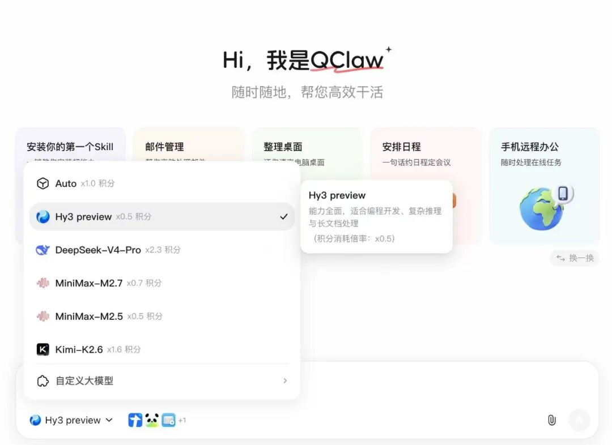

# QClaw大升级：率先支持Hermes，接入DS-V4、Hy3 preview

> 公众号: 腾讯云
> 发布时间: 2026-04-27 11:51
> 原文链接: https://mp.weixin.qq.com/s/bqWKKvdOQ61VDEeBe02eKg

---

今天，QClaw 发布了迄今为止力度最大的一次版本更新（v0.2.14）。

正式接入支持Hermes框架，用户可以创建并运行Hermes类型的Agent，在一个应用里实现“养虾又养马”。

与此同时，QClaw在这一版中同步完成了多项能力更新：“灵感广场”全面升级为“专家广场”，降低了不熟悉Prompt用户的使用门槛。

远程操控通道微信小程序升级，支持语音交互、文件共享好友。

底层模型从固定使用升级为自由切换，已支持最新的Hy 3 preview和 DeepSeek-V4  Pro。

连接器新增百度网盘、携程、飞猪和腾讯新闻四个平台；基于腾讯文档的 Agent团队协作功能也同步上线。

...

从内到外，QClaw大变样的亮点都在这👇

# // 灵感广场→专家广场

# 不懂skill也能用好Agent

#

QClaw产品经理每天都在咂摸怎么把Agent的使用门槛打下来。

他们认为，老版本的“灵感广场”本质上是一个选题和灵感启发入口。它告诉用户“你可以用 QClaw 做这些事”，但用户看到之后仍然需要自己组织语言、尝试指令、反复调优。

对于不了解 AI 工具使用方法的新手用户来说，这中间存在一个不小的门槛。

“专家广场”把这个门槛拆掉了。

用户打开后看到的100多个按行业和场景分类好的 AI 专家，选择对应领域的专家，用自然语言描述需求，专家会直接交付一个可用的结果物——文档、报告、代码或分析结论。

全新"专家广场"将底层能力从 Skill 升级为完整 Agent 架构——每个专家拥有独立人设与隔离的会话空间，对话更聚焦、回答更专业。让每位用户零门槛用上专业级 Agent 能力。

整个交互流程简化为三步：选专家、说需求、拿结果。用户无需理解什么是 Prompt、什么是 Skill、什么是 Agent，也无需进行任何配置或训练。

每个专家内置了经过优化的指令链和多步骤工作流，首次输出的质量远高于通用对话。

首期上线的专家覆盖内容创作、数据分析、代码开发等多个领域。

# // 专精养虾→养虾又养马

# 模型同步支持自定义

#

本次更新中，QClaw 接入了Hermes框架，现在同时支持两种Agent内核运行。

用户可以在QClaw中创建Hermes类型的Agent，根据实际需要选择使用哪种内核。养虾养马都随你，虾马自由。

（\*目前支持MacOS系统创建Hermes Agent）

模型选择方面，QClaw从原有的固定模式升级为自由切换模式。用户可以选择系统智能匹配，也可以手动指定模型。

目前已支持的模型包括最新的 Hy 3 preview、DeepSeek-V4 Pro、KIMI-K2.6、GLM-5.1。

积分统计体系也同步升级，从原来简单的Token计数改为按任务类型和所用模型匹配积分额度，花费情况更加清晰。

# // 小程序全新升级

# 本地Agent→本地Agent+云端Agent

#

QClaw专属小程序全新升级，除文字对话外，用户还可以语音远程操控QClaw，文件共享给好友。(搜索微信小程序「QClaw管家」直达)

比如在通勤路上用语音下达一条指令，到家之后电脑端的龙虾已经完成了相应任务。

小程序还支持一键绑定Lighthouse云服务器上已经购买过的云端龙虾。

绑定完成后，本地虾和云端虾可以在小程序中统一管理和调度，即使不在电脑前，也能通过手机远程指挥龙虾执行任务。

从今以后，QClaw不再是一只单纯的本地虾了。

# // 连接器持续扩容

# 能在Agent里面协作文档

#

连接器方面，本次更新新增了四个外部平台的接入支持：百度网盘、携程、飞猪、腾讯新闻。

用户可以通过对应的连接器让龙虾访问百度网盘中的文件、查询携程和飞猪上的行程信息、获取腾讯新闻的内容摘要。

QClaw 还上线了基于腾讯文档的Agent团队协作功能。

团队成员之间可以指挥QClaw让Agent共同编辑同一份文档开展团队协作。

基于Agent的在线文档协作体验，不想来试试吗？

以上是QClaw 这套Agent小屋的最新变化，

这里越来越热闹了，

希望你喜欢。

---

