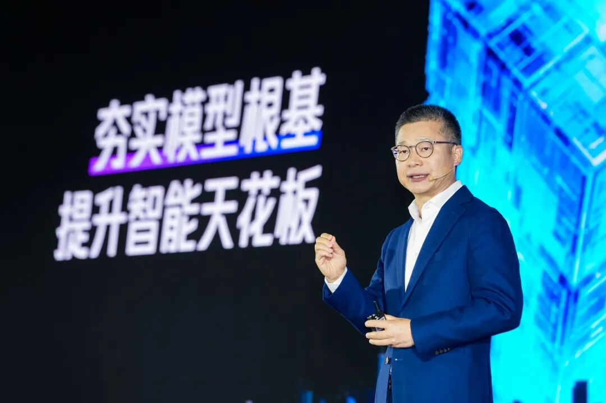

# 多款AI产品首发！腾讯云升级全栈企业级Agent能力

> 公众号: 腾讯云
> 发布时间: 2026-04-28 12:54
> 原文链接: https://mp.weixin.qq.com/s/PA1SMzy7CBaj9OGvDCWheQ

---

上个月的上海峰会，我们首次对外发布了[「腾讯云Agent产品全景图」](https://mp.weixin.qq.com/s?__biz=MjM5MDgwMzc4MA==&mid=2654907060&idx=1&sn=34e7f2bdc9d760b01a80596c7876dbdc&scene=21#wechat_redirect)（详情请戳👈🏻），系统呈现了从底层Infra基建到顶层Agent应用的全栈AI能力、产品体系。

今天，在2026腾讯云城市峰会（重庆站）上，我们往前更进了一步——

「全面升级全栈企业级Agent产品能力：首发ClawPro专有云版、ADP智能工作台、Agent Memory、Agent Storage等多款产品，让Agent在企业的工作流里真正跑起来！」

正如腾讯集团副总裁、政企业务总裁李强在会上所言：企业级AI的竞争焦点，正从「谁的模型更好」转向「谁能把模型用好」。不能稳定交付结果的AI，更多是纸上谈兵。

当AI从「会回答」走向「懂场景、会执行」，沿着企业真实的落地痛点，腾讯云交出了一整套工程化方案：

图注：腾讯集团副总裁、政企业务总裁 李强

// 第一步：打通企业级Agent落地全链路

与个人提效不同，企业部署Agent容错率较低。要让Agent真正用起来，第一步需要提供极低门槛的开发工具，以及一套更实用的管控与风控体系。

极简开发：用自然语言搭建工作流。我们全面升级了智能体开发平台ADP，通过全新上线的「智能工作台」，企业员工不用再去画复杂的流程图，只需用自然语言输入需求指令，平台就能自动解析并生成完整的工作流，还能一键打通企业内部的现有业务系统。

统一调度：打通内部Agent孤岛。当企业内部跑着成百上千个Agent，怎么统一管理成了难题。为此，我们也上线了ADP Agent Portal。它相当于一个调度枢纽，实现全链路的统一入口与可观测治理，帮企业把散落各处的Agent统一收编、精细化排班，并全程监督运行结果。

安全管控：把调度中心搬进私有环境。针对金融、政务等对数据安全有更高要求的民生行业，国内首个经百万级用户验证的管控平台ClawPro正式首发专有云版本。它实现了「运维+办公」双场景联动，将大模型与调度能力严密、完整地部署在企业本地。

成本风控：守住算力消耗的底线。Agent落地加速后，大量调用极易招致黑灰产的恶意套利，造成Token浪费。我们也同步上线了天御Token防刷解决方案，通过设备指纹与全生命周期防护，精准拦截批量作弊，坚决护住企业的算力「钱袋子」。

此外，针对不想从头开发的客户，我们还首发、上线了一批开箱即用的「数字员工」：

从扫码即用的QClaw、WorkBuddy，到深度集成云生态、一键完成云端调度且最高节省57%Token的LightClaw ACE；再到数据库Hermes Agent，以及业内首款多云管理专家CloudQ和ITSM技术支持专家AndonQ，让复杂的IT指令转化为极简对话。

// 第二步：夯实Harness工程底盘

前台应用跑得稳不稳，也看后台底座硬不硬。

脱离了企业知识和坚实基建的Agent，往往会暴露出执行慢、成本高、易产生幻觉等短板。为了解决这些企业落地痛点，我们对Harness工程化全链路进行了一次底盘加固：

首先是把「脑子」变得更聪明、更便宜。企业规模化跑Agent，算力成本是绕不开的门槛。为此，我们在腾讯云TokenHub平台上全面接入了极具性价比的Hy3 preview模型，把输入价格直接打到了1.2元/百万tokens，让大家接得上、用得起。

光有算力还不行，Agent还得懂企业的「行话」。业内首个AI原生Agentic知识库腾讯乐享持续迭代，可以自动完成知识分类、更新与合规审核，并由乐享自有Agent融汇内外部知识、穿透复杂业务场景，将知识势能转化为业务生产力。

再往下走，当Agent处理极其复杂的长线任务时，往往会面临记不住、存不起的问题。

针对这一点，我们发布了TencentDB Agent Memory插件。它通过独创的「短期记忆压缩」机制，在复杂长任务中不仅将Token消耗直降超50%，还让任务完成率逆势提升了23%（目前已在ClawPro中上线）。

另外，关于存储成本过高等问题，本次峰会上，腾讯云也首次发布了Agent Storage。它是一个统一的数据底座，我们通过存算解耦架构，将向量存储的综合成本大幅降低了 90%以上。

最后，也是最关键的安全防护问题。

Agent具备自主执行能力，复杂的网络交互暗藏不少风险。依托腾讯云AI Agent安全中心，我们还全新推出运行时防护与流量沙箱能力。

它们会自动接管所有流量并实现TLS解密，实时识别并脱敏十大类敏感数据。这相当于在网络层建立了一道硬性屏障，确保企业的核心机密绝不离开Agent的会话边界。

// 第三步：生产力拉满！Agent正在千行百业「上岗」

技术再强，最终都要拿业务结果说话。

目前，这套全栈企业级Agent能力已经在西南，乃至全国的各行各业交出了实打实的生产力答卷：

- 金融投研领域：腾讯云携手万得Wind，将万得AI接入微信ClawBot。金融从业者在微信里发句话就能完成行情查询与策略研判，过去半小时的工作，现在缩短至3分钟。
- 财税服务领域：SaaS平台「慧算账」通过ClawPro嵌入企业微信，实现查社保、开发票一站式打通。每个会计的服务能力从300家小微企业提升到400-500家，整体提效 50%。
- 医疗健康领域：和仁科技基于WorkBuddy部署了超百位「数字员工」，将医院HIS系统的故障响应从小时级压缩到了分钟级；中康科技将深耕19年的医疗能力封装上架至WorkBuddy技能商店，老年慢病患者只需对着手机说出药品名，就能秒级获取用药预警。
- CRM与融媒领域：六度人和（EC）用乐享AI知识库替代传统问答，让销售拜访客户的准备时间从小时级降至分钟级；天府融媒则搭起覆盖全省的「天融AI龙虾池」，让媒体工作者零门槛调用专业AI能力。

  ......

扎根大西南，放眼全球化。

截至目前，腾讯云已携手近2000家合作伙伴，服务了西南地区超过9万家客户。

在本次峰会上，我们不仅与两江新区及十余家头部政企机构达成了战略合作，更正式发布了「出海生态启航计划」，通过出海权益、伙伴库与知识服务三大体系，全力打造企业全球化首选云服务生态平台。

从底层基础设施的夯实，到企业级场景的实战演练。下一步，腾讯云将继续以全栈企业级Agent能力，把「增长」和「降本」这两件事，实实在在地交到每一个客户手中。

---

