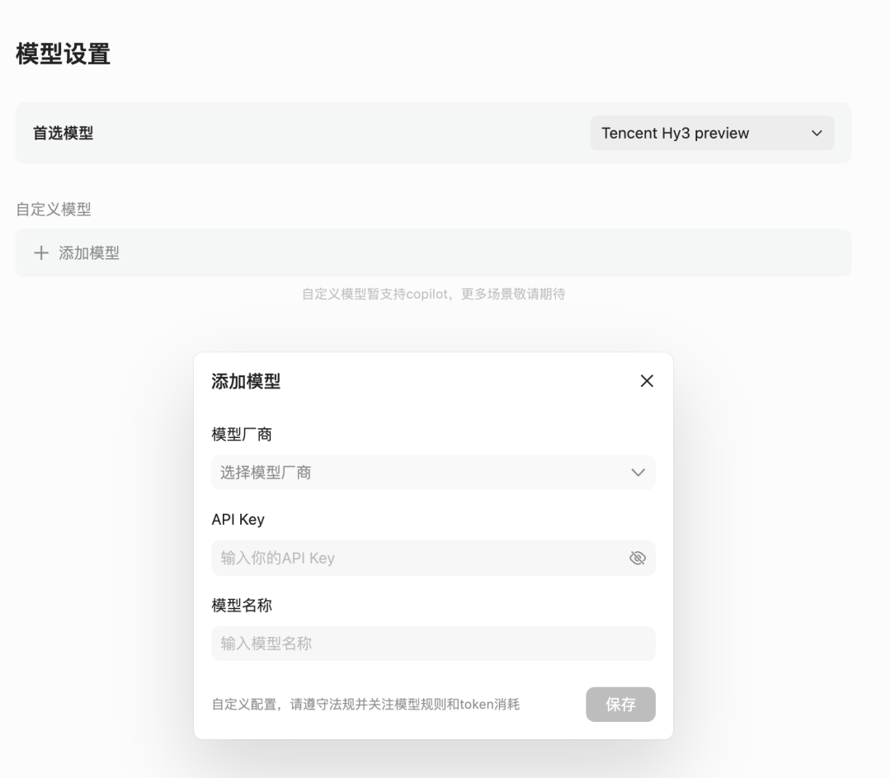
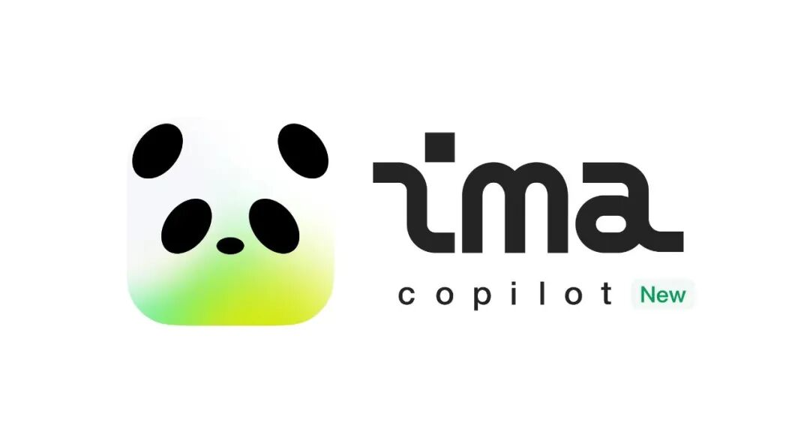

# 高速迭代530天，腾讯ima正式解锁Agent形态

> 公众号: 腾讯云
> 发布时间: 2026-04-29 10:50
> 原文链接: https://mp.weixin.qq.com/s/zQ_jegVtRBxOOWqPq7ROBg

---

今天，腾讯ima发布全新Agent模式“copilot”，支持用户创建专属Agent。

copilot内置记忆系统，通过copilot设定、用户档案、长期记忆、经验技巧四大模块，记住用户的背景、习惯与推进事项，实现跨场景连续调用，减少重复输入。

用户浏览网页、文件、知识库或笔记时，copilot还可感知当前内容，持续伴随，无需额外上传文件，直接基于当前内容完成理解与处理。

技能生态同步上线，copilot内置官方技能包，并支持按需加载扩展Skills。

ima为新用户提供一笔算力福利，每日登录还可领取额外算力。

为了保障体验，copilot功能采取申请制，将根据申请顺序陆续通过。

快速Get下面的要点👇，或者把这篇推文存到ima问你的copilot

#

# // 四大模块记忆系统，记住你是谁、从哪来、到哪去

copilot的记忆系统覆盖四个维度，各自承担不同角色。

-copilot设定（Soul）：定义Agent的性格、说话风格与行为方式，用户可自由设定，让Agent更像你想要的那个“伙伴”。

-用户档案（User）：记录用户的基本信息、工作背景与偏好设定，Agent据此调整回答风格与内容侧重。

-长期记忆（Memory）：将对话中反复出现的背景信息、推进事项结构化存储，跨会话保留，避免每次重新介绍自己。

-经验技巧（Agent）：Agent在使用过程中自行积累的经验条目，会随着使用持续迭代，越用越懂你。

这套系统可以把零散的上下文固化下来，记忆内容在设置卡片中可见，用户还可以直接通过对话编辑。

老ima用户已经开始和古人神交了👇

用户（谪仙）：“太白，帮我把这堆散乱的素材理一理，我要写个震撼的开篇。”

李白 copilot：“哈哈！兄台，这万卷‘正文’在我眼中，不过是奔流到海的黄河之水！我已尽览其中风光。”

# // 全场景感知，无需上传文件直接处理当前内容

除了记住你，copilot还能感知你当下正在做什么。

copilot支持以浮窗形式悬停在ima应用内，用户在浏览网页、打开文件、翻看知识库或笔记时，Agent会全程伴随，并自动感知当前内容。

不需要额外上传文件，直接问“这个网页讲了什么”就能在一个入口得到回答。

在知识库或笔记页面，还可以直接指挥copilot干活，例如“帮我把这个知识库按学科分类”。

# // ima官方增强Skills上线

前不久，ima上线的Skills能力受到大量用户欢迎，SkillHub资源下载量高达3.4万。

在这次copilot中还内置了与ima产品深度结合的官方Skills，首期上线知识库操作、笔记操作、创建Skill、生成报告等技能，持续增加中。

（不知道怎么用官方技能，直接问imacopilot）

知识库Skill是这次升级的重点：可以读取文件正文内容，进行跨文件的复杂信息读取和汇总。

除了官方技能，ima还支持用户通过对话装载其他Skills，点击“发现更多Skills”直达SkillHub 3.5万个技能，复制粘贴就能搞定。

copilot的开放还体现在模型上，支持用户自由配置各大模型API Key。（使用自有API Key的消耗由用户自行承担，不扣除平台算力）

2024年11月15日

ima第一天上线时

名字里就带有copilot

从ima.copilot到ima发布“copilot”Agent模式，ima在产品设计之初就想好了陪伴用户的知识形态。

欢迎来ima用Agent管理你的私人知识库。

也欢迎在评论区，告诉我们ima Agent的正确打开方式。

---

