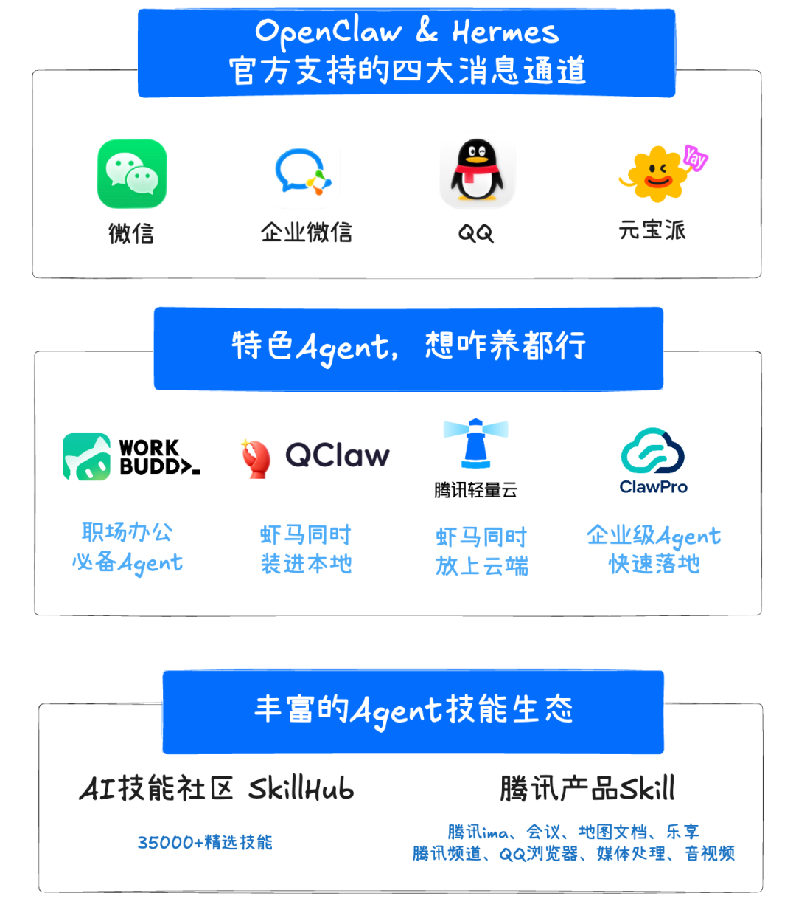
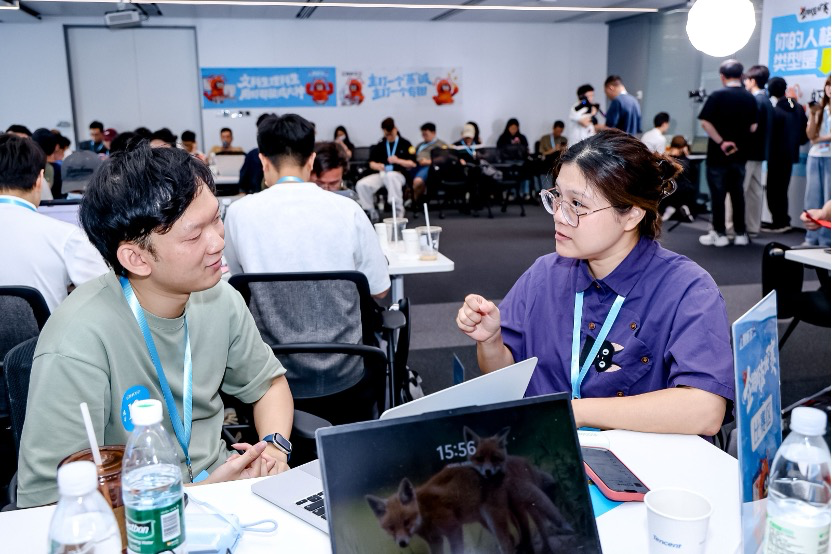
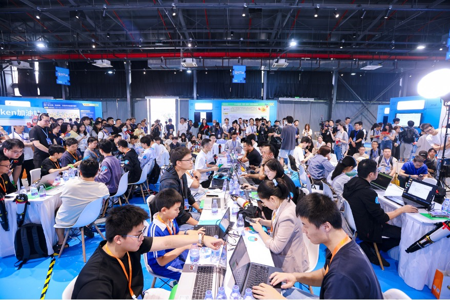
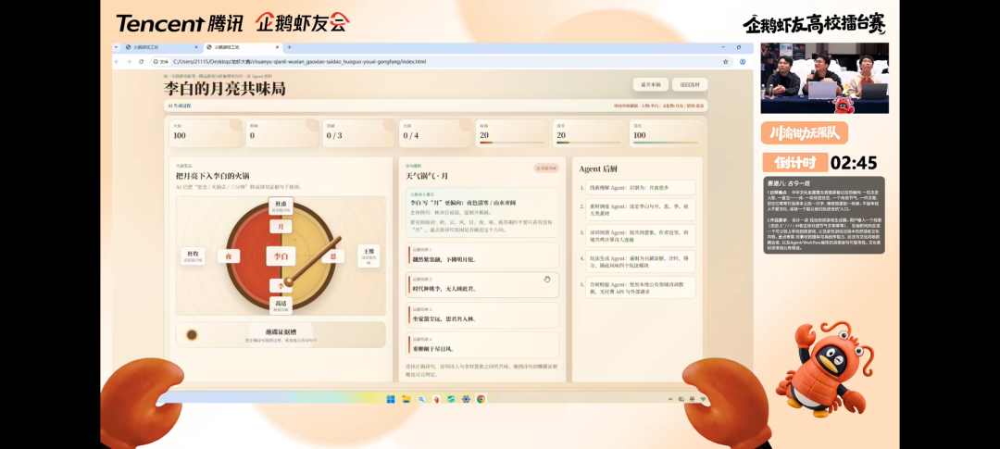
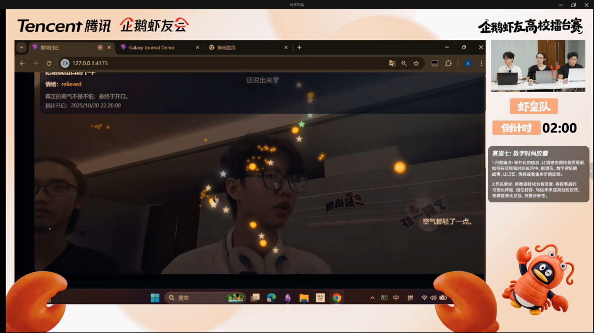
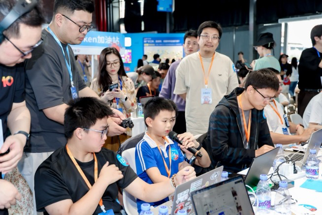
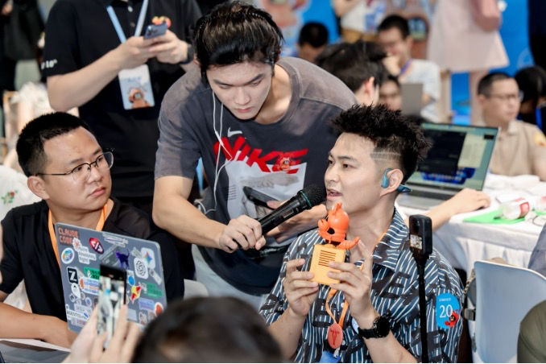
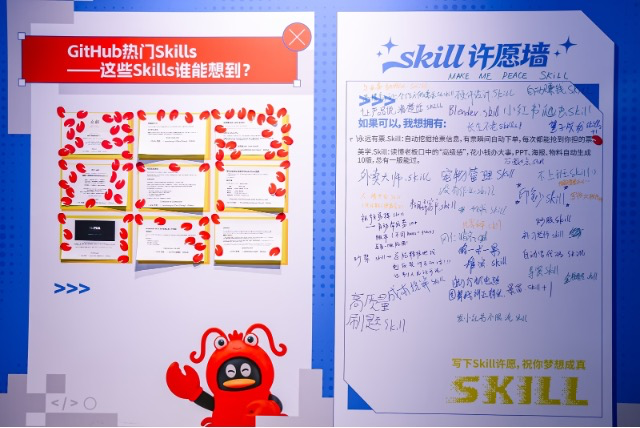

# 免费装虾55天，我们看到了100种Agent玩法

> 公众号: 腾讯云
> 发布时间: 2026-04-30 13:16
> 原文链接: https://mp.weixin.qq.com/s/z3Bei2HRwK3SFJY0Q6B3Rg

---

是的，腾讯门口免费安装龙虾已经过去快2个月了。

这只虾，从深圳启航，走上云端和本地、走进高校和园区，走遍全国大江南北。

- 3月6日，[腾讯宣布免费安装OpenClaw](https://mp.weixin.qq.com/s?__biz=MjM5MDgwMzc4MA==&mid=2654906519&idx=1&sn=589b1bdcac3ee8b1d5dc6e3ef2f627a8&scene=21#wechat_redirect)。
- 3月14日，[龙虾全国免费巡装正式启动](https://mp.weixin.qq.com/s?__biz=MjM5MDgwMzc4MA==&mid=2654906714&idx=1&sn=2432ed620c270bab039d5c2621e2af67&scene=21#wechat_redirect)。
- 3月20日[，企鹅虾友会启动](https://mp.weixin.qq.com/s?__biz=MjM5MDgwMzc4MA==&mid=2654906934&idx=1&sn=80c302f068d2e4cb4c986fb8accbe866&scene=21#wechat_redirect)，“一会两赛”诚邀全国热爱Agent人士。
- 4月14日，[Hermes Agent来了](https://mp.weixin.qq.com/s?__biz=MjM5MDgwMzc4MA==&mid=2654907235&idx=1&sn=b8c892ec98269d1056d28c8e6b6194bd&scene=21#wechat_redirect)，腾讯云率先支持部署。

  ...

过去55天，腾讯在全国共落地500多场免费安装和技术交流活动，走过40多个城市、近百所高校，累计参与实训学生近2万人。

总共为近10万名用户提供了安装部署→模型配置→技能安装→正式使用→卸虾装马/虾马双装的一条龙服务。

走遍全国的50多天里，我们和用户一起见证了这些变化👇

# // 领养一只虾→“虾马双全”

#

55天前，大家都想领养一只小龙虾。今天，围绕Agent的装、玩、养、用、斗各有门道，腾讯也构建了完善的Agent服务和框架满足用户的各种需求。

你日常用的聊天工具，都能指挥Agent干活。微信、QQ、元宝派、企业微信，同时被OpenClaw和Hermes列为官方支持的消息通道。

WorkBuddy已经成为不少用户办公离不开的Buddy，Lighthouse支持云端养虾又养马，QClaw把虾和马同时装进本地。

SkillHub加速Skill生态建设，ima龙虾知识库「鹅厂养虾」人数不断突破新高。

从领养一只虾，到虾马双全——腾讯和用户一起正在加速拥抱Agent。

# // 百人装虾→千人斗虾

#

全国巡装把龙虾从腾讯楼下带到了各地的写字楼、产业园和大学校园。与此同时，用户对龙虾的需求正在从“帮我装”变成“试试我的龙虾厉不厉害”。

腾讯启动了「企鹅虾友会」，通过“一会两赛”，覆盖入门科普、创意实践到硬核对抗。

企鹅虾友线下赛从深圳出发，先后落地上海、成都、广州、北京，一路五个城市。

上海站，11岁小学生养了3天虾就来参赛，打败一众“老虾”拿下二等奖；72岁的阿姨带闺蜜团来装虾观赛。

广州站，外卖骑手、广告人、中专老师齐上阵，一位听障工程师全程用文字与龙虾交互完成比赛。

（手语老师和选手沟通）

赛事回到深圳时，场面已经完全不一样了。企鹅虾友大会、虾友线下赛、Hermes Agent中国大陆首次官方Meetup同天举办，超千人涌进华侨城创意园打卡交流。

企鹅虾友大会上，腾讯12款产品集体摆摊，WorkBuddy、QClaw、Lighthouse、SkillHub等产品主理人现场坐镇，带虾友从不懂到会用，再从会用到玩好。虾友线下赛的赛场上，8岁小学生、17岁高中生、大学生、程序员轮番上台比拼蒸馏Skill。

（深圳站选手比赛现场，吸引了大量观众围观）

看完线下来到线上，企鹅虾友高校龙虾擂台赛也正式打响。高校龙虾专列停靠全国近百所高校，万人学习养虾攻略。

擂台赛集结全国**超100支**战队，**12支战队**突出重围，登上直播PK台，吸引**超15万人次**围观。比赛**不设专业门槛，不限技术背景**，大学生们利用**WorkBuddy** 等AI工具，从身心守护、数字文化、公益互助、烟火经济等八大赛道给出了自己的思考和实践。

重庆高校赛中，西南政法大学的法学生，在72小时限时开发中展现不俗**创意**，跨界打造“今天你拉了吗”火锅辣度榜，用法律人的严谨为吃货献上维权指南；川渝学子将历史文化融入游戏与火锅，获评委频频点赞。

大湾区高校赛场竞争更加激烈，深圳大学、南方科技大学、东莞理工学院等都派出多支战队攻擂挑战。他们把情绪疗愈与梦境再现相结合，用日程管理让毕业不散场，让校园里的公益好事被看见…用大学生们自己的话说，有了好用的AI，一个人什么都可以实现。

评委也在赛后感叹，**在激烈的竞技中，创意成了思绪的出口。** 有了 AI 工具的加持，**再微小的个体，再细小的需求，都能被温柔满足。**

从“百人装虾”到“千人斗虾”，Agent正从少数开发者掌握的工具，变成普通用户也能训练、调用和分享的能力。

# // “什么是Skill？”→用Skill造万物

#

"Skill是什么？"

腾讯云Lighthouse产品经理现场刚开始给用户装虾时，要回答很多次这个问题。

现在，企鹅虾友会上的用户，已经开始用Skill造万物。

景观行业总工李博，今年年后才接触Agent，北京赛场上30分钟把18年从业经验炼成“审图助手Skill”夺冠。

34岁程序员曾芬把工作方法论炼成“鲁班Skill”，核心是把模糊需求拆解成可执行的工作流。

8岁小学生因为“队友太菜了”，把顶级游戏攻略蒸馏进AI做成“蛋仔搭子”Skill。

产品经理云天甚至把龙虾装进了手工打造的AI硬件卡片机。

广州站一个晚上诞生了近50个Skill：蒸馏“灰太狼”做“首席抗挫折助理”、用曾国藩哲学造“反内卷心法”、中专老师带学生蒸馏“中专生自救指南”，还有人直接把自己蒸了——“只为能早点退休”。

从职场到校园，从游戏搭子到硬件联动，Skill让每个人都能用5分钟造一个应用。

不挑学历，不挑年龄，只拼你的想象力。

以上，是腾讯免费装虾的阶段性进展，很荣幸和大家同行共创。

祝大家五一假期快乐。

友情提醒，在5月1日00:00前，给你的Agent跑一个长任务。

你休息，它干活。

享受双倍的美好假期。

---

