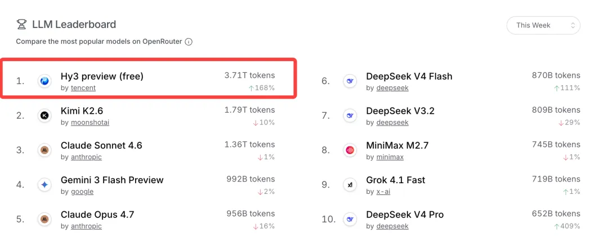
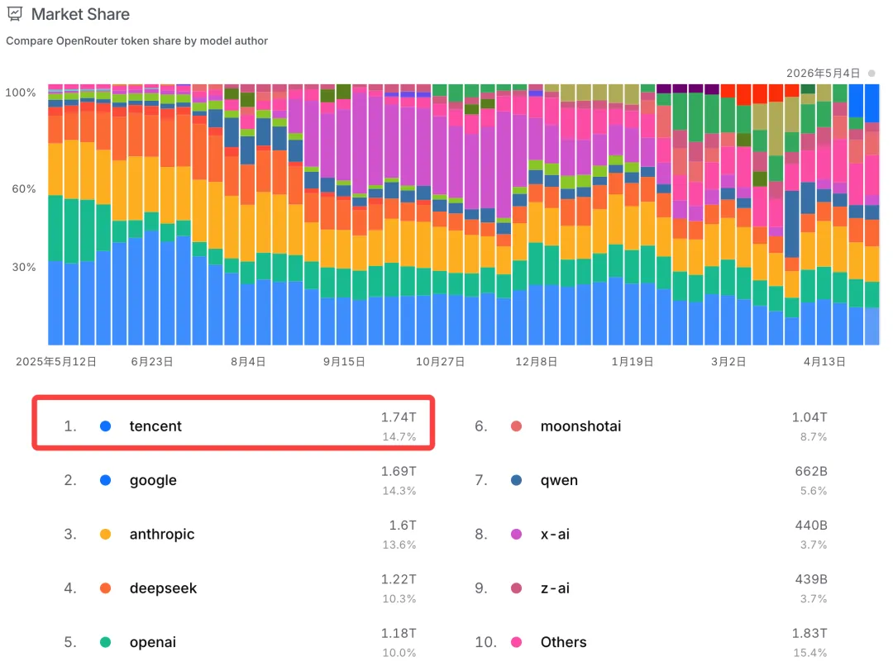
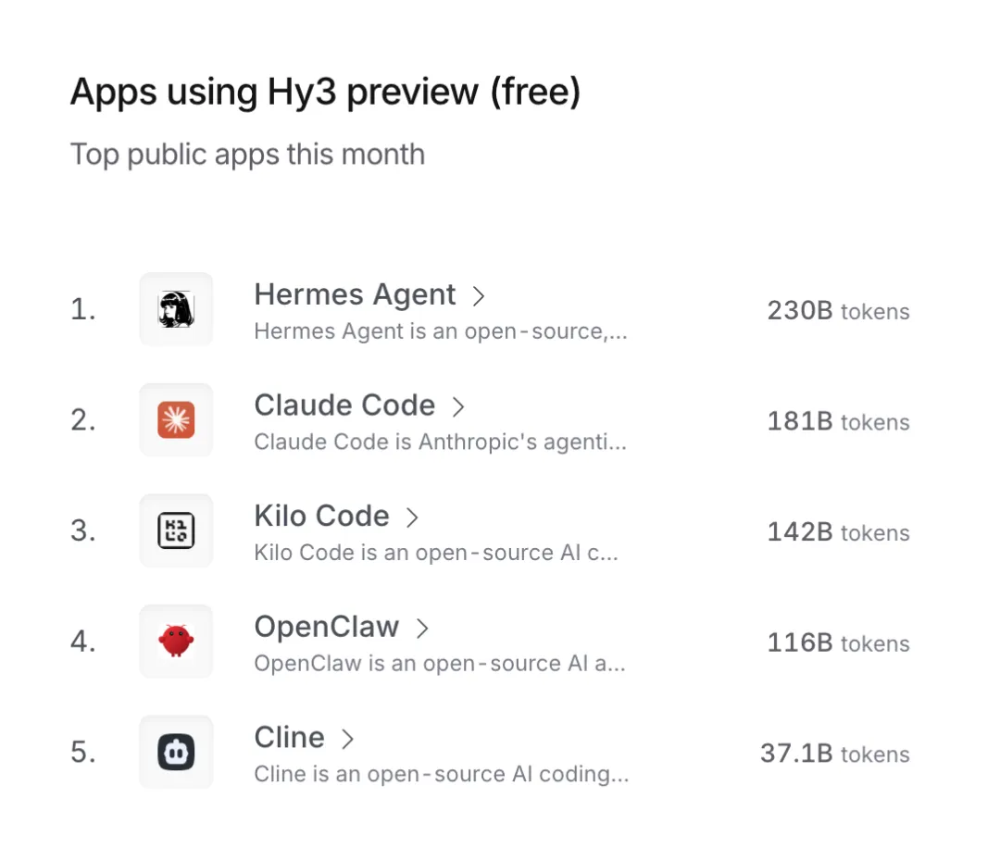

# Hy3 preview上线两周Token调用增长10倍

> 公众号: 腾讯云
> 发布时间: 2026-05-07 12:08:55
> 原文链接: https://mp.weixin.qq.com/s/Aicl4Tg1cm6siKu6A6tI-Q

---

汇报全球开发者对[Hy3 preview](https://mp.weixin.qq.com/s?__biz=MjM5MDgwMzc4MA==&mid=2654907403&idx=1&sn=571ee3baba7a34818859eb36739b286a&scene=21#wechat_redirect)上线两周的使用反馈👇

-截至目前，Hy3 preview的Token调用总量已达上一代模型Hy2的10倍。

-其中代码和智能体类场景增长尤为明显——在腾讯 WorkBuddy/CodeBuddy 及QClaw等应用中，调用增幅超过16.5倍。

-来自OpenRouter的公开数据显示，Hy3 preview过去一周以3.71万亿Token 的调用量，拿下周榜总量与市场占有“双第一”，在编程和工具调用场景同样排在榜首。

(OpenRouter模型调用周榜，5月7日)
（OpenRouter模型市场占有率排名）

Hy3 preview是混元完成技术架构重构后推出的首个模型，采用快慢思考融合的混合专家（MoE）架构，总参数量2950亿，激活参数210亿，支持256K长上下文。

这套架构天然适配复杂任务链和高频工具调用，也解释了为什么调用量集中爆发在Agent和代码场景。

在OpenRouter公布的Hy3 preview调用量最多的APP排行榜上，前5名均为国际主流智能体和代码类应用。

不少开发者也在社交媒体上分享Agent场景用Hy3 preview的体验:「工具调用成功率高、代码生成可靠」「是一个 Agent-First 的模型」「指令遵循的准确性令人印象深刻」。

腾讯业务此前的测试结果也显示，在 CodeBuddy 和 WorkBuddy 等智能体应用中，Hy3 preview的首次响应速度提升 54%，任务平均完成时间缩短 47%，任务成功率维持在 99.99%。接入该模型的腾讯文档 AI PPT 功能，生成成功率较上一代提升 20%。

目前，Hy3 preview已接入腾讯元宝、QQ浏览器、微信读书等多个业务场景。

接下来，混元将继续在OpenRouter、腾讯云TokenHub提供高性价比API服务，并通过多样化的Token Plan及开源等形式，持续服务全球开发者。

感谢大家的使用和反馈，

我们继续努力。

---

