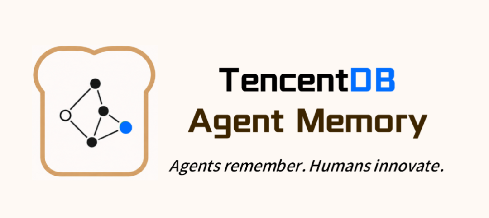
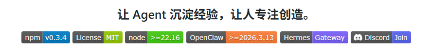
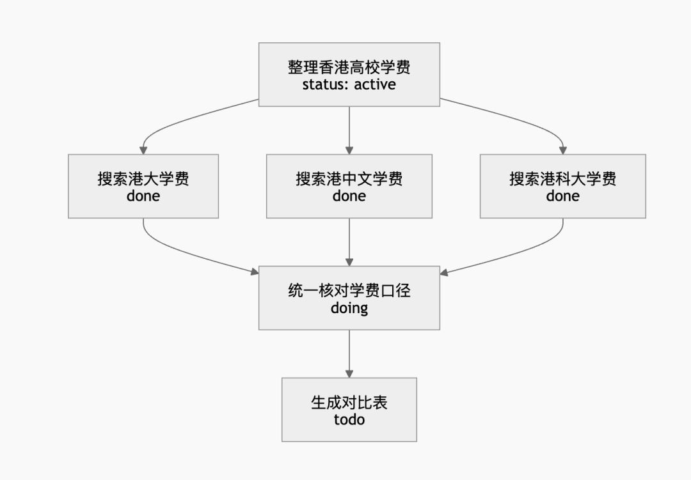
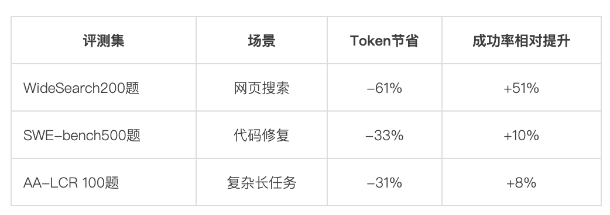

# 腾讯开源Agent Memory，让Token消耗降低61%

> 公众号: 腾讯云
> 发布时间: 2026-05-14 15:03:06
> 原文链接: https://mp.weixin.qq.com/s/mKSTl44Ste3Oxh7REl8WqQ

---

Agent太烧Token？汇报一个好工具

腾讯云正式开源 TencentDB Agent Memory，面向 Agent 长任务场景提供短期记忆压缩与长期个性化记忆能力。长期记忆已于上月上线[免费使用](https://mp.weixin.qq.com/s?__biz=MjM5MDgwMzc4MA==&mid=2654907139&idx=1&sn=3b86e64e59979cb3917580d9d0befc2c&scene=21#wechat_redirect)，这次开源的重点是短期记忆压缩。

项目主页👇

[https://github.com/Tencent/TencentDB-Agent-Memory](https://github.com/Tencent/TencentDB-Agent-Memory/blob/main/README.md)

随着 Agent 在代码开发、网页搜索、研究分析等场景中的任务链路持续变长，大量工具调用、网页内容和中间结果会快速占满上下文窗口，导致 Token 成本上升、任务状态丢失以及推理稳定性下降。

TencentDB Agent Memory 通过“上下文卸载（Context Offloading）+ Mermaid 任务画布”的技术，将完整信息卸载到外部存储，同时以结构化任务图保留关键状态与执行路径，使 Agent 在长任务中保持轻量上下文，同时支持原始信息的逐层追溯与恢复。

在多任务连续 Session 实验中，该方案最高降低 61% Token 消耗，同时提升长任务场景下的任务成功率。

先从这张“Mermaid 任务画布”讲起👇

## // Mermaid 无限画布：给 Agent 一张任务地图

长任务里最危险的事，不是信息丢了，是 Agent 不知道自己走到哪。

20 次工具调用之后，上下文里堆着一长串线性历史。Agent 能看到“做过什么”，但不容易判断哪些是并行分支、哪些步骤有前置依赖、当前处于哪个阶段。

流水账适合记录，地图适合导航。腾讯云数据库团队用 Mermaid Flowchart 把任务执行过程组织成一张可导航的任务画布。

Mermaid 是 GitHub 和技术文档中广泛使用的图描述语言，主流大模型天然具备读写能力，纯文本格式，可持续更新，人也能直接渲染查看。

通过这张画布，Agent 不需要记住所有内容，只需要知道哪些信息重要、它们被组织在哪里，以及必要时如何一步步展开。

历史没有被压成一段不可恢复的摘要。它变成了一张可以继续执行的地图——能折叠，也能展开。

## // 上下文卸载：省 Token，没丢证据

##

画布解决“结构不能丢”，但长任务中工具返回、搜索结果、日志输出等原始信息往往非常长，全部留在上下文里窗口很快被填满。

 Agent Memory 另一个核心技术是上下文卸载（Context Offloading）：每次工具调用结束后，完整结果写入外部文件（refs/\*.md），上下文里只保留一行摘要和索引路径。

原始信息不再长期占据上下文窗口，但也没有被丢弃——它按四层递进结构存储在外部，随时可以找回：

|  |  |  |
| --- | --- | --- |
| 层级 | 内容 | 位置 |
| Level 0 | 完整工具返回原文 | refs/\*.md |
| Level 1 | 工具调用级摘要 | offload.jsonl |
| Level 2 | 任务画布节点 | \*.mmd |
| Level 3 | 任务级索引（目标+状态） | 上下文 |

底层保留证据，高层保留结构。Agent 日常只接触 Level 2–3 的轻量信息驱动任务推进，当画布摘要不足以支撑决策时，通过 node\_id 回溯 Level 1 的 JSONL 记录，仍不够则继续下钻到 Level 0 的完整原文。

任何一层压缩都不是不可逆的黑盒——系统内每一条信息都可以沿索引链路 100% 找回。

多任务连续 Session 实验结果（非单题清空上下文）👇

Token 下降的同时成功率上升——上下文中的噪声减少后，模型注意力更集中在当前任务目标上。

消融实验也验证了画布的独立贡献：仅卸载时 Token 节省约 15%，叠加 Mermaid 画布后提升至 31%–33%。

## // 开箱即用，“虾马”一键部署

##

TencentDB Agent Memory 目前已适配 OpenClaw 和 Hermes 等主流 Agent 框架，支持一键集成。

-极简安装：openclaw plugins install @tencentdb-agent-memory/memory-tencentdb

-零外部依赖：默认使用本地 SQLite 存储，所有中间产物（画布、摘要）均为人类可读的 Markdown/Mermaid 文件 。

-进阶支持： 支持接入腾讯云向量数据库 TCVDB，实现混合检索（BM25 + Vector）。

Agent 的上下文窗口不应是一张无限堆叠的桌子，而应是一个有序的工作台。我们希望通过这套方案，为开发者提供一个更可靠、更透明的“第二大脑”。

这次开源，是把已经在内部验证过的产品能力开放给社区，我们希望它能帮 Agent 沉淀经验、让开发者把每一次交互都变成可复用的资产。

欢迎来Agent Memory项目主页点个Star，我们欢迎任何形式的贡献。

戳👉[项目主页](https://github.com/Tencent/TencentDB-Agent-Memory)

戳👉 [npm](https://www.npmjs.com/package/@tencentdb-agent-memory/memory-tencentdb)

---

