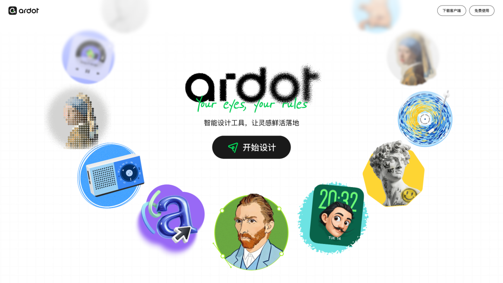
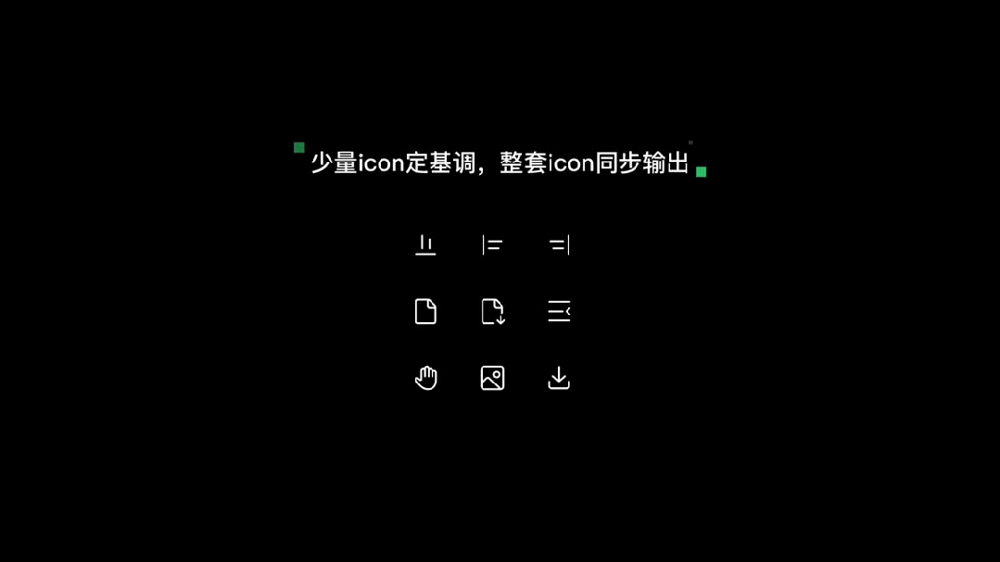
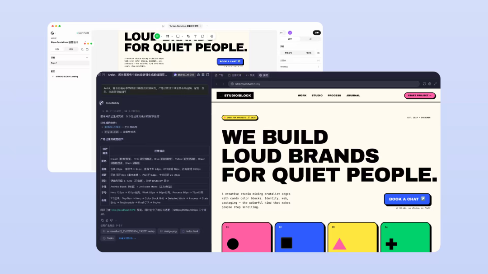
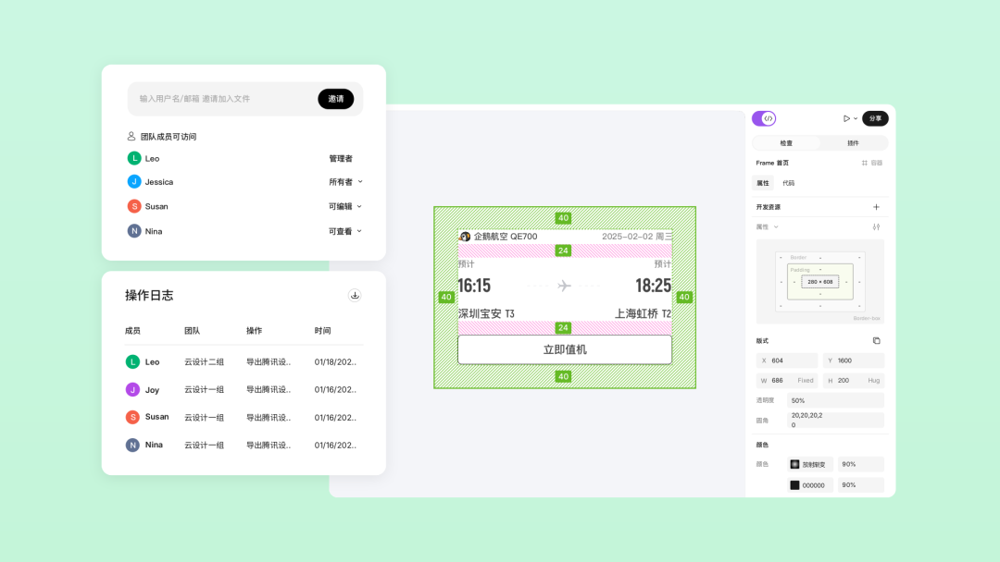

# 腾讯设计智能体Ardot公测：设计一键转代码

> 公众号: 腾讯云
> 发布时间: 2026-05-18 10:04:52
> 原文链接: https://mp.weixin.qq.com/s/cCbdbFfy0-ciPhpd56GeQA

---

来了！

今天，腾讯自研AI设计智能体平台Ardot正式公测，重新定义专业设计协作。

它不只是又一个"能画图的软件"，而是一个 AI 驱动的产设研协作平台——

从一句话生成团队可编辑的UI/UX 设计，到能直接跑起来的代码，一个工具里全走完。

现在注册，即享 1000 Credits 免费额度 （立即访问：ardot.tencent.com）

// AI一句话生成可编辑设计稿

过去大部分 AI 设计工具，一句话得到一张图，好看是好看，但没法改、不能用、交不出手。

Ardot 把这件事做反了：AI 生成的每一张图、每一个界面，都是可编辑、可复用、可交付的团队资产。

一句话，AI快速生成APP页面、官网、海报、插画、ppt....

编辑也灵活。

一句话，批量生成统一风格的系列矢量图标。

又一句话，AI帮你改这个按钮色彩，那个icon风格，轻松编辑任意局部元素。

甚至一键让图片转成可编辑格式。

Ardot还支持调用团队自己的业务组件库，一键生成符合规范的可编辑稿——不是"随机画"，是"按你家规矩画"。

也支持直接导入Figma文件，完整保留原有布局、样式和组件，实现零成本迁移，现有UI设计师也能快速上手、顺手。

// 代码友好，设计一键转代码

Ardot的一大前瞻特色，就是拥有“代码友好”基因。

以往设计交付开发，就是一场漫长的"切图-标注-反复确认"接力赛。

Ardot用 MCP（模型上下文协议）把这段路直接抹平：

设计稿，连同变量、组件、布局数据等设计细节数据，直接拉进CodeBuddy，一键代码还原。

设计师出稿，开发直接取代码，中间零摩擦。

Workbuddy、Cursor、Claude Code 等 MCP IDE，也兼容，实现无缝联动。

设计师、产品、开发，终于能坐在一张桌上了。

// 企业级实时协作+设计资产管理

团队协作，Ardot也给力：支持多人在线实时评论、标注反馈和版本对比。

“按钮再往上挪2像素”、“渐变色降低饱和”......产品、设计、研发可以在设计稿上直接圈点讨论，评审意见一目了然，决策全程留痕。

还配备智能权限中心、全方位行为追溯和无缝交接机制，确保协作规范、有序，很周到。

Ardot微信小程序也即将上线，手机端也能随时评审，更方便。

来了！设计协作效率，现在开始狂飙。

公测开启，立即体验。点击阅读原文了解产品详情。

立即访问：ardot.tencent.com

帮助文档：docs.ardot.tencent.com

