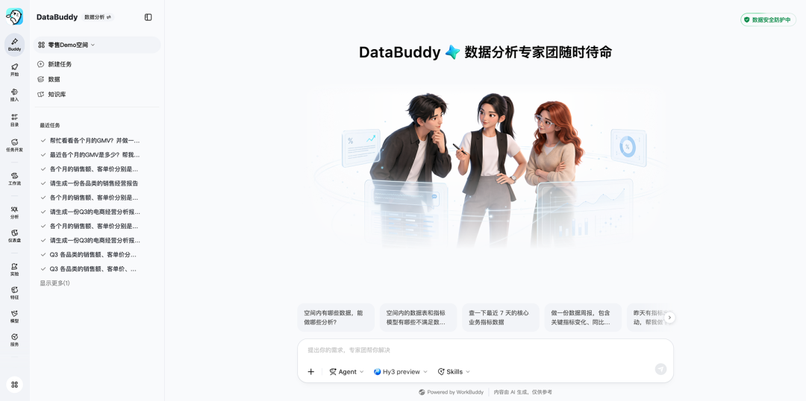
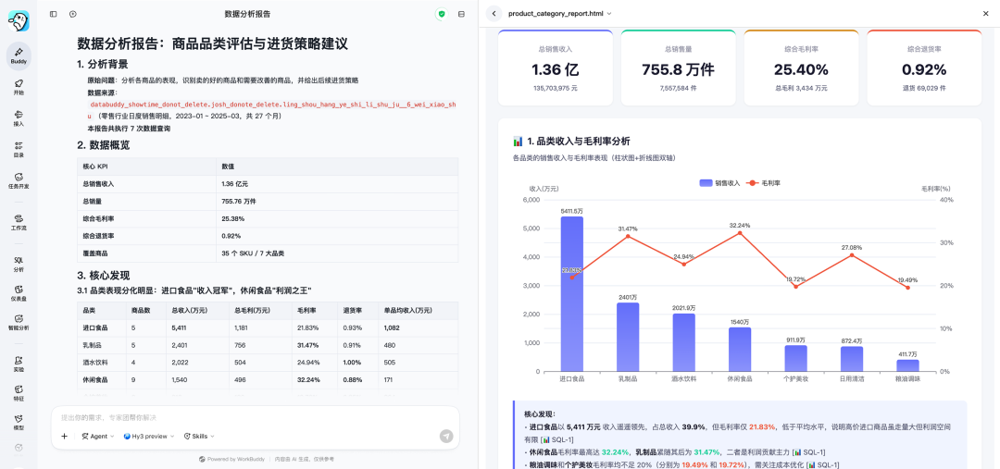
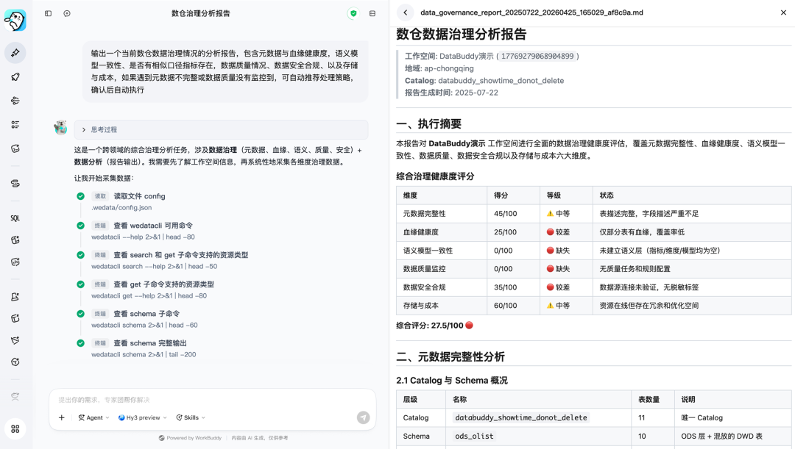
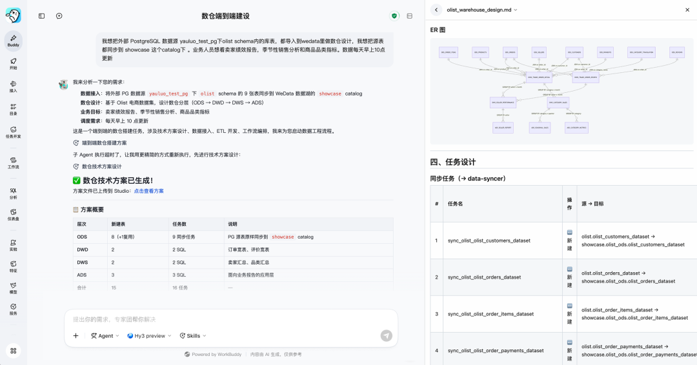
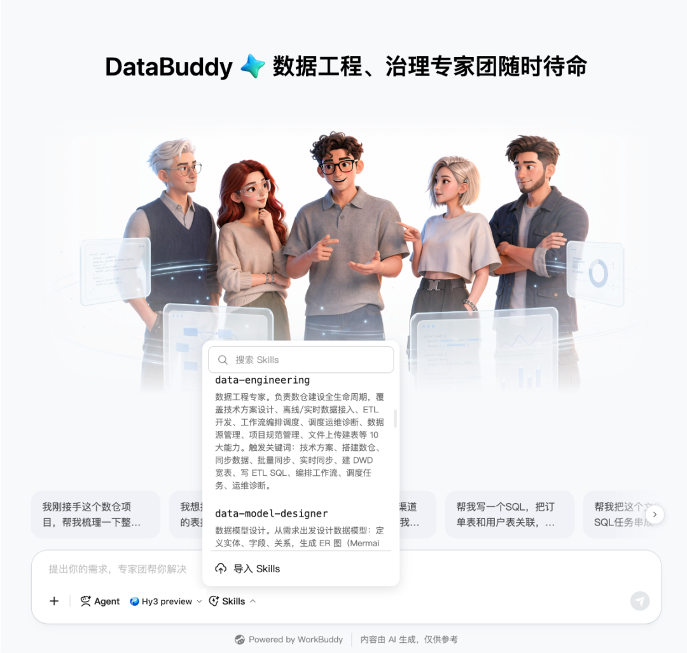
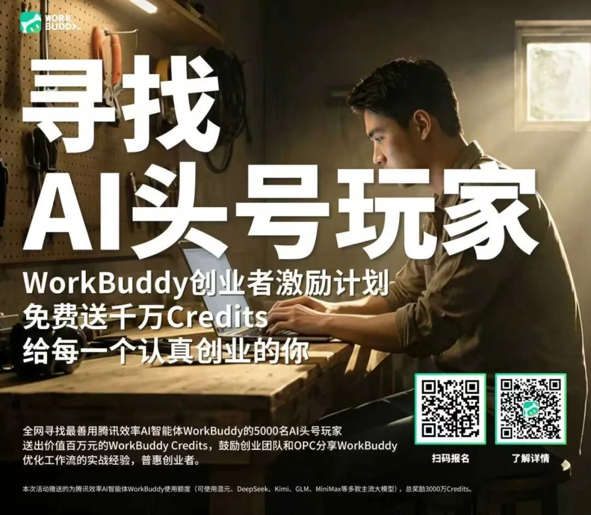

# 欢迎新Buddy：DataBuddy

> 公众号: 腾讯云
> 发布时间: 2026-05-19 16:57:46
> 原文链接: https://mp.weixin.qq.com/s/FRcjkk7Bfr1e4exbeY3QxQ

---

大数据人自己的原生Agent来了！

腾讯云大数据智能体工作台DataBuddy正式发布。用户通过自然语言对话，即可完成数据接入、开发、治理、分析全链路任务，不用再在多个页面之间切换操作，一句话说清目标，Agent自己跑完全流程。

过去几年，大数据平台不断演进：从数据湖仓，到统一治理，再到Data+AI融合。

但很多AI产品，本质上仍停留在人在操作工具的阶段——AI帮你补SQL、生成图表，真正的数据任务，仍然需要人一步步驱动。

DataBuddy 想做的是下一阶段：从工具辅助走向Agent交付。用户提出目标，Agent自主拆解任务、调用能力、规划流程，最终直接交付结果。

还要介绍下，DataBuddy基于腾讯WorkBuddy同源Agent底层能力打造，是Buddy家族的第三位成员，继承了WorkBuddy的Harness，再通过Skill引入腾讯云大数据服务内外部十几年大规模经验，这个Buddy可以既好又快地辅助数据从业者完成数据任务。

CodeBuddy面向开发者，WorkBuddy面向职场人士，DataBuddy则覆盖企业数据基础设施建设领域——数据分析师、数据治理人员、数仓工程师 ，三类角色今后都可以用对话完成工作。

// 三大场景：数据分析、治理、工程，一句话触发

DataBuddy首期针对三大数据场景重点调优落地效果和体验。

-数据分析方向，面向不会写SQL的业务人员和分析师，DataBuddy支持智能问数、指标归因分析、报告生成和可视化看板搭建。（继承了自然语言转SQL的[冠军能力](https://mp.weixin.qq.com/s?__biz=MjM5MDgwMzc4MA==&mid=2654903787&idx=1&sn=e6a988d2aa4c93e12306f61b94ca263f&scene=21#wechat_redirect)）

分析结果基于统一语义层产出，不同人问同一个问题得到一致答案。这套语义层不是静态配置——DataBuddy 构建了一套六层知识体系，从底层表结构、统一指标口径，到企业业务术语、个人使用记忆，层层递进。

用户对话中的业务洞察会被自动提取、去重、沉淀为持久知识资产，Agent 越用越懂你的业务，实现"用数驱动治数"的正向飞轮。

-数据治理方向，DataBuddy将数据治理从人工巡检、事后补救升级为「自动巡检 → AI诊断 → 智能修复」。

依托数据治理Skill，覆盖数据编目、语义建模、数据质量、数据安全、血缘分析五大域，自动发现元数据缺失、语义冲突、质量异常、合规风险、资源浪费等问题，并沿血缘追溯根因，生成修复方案并分级执行。

低风险操作秒级自动完成，高危操作需人工确认后执行。从单表诊断到全局数仓巡检，数十人天的治理工作缩短为小时级交付。

-数据工程方向，DataBuddy将数仓建设从“多模块手工串联”升级为“对话式全链路交付”。DataBuddy覆盖数仓建设到运维的全生命周期——数据接入、分层建模、ETL代码开发、工作流编排调度、故障诊断，原本分散在五六个模块的操作，现在一轮对话完成。

🌰举个例子：你说“把MySQL数据源内的销售库接入到WeData，帮我做数仓方案设计，业务要看GMV、复购率和品类分布，每天数据早上8点增量同步”。

DataBuddy 会基于源表分析生成数仓分层设计与目标表结构，并根据确认后的方案自动生成 ETL 代码和工作流配置，将原本 1-2 周的建仓工作压缩到小时级交付。

// 企业级：不只是能做事，更要安全、稳定、可控

Agent进入核心数据场景，真正的准入门槛是能安全地做事。

DataBuddy在安全体系做了完整的纵深设计，从身份权限到执行隔离，再到 Agent Guardrail和全链路审计，构建了一套多层次、可追溯、自进化的企业级安全防护体系。数据访问遵循最小权限原则，Agent的每一步操作都在权限边界内执行，不会因为自动化而绕过企业已有的数据安全策略。

Agent Guardrail针对性拦截提示注入攻击、越狱等新型风险；提供全链路审计日志及智能安全诊断等能力。对于金融、政企等高敏感行业，这意味着不需要为了用AI而降低合规标准。

在稳定性方面，DataBuddy搭载于腾讯云企业级Data+AI一体化数据智能平台。数据集成、任务调度、数据质量监控、元数据管理等底层能力被封装为可由Agent调用的Skill体系——不用AI另起炉灶重建一套，直接使用腾讯云大数据服务内外部十几年的经验。

计算层面，DataBuddy原生连接DLC数据湖计算引擎，数据任务的执行效率和准确性有底层算力保障。

对于已经在使用腾讯云大数据产品的企业客户来说，DataBuddy即插即用，现有的数据资产、权限体系、调度规则都可以直接继承，不需要重新配置。

新Buddy报到，欢迎体验。戳👉 [DataBuddy](https://wedata.cloud.tencent.com/website/showcase)

---

WorkBuddy也在找5000个认真用AI做事的人，Credits已备好，戳图👇了解详情

---

