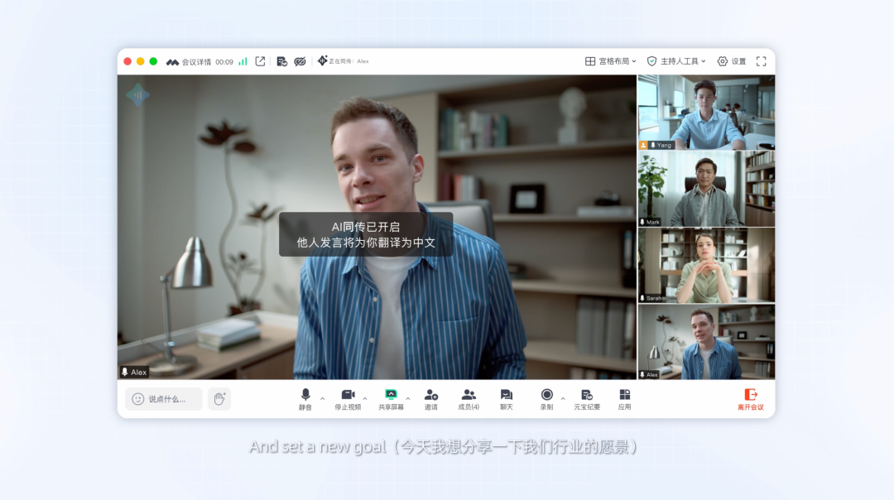
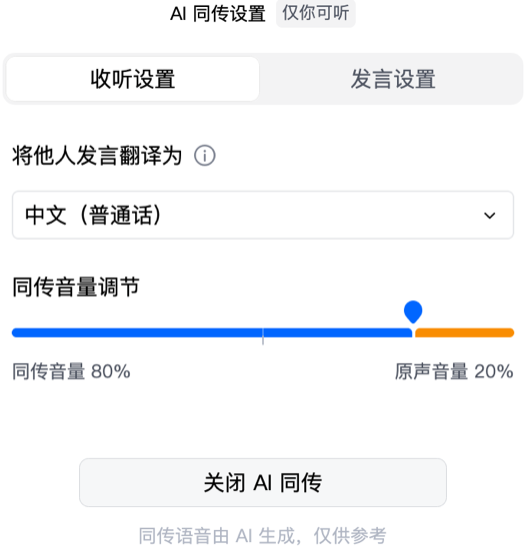
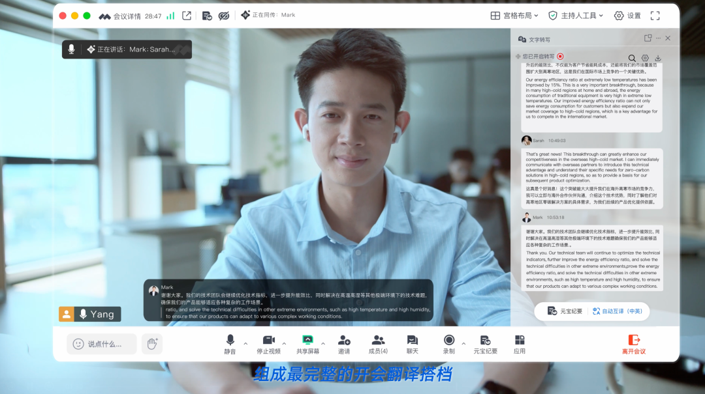
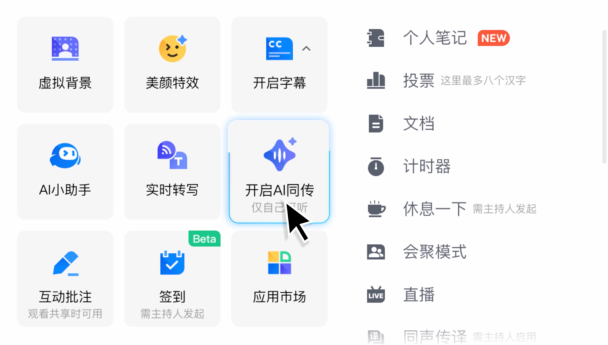

# 腾讯会议AI同传来了！

> 公众号: 腾讯云
> 发布时间: 2026-05-21 15:04:33
> 原文链接: https://mp.weixin.qq.com/s/fUeZi5zv9ky2nxeLZVhb6A

---

Isn't it delightful when friends come from afar?

今天，腾讯会议AI同传功能正式上线，首期支持中英互译。

每位参会者，都有了一位专属的AI同传译员。

跨境商务、跨洋协作、跨国交友，“听”和“说”，都松弛很多：不用会前紧急背单词、不用临时拉翻译、不用没听懂还假装淡定点点头。

####

#### // 3秒跟上，对话不再断档

过去的同传像接力赛——发言人讲完整句，翻译才能开口，对话节奏被生生切成两段。

腾讯会议把AI同传时延压到了3 秒以内，发言与翻译几乎同步，不用憋、不用等，跨语言的对话可以像母语沟通一样流畅。

#### // 音色模仿，还原发言人声音

开启"模仿你的音色"，AI翻译起来，就像是参会者本人在用外语说话。

好处很明显——多人会议里，你能轻松分辨谁在发言，不会被千篇一律的机器声搞混。

如果不想用，随时切成系统音色。

原声和同传声的音量大小，也可以自由调节。

重要场合，保留一点原声音量，方便实时确认关键信息有没有被准确传达；日常沟通，关掉原声，干净利落。

####

#### // 让翻译“可听、可译、可见、可记”

####

AI同传不是孤立的功能，它和腾讯会议已有的实时转写、会中字幕打通了——

● 实时转写：外语发言即时生成目标语言的文字记录

● 会中字幕：画面底部滚动显示双语对照

● AI同传：语音形式同步播报

同一场会议，翻译内容可听、可译、可见、可记，一套完整的AI工作流在腾讯会议里实现了闭环，极大的提升跨语言沟通的质量。

而这，也直接决定了会议中的AI，能做什么。

当每一句跨语言发言都能被精准捕捉、即时传递，会议所产生的上下文才真正完整、可用，成为 AI 读得懂、调得动的工作素材：

让AI转写、纪要、待办提取、会后问答，在跨语言会议中，能真的靠谱。

点这里，召唤你的AI译员，用你的声音，与世界实时对话。

