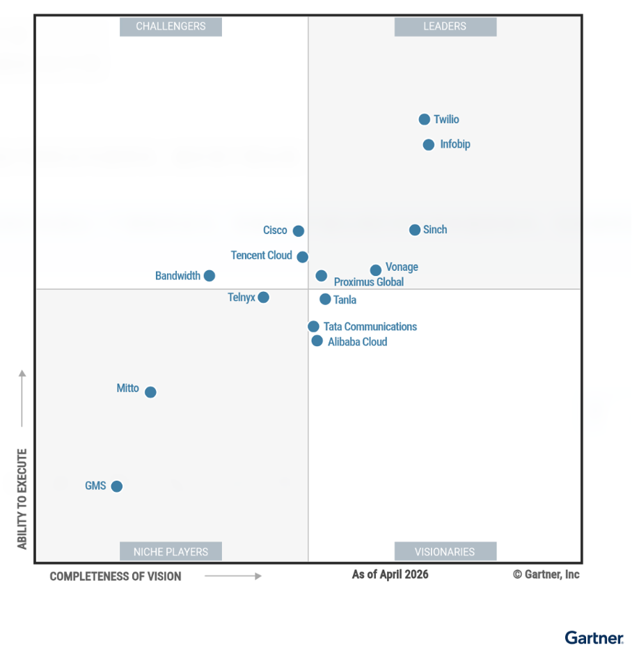
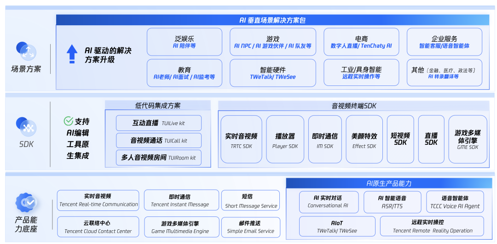
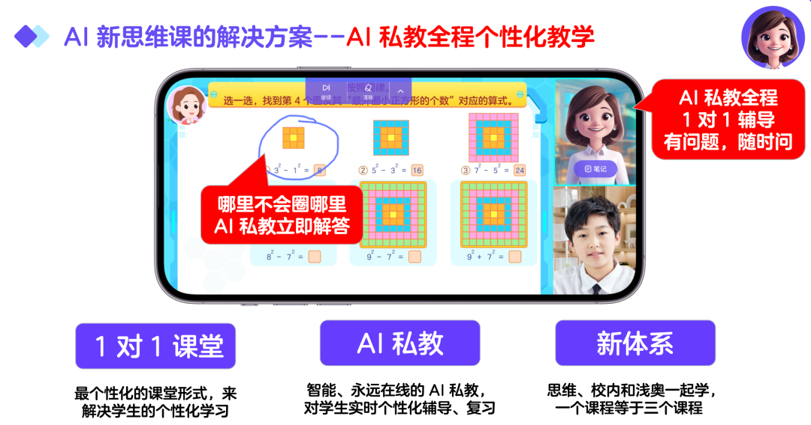
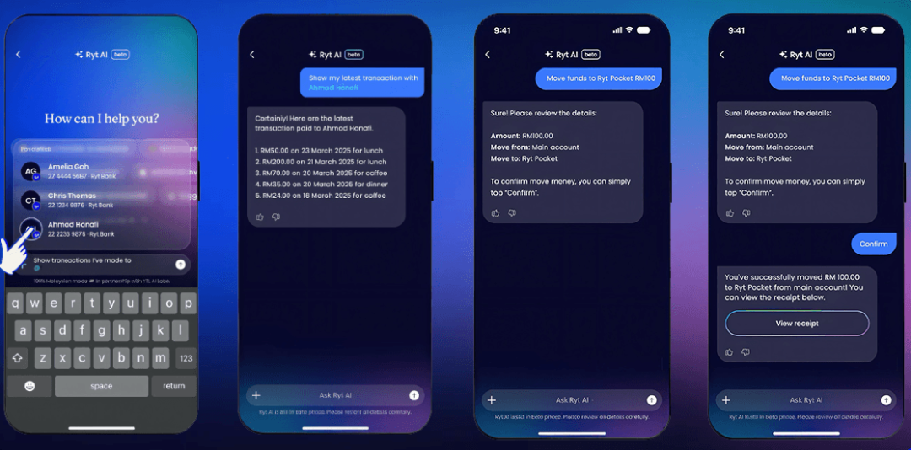

# Gartner报告：腾讯云CPaaS，亚太挑战者！

> 公众号: 腾讯云
> 发布时间: 2026-05-22 16:54:01
> 原文链接: https://mp.weixin.qq.com/s/NhZDMK3IA4QY48aqm7SgFA

---

和大家汇报：

今天，Gartner®正式发布2026年CPaaS魔力象限报告——

腾讯云不仅连续第四年入选“挑战者”象限，更在核心的“执行力（Ability to Execute）”维度，处于象限中亚太厂商最高的位置！

划个重点：我们也是中国唯一一家连续四年获此评价的云厂商！

腾讯云CPaaS深耕游戏、数字内容、媒体、电商及会议等音视频场景，在垂直行业定制化方案、区域合规认证、开放AI生态整合三方面表现突出。

这也意味着，当我们把全球网络基础设施、实时音视频（TRTC）、即时通信（IM）、云联络中心（TCCC）、物联网通信（IoT）等能力和前沿的AI技术融合时，一套真正能帮企业在全球市场打胜仗的通信底座，已经成型。

腾讯云CPaaS产品矩阵图

进一步面向AI原生应用与 Agent 开发场景，腾讯云将TRTC、IM 及 Live / Room / Call等核心能力封装为标准化 RTC Skills，让AI Agent通过标准接口灵活调用音视频能力。

// 第一步：把AI从实验室拉进真实业务场景

随着大模型的爆发，通信不再只是人与人的连接，更是人与AI、系统与AI的实时互动。在这个阶段，大家比拼的不再是单纯的算力，而是谁能让AI听得清、看得懂、答得快。

目前，腾讯云CPaaS构建了业内最丰富的AI通信能力矩阵，并已经在千行百业实打实地跑出了业务增量：

游戏与社交：端到端延迟 < 1000ms

基于腾讯云TRTC AI实时对话解决方案，“逗逗语音助手”将复杂的音视频采集、云端处理和AI生成一站式打通，端到端延迟被压在1000毫秒以内。

配合情绪识别和背景降噪，AI有了自然的活人感。目前该应用海外注册用户已破1000万，月活超200万。

在线教育：用户粘性跑赢行业40%

伴鱼智学基于这套底座，打造了多模态AI私教“可可老师”，为学生提供真正真人1v1般的流畅交互。沉浸式的陪伴体验，直接让用户粘性比行业平均水平高出了40%。

AI私教“可可老师”交互界面

智能硬件：每月上亿分钟通话不掉线

[儿童手表巨头小天才](https://mp.weixin.qq.com/s?__biz=MjM5MDgwMzc4MA==&mid=2654907777&idx=1&sn=af745f3f5f6884516de125e4707e3e05&scene=21#wechat_redirect)，接入了腾讯云TRTC + ASR云端协同方案，通过实时字幕让孩子们从听得见升级为看得清。

目前这套方案稳稳支撑着全球超1000万台设备，每月承载上亿分钟的通话，不掉线。

金融：上线首日高并发0中断

在马来西亚，全球首个AI原生银行Ryt Bank依托腾讯云金融级IM底座正式上线。基于我们超二十年的高并发调度经验，面对首日5万活跃用户的集中冲击，系统实现零中断。

用户只需一句自然语言指令，系统就能自动识别意图并执行转账、查询，每月稳定处理超14万次交易，真正实现对话即交易。

Ryt Bank系统自动识别意图界面

// 第二步：带着领先的音视频能力，迈入国际化2.0

在国内和亚太市场充分打磨后，腾讯云正把这套经过海量极高并发验证的CPaaS能力，带向中东、北美等更广阔的全球市场，迈入国际化2.0进程。

把成熟的直播带货能力复制到海外：

[泰国正大集团旗下的超级应用Amaze](https://mp.weixin.qq.com/s?__biz=MjM5MDgwMzc4MA==&mid=2654906430&idx=1&sn=ad4c9283dfba83e479a306d28b6e4b57&scene=21#wechat_redirect)，正依托腾讯云覆盖70+国家、3200+加速节点的全球网络，构建电商直播的底层骨架。

结合我们的极速高清（Top Speed Codec）技术、企业级IM以及AI画质增强、智能字幕等特技，海外用户也能体验到丝滑、高清、高互动的新范式直播电商。

Amaze超级应用电商直播页

让跨国通信像在本地一样，不卡、不断、不糊：

目前，腾讯云已在全球建成了新加坡、雅加达、首尔、东京、法兰克福、硅谷及沙特等7个境外独立数据中心。

我们把全球端到端的传输延迟做到了低于300毫秒，抗丢包率超过80%。这意味着，哪怕在网络条件复杂的跨国弱网环境下，也能保证音视频不卡、不断、不糊。

从单一的通信管道，到智能化的交互中枢；从深耕亚太，到服务全球千行百业。

连续四年入选Gartner CPaaS魔力象限挑战者，既是对腾讯云过去技术笃定的认可，也是一个新的起点。

未来，腾讯云将继续推动AI能力深度融入CPaaS全产品线。把最硬核的技术，转化为千行百业触手可及的生产力，助力企业在全球化浪潮中跑得更稳、走得更远。

---

