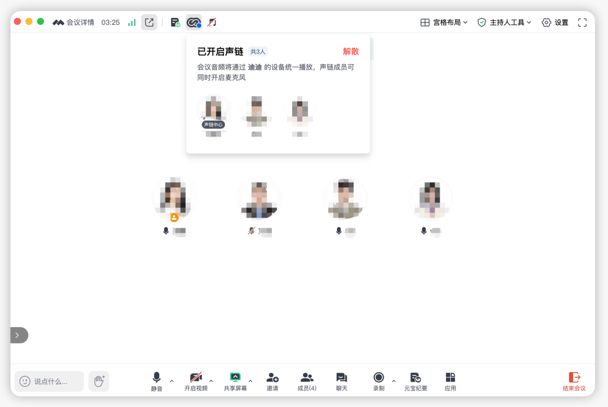

# “谁麦关一下，谢谢”

> 公众号: 腾讯云
> 发布时间: 2026-05-27 15:01:01
> 原文链接: https://mp.weixin.qq.com/s/zlKu_JYUtFf9TyYSTDf1dg

---

你大概率遇到过这种头皮发麻时刻：

和几个同事在同一间会议室，各自接入了同一场线上会议。只要有两台以上设备同时打开麦克风，一阵极度刺耳的尖锐啸叫声就会瞬间穿透整个房间。

这个问题困扰了不少职场人，成为线上会议体验中最常被吐槽的场景之一。行业调研数据显示，会议室音频问题中约有83%都是源自这种啸叫和回声。

今天，腾讯会议正式推出「声链」功能。

开启「声链」后，同一间会议室里的几个人同时开麦发言，不会再有啸叫，并且能自动识别发言人。

“谁的麦关一下！”是的，这句话以后在会议室可以消失了。

// 行业首创，纯软件终结多设备啸叫难题

有人问了：

“为什么同室开会这么容易引发啸叫？”根源在于音频回路：A设备播放的声音被B设备拾取播出来，又再次被A设备拾取，信号不断循环放大，最终变成了尖锐的杂音。

过去，行业内普遍的应对方式是，要么花钱买专业硬件，要么靠人工提醒。目前国内还没有产品从纯软件层面真正解决过多设备交叉回声这个技术难题。

腾讯会议「声链」能力来自腾讯天籁实验室，核心依托的是一种名叫“跨设备AI回声消除技术”。

当会议中有多个设备同时开麦时，它的工作流如下：

- 首先，算法会对每一个设备所收集到的音频进行回声消除处理；
- 紧接着，将高质量音频统一传输到声链中心；
- 声链中心完成多路麦克风数据的高精度混音对齐后，再上传到会议系统。

通过这一套组合拳，「声链」以纯软件方案，就能为用户打造清晰流畅、无啸叫干扰的优质音频体验。

// 开启声链，带来三大体验提升

现在，你只需升级到最新版本的腾讯会议，就可以体验到「声链」带来的变化。

沟通零负担，告别手动开闭麦。以前在会议室，总需要专门有人协调谁说话谁开麦，一旦忘记关麦，刺耳的啸叫就来了。

现在，开启「声链」后，同一间会议室里的几个人可以同时开麦发言，不仅不会再有啸叫，系统还能自动识别并智能切换不同发言人。

这让线上交流就像面对面交流一样自然，大家的注意力可以回归到会议内容本身。

空间零限制，打破专业硬件依赖。过去，为了让多人在同一空间顺畅开会，企业往往需要在正式会议室部署昂贵的专业音频设备。

「声链」直接打破了“好音频必须依赖专业硬件”的铁律，让原本昂贵的会议收音体验平权化。无论是精打细算的中小团队，还是空间紧张的大企业，现在随时可以在工位区、洽谈室甚至临时借用的角落，享受到专业的会议室体验。

AI零干扰，喂给大模型最干净的语料。如今，越来越多的团队依赖AI来生成会议纪要、提取决策和追踪待办。

但再强的AI也无法处理含糊、重叠或被啸叫打断的劣质音频。「声链」从源头解决了这个问题，为AI提供干净的音频输入，确保每一段发言都被清晰完整地记录，让会议真正变成可被AI理解、检索和复用的组织资产。

// 不止于办公，覆盖更多元场景

除了会议室，「声链」的适用场景还延伸到了更多领域：

教育与培训：在远程课堂中，讲师与多名学员可以各自使用自己的设备，在同一空间内顺畅参与讨论。

日常生活：在宿舍里，几个人各自用腾讯会议连麦打游戏、一起追剧或看比赛时，再也不会被烦人的回声打断，可以畅快开麦交流。

好的工具，应该让人忘记工具本身的存在。当开会不再需要操心谁开麦谁关麦，沟通才能回归真正的沟通。

欢迎升级到腾讯会议最新版本体验！

