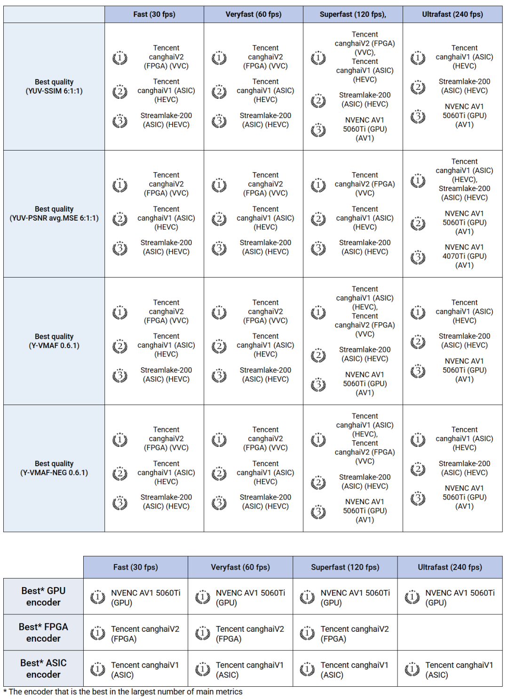
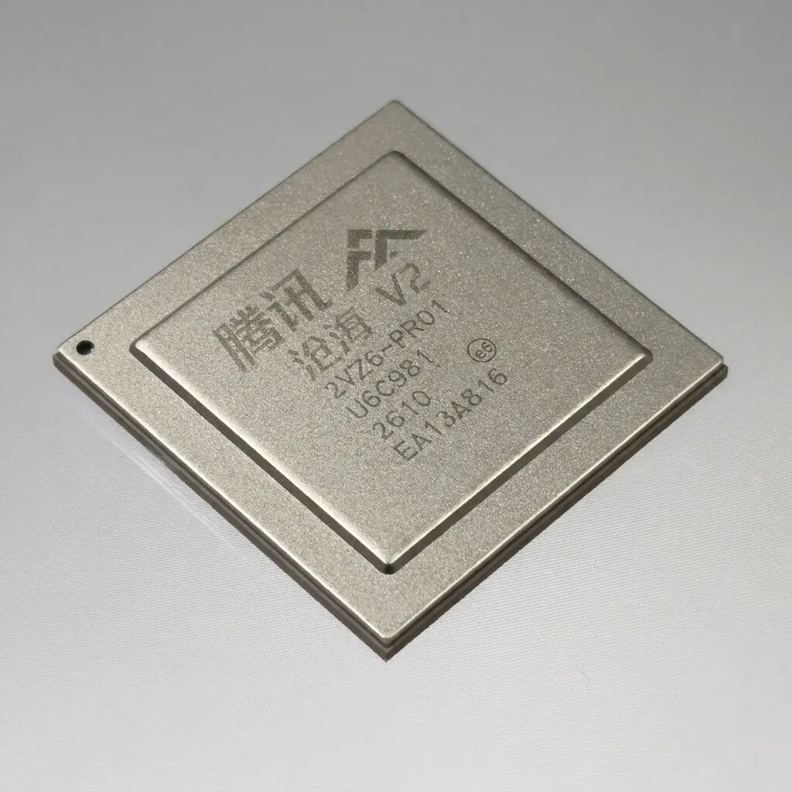

# 刚刚，腾讯自研「沧海芯片」夺冠！V2版本即将量产

> 公众号: 腾讯云
> 发布时间: 2026-05-27 12:20:26
> 原文链接: https://mp.weixin.qq.com/s/qxzcNLf0XmBBjlvelXhOsg

---

今天，和大家分享一个「硬核」好消息。

5月26日，[莫斯科国立大学（MSU）举办的硬件视频编码比赛成绩揭晓（](https://www.compression.ru/video/codec_comparison/2025/hardware_report.html)[大赛官网](https://www.compression.ru/video/codec_comparison/2025/hardware_report.html)[👈🏻](https://www.compression.ru/video/codec_comparison/2025/hardware_report.html)[）：](https://www.compression.ru/video/codec_comparison/2025/hardware_report.html)

腾讯自研的编解码系列芯片“沧海”在30—240fps所有速度档位的SSIM、PSNR、VMAF等所有评测指标上全部斩获第一，再次刷新硬件编解码的压缩率上限，在多项指标上领先超30%。

MSU是视频编解码领域的权威赛事，本次硬件编码器比赛吸引了AMD、英伟达、英特尔等知名企业超过40款产品参与。比赛的核心命题非常直接：

在保持相同画质的前提下，谁能将视频流的压缩效率做到极致，实现更高画质、更低成本、更低延时。

腾讯自研编解码系列芯片“沧海”在四大赛道所有评测指标上全部斩获第一

// 软硬协同抠出极致压缩率，已部署超10万片

在视频流量占主导的今天，视频体积的微小缩减，在海量并发下都意味着巨大的带宽与存储成本节约。

沧海芯片的解题思路是“全链路软硬件协同”：一方面，根据硬件编码的实际复杂度分布，持续升级码率控制模型，使码率分配更合理；另一方面，利用预分析阶段的内容特征识别，不断优化硬件候选编码模式组合。

简而言之，就是在不增加硬件复杂度的前提下，持续挖掘压缩率的极限。

同时，沧海的编码架构具备可伸缩性：既可以适度降低压缩性能以换取更高的并发路数，也能拉满压缩率来应对极致的画质需求。

这套架构目前已在真实业务场景中完成了规模化验证。从2019年启动研发到2023年量产，目前沧海V1芯片在腾讯云及腾讯自有场景（覆盖直播点播、4K转码、云游戏等）中已部署超10万片。

// 沧海V2成功点亮：算力翻倍，支持端到端画质增强

在V1规模落地的基础上，新一代沧海V2芯片已成功“点亮”并进入量产周期，计划于2026年下半年全面提供服务。

相比上一代，沧海V2实现了多维度的技术迭代：

- 统一架构支持双标准：沧海V2采用统一硬件架构，同时支持H.265和H.266两种主流编码标准。在画质不变的前提下，H.265压缩率较上一代提升超10%，H.266提升超 30%，且单芯片的编解码处理能力实现翻倍。
- 端到端画质增强：沧海V2集成了CPU、GPU以及计算机视觉（CV）处理能力，能直接在底层对视频进行智能分析，支持超分辨率、锐化、去雾、去噪等处理算法，实现画质的端到端升级。
- 原生支持低成本云渲染：针对云游戏等高并发场景，V2内置了GPU核心。在架构上实现了渲染与编码在同一颗芯片上共享显存。

数据无需在不同硬件间来回拷贝，既实现了低延迟的高清云渲染，又让两者的协同将压缩率再提升了5%以上。

// 音视频能力通过腾讯云MPS全面对外开放

底层硬件能力的突破，最终是为了服务上层业务。

腾讯在音视频领域的积累，也通过腾讯云媒体处理（MPS）产品，以公有云、私有云或SDK等方式对外开放。

随着沧海V2的量产落地，腾讯云将为行业客户提供更高清、更低码流的媒体处理基础设施，帮助企业在多媒体场景中实现提质增效。

