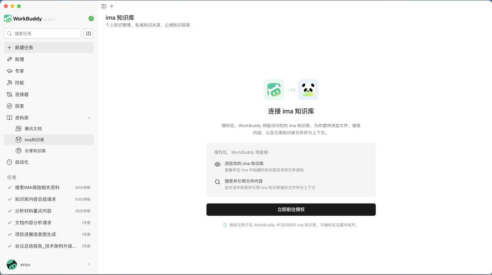

# ima & WorkBuddy，已连接

> 公众号: 腾讯云
> 发布时间: 2026-05-28 10:00:00
> 原文链接: https://mp.weixin.qq.com/s/pV6TiWApWma3ck2t5E8BQQ

---

 AI日常协助办公，两件事很重要：能记事、能干活。

我们需要像WorkBuddy这样的Agent来帮我们干活，也需要像ima这样的知识库来帮我们存储、记忆。

但过去，当我们要用WorkBuddy干活时，往往会发现：平时在ima里囤的大量行业报告、学习笔记和会议纪要，似乎很难被用上。

今天，ima和WorkBuddy正式打通！

这也意味着，你在ima中沉淀的知识，不仅可以在ima自己的Copilot中使用，也开始走出ima，进入更多Agent产品的工作流。

// 让沉淀的知识动起来

这套跨产品的知识流转体验非常顺滑：

你只需在WorkBuddy左侧导航栏进入「资料库」，点击ima知识库，一键授权绑定ima 账号后，你平时在ima里整理的个人资料、共享文档甚至是订阅的知识库，就全部能被WorkBuddy所调用了。

在具体的任务处理中，你可以单选具体的文件作为AI工作的上下文。最关键的是，AI 执行完成后，生成的产物还可以一键回传至ima。

通过这次接入，我们在不同AI工具间构建了一个可持续的正向闭环：知识沉淀→跨产品调用→WorkBuddy执行→产物回传ima。

你的知识库不再是一个只进不出的静态网盘，而是随着各个Agent产品的调用，不断生长、自我反哺的数字外脑。

//Copilot已全面开放，知识号能力升级

在输出知识底座的同时，ima的AI助理与能力也在同步加速进化。

此前排队人数超10万的ima Copilot，也已全面开放。现在可以直接在ima里无门槛地使用知识Agent，让你沉淀的资料直接参与到Copilot的任务执行中。

与此同时，ima的知识广场也迎来了重磅升级，支持通过“知识号”发布和发现Skill。

首批生态落地：目前已上线微信读书、腾讯招聘等官方Skill，同时全面开放用户发布专属Skill的能力。

知识与能力的强绑定：ima的Skill可以与用户自己的知识库深度结合。读取知识库直接成为了Skill执行流程中的一环。

这意味着，Skill不再是一个固定且单薄的通用工具，它能直接调取你团队沉淀的行业 know-how，形成更贴合真实业务场景的智能应用。

而“知识号”的定位，也从单一的内容发布入口，升级为一个能力发布入口。

从Copilot的全面开放，到知识号支持发布Skill，再到将知识库接入WorkBuddy。在ima，知识不仅能被妥善沉淀，更能被高效调度、跨界执行，让每一份数据资产都释放出实打实的生产力。

欢迎体验！

