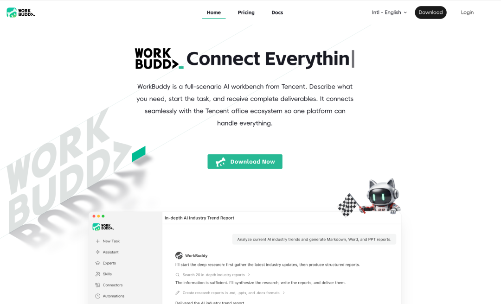
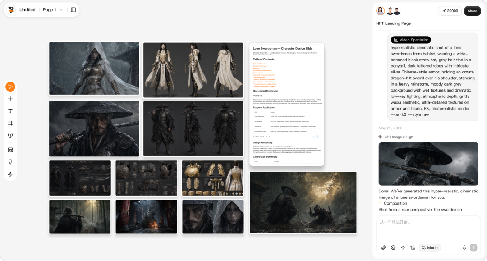
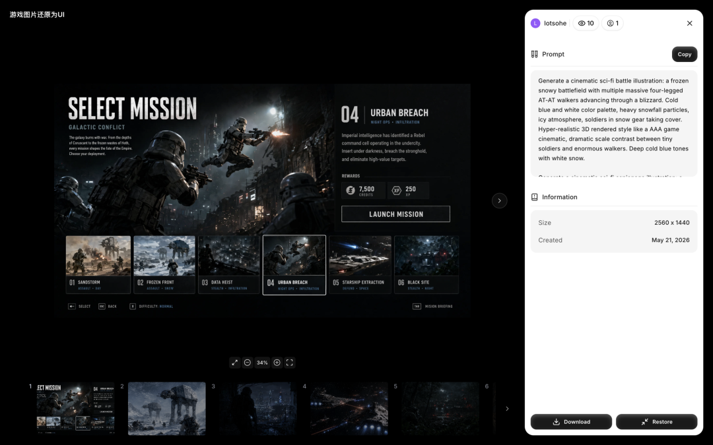
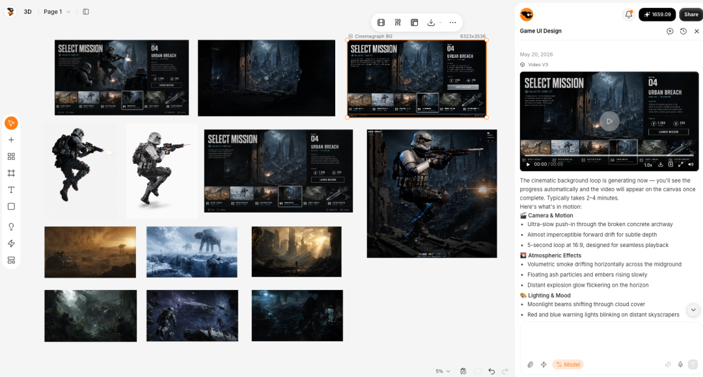
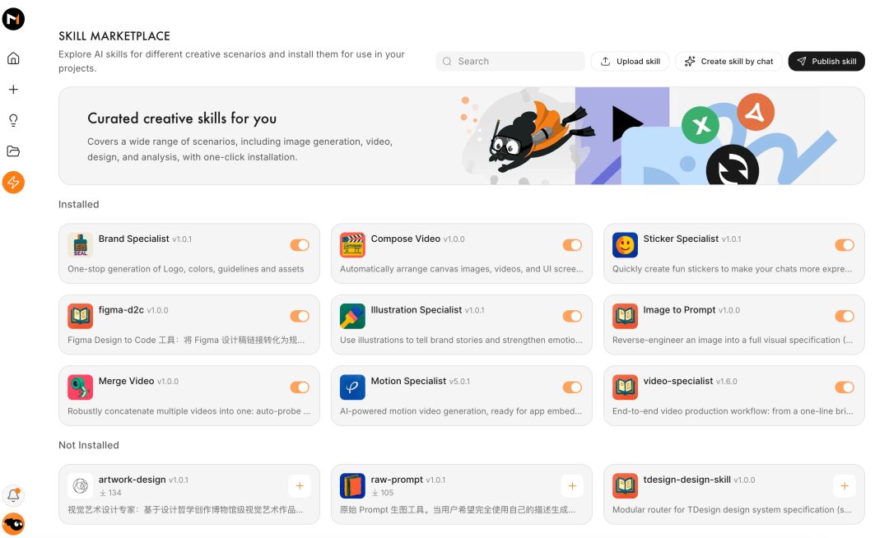

# 腾讯云AI加速出海：Agent基建升级，WorkBuddy、Miora全球上线

> 公众号: 腾讯云
> 发布时间: 2026-05-28 12:15:26
> 原文链接: https://mp.weixin.qq.com/s/RmHorgp3kEWL0RV6K5V_OQ

---

今天，腾讯云在香港面向全球开发者，发布多个Agent新品。

Agent Runtime 全面升级。面向 Agent 长任务、高并发、自主调用等运行特征，首次构建覆盖运行、存储、记忆与安全访问的原生运行平台。

WorkBuddy国际版上线。国内最受欢迎的效率智能体，今天出海了。

你的创意伙伴Miora国际版上线。能记住你审美和创作风格的智能体，一句话生成图片、视频、UI/UX 与3D，让你一个人拥有整个创意工作室。
腾讯云TokenHub，今天也正式面向海外用户提供模型服务。

面向全球，Agent优先，腾讯云AI正在加速全球化。

//Agent Runtime全面升级，打造Agent原生运行底座

过去半年，我们对Agent Runtime做了一次系统性升级，原生匹配Agent自主执行、休眠爆发等全新运行逻辑，具体有五大组件👇

Agent SandBox。升级“休眠唤醒”机制，让 Agent 像苹果手机后台App一样随时挂起和恢复。唤醒仅需50毫秒，比业界主流快20倍；暂停时自动释放 70%算力，不干活不计费。

Agent CBS。优化“买10G用2G”的传统预设模式，专为Agent新增按用量计费新模式。Agent 的第一块“电脑硬盘”，用多少付多少。

Agent Bucket。搭建人与 Agent、Agent 与 Agent 之间的共享空间。可为亿级用户提供专属云空间，原生多模态语义检索，覆盖数据传输、产物上云、智能查询全链路，让多 Agent 的内容生产与消费一站闭环。

Agent Gateway。Agent 全程不接触凭证，每一次出站访问动态授权，企业可以安心让 Agent 访问内部系统和数据。（QClaw 访问腾讯文档，用的就是这套机制）

Agent Memory。通过智能Context 卸载+符号化记忆，让长任务成功率提升30%，Token消耗降低60%。（目前已在Claw Pro一键启用，[开源版本](https://mp.weixin.qq.com/s?__biz=MjM5MDgwMzc4MA==&mid=2654907713&idx=1&sn=85adc5b5cd76b73bb3460e74ce867513&scene=21#wechat_redirect)已上线）

除了原生，也更加Agent友好。腾讯云全栈产品CLI完成Skill化改造，统一封装为Tencent Cloud Infra Skill，并在SkillHub上线。

用户无需打开控制台或编写命令行，直接通过 Agent，就能完成资源查询、创建与部署。

SkillHub上还有7万多个经科恩与云鼎实验室双重安全检测的Skills，上线2个月累计下载量超3000万次。

// WorkBuddy和它的兄弟Miora，一起出海了

继[CodeBuddy](https://mp.weixin.qq.com/s?__biz=MjM5MDgwMzc4MA==&mid=2654904296&idx=1&sn=e8100d1e221fce2c463dd8ab2e67eae9&scene=21#wechat_redirect)、[DataBuddy](https://mp.weixin.qq.com/s?__biz=MjM5MDgwMzc4MA==&mid=2654907739&idx=1&sn=c6ba301ec00bc4b83147ac7dd4776a6c&scene=21#wechat_redirect)、[QClaw](https://mp.weixin.qq.com/s?__biz=MjM5MDgwMzc4MA==&mid=2654907311&idx=1&sn=6a7846cc69fc25062de27a4f43995f96&scene=21#wechat_redirect) 面向全球用户发布之后，WorkBuddy国际版今天正式上线，保留国内版特色的同时，深度适配Slack、Telegaram、Discord等国际主流IM生态，手机遥控就能让Agent干活。

👉 WorkBuddy 官网：

https://www.workbuddy.ai

WorkBuddy 团队最新产品——全场景创意智能体工作室妙境 Tencent Design Miora 国际版同步开启邀测。Miora 与 WorkBuddy 共享同源Agent架构，但针对创意设计场景进行了深度优化。

👉 官网地址：miora.design

（在官网申请邀请码进行体验）

Miora搭载全球主流视觉模型，支持AI生成图片、视频、UI/UX以及3D等多种模态的内容，专业设计师与零基础用户都能用Miora快速把创意兑现。

一次交付整套视觉，覆盖创作全流程。输入一份需求描述，Miora按专业流程自行拆解，生成一整套品牌视觉全案——图片、视频、UI/UX、3D资产。生成后还能局部修改、扩展尺寸，从需求到成品一站完成。

 

有大脑、能记忆。Miora 先思考再干活，可以理解用户的审美偏好、设计规范和项目上下文，每次生成都更贴合用户风格，无需反复发送品牌资产。

已关注Follow  Replay    Share     Like  Close**观看更多**更多

退出全屏切换到竖屏全屏退出全屏腾讯云已关注Share Video，时长00:09

0/0

00:00/00:09 切换到横屏模式 继续播放进度条，百分之0[Play](javascript:;)00:00/00:0900:09[倍速](javascript:;)全屏 倍速播放中 [0.5倍](javascript:;)  [0.75倍](javascript:;)  [1.0倍](javascript:;)  [1.5倍](javascript:;)  [2.0倍](javascript:;)  [超清](javascript:;)  [流畅](javascript:;)  Your browser does not support video tags

继续观看

腾讯云AI加速出海：Agent基建升级，WorkBuddy、Miora全球上线

观看更多转载,腾讯云AI加速出海：Agent基建升级，WorkBuddy、Miora全球上线腾讯云已关注Share点赞WowAdded to Top Stories[Enter comment](javascript:;)  [Video Details](javascript:;)

一张画布承载多模态创作。图像、视频、3D、文本以节点形式自由摆放。Agent 能读取画布上下文，理解你正在做什么和下一步的计划。

支持个性化Skills定制。用户可与Miora协作沉淀自己的Skills，并分享给团队和社区。首批预置品牌视觉全案、创意分镜、插画与视觉叙事等高频场景 AI 专家。

另外，腾讯电子签海外版今天也正式上线，适配亚欧美非多地法律框架，以全球合规覆盖、多级签署、主流CA合作及eKYC人脸核验四大能力，提供一套全球可信的电子签名解决方案。

在上新Agent产品的同时，我们正在和全球的伙伴深化合作。今天的Tencent Cloud Day 上，腾讯云宣布与中信银行（国际）签署为期三年的战略合作协议，成为其推动「金融科技 2.0」数字转型的重要技术伙伴；同时联合 UXSoft Global，官宣BAPE Hong Kong等新客户合作落地。从香港出发， 为Agent打造下一朵云！

---

