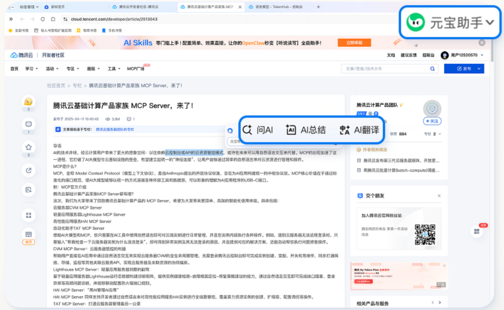
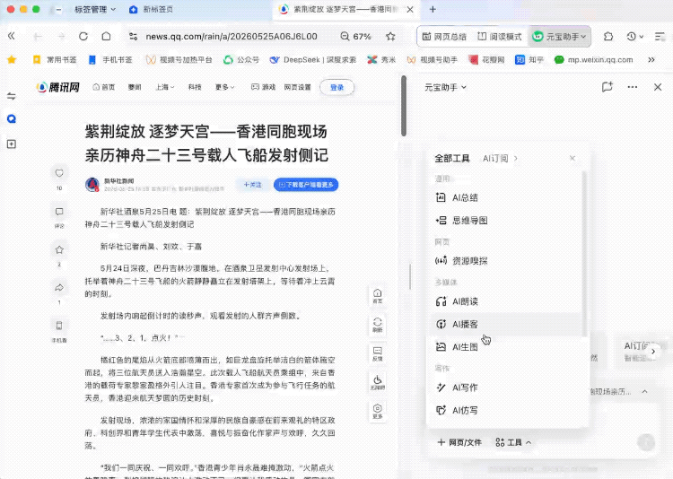
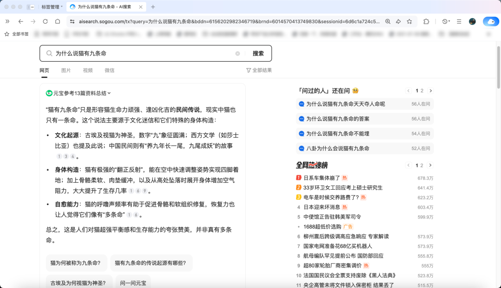

# QQ浏览器全面接入元宝助手！

> 公众号: 腾讯云
> 发布时间: 2026-05-29 15:46:28
> 原文链接: https://mp.weixin.qq.com/s/ozQqAYFPMwmIFY3lrbo33g

---

今天，QQ浏览器有了个“宝”：元宝助手。

没错，QQ浏览器全面接入元宝助手了（Mac版本已更新，其他版本逐步放量中，敬请期待）！

这次接入，希望给大家带来一个更纯粹、更原生的AI浏览器。无论是浏览、搜索、创作、学习......都能让AI全面辅助，让每一个使用环节的效率真实提升。
进入最新版的QQ浏览器，你会发现，元宝助手无处不在，随时“候命”。不仅能在任意浏览场景唤起元宝助手，进行提问、总结、连续对话，还能体验元宝助手的AI写作、AI生图等能力，甚至让它帮你总结处理多个网页的信息。
一句话总结：QQ浏览器+元宝助手=实实在在的生产力。
一起看看，有了“宝”的QQ浏览器的AI体验具体有哪些变化👇

// 更无处不在的AI：融入每一次浏览，随时随地打辅助

有了“宝”的QQ浏览器进化为一个随时在线的智能搭子。
以前用QQ浏览器的AI功能，你得先找到入口，点开这个浮窗、打开那个侧边栏，还得想清楚“该用哪个功能”。
现在，你在浏览哪里，元宝助手就在哪里。

元宝助手深度嵌入QQ浏览器的侧边栏、搜索栏、地址栏等位置。看新闻让它总结，翻文件遇到不懂的领域让它解答，查英文资料看到不懂的单词直接划词让它翻译......任何场景都可以一键唤起它，不用刻意“去找它”。
多个需求也能同时满足，接续完成任务。

// 更“通”的AI：支持多个网页、文件总结问答

对于每个打工人来说，每年处理的网页加起来估计能绕地球好几圈了。
这次，网页处理可以更加高效了。当你想同时对比三篇不同来源的网页文章时，再也不用来回切换网页，手动复制粘贴，一段段喂给AI。
直接唤起元宝助手，点击“+网页/文件”，选择需要一起处理的网页、文件，即可让元宝来一次性“跨内容综合梳理”，元宝助手理解所有内容并给出清晰的总结。几秒钟就能快速掌握网页和文件的核心信息，还能进行追问。

别人处理网页：一字一句、一个一个网页阅读；你用QQ浏览器处理网页：一句话。
// 更全能的AI：新增多项AI功能，能生图、会写作
接入元宝助手后，这些AI功能也能直接在QQ浏览器里用了：AI 写作、仿写、续写、润色、生图、学习。
● AI写作：种草文章、朋友圈文案、工作周报......既能从0到1帮你写，也能仿写、续写，以及进行文案润色。喜欢的文风一键照着写，思路卡壳随时让它帮你接下去。
● AI生图：简单的设计直接在QQ浏览器里用元宝助手就能完成，输入你想要的画面，直接生成配图，不用再到处找素材。

●AI学习：拍道题，元宝会把解析一步步列清楚，不懂的知识点也能随时提问，它像家教一样给你讲明白，还有电子错题本，再也不用手动整理错题。

此外，原有的网页总结、思维导图、阅读模式等大家高频使用的功能也在接入元宝助手后显著优化，回答的准确性、完整性大幅提升。
// 更聪明的AI：准确率提升，长篇解答逻辑更好
在接入元宝助手的同时，QQ浏览器的底层模型同步升级至Hy3 preview。
问答的准确率直接从91%提升到了94%，答得更准，答得更顺，体验更丝滑。尤其是长篇解答逻辑更好，读起来更易懂。

用户在QQ浏览器输入常规搜索词后，搜索结果首条即可直接呈现元宝整理的结构化答案，并支持一键追问。

更聪明的QQ浏览器，也是更可靠的智能伙伴！
看完这么多变化，有没有感受到，这次接入真的不仅仅是“接入”，而是对QQ浏览器AI能力的一次彻彻底底的系统化重构？好用的AI浏览器，正在加速进化。

对于元宝来说，这也是AI能力向浏览场景的一次延伸，我们希望，好用的AI，无处不在。

---

