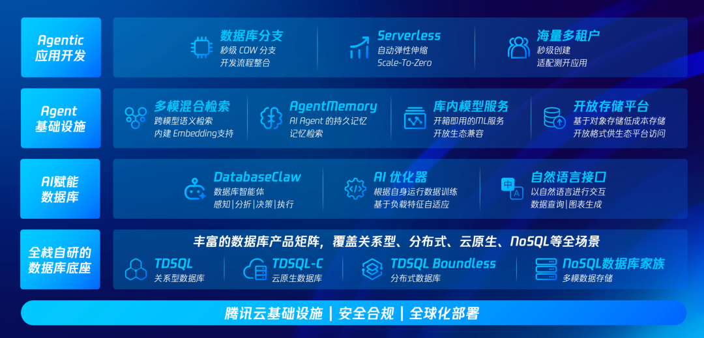

# 面向Agent，腾讯云数据库全面升级!

> 公众号: 腾讯云
> 发布时间: 2026-05-29 18:17:19
> 原文链接: https://mp.weixin.qq.com/s/m1QxY4jWNbWI5Sd3J0gOQg

---

今天，腾讯云宣布数据库产品体系面向Agent场景全面升级，为Agent 应用、AI 编程、智能运维三大场景，提供AI原生的数据库服务。

这也是腾讯云数据库进入3.0时代的第一天。

1.0扛住互联网的流量洪峰。

2.0拥抱融合创新战略，造优选的国产基础软件。

如今，腾讯云将以Agent为新用户，重新设计数据库产品与能力体系。

（腾讯云数据库AI原生全景能力图）

具体而言，看这三个Agent数据库👇

## //给Agent用的数据库

Agent 应用的数据散落在 MySQL、Mongo、Redis、COS 多套系统里，Agent 获取一份完整一致的数据，需要穿越多套延迟和一致性协议，大量时间消耗在数据获取上。

针对Agent专有的数据格式——上下文记忆，腾讯云今年发布了[Agent Memory](https://mp.weixin.qq.com/s?__biz=MjM5MDgwMzc4MA==&mid=2654907713&idx=1&sn=85adc5b5cd76b73bb3460e74ce867513&scene=21#wechat_redirect)，提供短期记忆（单次任务）和长期记忆（用户全局记忆）。

今天，腾讯云进一步为Agent Memory 增加团队记忆模块，将团队上下文组织为多个 Agent 共享的记忆层，让 Agent 理解团队工作规则与判断标准。

而针对会话状态、行业知识、图片视频等更加海量的多模态数据。腾讯云升级了高性能数据库TDSQL-B，把过去散落在 MySQL、Mongo、ES 等多套系统中的能力，重新统一到一套分布式底座中。

在同一架构内原生支持事务处理、向量检索、全文搜索与图计算四类引擎，并统一纳管多元异构数据源。

## //给AI编程专用的数据库

10个人、100个Agent同时用Agent开发，传统的数据库几乎无法设想这种场景。

针对AI Coding场景下数据库频繁复制、测试与回滚的新需求，腾讯云 TDSQL-C依托第三代存储架构演进，通过行列混存、全对等存储与日志解耦等能力，让数据库同时具备秒级弹性、混合负载处理与金融级高可用。

在此基础上，TDSQL-C还封装了三大特色能力，原生匹配Agentic开发👇

-数据库 Branch：像 Git 分支一样切数据库——1TB 库克隆从小时级压到秒级，主库零干扰，每个 Agent 都能获得一份与线上一致且隔离的测试环境。

-Serverless：开库秒级完成，闲置时资源和费用自动归零，按实际用量付费

-AI Toolkit：打包了好用的插件和工具，亿级向量零损召回、列存分析提速 10 倍、向量检索内存降低 75%都在话下。

## // 让Agent给DBA干活

## 云原生让数据库实例数量和架构复杂度持续上升，资深 DBA 供给却有限。此次升级，腾讯云也致力于用Agent帮助DBA提效。

## 腾讯云基于 OpenClaw 框架打造了数据库 AI Agent 产品 DatabaseClaw，让 DBA 和开发者用一句自然语言，即可完成过去需要在多个控制台间切换、串联指标、查阅文档才能完成的运维与排障任务。

DatabaseClaw 内置腾讯云十万级 DBA 工单沉淀的真实经验，将顶尖 DBA 的排障SOP沉淀为可复用Skill，并通过持续评测不断优化。

一个 Agent 即可统一覆盖腾讯云14款数据库产品与1600多个OpenAPI，实现关系型、NoSQL 与 SaaS 工具的统一运维。

除此之前，我们还把AI逐步引入数据库内核，让行业顽疾“慢SQL” 平均时延下降六成；还能预测流量洪峰，实现自动扩缩容。

...

拥抱Agent，腾讯云正在加速重构。

---

