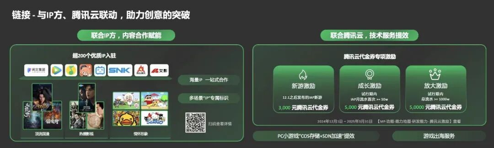
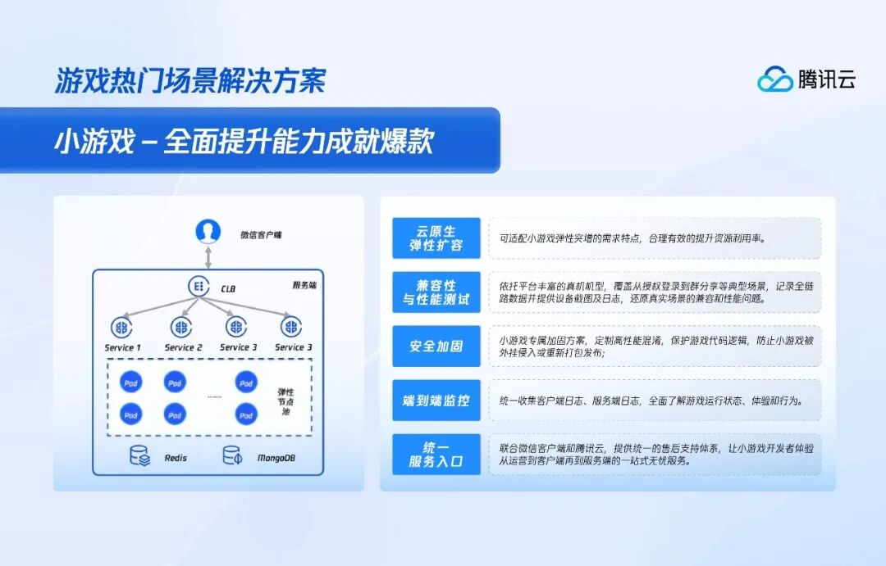

# 微信小游戏开发者超40万，腾讯云联合微信小游戏推出三大激励政策

> 公众号: 腾讯云出海服务
> 发布时间: 2025-01-14 14:31
> 原文链接: https://mp.weixin.qq.com/s/1tfaKhHXyiHrVd2tqvft3A

---

1月9日，2025微信公开课PRO于广州举办。在小游戏专场上，微信团队宣布，微信小游戏月活用户数已突破**5****亿**大关，用户使用时长持续增长，带动小游戏前三季度IAA流水同比增长超 **30%**；累计服务开发者数量超 **40****万**人次，其中 80% 以上是规模在 30 人以下的小团队。

同时，微信小游戏联合腾讯云正式推出三大激励政策，帮助新游、成长期、爆发期各阶段的小游戏开发者实打实地降低成本。在PC端小游戏COS存储与CDN加速提效、小游戏出海方面，也能获得服务，全方位为小游戏开发者保驾护航。

自2017年微信小游戏《跳一跳》推出至今，微信小游戏经历了数年的高速发展。据《2024年中国游戏产业报告》显示，小游戏市场2024年收入**398.36****亿**元，同比增长**99.18%**。目前月活超千万的小游戏产品已达20款，且手游玩家和小游戏重合用户规模较去年同比增长8.5%，已达3.42亿。

无疑，小游戏作为大蓝海赛道已然崛起。但相比于大型手游端游来说，小游戏更加轻量化，这也使得其开发团队普遍较小，两三个程序员就能够开发出一款像模像样的产品。比如《羊了个羊》，三个人的初始团队就研发出了一款半年营收破亿的爆款小游戏。

小游戏是内嵌在社交媒体平台上，具有强烈的社交裂变性，用户通过分享游戏邀请好友参与，能够在短时间内实现用户量的指数级增长，出现瞬时流量暴增的情况，而小开发团队的服务器往往很难承受住高峰流量，这对小游戏的承载能力、数据处理能力提出了更高的要求。

另外，黑客攻击、外挂、盗版等问题，导致小游戏产品开发后的运维难度加大，对开发团队整体要求更高。一旦出现宕机事故，不仅用户体验差，而且对游戏热度、用户留存活跃也会造成严重影响。

那么，于小游戏开发者来说，想要为用户提供更稳定、更优质的体验，选择和云厂商合作，无疑是最简单的方式。天生接入微信生态的腾讯云，成为了小游戏开发者的首选云服务商。2024年8月的微信小游戏畅销榜TOP10中，就有9个都使用了腾讯云。

腾讯云能够为小游戏提供云原生扩容、兼容性与性能测试、安全加固、端到端监控等一站式解决方案，全方位助力小游戏厂商打造爆款游戏。

在云原生扩容方面，腾讯云能够根据小游戏用户量的变化，实现资源的自动弹性伸缩，确保小游戏在用户激增时依然能够流畅运行，不会出现卡顿、崩溃等问题的同时，也能确保资源合理利用，避免浪费，优化IT成本。

在兼容性与性能测试方面,腾讯云则能够为小游戏进行全面兼容性测试，确保小游戏在不同品牌、型号的手机以及不同版本的操作系统上都能正常运行，提升用户的使用体验。

在安全方面，腾讯云通过小游戏安全加固、WAF 防火墙和抗 DDoS 防护等一系列安全措施，为小游戏构建起坚固的安全防线。同时，通过端到端监控，腾讯云则能实时监控游戏的各个环节，包括服务器、数据库、网络等，及时发现并预警潜在的问题。

而腾讯云天然与微信小游戏生态的联动，可以为开发者提供一站式服务入口与合作激励。对于2024年12月1日之后发布的IAP新游戏，开发者可以获得**3000****元**腾讯云代金券，用于游戏开发和运营的相关云服务；在小游戏试行期内，IAP月流水首次达到50万元，开发者可获得**五千元**腾讯云代金券；当总流水达到1000万元,还可获得**5万元**腾讯云代金券。

通过腾讯云一站式服务入口，小游戏开发者可以方便地获取腾讯云的各项云服务资源和技术支持，简化了服务获取的流程，提高了开发效率。面向未来，小游戏市场仍将继续保持强劲的增长势头，腾讯云也将不断升级解决方案与激励机制，帮助开发者打造出更多精品爆款游戏，助力小游戏产业生态繁荣发展。

**-END-**

#

# ①[游族网络与腾讯云达成战略合作，共同推动游戏行业技术发展](http://mp.weixin.qq.com/s?__biz=Mzg5NjgyNDMyOQ==&mid=2247486965&idx=1&sn=259d9dc31bdb5557c84c438d5ed4303e&chksm=c07a6893f70de185b19befe5a8b6384c3734295d3a74ad458bda2fbae2dc19ed39f2d321c87c&scene=21#wechat_redirect)

#

# ②[亚思未来与腾讯云达成战略合作，共建东南亚AI直播电商平台](http://mp.weixin.qq.com/s?__biz=Mzg5NjgyNDMyOQ==&mid=2247486959&idx=1&sn=9c59c8343e957885e803881c40cae376&chksm=c07a6889f70de19fc95a008098f11710ca2b9eb9e86b7307bdf5adba67af636f8847ef6bfd32&scene=21#wechat_redirect)

#

# ③[XTransfer与腾讯云达成战略合作 助力外贸数字化转型](http://mp.weixin.qq.com/s?__biz=Mzg5NjgyNDMyOQ==&mid=2247486953&idx=1&sn=f51c4e85f210fde0ff413e0652ddefee&chksm=c07a688ff70de1994fc0b7fc915f8256347c16af547cd1ce8acca570d5acf0a3f4ae297353ca&scene=21#wechat_redirect)

****关注我，及时获取互联网出海相关的行业趋势、云解决方案、实践案例等最新资讯******扫码即可获得**
**2024年游戏云案例实践及解决方案手册**

