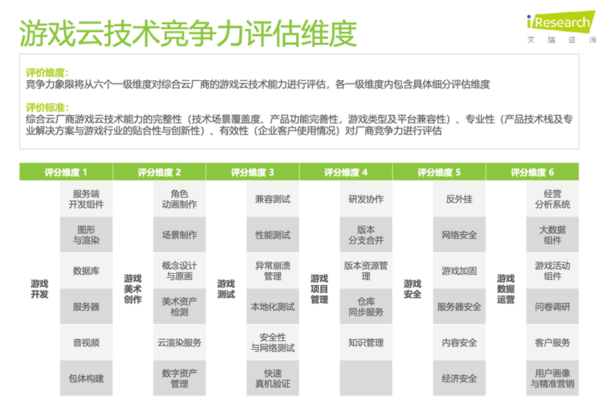
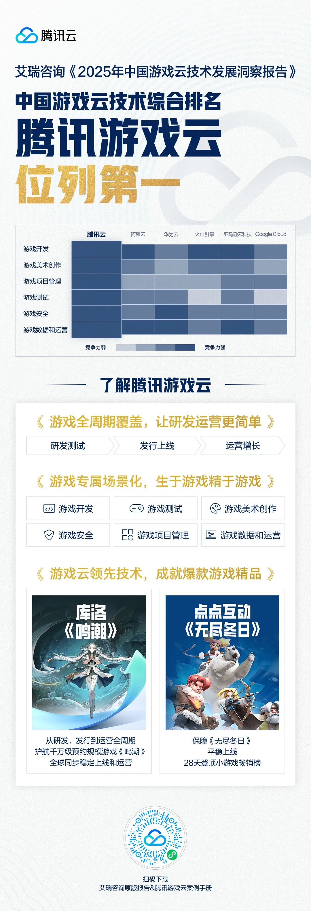

# 腾讯游戏云，技术实力第一！

> 公众号: 腾讯云出海服务
> 发布时间: 2025-02-18 14:36
> 原文链接: https://mp.weixin.qq.com/s/7jPzTRFklD9HrNDZKpmgCQ

---

腾讯游戏云，「第一」！

近日，艾瑞咨询发布《2025年中国游戏云技术发展洞察报告》，指出在游戏云技术领域，**腾讯游戏云综合竞争力排名第一**。

游戏云技术是游戏行业的重要组成，贯穿游戏研发测试、发行上线、运营增长等全流程。它不仅能降低技术门槛，让开发者更轻松上手，还能加速创新，推动游戏技术升级。

报告从**6个**一级维度、**35个**细分维度，针对云厂商游戏云技术的完整性、专业性和有效性，进行综合考察。

其中，腾讯游戏云凭借完善的基础设施、技术能力创新性以及覆盖游戏各业务领域的综合解决方案等优势，在**游戏开发、美术创作、项目管理、测试、安全、数据运营**六大核心领域保持全面领先，综合竞争力排名第一。

这份综合实力，早已经过了丰富的实战检验。看三个案例：

**//《鸣潮》：3200万全球预约玩家的稳定支撑**

作为一款二次元开放大世界游戏，《鸣潮》全球上线前，超**3200万**预约用户规模+全球六大区+大通服架构，对云端架构提出了极限挑战。腾讯游戏云提供全球云加速+弹性扩容+DDoS 高防，确保服务器稳定，战斗交互流畅，全球玩家体验无差别。《鸣潮》还通过GoSkinning基于腾讯美术资产AIGC的能力，对游戏各类角色及角色衣物进行自动蒙皮，大幅降低动画师工作量。

**//《无尽冬日》：28天登顶小游戏畅销榜**

《无尽冬日》海外版本已连续数月获得出海畅销榜第一，国内首发上线即登顶畅销榜，百万玩家涌入，瞬时并发挑战巨大。腾讯云弹性负载均衡+容器+MySQL数据库及CrashSight的技术架构，确保游戏的稳定上线，28天即登顶小游戏畅销榜。

**//《元梦之星》：上线9月以来0故障**

《元梦之星》基于腾讯云TKE容器架构，可迅速解决现网出现的负载预警。在角色皮肤制作方面，GenesisTex结合AIGC和可微渲染的技术，助力《元梦之星》实现自动生成复杂角色皮肤，其对多视角一致性的处理，相较于同类技术更具优势，并且全自动生成的结果已直接应用于多个UGC玩法。

目前，三七互娱、心动网络、乐元素、库洛游戏、冰川网络……越来越多的头部游戏厂商，都选择「牵手」腾讯游戏云，共同打造高质量游戏体验。

你的下一款游戏，考虑搭载腾讯游戏云了吗？

**-END-**

#

# ①[游族网络与腾讯云达成战略合作，共同推动游戏行业技术发展](http://mp.weixin.qq.com/s?__biz=Mzg5NjgyNDMyOQ==&mid=2247486965&idx=1&sn=259d9dc31bdb5557c84c438d5ed4303e&chksm=c07a6893f70de185b19befe5a8b6384c3734295d3a74ad458bda2fbae2dc19ed39f2d321c87c&scene=21#wechat_redirect)

#

# ②[亚思未来与腾讯云达成战略合作，共建东南亚AI直播电商平台](http://mp.weixin.qq.com/s?__biz=Mzg5NjgyNDMyOQ==&mid=2247486959&idx=1&sn=9c59c8343e957885e803881c40cae376&chksm=c07a6889f70de19fc95a008098f11710ca2b9eb9e86b7307bdf5adba67af636f8847ef6bfd32&scene=21#wechat_redirect)

#

# ③[XTransfer与腾讯云达成战略合作 助力外贸数字化转型](http://mp.weixin.qq.com/s?__biz=Mzg5NjgyNDMyOQ==&mid=2247486953&idx=1&sn=f51c4e85f210fde0ff413e0652ddefee&chksm=c07a688ff70de1994fc0b7fc915f8256347c16af547cd1ce8acca570d5acf0a3f4ae297353ca&scene=21#wechat_redirect)

****关注我，及时获取互联网出海相关的行业趋势、云解决方案、实践案例等最新资讯******扫码即可获得**
**2024年游戏云案例实践及解决方案手册**

