# 探索小众玩法与AIGC趋势下的新航向，出海趋势观察系列活动再出发！（文内附报告领取方式）

> 公众号: 腾讯云出海服务
> 发布时间: 2025-02-24 15:53
> 原文链接: https://mp.weixin.qq.com/s/WxKc4ofQUc6Vw0qvtoXt-A

---

全球化浪潮中，中国企业出海热正以前所未有的速度席卷全球，但随着出海厂商数量的增加以及全球大环境的瞬息万变，如何在这片波澜壮阔的海洋中找到新的增量，成为众多企业需要共同面对的重要议题。

时间迈入2025年，扬帆出海敏锐观察到了两大不可忽视的趋势，它们正悄然引领着出海行业的新航向。一是大模型的不断精进演化，带来了AIGC在各赛道、多场景的商业化落地成果。从文字创作到图像生成，从音频制作到视频剪辑，AIGC技术的广泛应用正在深刻改变着出海行业的面貌。二是小众玩法赛道，如宗教类应用、占星类应用、工具类应用等，在AIGC技术的加持下，获得了更为丰富的进化形态，为企业提供了差异化的竞争优势，开辟了新的增长点。

面对机遇，有准备的人才能掌握先机。为了帮助出海人缩小信息差，**腾讯云携手扬帆出海联合举办的Global Day系列精品活动再度重磅启航**，本次活动深度聚焦**小众玩法**和**AIGC**两大航道，以一场干货满满的**线上分享会**、一场火花四溅的**线上辩论会**，以及一场极具份量的**线下出海峰会**，特邀多位重磅行业嘉宾，为出海从业者们带来市场、技术、业务等多维度的洞察与干货内容，自**2月27日至3月14日**，三场好戏连唱，不容错过。

**2月27日——小众玩法线上分享会**

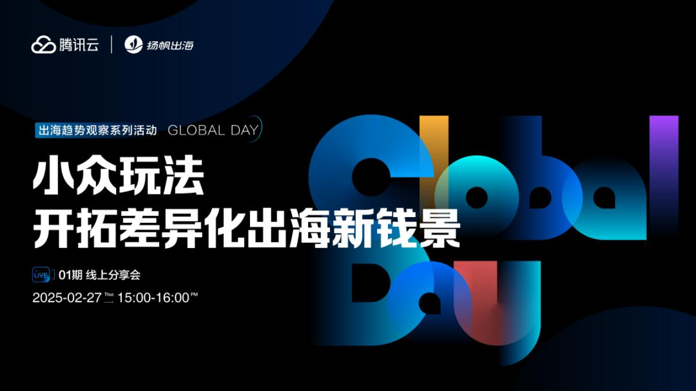

2024年至今，一些看似小众需求的赛道成功避开了内卷，找到新机会，如宗教、占星、健康、冥想、AI社交、音乐、实用工具品类等，均另辟蹊径获得了高速增长。

基于此，**2025年2月27日**，腾讯云携手扬帆出海联合举办的**Global Day系列活动01期**线上分享会，把目光投向了全世界的“**小众赛道**”玩法，探寻用户获取、有效运营打法和避坑指南，邀请到**蜗牛睡眠 产品副总裁 桑乐**作为演讲嘉宾，**大观资本 合伙人 徐瑞呈、赋比兴 海外项目负责人 李虹菁、翻咔 海外业务负责人 李东旭、腾讯云 出海首席解决方案架构师 王明**作为研讨嘉宾，共同探索全球小众玩法赛道的新机遇。

除精彩演讲及研讨环节之外，本次线上分享活动还将**重磅发布《小众玩法一指禅报告》**，聚焦宗教、占星、音乐、工具、健康、AI社交六大航道，并从市场洞察、实例拆解、未来市场机会预测三大维度进行解读，为出海从业者提供市场分析和战略建议。（领取方式见下方）

**嘉宾阵容曝光**
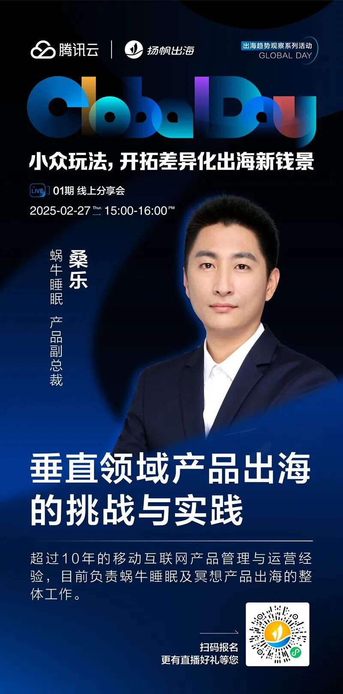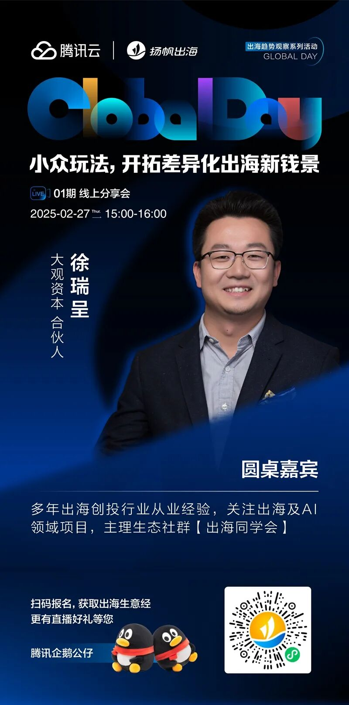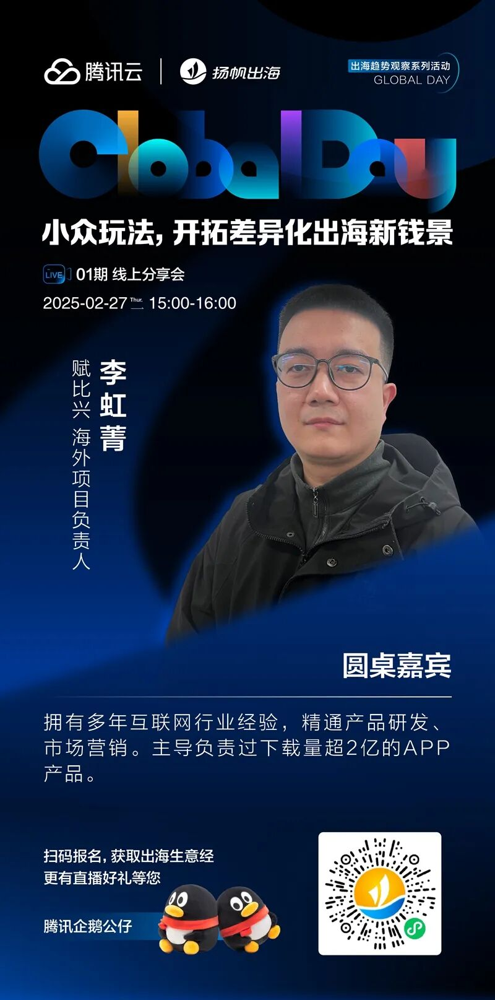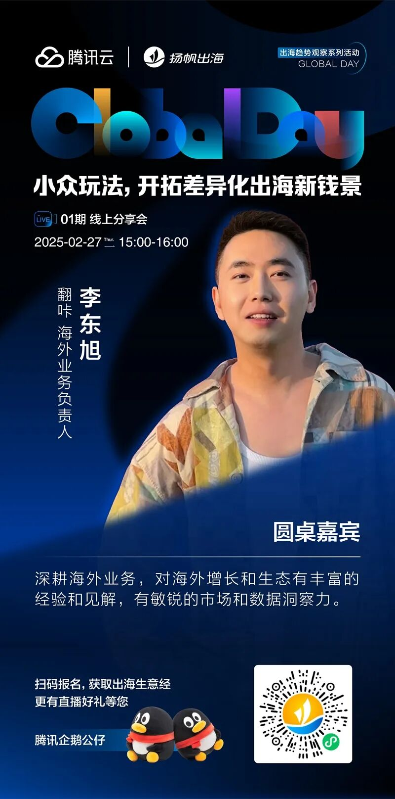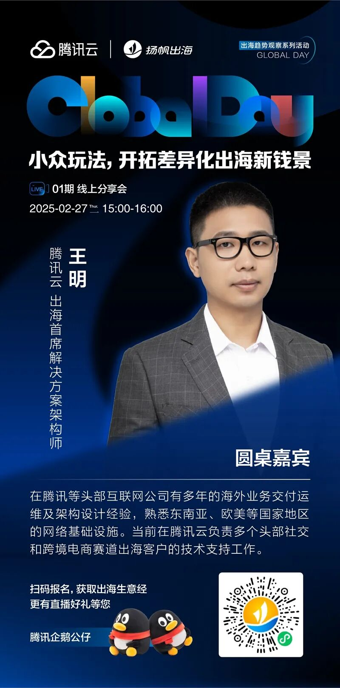

左右滑动查看更多

**议程介绍**

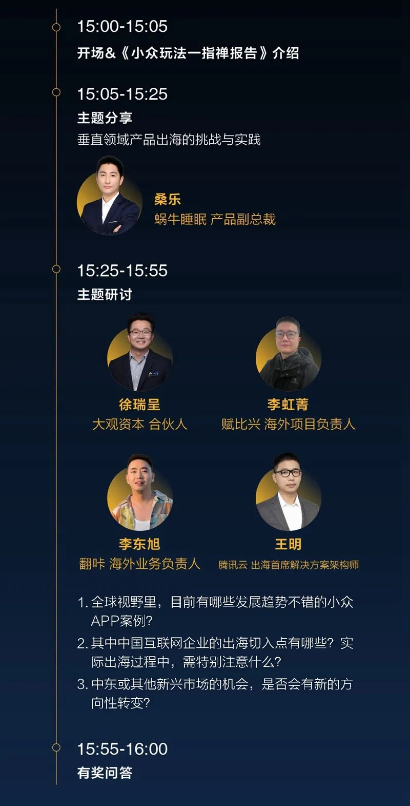

**活动报名&报告领取**

**活动时间：**2025年2月27日15：00-16：00

**活动报名：**点击跳转Global Day 线上分享会

**扫描下方小程序码领取**报告**：**

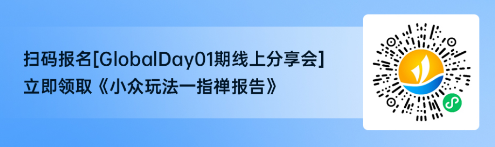

**3月6日——AI出海辩论会**

随着AIGC技术的快速发展，全球市场正迎来一场AI应用的革命。然而，AI技术的商业化路径究竟是以B端为主，还是以C端为主，仍是一个充满争议的话题。第二期Global Day活动将围绕“**从百模大战到应用之战，10年内AIGC商业化主战场在B端还是C端**”这一主题展开激烈辩论，邀请到**小影科技 VP 张航、ShareCreators COO 李斌、西湖心辰 联合创始人 俞佳、AI连续创业者 黄硕**组成两支辩方小队展开交锋，在辩论中释出出海者最为关心的AIGC未来发展趋势。

**精彩抢先看**

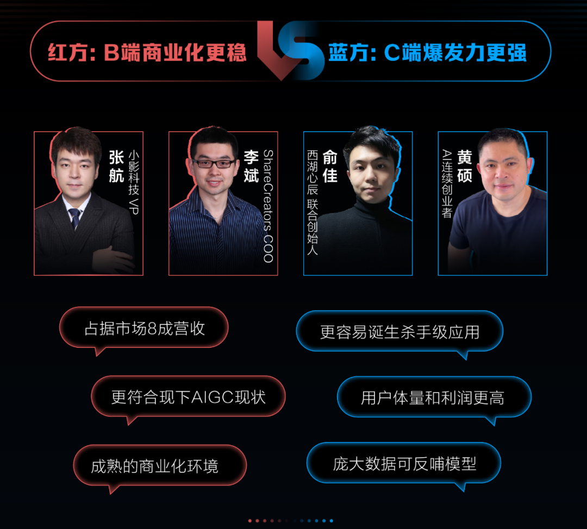

**嘉宾曝光**
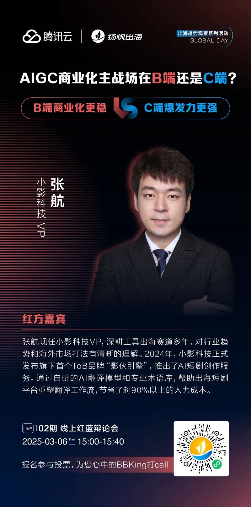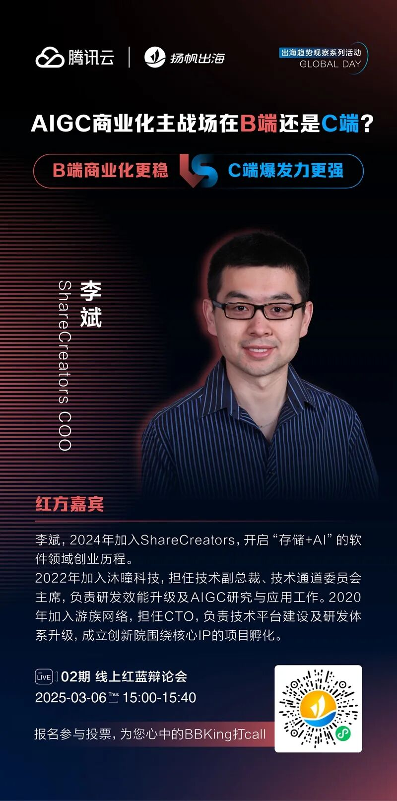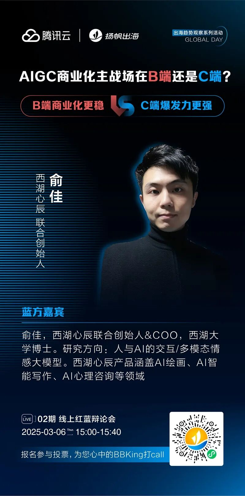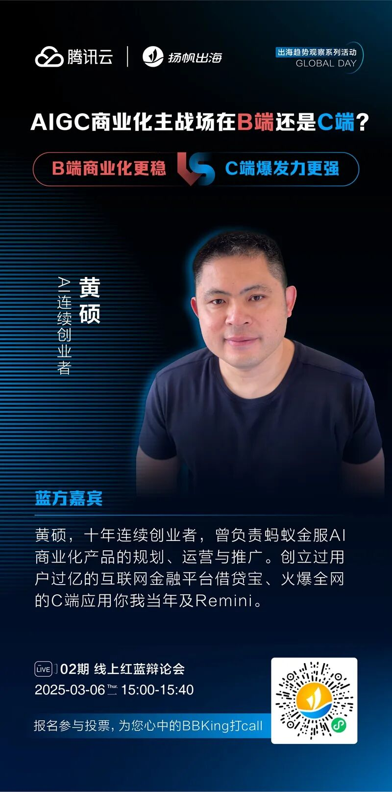

左右滑动查看更多

**三步走，投出你心中的“AI未来主战场”**

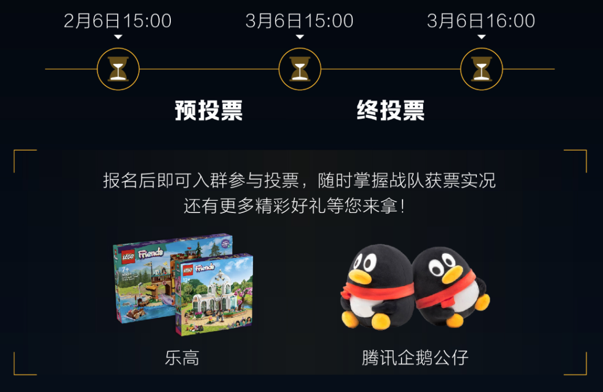

**投票通道**：点击参与，选出你心中的“AI未来主战场”

**活动时间&报名链接**

**活动时间：**2025年3月6日15：00-15：40

**活动形式：**线上直播

**报名方式：**点击跳转Global Day AI出海辩论会

**3月14日——AI出海峰会·北京站**

AIGC技术正以前所未有的速度改变着内容创作和传播方式，其广泛应用潜力巨大。如何更好地寻到PMF机会，也成为各大AI企业关注的重点。

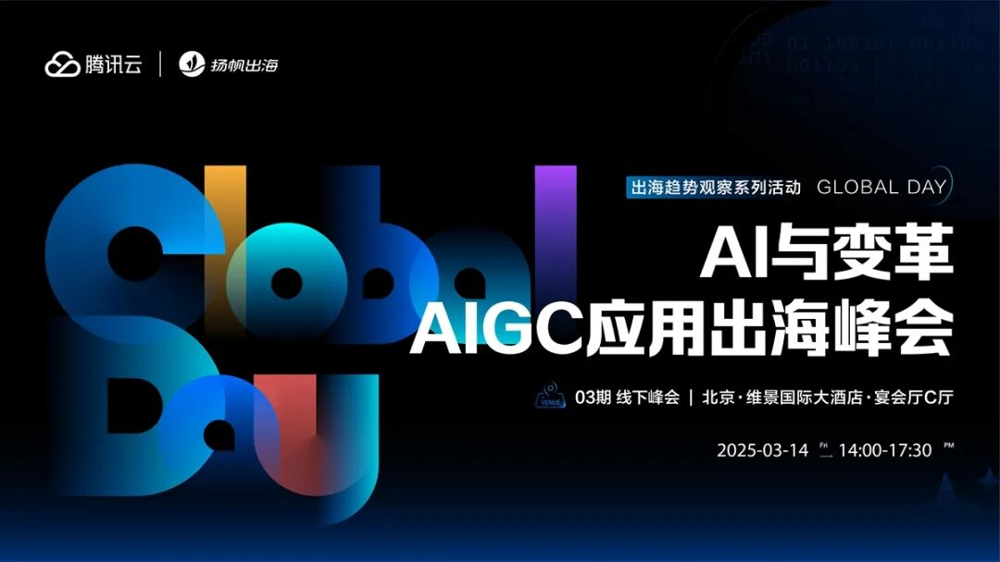

作为本届Global Day系列活动的收官战，本场**《AI与变革——AIGC应用出海峰会》**聚焦AI出海领域的最新动态与未来趋势，共同探讨AIGC技术在出海领域的应用前景与商业价值，探索AIGC应用的未来爆发点。

**2025年3月14日14：00-17：30，北京市·北京维景国际大酒店**，等待您的莅临。

**峰会报名：**点击跳转Global Day AIGC应用出海峰会·北京站

**峰会议程**

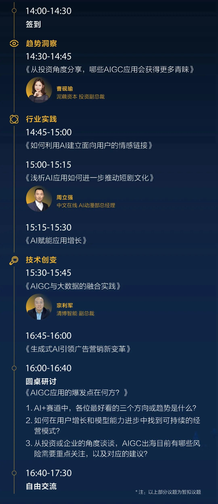

**-END-**

#

# ①[游族网络与腾讯云达成战略合作，共同推动游戏行业技术发展](http://mp.weixin.qq.com/s?__biz=Mzg5NjgyNDMyOQ==&mid=2247486965&idx=1&sn=259d9dc31bdb5557c84c438d5ed4303e&chksm=c07a6893f70de185b19befe5a8b6384c3734295d3a74ad458bda2fbae2dc19ed39f2d321c87c&scene=21#wechat_redirect)

#

# ②[亚思未来与腾讯云达成战略合作，共建东南亚AI直播电商平台](http://mp.weixin.qq.com/s?__biz=Mzg5NjgyNDMyOQ==&mid=2247486959&idx=1&sn=9c59c8343e957885e803881c40cae376&chksm=c07a6889f70de19fc95a008098f11710ca2b9eb9e86b7307bdf5adba67af636f8847ef6bfd32&scene=21#wechat_redirect)

#

# ③[XTransfer与腾讯云达成战略合作 助力外贸数字化转型](http://mp.weixin.qq.com/s?__biz=Mzg5NjgyNDMyOQ==&mid=2247486953&idx=1&sn=f51c4e85f210fde0ff413e0652ddefee&chksm=c07a688ff70de1994fc0b7fc915f8256347c16af547cd1ce8acca570d5acf0a3f4ae297353ca&scene=21#wechat_redirect)

****关注我，及时获取互联网出海相关的行业趋势、云解决方案、实践案例等最新资讯****
**扫码即可获得**
**2024年游戏云案例实践及解决方案手册**

