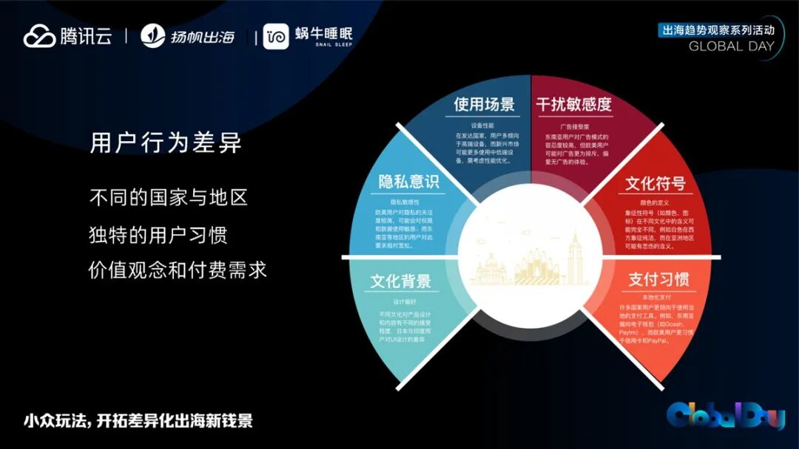
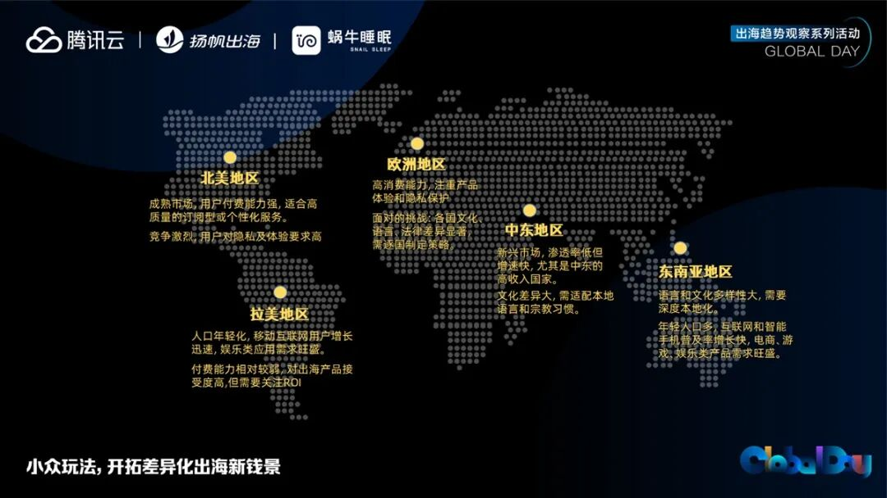
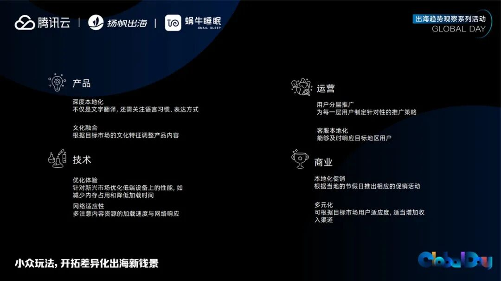
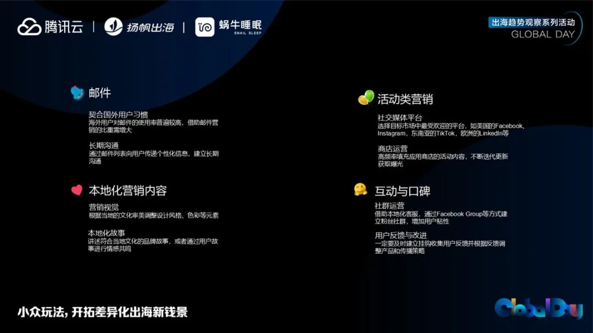

# Global Day01期线上分享会回顾 | 打破地域界限，小众玩法引领市场新潮流

> 公众号: 腾讯云出海服务
> 发布时间: 2025-03-04 14:30
> 原文链接: https://mp.weixin.qq.com/s/u53NDXKCvXjyOAoKafUz1A

---

在各主流赛道企业竞相角逐国际市场的出海热潮中，一些小众玩法巧妙避开直面竞争，另辟蹊径走出一条崭新的发展道路。这些小众应用凭借**独特的创意和精准的市场定位，深耕细分领域**，快速吸引了一些特定用户群体的关注和喜爱，展现出高速增长潜力，为整个行业带来了新的启发与思考。
2025年2月27日，**腾讯云携手扬帆出海联合举办的Global Day系列活动01期线上分享会**，聚焦“小众赛道”玩法探索，深入剖析用户获取策略与高效运营技巧，发掘全球小众玩法领域中的新机遇。
全球视野里，目前有哪些发展趋势不错的小众APP案例？中国互联网企业的出海切入点有哪些？中东或其他新兴市场机会，是否会有新的方向性转变？带着这些问题，我们在本期分享会中寻找答案。

**Part1** **主题****分享**

**《垂直领域产品出海的挑战与实践》**

**蜗牛睡眠 产品副总裁 桑乐**
在出海过程中，**理解用户行为差异**是非常重要的一点，面对不同区域、不同国家的用户，产品的访问频率、互动方式、使用偏好、支付需求、使用习惯等等都存在差异。因此，基于文化差异，在设计产品时，本地化研究是必不可少的一环，如当地的**人口特征、发展现状、文化差异、法规政策**等等。只有解决用户的痛点，才能为用户带来更好的体验感与满意度。

以蜗牛睡眠为例，出海初期就将目标投向了北美。主要是因为**工具型产品****更多****追求的是订阅率，****对****支付能力****更加看重**，北美地区的市场成熟度较高且用户的付费能力较强，非常适合订阅类的产品，但同时竞争也十分激烈。
而对于也有一定消费力的欧洲用户来说，用户更加注重产品体验，对产品质量要求非常高，而且存在**多语言**问题。中东地区虽然是个能够产生高收入的新兴市场，但主要问题在于**文化差异****过大**，需要在宗教信仰、生活习俗等方面做大量的本地调研。东南亚地区，年轻人口较多，平均年龄较低，当地**对于新****产品的接受程度是****一大优势特点**，不过虽然地域文化相近，但如果单纯的通过机翻出海，效果并不一定理想。而在拉美地区，人口年轻化，互联网普及率较高，虽然付费能力相对较弱，但是**用户增长十分迅速**。

对于特别关注ROI的产品来说，将北美、欧洲、以及与中国文化相近的东南亚、日韩等地作为出海第一站，或许是个不错的选择。同时，**接入一些运营工具**，如通过数据类工具，快速了解用户反馈、路径、分层，对于后续的优化也是很有帮助的。
运营方面，与本地用户沟通的问题过程中，**客服或者反馈系统的服务人员尽量是本地化****的效率会更高**，同时避免了**时差问题**。
技术方面，对于一些**网络设施设备并不太好的****新兴市场**，则需要在研发端时刻去关注相关数据，如CPU的占用率是否异常，在低性能的设备上，如出现卡顿甚至宕机状态，极可能导致用户留存降低。
商业方面，角度来看在优化与创新方面，可以**紧跟当地的节日、习俗做一些促销活动**，是很能够吸引用户转化的。还可以根据用户的适用程度逐渐去添加一些广告收入，并从数据上观察它的流失与留存特点。

当前，**投放成本激增下，****营销矩阵****成为能够帮助****产品形成自我造血****的关键**，自然用户流量的获取会比投放价值更高。
首先，是借助海外用户的邮件习惯，蜗牛睡眠增加了一些**邮件营销、推送****、****沟通，****来****与用户建立****更多连接与长期关系**，获得其信任的同时，也能给予产品口碑更好地传播与推广。其次，在Facebook、Instagram等平台去做一些**内容铺垫**，去传递专业知识，如睡眠过程中可能会产生的问题，如何解决这些问题，做好活动营销工作。另外，**不断积累商店活动**，通过产品的质量稳定性获得不错的评分，则会得到更多的曝光。最后，是**本地化营销内容**，如营销视觉方面需要迎合当地用户，在媒体矩阵的设计当中，是可以重点考虑的。

**P****art2** **主题****研讨**

研讨嘉宾：大观资本 合伙人 徐瑞呈、赋比兴 海外项目负责人 李虹菁、翻咔 海外业务负责人 李东旭、腾讯云 出海首席解决方案架构师 王明

**话题1：全球视野里，目前有哪些发展趋势不错的小众APP案例？**

**大观资本 合伙人 徐瑞呈：**近年来，海外华人创业者在细分赛道展现出强劲竞争力，尤其在**AI驱动**的新兴领域表现突出。尽管项目初始切入点常被视为“小众”，但通过精准定位与技术创新，许多团队已在北美、日本等主流市场跻身行业前列。
具体案例显示，文娱教育领域涌现出多个创新项目：**AI绘本**平台Miss Dora、**教育**工具College Bot等产品成功打开北美市场。**健康科技**方面，中国出海企业开发的StressWatch智能手表长期占据苹果生态榜单前列，**宠物互动**产品Traini则探索大模型在动物行为分析中的应用。**工具类创新**呈现跨界融合特征，如视频剪辑工具Viggle和AI助手Sider，既具备B端软件效能又保持C端用户体验，吸引全球投资者关注。
当前创业生态呈现两大特征：**一是****“****小众****”****概念被重新定义**，细分赛道通过AI赋能实现规模化突破；**二是技术边界日趋模糊**，移动互联网与AI、SaaS的深度整合催生新物种。华人创业者凭借技术敏锐度与全球化视野，正通过差异化创新在AI时代构建独特竞争优势。
**赋比兴 海外项目负责人 李虹菁：**当前海外细分赛道呈现多元化创新趋势，**手机主题美化与大健康领域显现增长潜力**。桌面美化类产品如Mico、iScreen在海外榜单排名快速攀升，印证了个性化数字消费需求的持续增长。
**翻咔 海外业务负责人 李东旭：**社交赛道正通过文化融合与技术革新开辟新路径：**针对LGBT群体的垂直社交产品表现突出**，如Match Group推出的Tinder已形成差异化定位，AI技术正深度重构社交体验，聊天破冰、虚拟陪伴等功能成为标配。值得关注的是，**AI驱动的情感类产品呈现跨界创新**——结合虚拟偶像IP的模拟恋爱应用在日韩及东南亚市场表现亮眼，而融合塔罗占卜的AI社交产品在印度等低ARPU地区也实现可观商业化，印证了本土化文化要素与技术创新结合的有效性。
市场竞争加剧背景下，两大核心策略逐渐清晰：一方面，**工具类产品持续深挖用户深层需求**，主题美化赛道通过视觉个性化创造增量价值；另一方面，**社交产品通过****“****技术+文化****”****双轮驱动开辟蓝海**，既运用AI提升互动质量，又精准捕捉地域文化特性。这些实践表明，**所谓****“****小众赛道****”****实质是未被充分满足的细分需求**，通过AI赋能与文化洞察，创业者可构建独特竞争壁垒，在全球化市场中实现超线性增长。
**腾讯云 出海首席解决方案架构师 王明：**腾讯云凭借音视频通信与AIGC技术体系，正深度赋能泛娱乐社交类应用出海。比如说，针对音视频社交场景，我们可以**为出海企业提供低延时、高并发的技术支撑，加速全球化部署**。在AI创新层面，腾讯云整合数字人、智能语音、内容生成等核心能力，推动社交产品形态升级：比如，通过AI声音引擎实现个性化音色定制，结合礼物生成技术为直播间创造差异化互动体验；数字人分身技术则重塑主播生态，支持虚拟角色扮演与智能体交互，甚至延伸至游戏场景实现AI智能体陪玩。
随着混元大模型的多模态能力释放，**腾讯云AIGC已覆盖30+行业创新场景**。文生文、文生图、文生视频技术赋能工具类应用开发，如智能会议纪要生成、文案扩写优化、风格化图片处理等。在电商领域，模特换装、商品海报自动生成等功能显著提升运营效率，而个人写真、虚拟试衣等C端应用则拓展用户体验边界。当前，**这些技术正成为小众赛道突围的关键支点——从社交直播的沉浸式互动到电商的内容生产革命，腾讯云通过底层算力与AI技术融合，持续催化出海应用的场景创新与增长飞轮**。

**话题2:中国互联网企业的出海切入点有哪些？实际出海过程中需要特别注意什么？**

**赋比兴 海外项目负责人 李虹菁：**在进行产品选品时，首先要考虑的是**目标用户人群**，了解他们的需求和痛点。并根据团队的资源和能力，合理地进行**品类选择**。**偏工具类、内容少且垂直的品类，产品竞争相对较小，同时也有利于后期的本地化和全球复制。**在选择出海地区时，**建议优先考虑人口众多、经济环境稍好的国家，这些地区的市场机会更大，也更有可能带来可观的收益**。然而，即使在这样的地区，竞争也依然存在，因此在实际出海过程中，本地化是确保产品能够顺利进入并适应新市场的重要环节，而合规性则是确保产品能够在新市场中长期发展的关键，需要特别注意。
**翻咔 海外业务负责人 李东旭：**在准备出海的过程中，每位开发者都需要深思熟虑，找到适合自己的切入点。这不仅仅是对市场趋势的盲目追逐，而是需要深入了解公司的**核心业务、算法、数据模型等关键要素**，明确自身的业务基因和核心竞争力。
选择产品类型和地区时，要清醒地认识到自身的实力和局限性，**避免盲目扩张导致资源分散。**同时，对于目标市场的深入了解也是必不可少的，这包括**市场规模、用户需求、文化背景**等多个方面。
本地化是出海过程中无法回避的重要议题，**跨文化沟通和理解是本地化成功的关键**。不能仅凭主观臆断或刻板印象来制定本地化策略，而需要**深入了解目标市场的文化特质和用户需求**。例如，在针对LGBT人群开展业务时，尽管这一人群在全球范围内具有共性，但在不同文化背景下，他们的需求和偏好也会呈现出细微的差异。
**大观资本 合伙人 徐瑞呈：**从2015年到2016年，出海行业开始逐渐进入人们的视野，成为了一个热门话题。在选择出海的目的地时，我们认为应**从自身的特点和优势出发**。比如，如果团队对某个地区或国家的文化、语言等有深入的了解，那么选择该地区作为出海的首站可能会更加合适。当然，**北美等地区由于其庞大的市场规模和成熟的商业环境，也是许多出海企业的首选**。
此外，**长期主义**在出海过程中也显得尤为重要。虽然短期主义策略，如买量等，可以为企业带来快速的收益，但从长远来看，坚持长期主义，注重产品的持续迭代和优化，以及用户体验的提升，才能为企业在出海市场中赢得**持久的竞争力**。
在谈论出海时，本地化无疑是一个无法回避的话题。然而，我们也要注意**不要陷入过度强调本地化的误区**。谷歌作为全球化的成功案例，其国际化团队分为国际化和本地化两组，这给我们提供了一个很好的启示。
**腾讯云 出海首席解决方案架构师 王明：**出海应用的部署是一个复杂的过程，需要综合考虑**本地化和全球化**因素。从技术角度来看，部署过程中需要注意多个方面。
首先，业务区域的选择至关重要。为了提供更优质的服务，应选择**靠近用户的区域进行本地化部署**。这有助于减少网络延迟，提升用户体验。
其次，技术实施上需要关注**弹性扩展、避免单点故障、网络延迟和分布式计算**等方面。在数据存储方面，需要确保数据的可靠存储和高可用性。采用高可靠和数据冗余的存储解决方案，如对象存储或分布式文件系统，能够确保数据的安全和持久性存储。同时，**定期进行数据备份和制定详细的数据恢复计划**也是必不可少的。
从全球化角度看，出海应用需要进行**多区域业务部署**，以满足不同国家和地区的用户需求。通过前端和后端优化手段，如代码压缩、图片加载优化、数据库索引缓存机制等，可以提升系统的性能和响应速度。
此外，**合规**也是出海应用中不可忽视的一个方面。在数据传输和存储过程中，需要**遵循各国的数据隐私法规**，如GDPR或CCPA等。采用加密技术如SSL/TLS、AES等保护用户数据安全也是至关重要的。
最后，在资源优化和成本控制方面，**可以利用容器化技术和监控手段来优化资源配置**。通过实时分析业务资源使用情况，避免底层资源的浪费。同时，利用云服务提供商的按需计费模式，根据实际使用量来付费，可以降低出海应用的成本。

**话题3：中东或其他新兴市场的机会，是否有新的方向性转变？**

**大观资本 合伙人 徐瑞呈：**出海过程中，**市场选择**尤为重要，虽然全球范围内存在几个公认的高收入或用户增长迅速的市场，但最终的决策还需**基于企业自身的实际情况和优势**。
进入北美市场，站稳脚跟颇具挑战。然而，**一旦成功覆盖北美市场，企业的未来发展将更为顺畅**。不过，由于地缘政治等因素，当前对北美市场的选择需更加审慎。尽管如此，中国企业在北美的多个细分赛道，如社交、AI工具、健康等领域，仍展现出了强大的竞争力。
**日本市场对中国产品具有较高的认可度**。特别是**工具导向**的产品，在日本市场上逐渐崭露头角，赢得了用户的青睐。同时，中国手游在日本也取得了显著成绩，无论是大厂还是中小厂都有佳作问世。
**赋比兴 海外项目负责人 李虹菁：**墨西哥作为全球第15大经济体，人口众多，市场潜力巨大，是一个值得尝试的新兴市场，**可以借鉴国内成功的商业模式和路径**，寻找并满足当地随着经济发展而逐步显现的需求。例如，随着生活水平的提高，**墨西哥人对于大健康品类的需求可能会逐渐增加**，包括减肥、心理健康等方面的产品和服务。这些领域可能蕴含着巨大的商业机会。
另外，中东地区也是一个值得关注的出海市场。**由于宗教和文化因素，****当地****的线下娱乐选择相对较少，因此人们更倾向于在网上寻找娱乐机会**。这推动了中东地区直播和游戏行业的快速发展。对于出海企业来说，可以抓住这一趋势，开发适合中东市场的直播和游戏产品，满足当地用户的需求。
**翻咔 海外业务负责人 李东旭：**加拿大由于其与美国相近的文化和语言背景，其互联网发展程度相对滞后于美国约两年，但领先于东南亚地区五年。这为开发者提供了一个新视角，**即成功在美国市场推出的产品，在复制到加拿大市场时可能同样具有较大的成功潜力**。
然而，当前美国政局的变化对海外业务，特别是中国开发者的业务，带来了**诸多不确定性**。近年来，包括TikTok在内的多款中国应用在美国遭遇下架或封禁，类似事件也发生在印度等其他市场，这对出海开发者构成了严峻挑战。合规性是出海开发者在海外市场必须跨越的门槛，以LGBT社交产品为例，因政策要求，需要进行的用户真人认证等合规措施，而这些措施可能会引发的**用户隐私保护等政治敏感问题**。此外，开发者还需关注数据存放位置等细节问题，以确保完全遵守当地法规。

**腾讯云 出海首席解决方案架构师 王明：**合规性是出海企业以及云服务提供商在全球化发展过程中绕不开的关键话题。腾讯云在海外开展业务时，不但严格遵守不同国家和行业的合规要求，致力于打造一个值得信赖的云服务环境，并积极参与行业标准的制定与推广。目前**已获得国内外400多项专业认证，并得到国际顶级行业研究机构的认可**。

对于出海企业来说，遵循各国数据隐私法规至关重要。腾讯云在提供数据合规的云服务的同时，还通过合作伙伴提供**合规咨询服务**，以帮助企业更好地应对合规挑战。

在技术上，腾讯云可提供**数据安全工具、数据加密、数据权限管理和数据审计**等手段来帮助出海企业满足合规要求。例如，通过数据分级分类方案为涉及大量个人隐私数据的企业制定数据合规标准，并进行隐私数据的筛选、分析、分类权限管控和存储，以及提供用户注册和登录时的身份信息真实性校验服务。

此外，腾讯云还提供**内容安全审核服务**，通过图像搜索、图像侵权审核等技术手段，对电商平台上的品牌logo、侵权图案和原创花纹图像等进行合规内容审核，以确保企业业务的合规性。

**点击链接查看01期线上分享会回放，听听大咖们的看法：**#小程序://扬帆出海/qW8tv8J9Tqoj0Aw

**P****art3** **GlobalDay****系列****活动****预告**

在科技日新月异的今天，AI正以惊人的速度重塑着世界。在探索路上，**是B端商业化更稳，还是C端爆发力更强**，很大程度上决定了产品发展方向的关键。同时，**如何更好地寻到PMF机会**，也成为各大AI企业关注的重点内容。
基于此，3月6日，Global Day02期活动将围绕**“从百模大战到应用之战，10年内AIGC商业化主战场在B端还是C端”**这一主题展开辩论，深入剖析并阐述出海者关注的AIGC未来发展趋势。
**点击链接立即报名：**#小程序://扬帆出海/PvY7A0BTImcEB3e

3月14日，Global Day03期活动**《AI与变革——AIGC应用出海峰会》**将AI聚焦出海领域的最新进展与未来走向，深入探讨AIGC技术在出海场景下的应用潜力与商业机遇，寻找AIGC应用即将迎来的爆发式增长点。
特邀泥藕资本 投资副总裁、狐之空 CEO、中文在线集团 AI动漫部总经理、清博智能 副总裁等行业领袖深度分享交流，更多嘉宾持续更新中
聚焦AI市场趋势、商业化、出海成功案例、DeepSeek深度观察
探索AIGC技术商业模式，关注全球AI机会
**活动时间：**3.14  14:00-17:30（14:00-14:30签到）
**活动地点：**北京维景国际大酒店 宴会厅C厅
**点击链接立即报名：**#小程序://扬帆出海/eEJt2GMlDaIi6cm

**-END-**

#

# ①[游族网络与腾讯云达成战略合作，共同推动游戏行业技术发展](http://mp.weixin.qq.com/s?__biz=Mzg5NjgyNDMyOQ==&mid=2247486965&idx=1&sn=259d9dc31bdb5557c84c438d5ed4303e&chksm=c07a6893f70de185b19befe5a8b6384c3734295d3a74ad458bda2fbae2dc19ed39f2d321c87c&scene=21#wechat_redirect)

#

# ②[亚思未来与腾讯云达成战略合作，共建东南亚AI直播电商平台](http://mp.weixin.qq.com/s?__biz=Mzg5NjgyNDMyOQ==&mid=2247486959&idx=1&sn=9c59c8343e957885e803881c40cae376&chksm=c07a6889f70de19fc95a008098f11710ca2b9eb9e86b7307bdf5adba67af636f8847ef6bfd32&scene=21#wechat_redirect)

#

# ③[XTransfer与腾讯云达成战略合作 助力外贸数字化转型](http://mp.weixin.qq.com/s?__biz=Mzg5NjgyNDMyOQ==&mid=2247486953&idx=1&sn=f51c4e85f210fde0ff413e0652ddefee&chksm=c07a688ff70de1994fc0b7fc915f8256347c16af547cd1ce8acca570d5acf0a3f4ae297353ca&scene=21#wechat_redirect)

****关注我，及时获取互联网出海相关的行业趋势、云解决方案、实践案例等最新资讯****
**扫码即可获得**
**2024年游戏云案例实践及解决方案手册**

