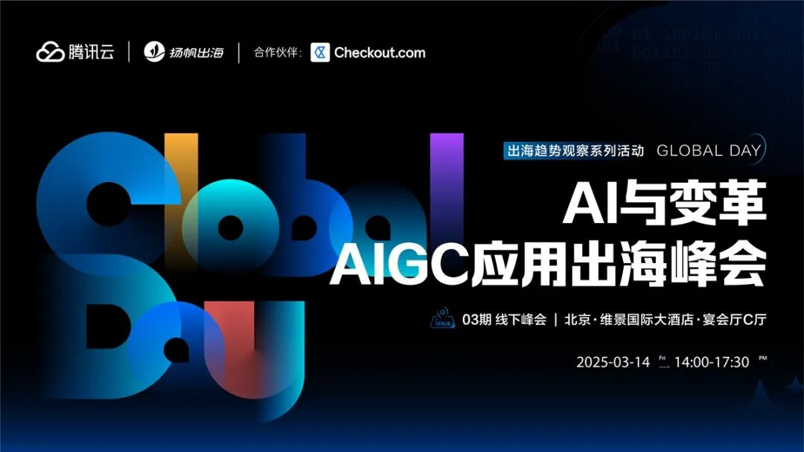
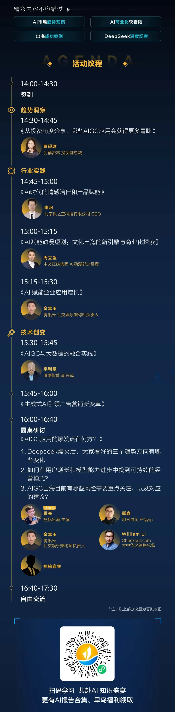
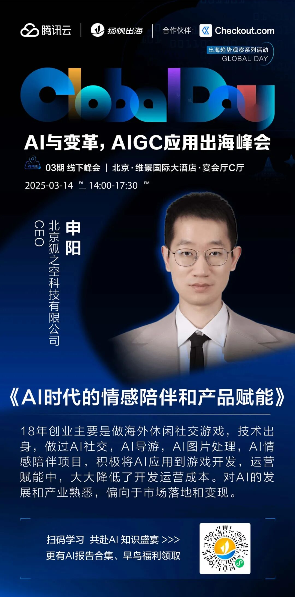
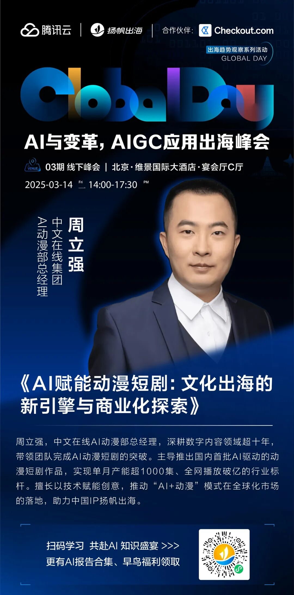
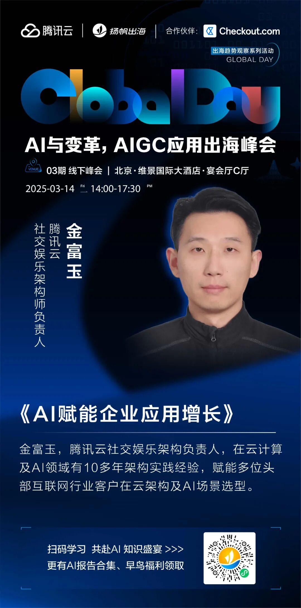
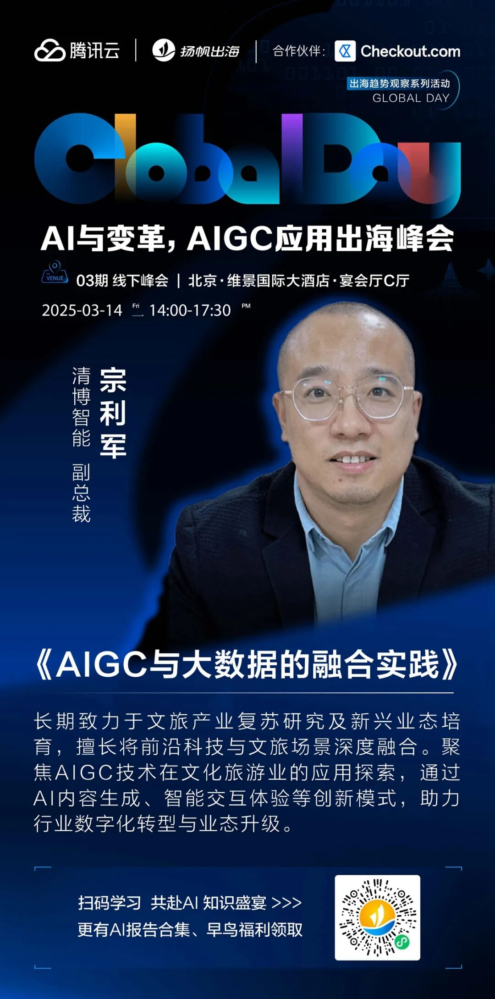
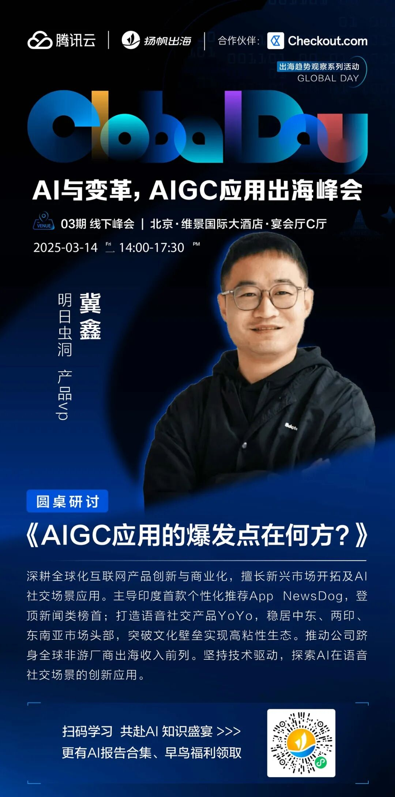
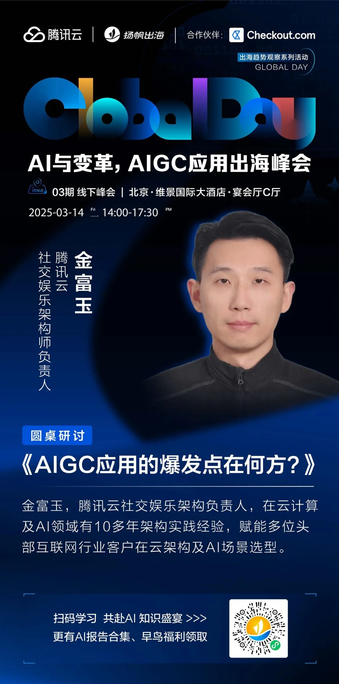
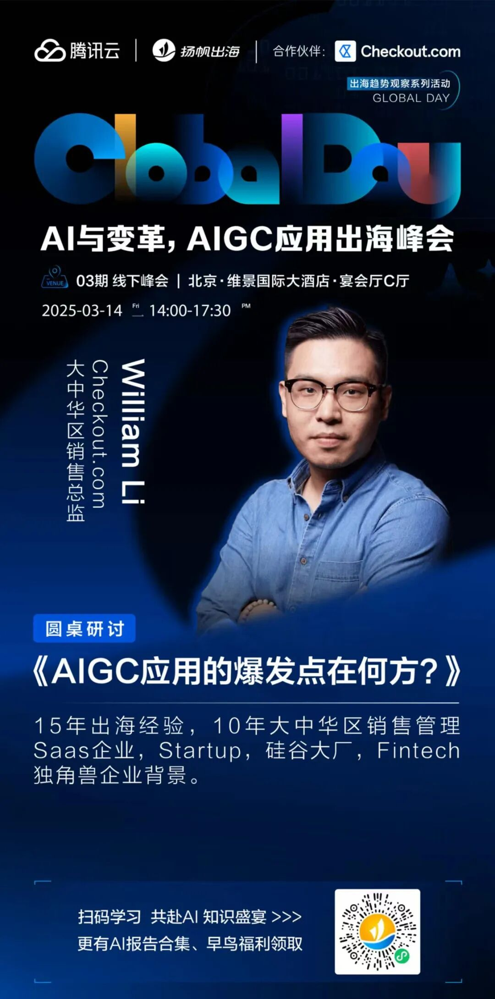

# Global Day03期 | 重磅嘉宾阵容曝光，AIGC应用出海峰会即将开幕！

> 公众号: 腾讯云出海服务
> 发布时间: 2025-03-06 16:24
> 原文链接: https://mp.weixin.qq.com/s/nIz863_X3de-2MbWa5WtaQ

---

当前，AIGC技术正以所未有的速度席卷全球，从文字创作到内容生成，AIGC正在深刻改变着创作和传播方式，广泛应用的巨大潜力，为各行各业带来了前所未有的机遇与挑战。
在这场全球热潮中，中国AI企业表现出了强劲的势头。特别是近期**D****eep****S****ee****k****凭借领先的技术实力和创新的商业模式，向世界展示了中国AI技术的强大力量**。然而，面对全球化的竞争格局，如何更好地寻找到PMF机会，如何将AIGC技术更好地应用于实际场景等问题，成为需要思考的重要课题。
基于此，由**腾讯云、扬帆出海联合主办，Checkout.com作为合作伙伴的Global Day系列活动03期《AI与变革，AIGC应用出海峰会》将于2025年3月14日在北京举办**。特别邀请了AI+应用、AI+短剧、AI+游戏、AI+数据等行业领袖深度交流，共同探讨当前中国AI企业的不同商业模式，分析全球化的AIGC应用机会，分享成功案例与经验，深度观察DeepSeek，致力于为AIGC应用的全球化发展提供思路和方向。

**点击小程序链接，立即报名：**#小程序://扬帆出海/NSVEr2SivJoqiXz

**PART 1****活动议程一览**

**PART****2****嘉宾阵容曝光**

**演讲嘉宾**

左右滑动查看更多

**圆桌嘉宾**

左右滑动查看更多

**PART****3****合作企业**

**联合主办**

**腾讯云：**腾讯集团倾力打造的云计算品牌，提供全球领先的云计算、大数据、人工智能等技术产品与服务。以卓越的科技能力打造丰富的行业解决方案，构建开放共赢的云端生态。400+ 款产品共筑腾讯云完善产品体系，基础设施已覆盖全球五大洲 21 个地区，运营 58 个可用区，3200+个全球加速节点。

**合作伙伴**

 **Checkout.com：**是一家成立于英国的全球领先信用卡收单行，致力于为出海商户提供高效、安全、及模块化的支付解决方案。作为支付收单专家，我们支持多种国际主流信用卡支付以及多个本地支付方式，实现超过150种货币的交易处理。同时，我们提供一站式跨境支付解决方案。
Checkout.com在全球有 19 个本地团队，深受如 Sony、SHEIN、阿里巴巴、小米、网易、Uber Eats、GE Healthcare、英国《金融时报》等国际品牌的信赖。我们在亚太地区设有上海、香港、新加坡和东京四个办公室，专注于深耕本地市场，为商户提供定制化支付服务。
We are Checkout.com, where the world checks out.**PART****4****报名渠道**AI 技术的飞速进步与市场需求的不断升级，正携手推动着一个智能融合、价值共创的新纪元。面对这样的历史机遇，每一位行业参与者都既是见证者，也是塑造者。无论是希望抢占市场先机的创新企业，还是对AI未来充满好奇的各界人士，都需要积极拥抱变化，深入沟通交流，共同探索AI创造的无限可能。
**2025年3月14日14：00—17:30，北京·维景国际大酒店宴会厅·C厅**，《AI与变革，AIGC应用出海峰会》诚邀您的莅临！
点击下方小程序，立即报名吧！

**-END-**

#

# ①[游族网络与腾讯云达成战略合作，共同推动游戏行业技术发展](http://mp.weixin.qq.com/s?__biz=Mzg5NjgyNDMyOQ==&mid=2247486965&idx=1&sn=259d9dc31bdb5557c84c438d5ed4303e&chksm=c07a6893f70de185b19befe5a8b6384c3734295d3a74ad458bda2fbae2dc19ed39f2d321c87c&scene=21#wechat_redirect)

#

# ②[亚思未来与腾讯云达成战略合作，共建东南亚AI直播电商平台](http://mp.weixin.qq.com/s?__biz=Mzg5NjgyNDMyOQ==&mid=2247486959&idx=1&sn=9c59c8343e957885e803881c40cae376&chksm=c07a6889f70de19fc95a008098f11710ca2b9eb9e86b7307bdf5adba67af636f8847ef6bfd32&scene=21#wechat_redirect)

#

# ③[XTransfer与腾讯云达成战略合作 助力外贸数字化转型](http://mp.weixin.qq.com/s?__biz=Mzg5NjgyNDMyOQ==&mid=2247486953&idx=1&sn=f51c4e85f210fde0ff413e0652ddefee&chksm=c07a688ff70de1994fc0b7fc915f8256347c16af547cd1ce8acca570d5acf0a3f4ae297353ca&scene=21#wechat_redirect)

****关注我，及时获取互联网出海相关的行业趋势、云解决方案、实践案例等最新资讯****
**扫码即可获得**
**2024年游戏云案例实践及解决方案手册**

