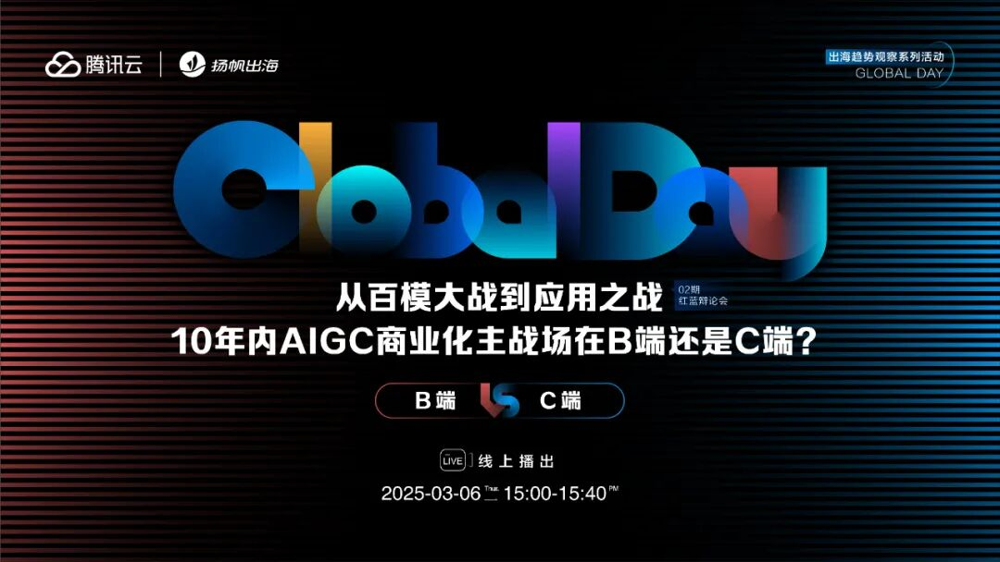
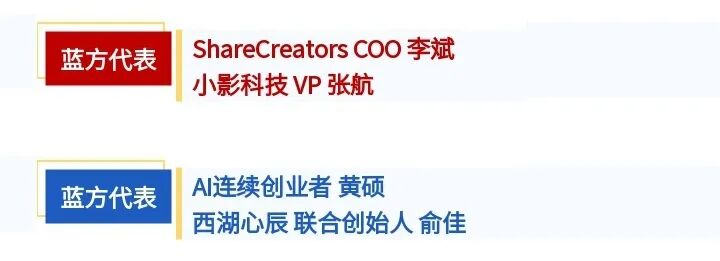
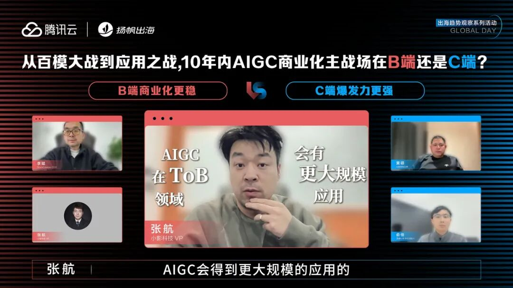
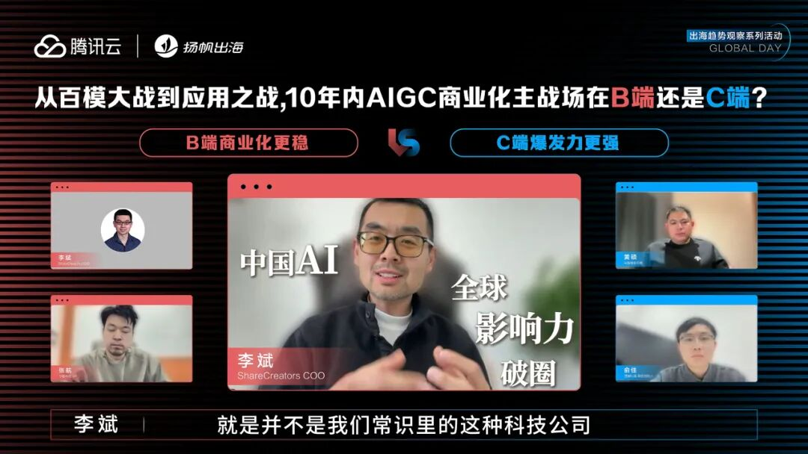
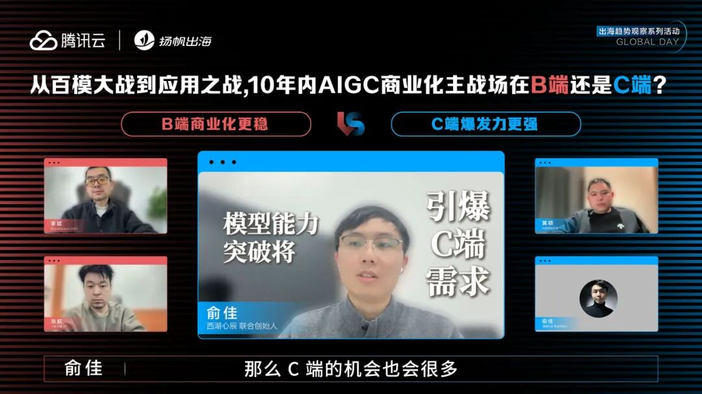
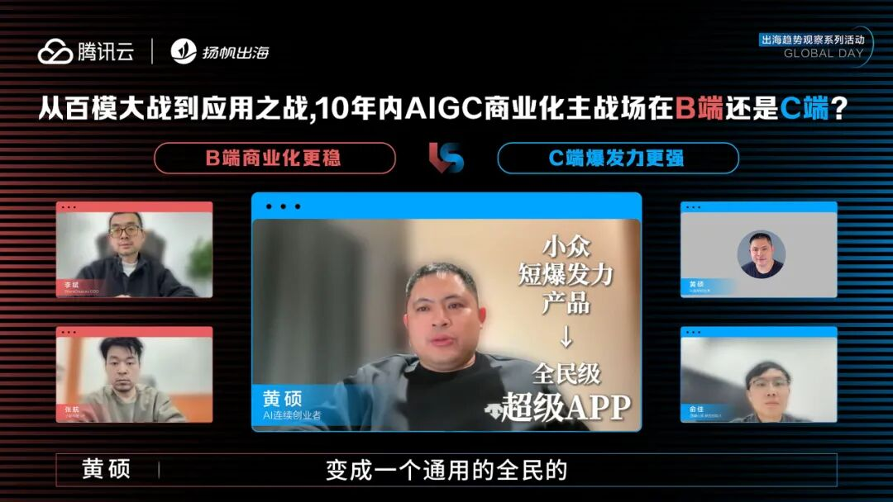
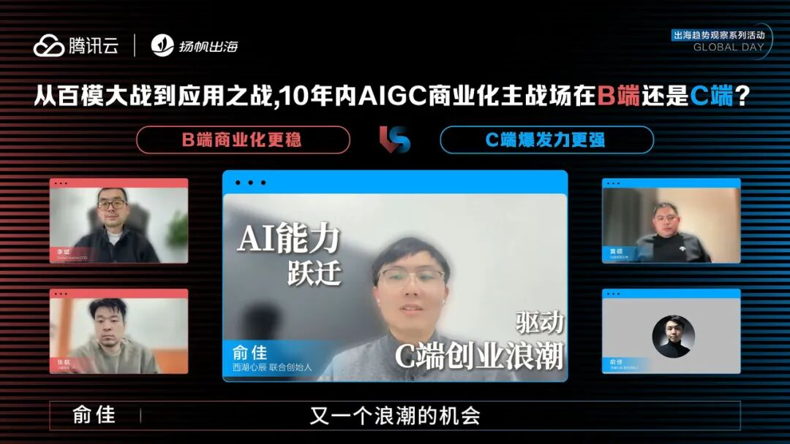
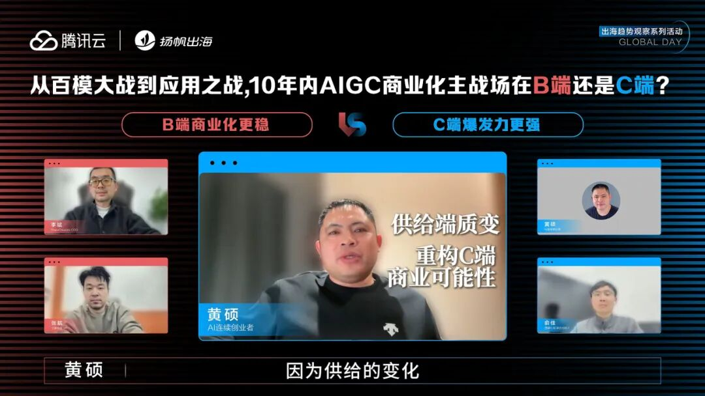
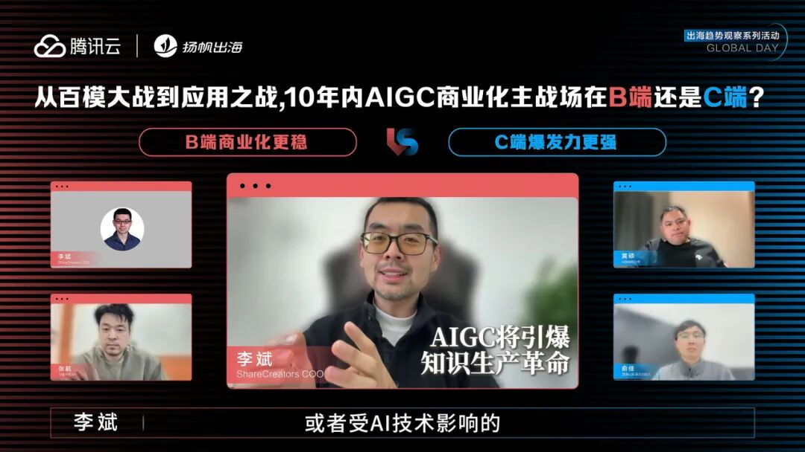
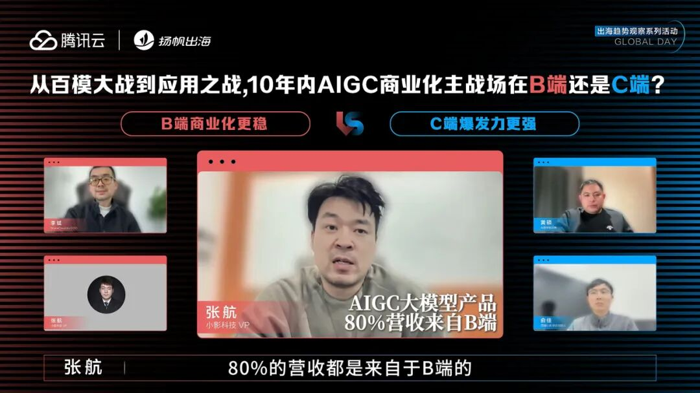

# AIGC商业化破局思辨：B端场景深耕VS C端超级APP革命

> 公众号: 腾讯云出海服务
> 发布时间: 2025-03-10 17:15
> 原文链接: https://mp.weixin.qq.com/s/YafGtGTeKFeePEYMLCSW_w

---

DeepSeek以日均百万级用户的增速突破技术奇点， AIGC从实验室跃入千家万户。技术的爆发正在撕裂商业化的边界，B端企业用AIGC重构降本增效的底层逻辑，C端用户则用AIGC掀起全民创作的浪潮。
未来的十年，究竟是**B端深耕场景化赋能的厚雪长坡****更具爆发力**，还是**C****端裂变方式需求****更能率先跑通商业闭环**？
带着这个问题，扬帆出海和腾讯云联合举办了第五届Global Day，现场特别邀请到了**ShareCreators****COO****李斌**，**小影科技 VP 张航**，**AI连续创业者 黄硕**，**西湖心辰 联合创始人 俞佳**共同探讨，在DeepSeek代表中国底层技术崛起的当下，未来 AIGC的商业化方向和思路。
本场辩论会，四位嘉宾分为红蓝双方进行讨论。

**Round1 观点论述**
**红方观点：AIGC在To B领域会有更大规模应用**
**张航：**企业作为经营主体，最清楚自身降本增效的痛点和需求场景。以短剧出海行业为例，头部平台面临白人剧产能不足的困境，国产剧填补内容空缺时需进行多语种翻译。**传统外包模式单部剧翻译耗时7-10天、成本高昂，通过自研AI翻译模型可将成本降低90%、效率提升数倍。**这类由企业真实需求催生的垂直场景，正是AIGC发挥价值的典型阵地。
当前AI技术在C端应用呈现"百APP竞逐一爆款"的低成功率现状，主要原因在于普通用户需求分散且难以标准化。**相比之下，B端场景聚焦专业领域，能够通过深度合作构建技术壁垒。**ToB企业既懂行业痛点又掌握核心数据，这种双重优势使其成为AI技术从理论到实践的最佳试验场。

**李斌：**B端用户多为专业人士，能清晰定义需求边界。例如医疗影像分析领域，医生可明确要求AI识别特定病灶特征，这种**精准需求反哺AI模型的定向优化，相较C端泛化需求更具发展优势。**
专业领域天然存在流程规范和质量标准，为AI应用提供可量化的改进方向。法律文书处理中，企业可制定合同条款的合规性评分体系，通过持续训练使AI输出符合行业规范，这种标准化进程能形成显著竞争壁垒。
B端业务场景常涉及封闭式行业数据（如制造业设备传感器数据），这类数据具有高专业性和强关联性特征。**通过与客户共建数据生态，企业能开发出定制化AI解决方案，这种数据资产积累形成的护城河，在C端碎片化数据环境中难以复制。**

**蓝方观点：模型能力产生质的飞跃，有望出现全民级超级APP**
**俞佳：**AI的智能水平接近甚至超越人类均值，彻底改变了应用开发的基础条件。随着模型参数规模突破、训练效率提升，通用型AI能力开始覆盖广泛需求，为规模化应用奠定基础。如今，大模型显著降低开发门槛：单人/小团队可通过Prompt工程快速构建功能型应用，边际开发成本趋近于零。**从"不可商业"变为可行，催生海量创新机会。**
尽管B端存在标准化难题、C端面临需求验证风险，但两类场景均面临根本性挑战：**需求匹配精度与商业可持续性。**大模型对C端的核心价值在于重构"需求-供给"关系——**通过智能生成突破传统互联网"满足已有需求"的局限，创造增量价值。**例如AI辅助设计工具可生成传统开发方式无法实现的交互形态，开辟全新需求空间。

**黄硕**：当前基于Transformer架构的大模型实现了从"场景适配"到"场景生成"的质变。2019年前GANs时代受限于局部特征学习能力，产品只能聚焦垂直领域（如图像修复）；而Transformer的涌现能力使得模型可自主理解复杂语义，支撑起通用型交互（如ChatGPT）。**这种代际差异直接导致应用生态从"工具集合"向"智能中枢"演变。**
建议创业者重点关注三类方向：**效率增强型（如AI辅助写作/会议纪要生成），交互革新型（如多模态对话系统），价值重构型（如AI驱动的内容生产革命）。**他以自身创业经历为例，强调当前应避免重复2019-2021年的垂直赛道竞争，转而探索大模型原生场景（如基于思维链的复杂任务处理）。
通用大模型提供底层能力，**优质产品积累用户数据，数据反哺模型迭代形成壁垒。**创业者需警惕"虚假繁荣"——部分企业仍试图用小模型+人工规则包装概念，这种模式在通用AI时代缺乏竞争力。**真正的机会在于构建"AI增强人类"的协同系统，而非单纯替代人力。**

**Round2 红蓝攻辩**
**红方提问：在AI新浪潮下，C端产品竞争激烈且成熟应用品类有限，如何塑造 C端产业竞争力？**

**蓝方回答：**
**俞佳：**能跑出来的C端应用要基于用户需求，挖掘过去因智能问题或成本无法解决的场景，利用如今开发成本降低、**可高频试错、小组化运作优势，尝试细分场景，收益常可观**；同时要结合AI特质，如类似character.AI的产品很AI native，随模型能力提升，此类值得挖掘的场景会更多。
**蓝方提问：AIGC时代B端业务如何解决行业差异大、需求碎片化致开发成本高的问题？**
**红方回答：**
**张航****：**分两点，行业差异大即行业标准不同，To B行业标准源于甲方需求，以短剧出海场景为例，有AI翻译等方向，需将人力工作标准转化为AI可完成的标准，虽AI翻译质量有差距，但成本低，面对客群不同，不是问题；**需求碎片化是To B企业必须面对的课题，挖掘与满足需求是基本要求**，在中国大环境下，满足不了客户需求就易流失客户，不过这两个具象问题对比C端更抽象的类似问题，对To B来说甚至有一定优势。
**红方提问：行业差异大和需求碎片化对 C 端较抽象，C 端 AI 产品商业化未来十年突破点在哪？**
**蓝方回答：**
**黄硕：**C端需求本质未变，变的是供给，商业化关键两点，一是获得收入，有需求且解决问题客户就愿付钱，难在竞争，**当下是效果为王时代，创业公司要了解场景与用户、做出差异化**；二是获得利润，目前大模型生产端成本贵，成本需降，如百万次TOKEN调用成本降到0.1美金量级，收支有望平衡。
**蓝方提问：从供给角度，是什么质的变化让这一代服务B端客户能力有进步？**
**李斌：**B端相比C端更能树立竞争壁垒，C端多解决通识性问答与通用需求，B 端更垂直专业，如ShareCreators面向数字资产管理领域，不同行业资产生产、管理、迭代、协同方式与效率、规模各异，产生不同应用产品，且在合规、审计等方面，**B端可利用AI解决具象问题，还能基于专业业务场景、企业知识与闭环商业逻辑塑造匹配的AI模型**，这是B端机会与优势。

**Round3 总结陈词****蓝方总结：**
**俞佳：**随着 AI 大模型的能力的不断提升，每一位创业者就会有更强的去解决需求的能力，所以**这是一个C端创业的又一个浪潮和机会**，希望大家都能乘上生成式AI的这艘大船。

**黄硕：**生成式AI未来大有机会，今天，C端的爆发力在于，其供给端能力产生了质的变化，此前，互联网和移动互联网时代，需求没变，供给变化，这和生成式AI爆发的今天有本质区别，如今，这个机会摆在我们面前，**让供给的变化产生了新的可能**，因此，这吸引更多人来探索，寻找新的可能，在这一轮大潮中，大家可以获得新的结果。

**红方总结：**
**李斌：**未来十年里，整个知识增长的体量，会超越人类历史上所有知识体量的总和，并且未来十年塑造的知识体量里，可能有一半是由AI生产，或受AI技术影响的，从这个角度来讲，未来对于整个产业而言，**更多的非专业人员会变成专业人员，所谓To B还是To C可能会慢慢模糊掉，创业者的梦想，一些好的idea会在生产好内容好产品的过程中慢慢实现**，未来的AI能够为大家提供更多的机会，这将是一个普通人创造奇迹的时代。

**张航：**B端市场有其核心优势，**一方面在于营收主导，另一方面在于刚需场景明确****。**目前，AIGC大模型产品80%的营收来自于B端，C端的尝试是基于B端企业客户完成大模型训练之后，再去反哺C端。此外，**数据和场景适配的壁垒之下，训练模型对数据依赖性强，同时需要应用场景的支持，而数据和场景都掌握在B端客户手中。**第三在于，B端有清晰的商业化模式，包括API调用以及订阅，硬件交付等，其客户的稳定性更高，因此B端将长期主导AIGC商业化。C端则需要等待技术成熟和用户习惯的变革，或许在五六年之后，C端会出现更多更好更成熟的多模态应用，到那时，B端企业的体量已然不是今天的规模，当然，无论To B还是To C，这两者都不是割裂的关系，**B端的技术积累去反哺C端的应用创新，可能是未来的趋势。**

AI技术发展到今天，无论B端在技术上优势，还是C端在创新上的特点，两个市场方向都驱动着更多更优秀的产品不断诞生，通过更丰富的技术手段来促进AIGC产品向着更成熟的方向发展，技术推动效率提升和创意出新，一个新的时代正在来临，让我们共同期待，在AI推动下，B端和C端诞生出更多新的创意和奇迹。

**精彩活动预告**

接下来，**腾讯云与扬帆出海联合主办，Checkout.com作为合作伙伴的Global Day系列活动03期《AI与变革，AIGC应用出海峰会》将于2025年3月14日在北京举办**。峰会特别邀请了AI+应用、AI+短剧、AI+游戏、AI+数据等行业领袖深度交流，共同探讨当前中国AI企业的不同商业模式，分析全球化的AIGC应用机会，分享成功案例与经验，深度观察DeepSeek，致力于为AIGC应用的全球化发展提供思路和方向。

**点击小程序链接，立即报名：**#小程序://扬帆出海/NSVEr2SivJoqiXz

**-END-**

#

# ①[游族网络与腾讯云达成战略合作，共同推动游戏行业技术发展](http://mp.weixin.qq.com/s?__biz=Mzg5NjgyNDMyOQ==&mid=2247486965&idx=1&sn=259d9dc31bdb5557c84c438d5ed4303e&chksm=c07a6893f70de185b19befe5a8b6384c3734295d3a74ad458bda2fbae2dc19ed39f2d321c87c&scene=21#wechat_redirect)

#

# ②[亚思未来与腾讯云达成战略合作，共建东南亚AI直播电商平台](http://mp.weixin.qq.com/s?__biz=Mzg5NjgyNDMyOQ==&mid=2247486959&idx=1&sn=9c59c8343e957885e803881c40cae376&chksm=c07a6889f70de19fc95a008098f11710ca2b9eb9e86b7307bdf5adba67af636f8847ef6bfd32&scene=21#wechat_redirect)

#

# ③[XTransfer与腾讯云达成战略合作 助力外贸数字化转型](http://mp.weixin.qq.com/s?__biz=Mzg5NjgyNDMyOQ==&mid=2247486953&idx=1&sn=f51c4e85f210fde0ff413e0652ddefee&chksm=c07a688ff70de1994fc0b7fc915f8256347c16af547cd1ce8acca570d5acf0a3f4ae297353ca&scene=21#wechat_redirect)

****关注我，及时获取互联网出海相关的行业趋势、云解决方案、实践案例等最新资讯****
**扫码即可获得**
**2024年游戏云案例实践及解决方案手册**

