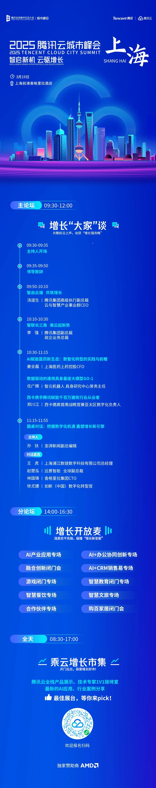

# 2025腾讯全球数字生态大会上海峰会倒计时：智启新机 云驱增长

> 公众号: 腾讯云出海服务
> 发布时间: 2025-03-17 17:04
> 原文链接: https://mp.weixin.qq.com/s/T8RbnCag0azwalODhjv0dw

---

AI大模型技术突破性进展及应用普及，正加速推动产业升级与企业数字化转型。腾讯始终坚持核心技术自研、拥抱开放生态的技术发展策略，通过领先的技术与解决方案，加速AI领域战略布局，助力各行各业实现数字化升级转型，提升生产力与竞争力。

从瑞金医院的医学大模型矩阵，到宝武钢铁的智能制造；

从华东理工大学的学术问答助手，到老凤祥的数字化增长；

从交通银行的远程银行服务，到蔚来汽车的自动驾驶研发运营；

腾讯云正在深入医疗、工业、教育、金融、出行等众多领域的产业发展进程，

以“数字化合伙人”的角色，助力增长，推动创新。

作为腾讯产业互联网重要窗口，2025腾讯全球数字生态大会城市峰会即将启幕。首站上海峰会于2025 年 3 月 19 日在上海举行。大会以“智启新机 云驱增长”为主题，将发布腾讯云产业科技最新进展，腾讯AI 大模型全景思考，并与各行各业数字化转型升级引领者，共探智能技术未来新机、云端驱动的创新增长路径。

**即刻关注会议信息：**

2025年3月19日 9:30-12:00

2025腾讯全球数字生态大会｜上海峰会

上海前滩香格里拉酒店

活动详情

⬇️⬇️⬇️

**-END-**

#

# ①[游族网络与腾讯云达成战略合作，共同推动游戏行业技术发展](http://mp.weixin.qq.com/s?__biz=Mzg5NjgyNDMyOQ==&mid=2247486965&idx=1&sn=259d9dc31bdb5557c84c438d5ed4303e&chksm=c07a6893f70de185b19befe5a8b6384c3734295d3a74ad458bda2fbae2dc19ed39f2d321c87c&scene=21#wechat_redirect)

#

# ②[亚思未来与腾讯云达成战略合作，共建东南亚AI直播电商平台](http://mp.weixin.qq.com/s?__biz=Mzg5NjgyNDMyOQ==&mid=2247486959&idx=1&sn=9c59c8343e957885e803881c40cae376&chksm=c07a6889f70de19fc95a008098f11710ca2b9eb9e86b7307bdf5adba67af636f8847ef6bfd32&scene=21#wechat_redirect)

#

# ③[XTransfer与腾讯云达成战略合作 助力外贸数字化转型](http://mp.weixin.qq.com/s?__biz=Mzg5NjgyNDMyOQ==&mid=2247486953&idx=1&sn=f51c4e85f210fde0ff413e0652ddefee&chksm=c07a688ff70de1994fc0b7fc915f8256347c16af547cd1ce8acca570d5acf0a3f4ae297353ca&scene=21#wechat_redirect)

****关注我，及时获取互联网出海相关的行业趋势、云解决方案、实践案例等最新资讯****
**扫码即可获得**
**2024年游戏云案例实践及解决方案手册**

