# 大咖云集，共话AI与变革：AIGC应用出海峰会精彩内容回顾！

> 公众号: 腾讯云出海服务
> 发布时间: 2025-03-20 12:00
> 原文链接: https://mp.weixin.qq.com/s/uGsOxA39wTrvtqbZTwlroQ

---

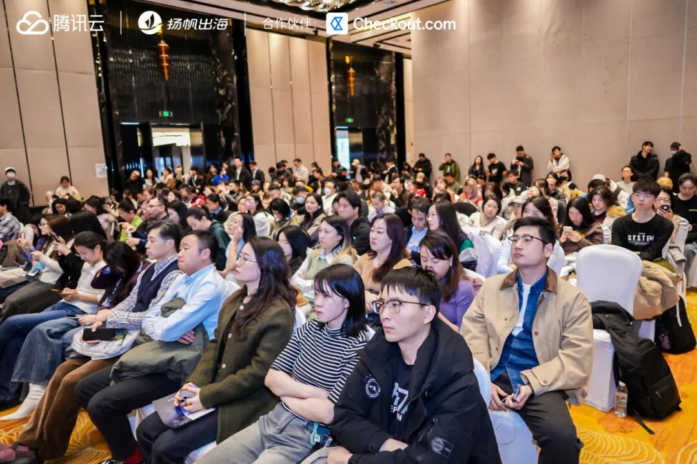

在数字化浪潮席卷全球的今天，人工智能（AI）作为推动社会变革的重要力量，正以前所未有的速度重塑各行各业，特别是近期，DeepSeek的推出，更在AI市场中掀起了一股新的浪潮。此种背景下，不止模型能力成为各大厂商关注的重点，如何更好地寻找到PMF机会，也成为各大AI企业的首要目标之一。
**3月14日，由扬帆出海携手腾讯云联合举办、Checkout.com作为合作伙伴的Global Day出海趋势观察系列活动03期·《AI与变革——AIGC应用出海峰会》于北京圆满落幕**，本次活动我们邀请到了**泥藕资本 投资副总裁 曹砚瑜、北京狐之空科技有限公司 CEO 申阳、中文在线集团 AI动漫部总经理 周立强、腾讯云 社交娱乐架构师负责人 金富玉、清博智能 副总裁 宗利军**作为**演讲嘉宾**，**明日虫洞 产品VP 冀鑫、XcreateAI 联合创始人 辛童**、腾讯云 社交娱乐架构师负责人 金富玉**、Checkout.com 大中华区销售总监 William Li**作为**圆桌嘉宾**，共同围绕AIGC的应用前景、AI技术能力发展、以及“AI+X”未来趋势等多个话题，展开了深度交流与精彩分享。

**峰会演讲**
**0****1****《从AI热潮到小团队公司——投资视角下的创业新机遇》**

**泥藕资本 投资副总裁****曹砚瑜**

在最近的几个月里，中国的AGI项目取得了举世瞩目的成就，如宇树科技、DeepSeek以及Manus等。这些项目的共同点在于它们挑战了传统投资的舒适区，选择了技术壁垒高、回报周期长的非常规路径。这种反常规逻辑提示我们，**在当前环境下，技术的理想主义和技术能力可能比早期的商业计划更值得关注**。比如OpenAI早期的例子，就证明了技术路径的长期价值。

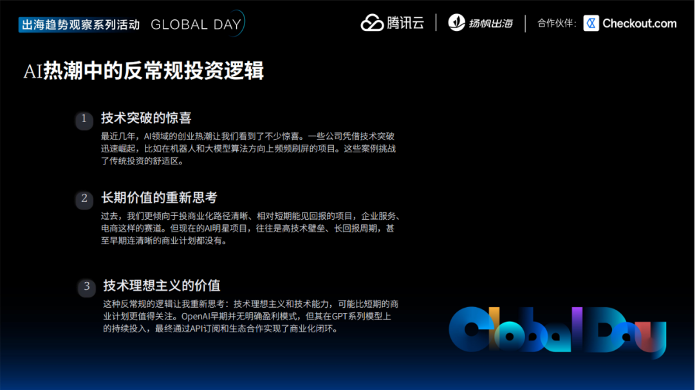

对于投资机构，尤其是中腰部的投资机构，这是一个机会。**AI赛道的机会不仅属于大基金，只要有足够的耐心，愿意为慢变量买单，寻找技术驱动可能重塑产业的项目，就有可能抓住下一个独角兽**。但这也带来了新的挑战，即如何判断一个项目的潜力。对此，首先要关注团队的技术基因，以及技术能解决什么样的真问题。这一逻辑正在重塑早期投资的游戏规则。

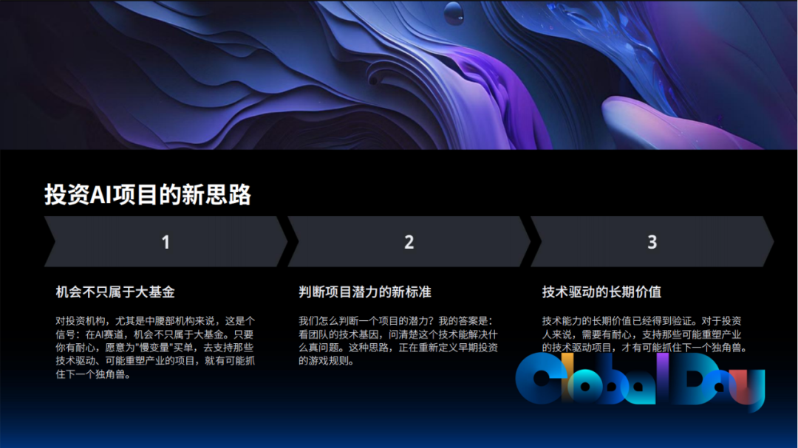

此外，小团队AI公司模式通常由一个人或极少的团队主导，通过AI工具和大模型，短时间内就能从创意到产品再到市场化。例如，Manus的发布公司Monica.im最初是一个3人的小团队，他们精准地抓住了用户对效率工具的需求，通过订阅模式迅速跑通了商业化。同时，Writesonic和Midjourney的案例也证明了轻量化创业的可行性。
小团队AI公司成功的背后逻辑包括：一是**关注创始团队的技术洞察力和工作方式**，他们必须既懂技术又能高效迭代产品；二是**资源合理利用**，把单点突破做到极致，聚焦核心、外包边缘；三是**关注商业化可行性**，除了基础的订阅外，还可以推出按量付费等需求，吸引中小开发者聚集。同时，通过用户生成的高质量内容反哺大模型，形成数据飞轮，优化项目。部分团队也尝试开源加商业版的模型，通过免费工具引流，向企业端用户推销定制化服务。

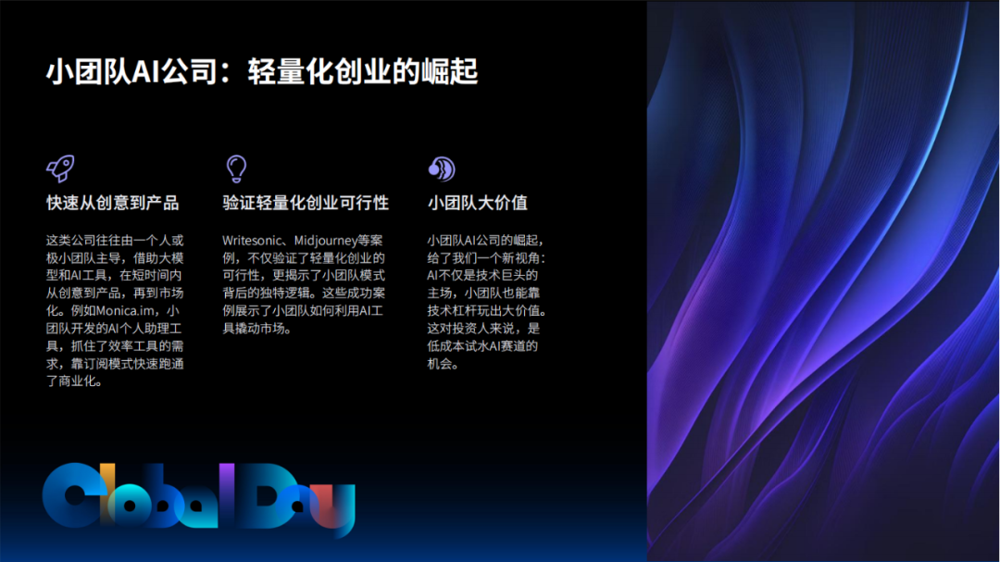

然而，小团队也面临诸多挑战，如**技术瓶颈、市场扩展等**。因此，**在判断项目时，不仅要考虑团队的技术基因，还要关注团队的反脆弱性，如是否具备应急资金和备选退出路径等**。
此外，AI创业的另一个方向是全球化的市场，数字内容的出海加AI的方式正在成为中国创业者以小博大的新战场。**小团队AI公司的成功经验可以迁移到内容出海上**。在融资方面，早期尤其是初创企业，现金流非常关键。可以用AI工具生成多语言内容，通过社交媒体或垂直平台做小规模流量测试，跑通后再进行融资，重点是不要盲目烧钱扩张。从发展的角度看，本地化和效率是成功的关键。可以通过AI工具做测试，但理解用户最终还得靠自己。可以借助垂直平台与用户交流，以获取快速迭代产品的路径。在商业化方面，可以灵活变现，步步为营。

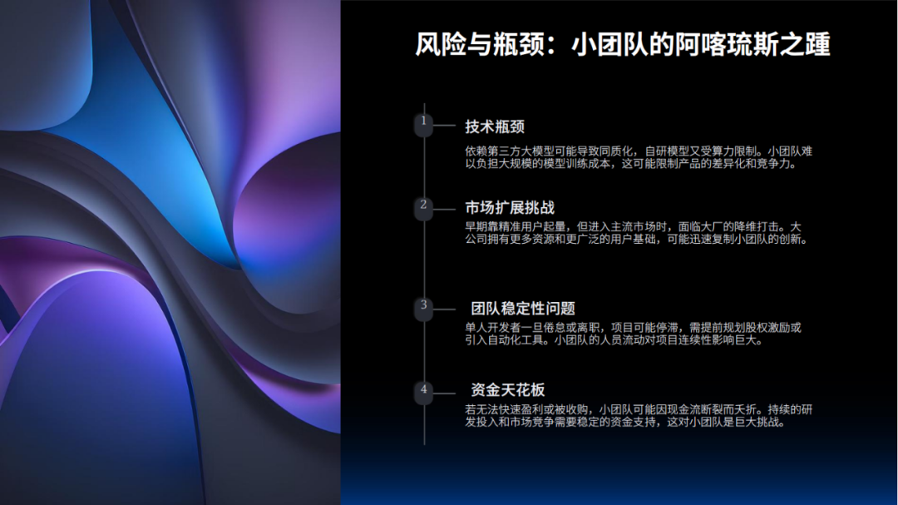

总的来说，从反常规的AI热潮，到以小博大的轻量化模式，再到技术驱动的全球化的趋势，小团队AI公司的崛起给了中国创业者和投资人一种新的视角。抓住这一机会的关键是相信技术的长期价值。
**0****2****《AI时代的情感陪伴和产品赋能》**
**北京狐之空科技有限公司 CEO****申阳**

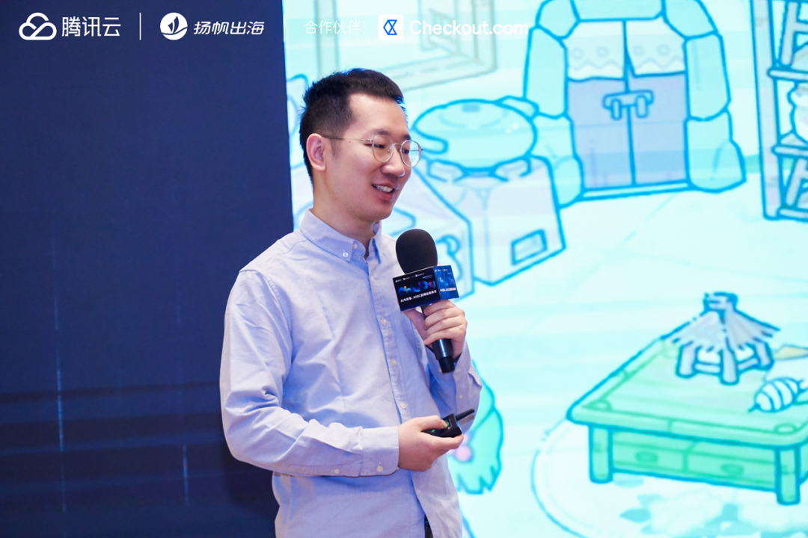

AI自ChatGPT问世以来，经历了井喷式的发展。然而，如何变现和落地仍是当前行业面临的主要挑战。在过去两年中，我亲自参与了多种AI产品的开发，包括AI导游、AI宠物、AI图片处理等，并积累了一些心得。
在正式探讨AI情感陪伴之前，我想分享一些我们在开发过程中踩过的坑。首先，**做AI产品前必须深入了解相关政策**。例如，我们曾尝试推出AI导游，但发现这在当地被视为伪需求，不仅旅游部门不支持，还遭到线下导游的反对。这使我意识到，**某些AI产品更适合与硬件结合，以更好地满足市场需求**。
此外，我们在开发AI占卜、算命类小游戏时，也遇到了政策上的限制，特别是涉及宗教、迷信的内容。这提醒我们，在产品开发过程中必须特别注意**政策合规性**。
接下来，我想重点谈谈AI情感陪伴。**AI因其高度的仿真性，在模仿真人心理和情感方面展现出巨大的应用潜力**。近期，国内涌现出许多基于DeepSeek的AI情感陪伴产品，这些产品不仅获得了大量投资，用户增长也非常迅速。
以筑梦岛APP为例，其下载量巨大，DAU已超过10万，且AI消耗的Token数也非常多。筑梦岛通过网文小说、二次元等内容生成角色，深受年轻人喜爱。在海外，我们也发现了一款类似的AI情感陪伴产品，其访问量巨大，并已形成社区化运营。用户可以自定义角色，甚至包括一些特殊群体，这显示了AI情感陪伴市场的巨大前景。

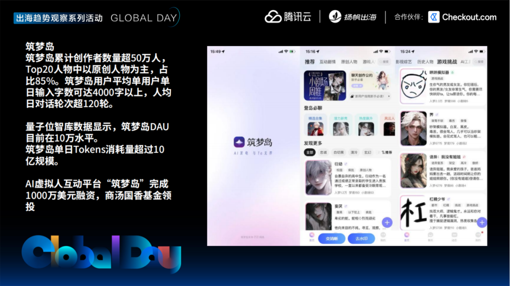

除了AI情感陪伴，我还关注了AI在成人用品、亲情陪伴和宠物陪伴方面的应用。例如，南方某公司利用DeepSeek为成人用品赋予“灵魂”，**通过记录用户与产品的聊天内容来培养性格，不付费则删除记录**，这一创新大大提升了产品的长期收益。
在亲情陪伴方面，数字人技术为失去亲人的家庭提供了**情感慰藉**。通过输入亲人的图像、性格、视频和语言习惯，数字人能够生成一个仿佛亲人还在身边的虚拟形象。这一应用已在国内有团队落地，并展现出巨大的市场潜力。

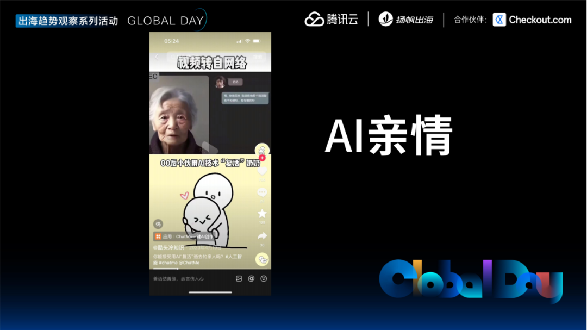

至于AI宠物陪伴，海外的一款名为Tamdog的产品累计流水已超过1000万美元，下载量也高达2000万。它允许用户将自己喜欢的宠物图片上传，生成一个数字宠物，并与用户进行互动。这种**高度仿真的AI宠物**不仅满足了人们的情感需求，还实现了长期的变现。

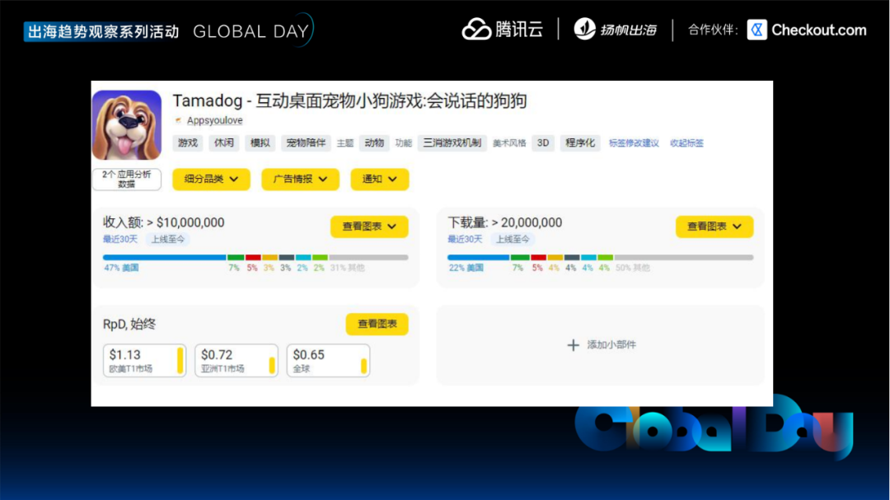

我认为，随着现代社会的高速发展，人与人之间的情感联系逐渐变得淡漠，但人们的情感需求却始终存在。AI正逐步渗透到我们生活的各个方面，情感陪伴市场也将因此迎来井喷式发展。未来，我们可能会看到更多类似于AI女友、AI男友、AI宠物、AI亲人、AI朋友的产品出现在我们的生活中，甚至与硬件结合，形成更加多样化的AI陪伴形式。
最后，尽管与机器人谈感情听起来有些不可思议，但它的出现有其合理性，希望大家能以进步的思想看待AI情感陪伴的发展。
**0****3****《AI赋能动漫短剧：文化出海的新引擎与商业化探索》**
**中文在线集团 AI动漫部总经理****周立强**

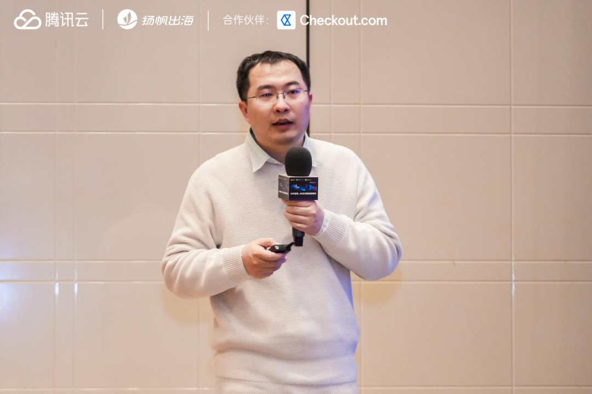

根据中国AIGC应用场景报告，**到2024年，AIGC应用的规模预计将达到200亿，而到2030年，这一数字规模将跃升至万亿级别**，年复合增长率之高，令人瞩目。这不仅揭示了AIGC领域的巨大潜力，也预示着我们正站在一个技术变革的风口浪尖上。
与此同时，英国的《金融时报》也针对动漫产业进行了深入分析。他们指出，**无论是动画电影还是传统动漫，都面临着劳动密集型产业的共同挑战。而AIGC，正是为这些产业带来革新与赋能的关键力量**。它能够通过智能化、自动化的手段，显著提升生产效率，降低成本，为动漫产业注入新的活力。

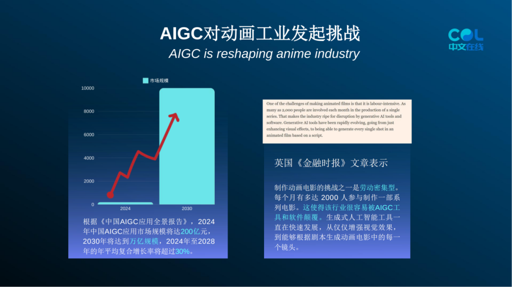

中文在线作为AIGC领域的先行者，一直在积极探索和实践。去年10月，我们成功发布了**全球首个万字创作大模型“中文逍遥”**。这款大模型利用AI技术释放内容生产力，为创作者提供了强有力的辅助。今年，我们更进一步，与DeepSeek展开了深度合作，共同研发并训练大模型，旨在进一步提升其创作能力，为用户带来更加丰富、多元的内容体验。
我们通过对比传统动漫与AI动漫的制作流程，可以看到**AI动漫在效率、成本和创意拓展方面具有显著优势**。传统动漫制作流程繁琐，高度依赖人工，而AI动漫则通过AI生成剧本、图片和视频，大幅缩短制作周期，降低成本，同时实现多元化的创意拓展，为动漫作品注入新的灵感和活力。

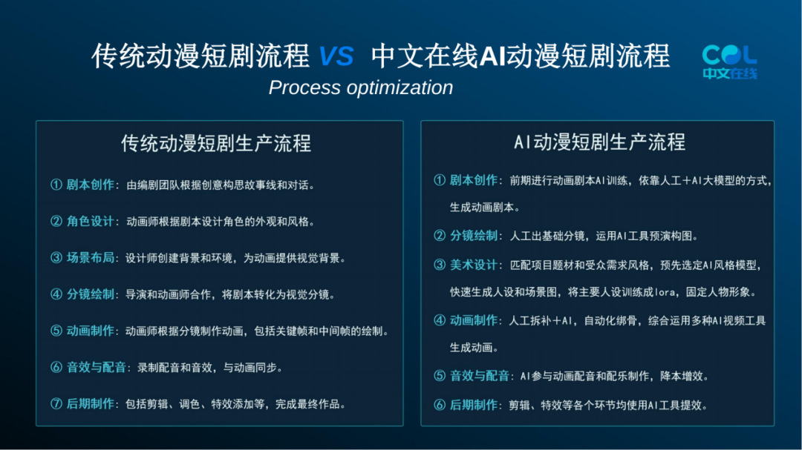

具体来说，AI动漫短剧在业务上的诸多优势包含以下几点。首先，它**具有跨国界传播的能力**。与真人短剧相比，动漫短剧在翻译和文化适配方面更加灵活，能够轻松跨越语言和文化的障碍，实现全球范围内的传播。其次，**AI动漫短剧实现了知识工业化量产**。我们自主研发了一套完整的AI工具链，从剧本阶段到分镜、图片再到视频制作，每一个环节都能够通过AI技术实现快速产出。这不仅提高了生产效率，还降低了制作成本。最后，**AI动漫短剧在成本控制方面表现出色**。在全链条的AI动漫模型工具加持下，我们可以将IP快速改编成动漫短剧，单部作品制作周期缩短70%，成本降低50%以下。

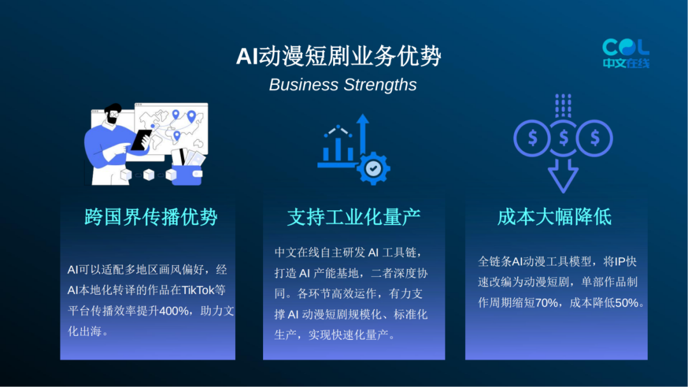

在出海方面，目前我们已经将AI动漫短剧推向了新加坡和北美市场，并计划未来进一步拓展至日韩、东南亚等地区。为了更好地适应海外市场，我们专门制作了一些符合当地审美偏好的动漫作品。例如，我们为北美市场定制了一部名为《愤怒的吸血鬼》的AI动漫短剧，该作品在画风和剧情上都更加贴近欧美观众的喜好。
在商业模式上，我们也进行了多元化的探索。除了与海外平台合作进行内容分发外，我们还注重**IP的全链条开发和运营**。通过将动漫IP改编为漫画、动画、真人影视等多种形式的内容产品，我们可以实现IP价值的最大化。同时，我们还积极拓展版权运营和变现渠道，与新型海外视频平台合作，覆盖更广泛的海外市场。

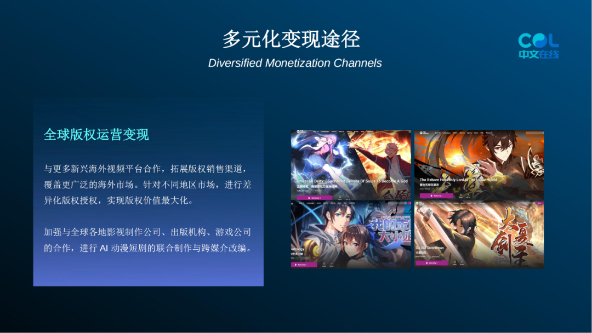

展望未来，我们认为AI在动漫短剧领域的应用前景将更加广阔。首先，**AI将能够在角色设计上实现更多样化和个性化的呈现**。通过AI技术，我们可以快速生成符合全球不同地区受众偏好的角色外貌和性格特征，为动漫作品增添更多魅力。其次，**AI动漫短剧将提供更加个性化的观看体验**。通过互动式叙事结构等技术手段，观众可以更加深入地参与到动漫故事中，享受更加沉浸式的观看体验。最后，我相信AI动漫短剧将**为中国文化内容出海带来新的机遇**。借助AI技术，我们可以更加高效地将中国优秀的动漫作品推向全球市场，提升中国文化的国际影响力。

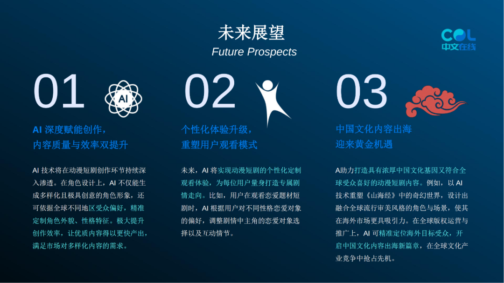

 **04****《AI赋能企业应用增长》**
**腾讯云 社交娱乐架构师负责人****金富玉**

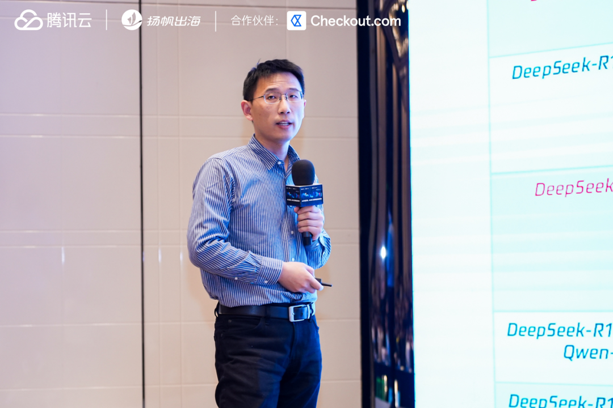

近年来，我们注意到在大模型层面，国内大模型厂商正积极与最新的DeepSeek模型进行整合。同时，多模态和视频模型的竞争也日益激烈，这些进展催生了更多AI ToC的应用出现，如Agent、AI角色扮演、AI搜索和AI工具等。
在算力层，**DeepSeek的兴起推动了国内算力市场的增长和算力需求的增加**。此外，除了DeepSeek，Manus 智能体也在AI领域崭露头角，特别是其在Agent应用层面逐渐受到关注，这些进展预示着AGI时代的到来越来越近。

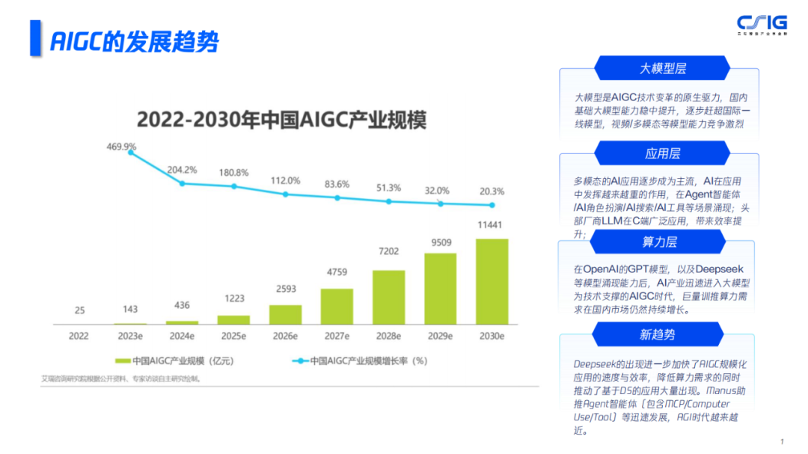

而随着AIGC的内容、客户、产品和方案不断涌现，这也促使我们加速创新，推出更多产品和合作模式以及针对性的产品和解决方案以满足客户需求。
为积极应对AIGC的快速发展，腾讯云从算力、模型、工具到应用层面，都推出了不同的产品和方案。比如针对DeepSeek这一热门模型，腾讯云就能够提供一套全面的整合方案。

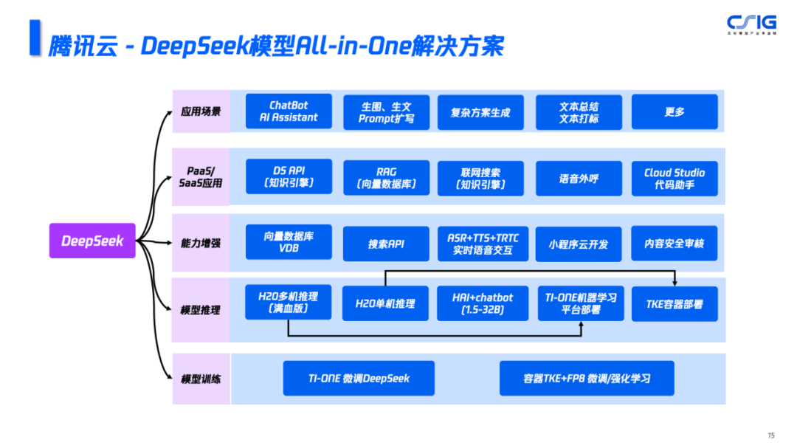

要知道，DeepSeek以其低算力需求、高效果得分和强大的推理能力等优势，在短时间内实现了用户量的快速增长，成为AI领域的焦点。然而，**DeepSeek也存在幻觉率较高、服务不稳定等问题，需要结合应用框架进行优化**。

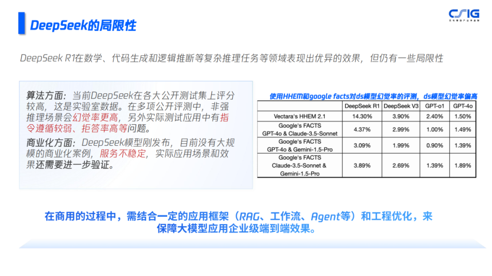

腾讯云针对DeepSeek的场景提供的多种解决方案包括**API模式、模型工程化、知识引擎PaaS应用**等。同时，还提供有**算力推理部署方案**，以满足不同模型和场景的需求。对于希望进行私有化部署的客户，腾讯云提供了**集成行业向量数据库、精调大模型**等多种方式。此外，腾讯云的机器学习平台为客户提供了**从数据准备、训练、调试到部署的一站式服务**。

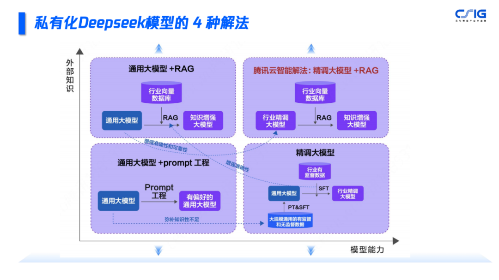

**在解决DeepSeek幻觉率问题方面，腾讯云提供了外挂企业知识库、联网搜索和模型蒸馏与精调等方案**。这些方案都有助于降低DeepSeek的幻觉率，提高回复的准确性和时效性。

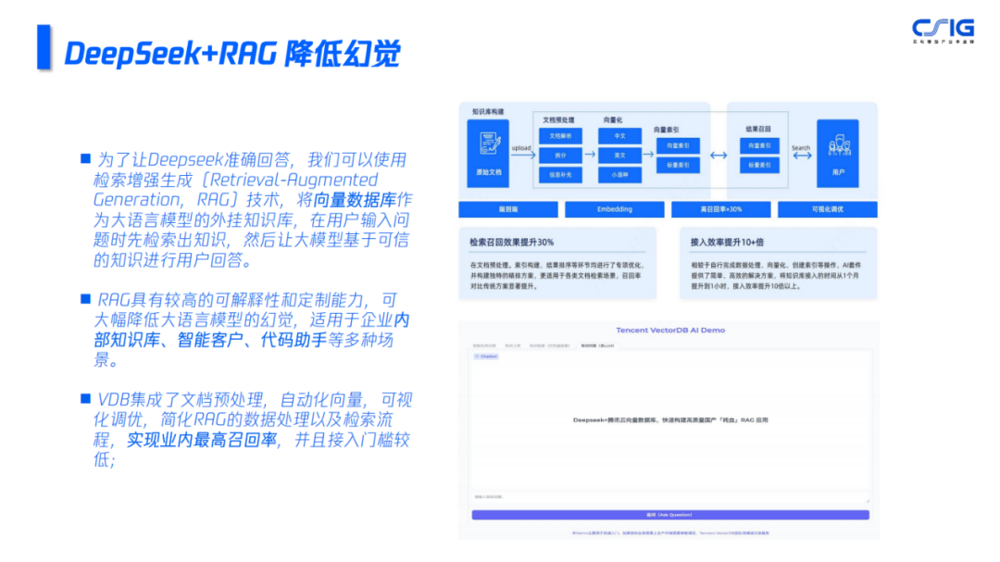

此外，腾讯云还在多个应用场景，如实时语音对话、AI角色扮演中提供对应的大模型解决方案。 同时，腾讯云也注重安全审核，确保训练数据的安全性和合规性。总之，AIGC领域正处于快速发展阶段，腾讯云将继续加大在该领域的投入和布局，为客户提供更加优质、高效的AI服务。
**05****《AIGC与大数据的融合实践》**
**清博智能 副总裁****宗利军**

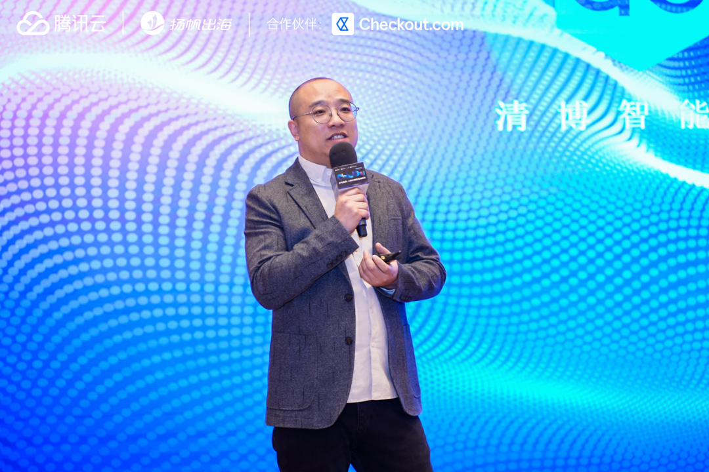

我们知道，**AI大模型的发展离不开算力、算法和数据这三大要素**。而DeepSeek之所以能够在算力有限的情况下赶超ChatGPT，正是因为它在算法和数据优化方面做出了卓越的贡献。
在大模型的应用领域，我们主要关注语言大模型、视觉大模型以及多模态大模型。DeepSeek作为语言大模型的代表，已经在多个领域展现出了强大的能力。而视觉大模型，如豆包、可灵等，则能够在文字生成图片和视频方面发挥巨大作用。
然而，大模型的应用也面临着一些挑战，特别是数据层面的问题。比如，**AI谣言的产生往往与底层数据的错误或缺失有关**。这也是我们在应用大模型时需要特别注意的问题。
清博智能成立于2014年，是国内领先的人工智能科技企业，专注于用前沿技术赋能品牌声誉管理。创新AI算法，挖掘数据价值，洞察舆情动态，全方位品牌声誉管理专家。
清博智能的主要客户群体包括央级企业、媒体、高校以及世界500强企业等。除了常规的舆情业务外，还涉足AIGC、机器人、虚拟人等多个领域。

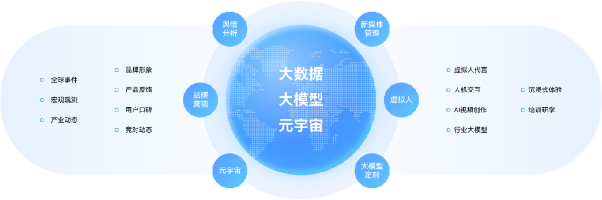

在AI+大数据的底层技术架构方面，清博智能拥有完善的体系。从底层的数据中心到应用层的功能实现，都能够提供全方位的支持。特别是在**融媒工具**方面，清博智能提供了一系列**智能多模态内容生成工具**，如AI图像和视频生成等。这些工具能够帮助客户快速生成高质量的内容，提高工作效率。

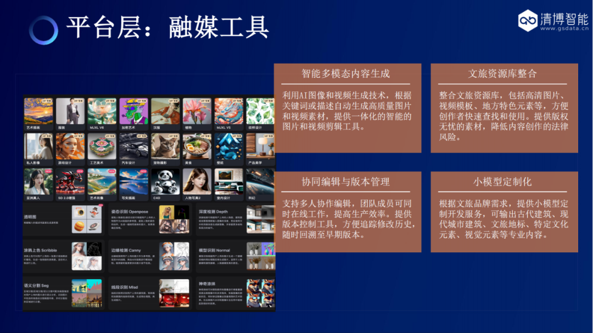

此外，清博智能还为出海企业提供了**舆情业务和综合合作榜单业务或定制化**等服务。通过全网及国外数据的分析，能够帮助客户洞察海外市场情况，制定更有效的营销策略。

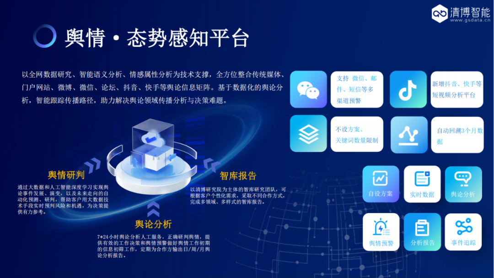

在AI生产内容服务方面，清博智能的智创工坊团队为多个媒体和企业单位提供了**创意视频和AI视频制作服务**。这些视频不仅质量高，而且生成速度快，大大节省了客户的时间和成本。
最后，我想强调的是，数据在AI发展中的重要性不容忽视。通过深入分析和利用数据，我们能够更好地发现市场需求和趋势，从而推动AI技术的创新和应用。同时，我们也需要关注数据的质量和准确性，以避免AI谣言等问题的产生。

**圆****桌研讨：****《AIGC应用****的爆发点在何方？》**

**图：出席嘉宾**嘉宾演讲环节后，我们邀请到**明日虫洞 产品VP 冀鑫、XcreateAI 联合创始人 辛童**、腾讯云 社交娱乐架构师负责人 金富玉**、Checkout.com 大中华区销售总监 William Li**作为**圆桌嘉宾**，扬帆出海 主编 霍亮作为主持人，共同研讨《AIGC应用的爆发点在何方？》。
**Q1：DeepSeek爆火后，大家看好的三个趋势方向有哪些变化？******腾讯云 社交娱乐架构师负责人 金富玉：****从云聚数走向全球的角度出发，Deepseek的出现显著降低了GPU算力消耗，催生了更活跃的AI应用生态。企业可以更加专注于AI应用的开发，提升业务价值。同时，****如何将Deepseek的AI能力集成到现有应用中，以吸引更多流量，也是企业思考的重点**。**此外，****数据隐私和隐私合规问题****在出海场景中越来越受到关注**。****明日虫洞 产品VP 冀鑫：**我认为**Deepseek的爆火给普通用户带来了深度思考模型的全新体验，同时也降低了开发者的成本**。看好的趋势方向包括：一是**语音相关AI技术服务的进步**，未来语音交互将更加自然流畅；二是**垂直场景类效益型应用的发展**，AI能够极大提升工作效率，但目前仍需优化；三是**社交类应用的创新**，Deepseek成本下降后，AI拟人化将做得更好，带来更丰富的交互体验。
**Checkout.com 大中华区销售总监 William Li：**我们看到AI在电商、游戏和社交等领域都有巨大的应用潜力。然而，**在出海过程中，除了关注技术创新外，还需要重视商业化模式的探索和合规性问题的解决**。特别是小团队在追求快速迭代的同时，也要考虑如何将产品变现，并确保资金的安全和合规性。
**XcreateAI 联合创始人 辛童：**从行业实践者的角度来看，Deepseek的爆火让所有公司都意识到必须追赶AI潮流。用户侧对AI产品的需求也在不断增加，从理性推理到感性陪伴都有需求。看好的趋势方向包括：一是**AI陪伴类产品的创新**，需要补足有效数据以提升交互温度；二是**效率和AI Agent的提升**，AI能够帮助处理大量信息，提高工作效率；三是**社交泛娱乐类应用的探索**，AI将融入更多产品形态中，提升用户体验。
**Q2：如何在用户增长和模型能力进步中找到可持续的经营模式？******腾讯云 社交娱乐架构师负责人 金富玉：****在提升AI模型能力方面，腾讯云有着丰富的技术创新。腾讯云自研的混元大模型在多个场景如内容生成、AI角色扮演、AI搜索等领域都展现出了强大的实力，并已经在腾讯自身业务中得到了广泛应用。此外，腾讯云还通过底层技术的优化，如星脉网络，来提升GPU的吞吐能力，为用户提供更高效的云计算服务。针对Deepseek等高要求场景，腾讯云也提供了多种方案来满足用户的延迟和并发需求。在AI+行业的赋能上，腾讯云通过提供****图像创作引擎、视频创作引擎****等原子能力，助力了短剧生成等行业的发展**。****明日虫洞 产品VP 冀鑫：**从开发者的角度来看，要在用户增长和模型能力进步中找到可持续性的经营模式，**首先需要明确核心需求**，并拆解出哪些步骤可以通过AI来解决。**在初期，可以借助各大厂商的现成能力，通过调API等方式快速实现需求，达到一定的产品体验。随着产品的迭代和流水的增加，再逐步考虑成本控制和模型优化**。建议开发者们不要盲目追求最新的技术，而是要选择适合自己场景和成本的方式，逐步迭代产品，以达到最佳的用户体验和成本控制。
**Checkout.com 大中华区销售总监 William Li：**从支付的角度来看，**AI技术在支付领域的应用主要体现在风控和身份验证上**。Checkout.com通过自研技术，实现了对支付流程的高效风控和身份验证，提升了用户体验和支付安全性。此外，**支付领域的核心不仅是费率和支付方式，更重要的是风控能力**。未来，随着AI技术的不断发展，风控模型将更加智能化和自动化，进一步提升支付效率和安全性。
**XcreateAI 联合创始人 辛童：**在AI技术驱动的市场环境下，我们观察到AI在**提升营销效率**方面展现出了巨大潜力。通过AI技术，如自动脚本生成和创作者匹配，可以显著缩短品牌与网红之间的合作周期，同时保证内容质量，这对于出海营销尤为重要。在商业化策略上，我们发现**合理的订阅定价在美国等市场并不构成用户障碍，关键在于产品能否提供真正的价值**。因此，出海开发者在定价时应更加自信，同时关注用户反馈以持续优化产品。
此外，选择合适的增长渠道对于出海成功至关重要。**不同市场、不同阶段需要不同的策略，如SEO等长期效益的策略需提前规划**。同时，产品与运营的紧密协作也是关键，**从产品立项之初就应融入增长思维**，确保每个功能点都能为增长贡献力量。综合而言，AI技术在营销领域的应用为出海开发者提供了新机遇，但关键在于如何结合市场需求、合理定价、精准渠道选择以及产品与运营的协同，以实现可持续的增长。
**Q3：AIGC出海目前有哪些风险需要重点关注，以及对应的建议？******腾讯云 社交娱乐架构师负责人 金富玉：****随着企业出海步伐的加快，****跨境数据流动成为不可回避的问题**，**而各国复杂多变的合规要求更是为企业带来了严峻挑战。腾讯云凭借多年经验，与IBM携手发布了出海白皮书，为企业提供了详尽的数据流动与数据安全合规指导。在技术层面，腾讯云通过****COS加密、TLS协议加密****等手段，有效保障了数据流动的安全与高效。同时，针对海外内容安全审核的特殊性，腾讯云还定制化训练了****内容审核模型****，确保企业内容符合当地法律法规。此外，腾讯云还推出了****业务风控引擎与数据安全治理产品****，为企业提供了全方位的风险防控与可视化安全界面，助力企业在出海道路上稳健前行。**明日虫洞 产品VP 冀鑫：**数据隐私保护、内容审核等问题并非AI技术本身所带来，而是企业在出海过程中必须面对的现实挑战。随着国际形势的变化与各国政策的不断完善，出海企业对于合规性的要求日益严格。因此，**建议开发者在出海之初就应高度重视合规问题**，避免因违规而遭受下架等严重后果。当然，腾讯云等云服务提供商也能提供很多支持和帮助，比如**数据合规指导、内容审核模型**等，这些都可以帮助开发者更好地应对出海风险。总之，**合规性是AIGC出海企业必须坚守的底线**。
**Checkout.com 大中华区销售总监 William Li：**AIGC出海企业在规避成人内容、掌握用户信息及订阅模式商业化等方面面临诸多挑战。**建议企业采用技术与自定义规则相结合的方式，有效规避成人内容等风险**。同时，掌握用户信息也非常重要，建议企业**将订阅用户信息与支付信息分开管理，以降低合规风险**。在商业化模式上，企业可以**根据目标市场的消费习惯合理定价，并通过免费试用等方式培养用户黏性**。
**XcreateAI 联合创始人 辛童：**首先，要**明确自己的目标市场和用户群体**，了解他们的需求和偏好，以便为他们提供更有针对性的产品和服务。其次，要**注重内容创新和差异化营销**，避免陷入同质化竞争。在内容创作上，可以结合AI技术和人工编辑的优势，创作出更具吸引力和传播力的内容。在营销方面，可以**寻找与产品特质相符的创作者合作**，通过他们的影响力来扩大产品的曝光度和知名度。当然，隐私保护也是不能忽视的问题，要遵循相关法律法规和行业标准，确保用户数据的安全性和隐私性。
**峰会直播回放**

**-END-**

#

# ①[游族网络与腾讯云达成战略合作，共同推动游戏行业技术发展](http://mp.weixin.qq.com/s?__biz=Mzg5NjgyNDMyOQ==&mid=2247486965&idx=1&sn=259d9dc31bdb5557c84c438d5ed4303e&chksm=c07a6893f70de185b19befe5a8b6384c3734295d3a74ad458bda2fbae2dc19ed39f2d321c87c&scene=21#wechat_redirect)

#

# ②[亚思未来与腾讯云达成战略合作，共建东南亚AI直播电商平台](http://mp.weixin.qq.com/s?__biz=Mzg5NjgyNDMyOQ==&mid=2247486959&idx=1&sn=9c59c8343e957885e803881c40cae376&chksm=c07a6889f70de19fc95a008098f11710ca2b9eb9e86b7307bdf5adba67af636f8847ef6bfd32&scene=21#wechat_redirect)

#

# ③[XTransfer与腾讯云达成战略合作 助力外贸数字化转型](http://mp.weixin.qq.com/s?__biz=Mzg5NjgyNDMyOQ==&mid=2247486953&idx=1&sn=f51c4e85f210fde0ff413e0652ddefee&chksm=c07a688ff70de1994fc0b7fc915f8256347c16af547cd1ce8acca570d5acf0a3f4ae297353ca&scene=21#wechat_redirect)

****关注我，及时获取互联网出海相关的行业趋势、云解决方案、实践案例等最新资讯****
**扫码即可获得**
**2024年游戏云案例实践及解决方案手册**

