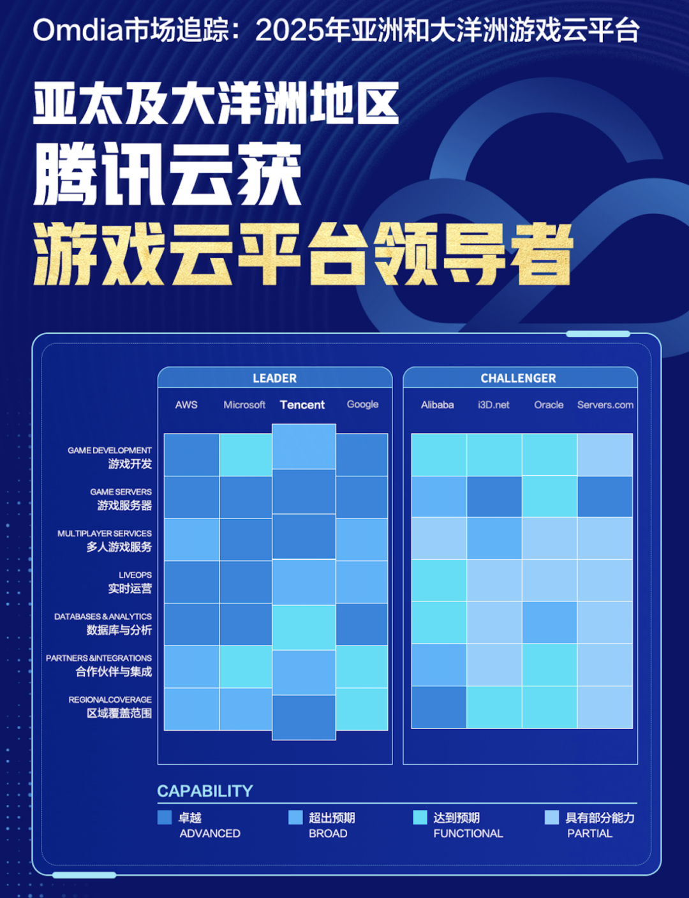
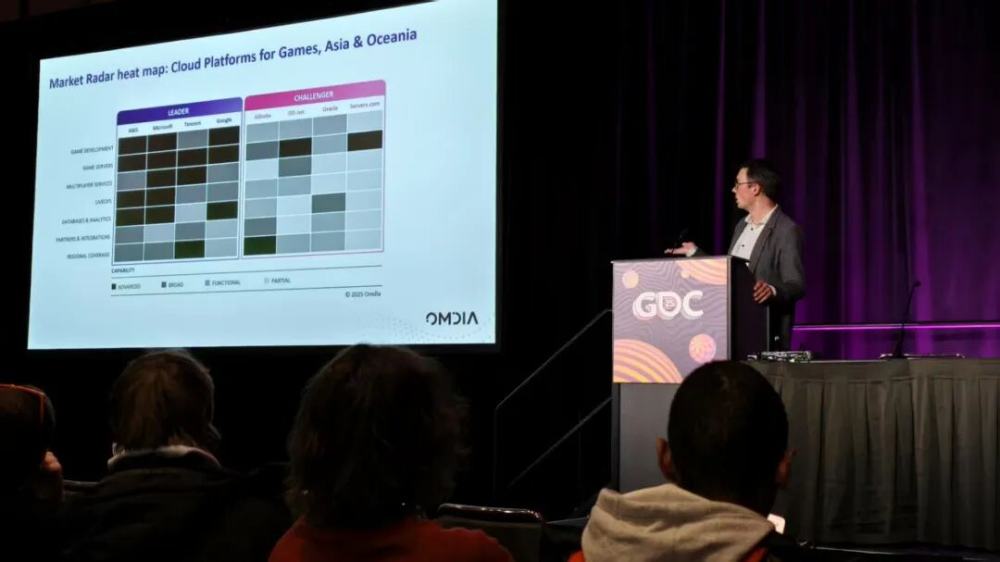
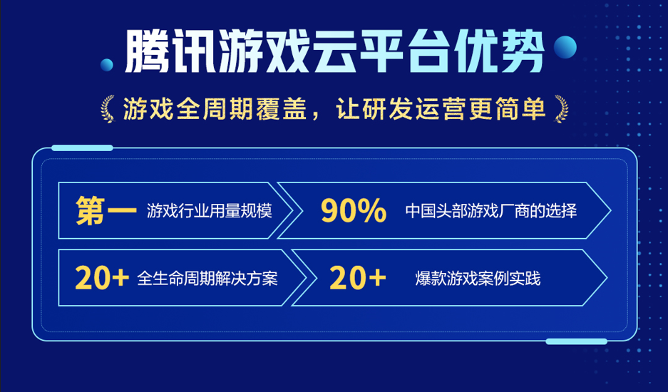

# 腾讯游戏云：进入全球「领导者象限」

> 公众号: 腾讯云出海服务
> 发布时间: 2025-03-26 16:30
> 原文链接: https://mp.weixin.qq.com/s/IB9kxJ6d8DpF6Tl7_IzuSg

---

汇报一个好消息：

GDC（全球游戏开发者大会）2025展会期间，腾讯云被国际权威机构Omdia评为亚太及大洋洲地区「游戏云平台领导者」，和 AWS、Microsoft、Google一起，进入「Leader」象限。

翻译一下——腾讯云跻身**「全球游戏云头部厂商」**。

这份肯定出自《Omdia市场追踪：2025亚太及大洋洲游戏云平台》的报告，报告从游戏开发、游戏服务器、多玩家服务、实时运营（LiveOps）、数据库与分析、合作伙伴与集成、区域覆盖范围七大维度，评估云平台的硬实力。

腾讯云拿到了三项最高等级「Advanced」——**游戏服务器、多玩家服务、区域覆盖范围**，游戏开发、实施运营、合作伙伴与集成等维度也表现不错。

Omdia说，「腾讯云的核心优势，是对中国及全球游戏市场的深刻理解」。口说无凭，来看看Omdia点名表扬的三项能力，是如何「深刻」理解游戏市场的？

**01｜游戏服务器：弹性强、够稳定、调度快**

做游戏的都知道，上线的那一刻，用户暴增，最怕的就是服务器顶不住。

腾讯云游戏服务器具备弹性强、扩容快、稳定抗压三大能力——全球化容器部署体系+智能资源调度+高等级DDoS防护，帮助游戏开发商稳稳地把「关键时刻」变成「高光时刻」。

库洛游戏《鸣潮》上线期间，腾讯云支撑其在全球六大区域实现分钟级服务器部署，快速应对多区域开服需求；面对高达3200万的预约用户，系统通过弹性扩缩容与智能流量调度，成功保障游戏平稳上线。

**02｜多玩家服务：组队快、对战稳、防外挂**

语音断了、对战掉了……「多玩家」在线时，这些事儿真的很影响体验。

腾讯云提供一整套「多玩家服务体系」，包括语音引擎 GME、内容安全审核和反外挂系统 ACE，既要让玩家「玩得起来」，更要保证「玩得公平」。

沉浸式叙事手游《重返未来：1999》首发当天迎来大量玩家涌入，腾讯云通过EdgeOne提供加速服务，保障实时语音、战斗指令同步不卡顿；搭配 ACE 游戏安全方案，有效防御了外挂与脚本攻击，助力产品冲上iOS免费榜首位。

**03｜区域覆盖能力：全球可达，亚太更强**

游戏出海，最大的问题往往不是玩法，而是玩家进不去、老掉线。

腾讯云已在全球部署58个可用区、3200+加速节点，尤其在亚太和大洋洲地区，覆盖密，响应快。结合边缘计算架构EdgeOne，能为全球同步上线、跨国联机、高并发战斗等场景，提供稳定、快速、抗压的网络支撑。

在《Honor of Kings》进军巴西市场过程中，腾讯云通过EdgeOne构建本地加速网络，有效应对网络复杂、时延不稳等挑战；玩家在登录、支付、社交互动等关键场景中，获得稳定流畅体验，收获大量巴西用户好评，为后续全球发行打下基础。

GDC现场，腾讯云还秀出旗下多项技术产品能力，如音视频服务、边缘加速平台 EdgeOne、数据库服务和 Game Hosting（IaaS）等。同时，腾讯还展示全新升级的游戏AI引擎GiiNEX的最新进展，通过生成式人工智能技术的引入，GiiNEX在游戏宣发、游戏内容生成、用户内容生成（UGC）多个环节带来了全新的体验。

入选 Leader，是一次阶段性的肯定，但远不是终点。

接下来，我们会继续把底子打得更稳，服务做得更好，成为更多游戏伙伴们值得依靠的「搭子」。

感谢认可，同时也很期待，被更多的伙伴真正「看见」。

https://yuanbao.tencent.com/download

**-END-**

#

# ①[游族网络与腾讯云达成战略合作，共同推动游戏行业技术发展](http://mp.weixin.qq.com/s?__biz=Mzg5NjgyNDMyOQ==&mid=2247486965&idx=1&sn=259d9dc31bdb5557c84c438d5ed4303e&chksm=c07a6893f70de185b19befe5a8b6384c3734295d3a74ad458bda2fbae2dc19ed39f2d321c87c&scene=21#wechat_redirect)

#

# ②[亚思未来与腾讯云达成战略合作，共建东南亚AI直播电商平台](http://mp.weixin.qq.com/s?__biz=Mzg5NjgyNDMyOQ==&mid=2247486959&idx=1&sn=9c59c8343e957885e803881c40cae376&chksm=c07a6889f70de19fc95a008098f11710ca2b9eb9e86b7307bdf5adba67af636f8847ef6bfd32&scene=21#wechat_redirect)

#

# ③[XTransfer与腾讯云达成战略合作 助力外贸数字化转型](http://mp.weixin.qq.com/s?__biz=Mzg5NjgyNDMyOQ==&mid=2247486953&idx=1&sn=f51c4e85f210fde0ff413e0652ddefee&chksm=c07a688ff70de1994fc0b7fc915f8256347c16af547cd1ce8acca570d5acf0a3f4ae297353ca&scene=21#wechat_redirect)

****关注我，及时获取互联网出海相关的行业趋势、云解决方案、实践案例等最新资讯****
**扫码即可获得**
**2024年游戏云案例实践及解决方案手册**
