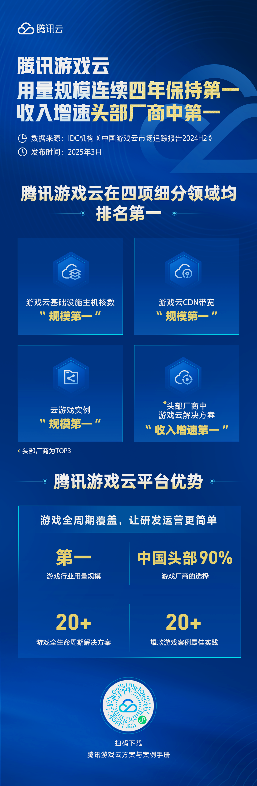

# 腾讯游戏云：用量规模+收入增速，双料第一！

> 公众号: 腾讯云出海服务
> 发布时间: 2025-04-11 16:49
> 原文链接: https://mp.weixin.qq.com/s/cVnHn5fuXlo7DrApClZ5pg

---

汇报一下：我们四连冠了——

刚刚，国际权威机构IDC发布《中国游戏云市场跟踪研究，2024H2》报告。报告显示，腾讯游戏云：

**用量规模，连续四年全国第一；收入增速，在国内头部云厂商中连续两年全国第一。**

四个细分维度的评估中，腾讯游戏云全部位居首位。包括：

● 游戏云基础设施规模第一；

（\*公有云/专有云基础设施用量第一）

● 云游戏接入覆盖规模第一；

（\*云游戏解决方案用量第一）

● 资源下载分发规模第一；

（\*CDN用量第一）

● 头部厂商中，游戏云解决方案收入增速第一。

这份认可，源自腾讯对技术能力的长期投入：

从游戏研发到全球运营，腾讯游戏云已覆盖游戏全生命周期的关键环节，在高并发应对、全球多区部署、版本快速迭代、安全防护等方面，提供稳定可靠的服务支撑。

尤其是在中国游戏加速「走出去」的背景下，腾讯云的全球部署能力、本地加速方案和安全防护体系，正成为越来越多国产游戏出海的「底气」。

《鸣潮》《重返未来：1999》《Honor of Kings》等游戏在全球首发和区域拓展中，均由腾讯云提供技术支持。目前，包括三七互娱、心动网络、乐元素、库洛游戏、冰川网络等知名游戏厂商在内，腾讯云是中国游戏厂商的第一选择。

感谢认可。我们期待和行业一起，走得更远，走得更稳。

**-END-**

#

# ①[游族网络与腾讯云达成战略合作，共同推动游戏行业技术发展](http://mp.weixin.qq.com/s?__biz=Mzg5NjgyNDMyOQ==&mid=2247486965&idx=1&sn=259d9dc31bdb5557c84c438d5ed4303e&chksm=c07a6893f70de185b19befe5a8b6384c3734295d3a74ad458bda2fbae2dc19ed39f2d321c87c&scene=21#wechat_redirect)

#

# ②[亚思未来与腾讯云达成战略合作，共建东南亚AI直播电商平台](http://mp.weixin.qq.com/s?__biz=Mzg5NjgyNDMyOQ==&mid=2247486959&idx=1&sn=9c59c8343e957885e803881c40cae376&chksm=c07a6889f70de19fc95a008098f11710ca2b9eb9e86b7307bdf5adba67af636f8847ef6bfd32&scene=21#wechat_redirect)

#

# ③[XTransfer与腾讯云达成战略合作 助力外贸数字化转型](http://mp.weixin.qq.com/s?__biz=Mzg5NjgyNDMyOQ==&mid=2247486953&idx=1&sn=f51c4e85f210fde0ff413e0652ddefee&chksm=c07a688ff70de1994fc0b7fc915f8256347c16af547cd1ce8acca570d5acf0a3f4ae297353ca&scene=21#wechat_redirect)

****关注我，及时获取互联网出海相关的行业趋势、云解决方案、实践案例等最新资讯****
**扫码即可获得**
**2024年游戏云案例实践及解决方案手册**
