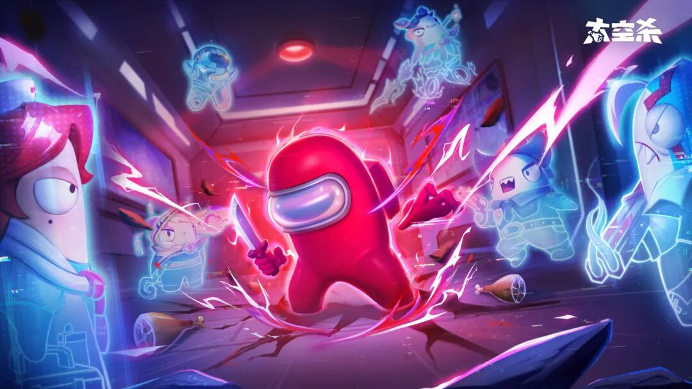
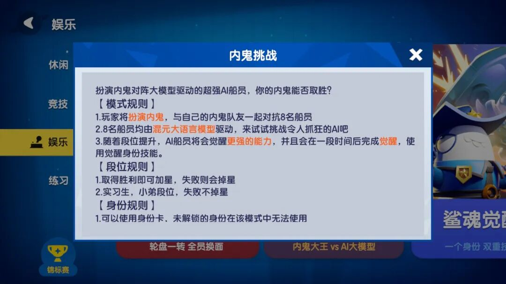

# 腾讯云X巨人网络：来《太空杀》当「内鬼」，智斗700万AI

> 公众号: 腾讯云出海服务
> 发布时间: 2025-04-28 14:44
> 原文链接: https://mp.weixin.qq.com/s/8p3Em-3ow8C_U9YWGeOflg

---

游戏里被AI「票出局」，是种什么样的体验？

近日，巨人网络旗下社交推理游戏《太空杀》接入腾讯混元Turbo S大模型。2亿注册玩家，在线与超700万AI角色同台竞技——

AI玩家首次以拟人推理和社交博弈能力登场，让智能NPC真正融入游戏，也让社交推理游戏有了全新的打开方式。

传统推理游戏中，NPC更多像是预设动作的演员，只能按剧本行动。接入腾讯混元Turbo S后，《太空杀》的AI玩家仿佛拥有了「自由意志」，在每一局游戏中展现出独立思考、自主博弈能力——● 推理直觉：像经验丰富的老玩家一样，能够从对话细节中抽丝剥茧、识破破绽；● 动态博弈：根据局势变化临场伪装、结盟、指控，形成真正的复杂互动；

● 自然对话：对话流畅自然，不再是机械应答，而是真实的交流与推理；

● 策略演变：不仅反应敏捷，还能在不同局势下调整策略，打破套路化行为。

仅上线一个月，Turbo S驱动下的AI玩家已累计参与近90万场对局，生成超700万个独立逻辑链条的智能体。在这些对局中，玩家面对的，不再是简单算法的堆叠，而是活生生、有谋略、有变数的「AI对手」。

为了进一步丰富玩家体验，《太空杀》还接入了腾讯云TTS（文字转语音）技术，支持玩家一键生成角色配音，让每一段剧情创作都能「发声」，扩展了UGC内容的丰富度和传播力。

放眼全球，将大模型深度融入游戏核心玩法的案例仍属少数。

腾讯云与巨人网络在《太空杀》中的探索实践，正在释放智能NPC在游戏行业的巨大潜能。比如：

**●****沉浸感突破：NPC不再是道具，而是能推理、能博弈、有社交动机的「智慧」个体；****●****内容自增长：AI动态演绎故事，打破剧本更新的瓶颈，持续制造新鲜体验；****● **开发新动能******：大幅降低内容生产与运营压力，为游戏商业化打开新增长曲线。**

也就是说，未来你在游戏世界中遇到的每一位「路人甲」，都可能拥有自己的记忆、情感与故事；每一次对话，都是一次未曾预设的新冒险。

腾讯云将持续基于混元大模型，联动游戏伙伴探索智能NPC、内容生成与虚拟交互等前沿应用——

让更多可能，在数字世界里生长。

**-END-**

#

# ①[游族网络与腾讯云达成战略合作，共同推动游戏行业技术发展](http://mp.weixin.qq.com/s?__biz=Mzg5NjgyNDMyOQ==&mid=2247486965&idx=1&sn=259d9dc31bdb5557c84c438d5ed4303e&chksm=c07a6893f70de185b19befe5a8b6384c3734295d3a74ad458bda2fbae2dc19ed39f2d321c87c&scene=21#wechat_redirect)

#

# ②[亚思未来与腾讯云达成战略合作，共建东南亚AI直播电商平台](http://mp.weixin.qq.com/s?__biz=Mzg5NjgyNDMyOQ==&mid=2247486959&idx=1&sn=9c59c8343e957885e803881c40cae376&chksm=c07a6889f70de19fc95a008098f11710ca2b9eb9e86b7307bdf5adba67af636f8847ef6bfd32&scene=21#wechat_redirect)

#

# ③[XTransfer与腾讯云达成战略合作 助力外贸数字化转型](http://mp.weixin.qq.com/s?__biz=Mzg5NjgyNDMyOQ==&mid=2247486953&idx=1&sn=f51c4e85f210fde0ff413e0652ddefee&chksm=c07a688ff70de1994fc0b7fc915f8256347c16af547cd1ce8acca570d5acf0a3f4ae297353ca&scene=21#wechat_redirect)

****关注我，及时获取互联网出海相关的行业趋势、云解决方案、实践案例等最新资讯****
**扫码即可获得**
**2024年游戏云案例实践及解决方案手册**
