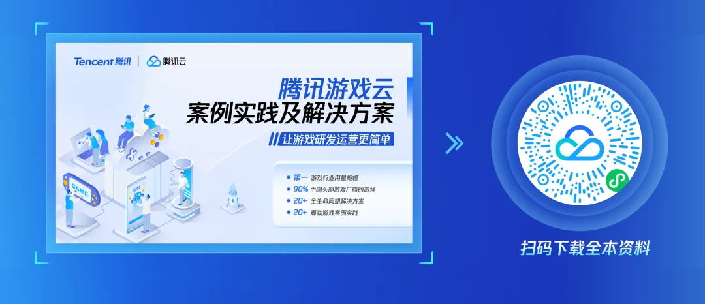

# 腾讯大模型「整活」，游戏智能NPC「活」了！

> 公众号: 腾讯云出海服务
> 发布时间: 2025-05-19 11:59
> 原文链接: https://mp.weixin.qq.com/s/s854Ycuvm6hWlge4xh0ALg

---

天塌了！游戏里的NPC突然有「灵魂」了。

《碧优蒂的世界》（下称「BUD」）上新的「AI赛季」里，NPC不再是照剧本走的工具人。他们会顶嘴、记仇、掂量利弊、评估风险——甚至你一句话说错，剧情都能拐弯。

NPC集体「开窍」背后，腾讯云为BUD提供了一整套技术解决方案——

依托腾讯云「AI+云」产品能力（包括混元大模型、向量数据库、腾讯安全ACE等），打造「智能生命体」NPC角色，实现从语言、行为到情感由AI全面驱动，为玩家提供更沉浸、更真实的互动游戏体验。

点击播放视频

先来看看全新的游戏体验——

**//角色更丰富，不再是「工具人」**BUD的AI小镇中，NPC不再千篇一律。借助腾讯混元角色扮演专属模型（Hunyuan-large-role），玩家将遇到搞怪女友、腹黑保安、医生、护士，还能自己创建火影卡卡西等NPC角色。

每个角色都有独立性格与任务逻辑，不仅能和玩家互动，还能在游戏场景中自主活动、彼此聊天。比如，在「逃离废弃医院」玩法中，玩家就要面对7个各怀心思的NPC守卫，每个都不是好糊弄的。

**//对话更自然，不再点「选项卡」**

传统NPC要靠玩家点击预设选项推进对话，而腾讯混元新一代快思考模型 Turbo S，赋予NPC上下文理解、情绪识别和语言生成能力。玩家可以用自然语言与NPC交流，NPC也能根据语境调整反馈，推动剧情自然演进。

并且，NPC不只是会说，还会「演」。借助腾讯混元大模型的多模态处理能力，系统支持语音、文本、图像等多种输入形式，并与动作库联动，实现动态表情与动作反馈。

玩家文字体现的语气温柔，女友NPC会靠近点头；态度冷漠，她则转身走人、表情冷淡——这不仅提升了互动沉浸感，也增强了NPC的「人设真实感」。

//记忆更长效，NPC会「翻旧账」

最打破次元壁的，是NPC记得住你。通过腾讯云向量数据库，玩家的每次对话、选择和行为都会被转化为向量信息存储，再被模型实时调用。

NPC不只是回应你「这一轮」的话，而是记得你之前说过什么、做过什么。比如，你的NPC女友可能因为你场次欺骗了他，这次就会翻旧账、不再信你，延迟剧情解锁。

除了让NPC变「聪明」，腾讯云还帮助BUD搭建起覆盖开发、运营、合规的完整体系，让小团队也能高效构建AI大世界——

开发方面，腾讯混元模型可无缝对接开源无代码平台 Dify，BUD策划只需通过拖拽方式，就能快速搭建NPC对话逻辑、剧情结构等AI场景。腾讯混元大模型还协助进行人设预训练与Prompt调优，让一个玩法从构想到上线，只需几天时间就能完成。

在AI+UGC内容合规方面，腾讯云游戏安全ACE系统提供内容审核、多语言适配、地域合规等支持，帮助BUD顺利上线多个国家与地区，稳稳出海。

目前，大模型与游戏行业的融合正在提速，智能NPC，则是这场融合里最先落地、玩家最有感的「突破口」。同BUD的合作中，腾讯云也完成了一次「技术加持」到「内容共创」的角色切换。

当AI真正进入游戏的前台，「玩法」这件事，也许才刚刚开始。

那么问题来了，这款新玩法，你体验过了吗？NPC女友放你走了吗？

评论区交作业，我们等你剧透。

**-END-**

#

# ①[游族网络与腾讯云达成战略合作，共同推动游戏行业技术发展](http://mp.weixin.qq.com/s?__biz=Mzg5NjgyNDMyOQ==&mid=2247486965&idx=1&sn=259d9dc31bdb5557c84c438d5ed4303e&chksm=c07a6893f70de185b19befe5a8b6384c3734295d3a74ad458bda2fbae2dc19ed39f2d321c87c&scene=21#wechat_redirect)

#

# ②[亚思未来与腾讯云达成战略合作，共建东南亚AI直播电商平台](http://mp.weixin.qq.com/s?__biz=Mzg5NjgyNDMyOQ==&mid=2247486959&idx=1&sn=9c59c8343e957885e803881c40cae376&chksm=c07a6889f70de19fc95a008098f11710ca2b9eb9e86b7307bdf5adba67af636f8847ef6bfd32&scene=21#wechat_redirect)

#

# ③[XTransfer与腾讯云达成战略合作 助力外贸数字化转型](http://mp.weixin.qq.com/s?__biz=Mzg5NjgyNDMyOQ==&mid=2247486953&idx=1&sn=f51c4e85f210fde0ff413e0652ddefee&chksm=c07a688ff70de1994fc0b7fc915f8256347c16af547cd1ce8acca570d5acf0a3f4ae297353ca&scene=21#wechat_redirect)

****关注我，及时获取互联网出海相关的行业趋势、云解决方案、实践案例等最新资讯****
**扫码即可获得**
**2024年游戏云案例实践及解决方案手册**

