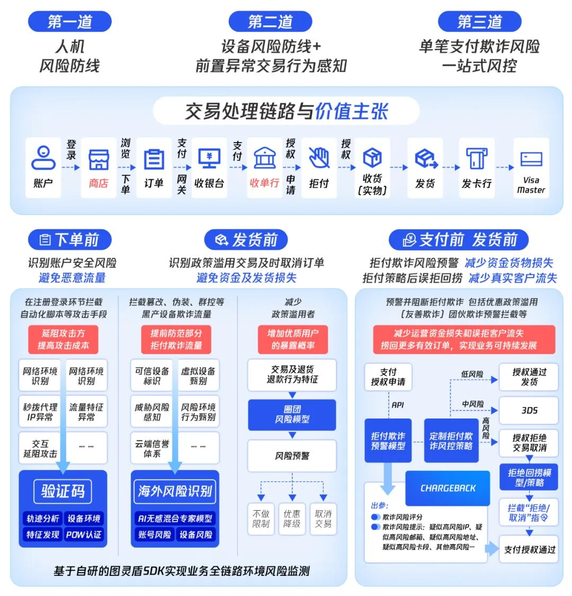
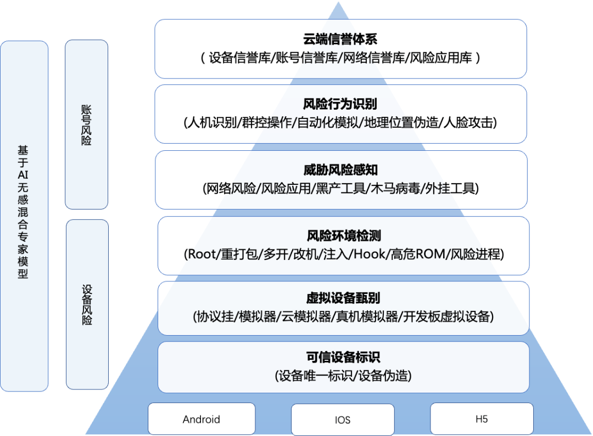

# 腾讯云天御发布海外交易风控解决方案，AI+情报双擎护航企业全球化安全

> 公众号: 腾讯云出海服务
> 发布时间: 2025-05-28 14:10
> 原文链接: https://mp.weixin.qq.com/s/PuFpbEYbnvGzB1DZI4KZHw

---
**在全球化浪潮下，中国企业加速出海布局，据商务部统计，截至2024年底，中国共有3.1万家境内投资者在国（境）外设立对外直接投资企业4.8万家，年末境外企业资产总额接近9万亿美元；中国对外直接投资存量接近3万亿美元，位列全球第三。****但与此同时，海外和跨境交易中的安全威胁也十分复杂，恶意攻击、数据泄露、账户盗用等问题不仅威胁企业资产安全，更可能因合规风险导致业务受阻。据Cybersource报告数据，2023年全球电子商务欺诈导致的损失达到约480亿美元，其中跨境支付作为电商的重要组成部分，其欺诈损失占比显著，且随着新兴技术的高速演进赋能，单笔欺诈损失金额也在提升，如深度伪造（Deepfake）攻击在2024年已造成单笔数百万美元的损失。****面对欧盟GDPR、东南亚数据本地化存储等43项新增合规要求，以及出海企业业务安全防护需求痛点，腾讯云天御基于多年技术积累与全球化实战经验，推出海外交易风控解决方案，以智能风控能力为核心，通过「AI动态风控+全球情报中枢」双引擎，实现支付欺诈拦截率99.5%与合规适配效率提升70%，助力企业构建安全与体验并重的全球化业务防线。**

***出海企业的安全挑战***

***从数据窃取到账户欺诈***

- 爬虫攻击升级战：黑灰产通过高频自动化脚本持续盗取支付页面敏感信息，如商品价格、库存数据，导致企业商业机密泄露或营销策略失效。事实上，恶意爬虫已进化至「低慢小」攻击模式，使其攻击行为难以被检测和防范，得以长期潜伏。腾讯安全监测显示，2024年针对跨境交易的恶意爬虫攻击量同比增长23%，单次攻击潜伏周期长达72小时，而单次攻击可导致数万至百万级用户信息泄露。

- **账户黑产产业化：黑产可通过虚拟手机号批量注册、撞库攻击等手段入侵用户账户（依托GoLang编写的自动化工具包，黑产可在1分钟内完成200个虚拟号注册），威胁支付安全并引发资金损失。菲律宾某支付平台曾遭遇撞库攻击，单日盗刷金额超千万比索。据腾讯安全监测数据，在跨境交易中黑产账号盗用导致的拒付率高达12%。**

- **合规重压常态化：企业在海外运营中面临着不同国家和地区的法律法规和数据保护要求，如欧盟最新支付服务指令（PSD3）要求交易风险评估必须包含设备指纹等12项指标，而印尼央行则强制跨境平台执行本地化验证组件部署。数据合规不仅关系到企业的声誉和信任度，更直接影响到企业在全球市场的运营效率和竞争力。**

***破局关键***

***精准风控与场景适配的***

***双重平衡***

**面对复杂多变的国际市场环境，出海企业需要建立健全合规的安全体系，以保持业务的持续健康发展。企业需在安全与用户体验间找到平衡点：**

- **降低误拦截率：避免因风控策略过严误伤真实用户，例如拦截正常支付请求导致订单流失。**

- **多场景灵活适配：覆盖登录注册、秒杀抢购、跨境支付等高频场景，应对不同地区的用户习惯与合规要求。**

**同时，遵守当地的数据保护法规是企业合法合规经营的基础。在国际化过程中，企业必须深入理解并遵守各国法规，确保合规运营，避免因数据违规而面临法律风险或经济处罚。由于各国政策法规可能会不断变化，企业也需要保持高度敏感，及时调整合规策略，以应对政策变化带来的挑战。*******腾讯云天御***

***海外支付风控解决方案***

***三层防护体系构建安全屏障***

****第一层-智能人机验证：兼顾安全与用户体验**

- **基于AI的人机识别验证码，支持滑动、点选等交互形式，智能识别出真人用户自动完成操作，拦截自动化脚本的同时降低用户摩擦。**

- **结合风险评分动态调整验证强度，高风险请求触发强验证，低风险场景无缝放行。**

- **充分适配海外不同区域的用户操作习惯，支持多语种。**

**第二层-设备安全识别：穿透虚拟化伪装**

- **通过设备指纹技术识别模拟器、云手机、改机工具等虚拟环境，有效甄别黑产团伙的批量操作。**

- **依托海量风险识别经验，实时判断设备风险等级，阻断异常设备登录或交易。**

**第三层-分层分级筛查机制：精准打击高阶攻击**

- **实时层：实时拦截明显恶意行为（如高频请求、IP黑名单）。**

- **决策层：基于行为分析模型识别隐蔽攻击（如慢速爬虫、分布式撞库）。**

- **战略层：通过AI模型关联多维度数据（交易链路、用户行为画像）筛查高级持续性威胁。**

***核心优势***

***技术融合与生态协同***

- **关键技术能力融合：将风险识别引擎（RCE）与验证码能力集成至单一SDK，减少开发成本并提升防护响应速度，黑灰产识别准确率达99.5%。**

- **全球威胁情报联动：依托腾讯威胁情报云，实时同步全球黑产攻击特征库，覆盖新兴攻击手法。**

- **AI驱动的风控进化：通过增加AI大模型的技术研发投入，特别是多模态大语言模型、计算机图形学的前沿探索，使得风控能力不断进化。**

- **全球化合规：腾讯云已连续通过ISO系列等多项国际标准合规认证、CSASTAR金牌认证，以及严格的SOC1、SOC2、SOC3审计，在信息安全管理体系、IT服务管理体系、业务连续性管理体系、质量管理体系、个人信息保护以及网络安全控制等方面有着极强的保证。同时，也获得欧盟CISPE数据保护行为准则认证，提升云服务商遵循GDPR要求的合规程度。**

**某自营电商针对欺诈资损高、支付成功率低的痛点，通过接入腾讯云天御风控交易系统并分阶段优化解决方案，显著提升业务安全与效率。该电商主营虚拟订阅及多品类虚拟产品，因交易高频面临卡支付欺诈导致的交易失败及资损问题。通过四个月的策略调试，其风控体系融合冷启动阶段的频次监控、设备指纹识别，优化阶段的定制化决策树模型、团伙聚类及用户画像分析，以及完善阶段的特征监测与无监督学习模型，最终将欺诈率从0.9%降至0.25%，支付成功率从85%提升至89%。系统通过动态回捞模型和可信体系持续优化风险画像，同步降低交易拒付率并提高通道成功率，实现业务风险与收益的平衡。**另一家跨境电商平台，则在展业过程中遭遇大规模欺诈攻击，导致拒付率攀升至1%以上。接入腾讯云天御风控系统后，该跨境电商实现风险精准防控。通过T+0级策略快速迭代，系统全链路识别垃圾账户、设备环境异常及群组攻击特征，结合实时交易行为分析，在第6周介入后3个月内将拒付率降至0.25%以下，拦截团伙攻击超10次、欺诈交易2000余笔，规避损失超8万美元，有效平衡交易安全与业务增长。**当前，风控已进入“博弈智能”时代，腾讯安全凭借多年的人才优势、技术沉淀和资源积累等，在出海业务风控服务方面持续打造核心竞争力。腾讯云天御海外交易风控解决方案，以“智能风控+全球化合规”为核心，为企业提供从攻击防御到数据安全的全链路保障。未来，腾讯安全也将持续投入AI与大数据技术研发，开放前沿安全对抗能力，护航更多中国企业在全球市场稳健前行。****扫描二维码，进入产品官网****-END-**

#

# ①[游族网络与腾讯云达成战略合作，共同推动游戏行业技术发展](http://mp.weixin.qq.com/s?__biz=Mzg5NjgyNDMyOQ==&mid=2247486965&idx=1&sn=259d9dc31bdb5557c84c438d5ed4303e&chksm=c07a6893f70de185b19befe5a8b6384c3734295d3a74ad458bda2fbae2dc19ed39f2d321c87c&scene=21#wechat_redirect)

#

# ②[亚思未来与腾讯云达成战略合作，共建东南亚AI直播电商平台](http://mp.weixin.qq.com/s?__biz=Mzg5NjgyNDMyOQ==&mid=2247486959&idx=1&sn=9c59c8343e957885e803881c40cae376&chksm=c07a6889f70de19fc95a008098f11710ca2b9eb9e86b7307bdf5adba67af636f8847ef6bfd32&scene=21#wechat_redirect)

#

# ③[XTransfer与腾讯云达成战略合作 助力外贸数字化转型](http://mp.weixin.qq.com/s?__biz=Mzg5NjgyNDMyOQ==&mid=2247486953&idx=1&sn=f51c4e85f210fde0ff413e0652ddefee&chksm=c07a688ff70de1994fc0b7fc915f8256347c16af547cd1ce8acca570d5acf0a3f4ae297353ca&scene=21#wechat_redirect)

****关注我，及时获取互联网出海相关的行业趋势、云解决方案、实践案例等最新资讯****
**扫码即可获得**
**2024年游戏云案例实践及解决方案手册**