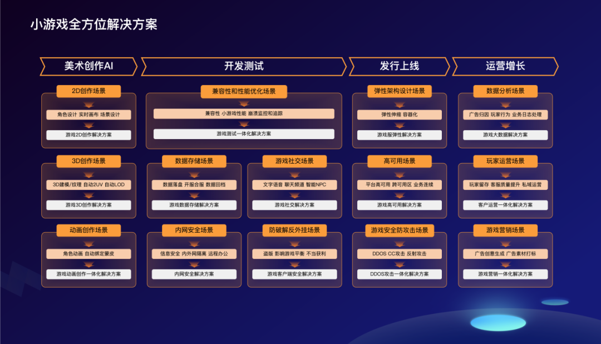
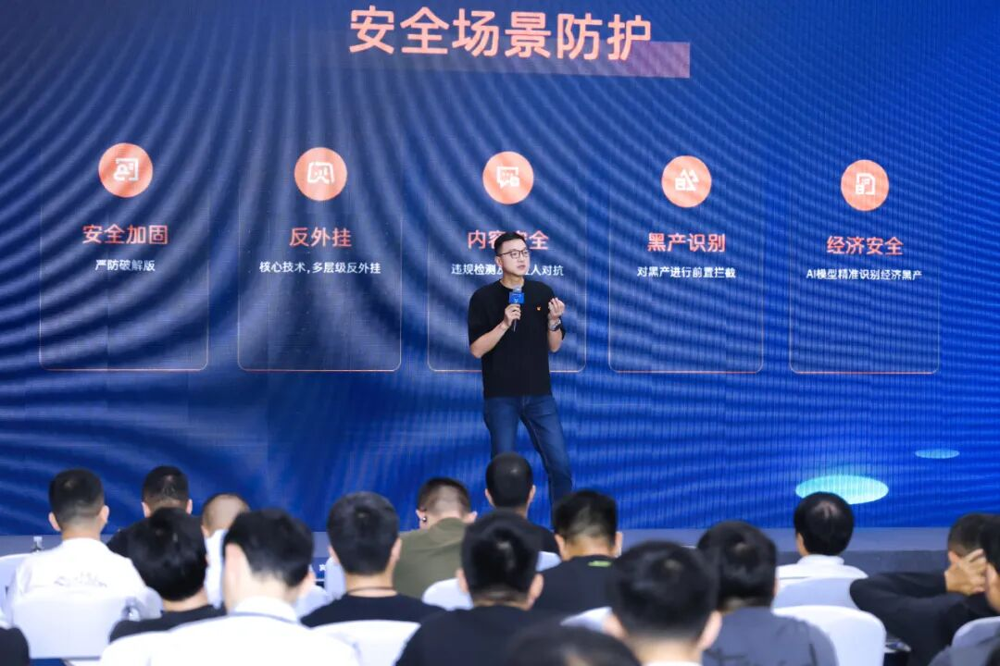

# @小游戏开发者，业内首个「小游戏全方位解决方案」来了

> 公众号: 腾讯云出海服务
> 发布时间: 2025-06-25 20:55
> 原文链接: https://mp.weixin.qq.com/s/Ig_iq_1ROM6BDQUXUz4veg

---

地铁上划两把《开心消消乐》，午休时点开《无尽冬日》建座城……这些解压上头的小游戏，已经撑起了一个年入百亿级的市场。

但你可能不知道：80%的小游戏厂家，都不足30人。

因为小游戏天生适合「小快灵」：低成本开发，迅速验证创意，上线节奏飞快。可玩家的要求也在「升级」——玩法要新、美术要精、高峰期不崩……小团队逐渐陷入「高品质+快交付」的双重挑战。

现在，腾讯云为小游戏厂商提供了「提速+提质」的新解法——

在2025微信小游戏开发者大会上，腾讯云正式发布业内首个「小游戏全方位解决方案」，覆盖从美术创作、技术测试，到上线部署、运营增长的完整流程。

新推出的「小游戏全方位解决方案」中，腾讯云首次将混元3D大模型、混元游戏视觉生成等美术AI能力，及腾讯游戏多年沉淀能力，系统化开放给开发者，助力小团队也能拥有大厂级生产力。比如：

● **2D原画设计：**支持角色、场景等高品质素材的快速生成，设计师画草图、上色、润色细节，AI都能协助，像搭档了一个「美术助手」；还支持多人实时协作画布，让团队协同更高效、反复修改更少；

● **3D建模与贴图：**内置AI建模与纹理生成能力，集成自动2UV贴图（可自动生成清晰、自然的材质效果）和LOD优化技术（能根据设备性能自动调整模型精度），既能快速出效果，又能适配不同设备的性能，低配机也能流畅运行；

● **动画与蒙皮：**提供动画一体化解决方案，动画师不再需要一帧帧手动调整骨骼、贴合模型，AI就能自动识别角色结构，智能完成大部分蒙皮操作，只需人工手动微调，就能直接投入使用，节省大量时间。

   这套AI工具，不仅降低了小游戏美术创作的门槛，也让小游戏厂商在资源有限的条件     下，能够做出高品质、有表现力的游戏画面。

   不仅如此，从前期玩法搭建、功能测试，到中期服务部署与性能调优，再到上线     后的高并发承载、用户留存运营，所有环节都能在腾讯云上搞定。一套工具全流     程覆盖，省事、省心，也更稳定。

与此同时，腾讯云持续打造一系列游戏行业特有的能力服务小游戏开发者——

● **小范围出错就要全服回档？运营手滑误删了重要角色的场景？**

数据库灵活闪回，MongoDB数据库支持数据按Key回档；自主研发的数据加速模块方案实现Redis缓存性能飞跃，最高可达3倍处理速度提升；

● **搭建匹配服务器耗时耗力？不同类型游戏需要兼容不同服务器框架？**

容器服务全面兼容OKG、Agones等主流开源游戏服务器框架，支持多网络通道接入与多负载均衡端口复用等游戏通用需求；

● **服务器异常波动、玩家大面积掉线，故障定位如大海捞针，服务恢复遥遥无期？**

CLS日志服务融合AI分析能力，智能解析海量复杂日志，自动定位游戏故障根本原因，系统维护效率显著提升，减少停机时间。

目前，包括《开心消消乐》《无尽冬日》《咸鱼之王》《百炼英雄》《指尖无双》等国民级小游戏，都跑在了腾讯云上。

未来，腾讯云将继续打磨产品，开放更多 AI和云的技术能力，助力更多开发者创作出好作品。

小游戏可以很小，但创意和野心，可以很大。

**-END-**

#

# ①[游族网络与腾讯云达成战略合作，共同推动游戏行业技术发展](http://mp.weixin.qq.com/s?__biz=Mzg5NjgyNDMyOQ==&mid=2247486965&idx=1&sn=259d9dc31bdb5557c84c438d5ed4303e&chksm=c07a6893f70de185b19befe5a8b6384c3734295d3a74ad458bda2fbae2dc19ed39f2d321c87c&scene=21#wechat_redirect)

#

# ②[亚思未来与腾讯云达成战略合作，共建东南亚AI直播电商平台](http://mp.weixin.qq.com/s?__biz=Mzg5NjgyNDMyOQ==&mid=2247486959&idx=1&sn=9c59c8343e957885e803881c40cae376&chksm=c07a6889f70de19fc95a008098f11710ca2b9eb9e86b7307bdf5adba67af636f8847ef6bfd32&scene=21#wechat_redirect)

#

# ③[XTransfer与腾讯云达成战略合作 助力外贸数字化转型](http://mp.weixin.qq.com/s?__biz=Mzg5NjgyNDMyOQ==&mid=2247486953&idx=1&sn=f51c4e85f210fde0ff413e0652ddefee&chksm=c07a688ff70de1994fc0b7fc915f8256347c16af547cd1ce8acca570d5acf0a3f4ae297353ca&scene=21#wechat_redirect)

****关注我，及时获取互联网出海相关的行业趋势、云解决方案、实践案例等最新资讯****
**扫码即可获得**
**2024年游戏云案例实践及解决方案手册**

