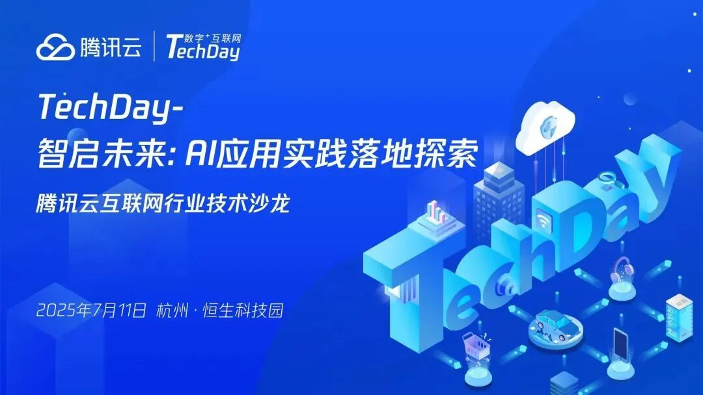
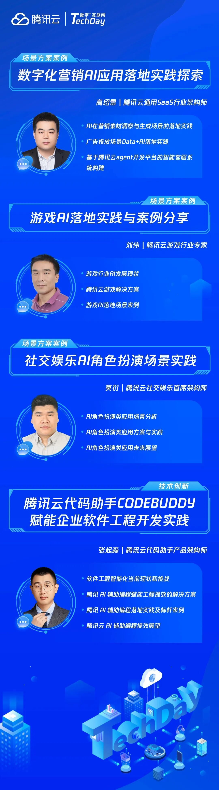

# 【活动报名】7月11日杭州腾讯云TechDay：AI落地实战沙龙，等你抢位！

> 公众号: 腾讯云出海服务
> 发布时间: 2025-07-02 12:00
> 原文链接: https://mp.weixin.qq.com/s/Yn__BG7mBGAoSILgp-_oTg

---

## 活动背景

当前，AI 技术正加速与各行业场景融合，成为推动企业创新与效率提升的核心引擎。杭州作为国内 AI 产业高地，汇聚了众多 AI 科技类企业，展现出强劲的技术创新力。

为助力杭州本地企业探索 AI 落地实践，腾讯云主办" TechDay "技术沙龙系列活动，聚焦数字化营销、游戏美术、社交娱乐等面向用户场景的 AI 应用案例，深度解析腾讯云代码助手等技术创新。通过实战分享和落地案例，与当地企业深度交流腾讯云的 AI 能力与实操使用，推动AI 在杭州生态中的规模化落地，赋能企业智胜未来。

##

## 活动详情

主题  ：智启未来：AI应用实践落地探索

时间  ：2025年7月11日 15:00-17:00

地点  ：杭州市余杭区恒生科技园7号楼

## 嘉宾阵容

##

##

席位有限，立即扫码报名

与腾讯云专家共探AI落地实践！

**-END-**

#

# ①[游族网络与腾讯云达成战略合作，共同推动游戏行业技术发展](http://mp.weixin.qq.com/s?__biz=Mzg5NjgyNDMyOQ==&mid=2247486965&idx=1&sn=259d9dc31bdb5557c84c438d5ed4303e&chksm=c07a6893f70de185b19befe5a8b6384c3734295d3a74ad458bda2fbae2dc19ed39f2d321c87c&scene=21#wechat_redirect)

#

# ②[亚思未来与腾讯云达成战略合作，共建东南亚AI直播电商平台](http://mp.weixin.qq.com/s?__biz=Mzg5NjgyNDMyOQ==&mid=2247486959&idx=1&sn=9c59c8343e957885e803881c40cae376&chksm=c07a6889f70de19fc95a008098f11710ca2b9eb9e86b7307bdf5adba67af636f8847ef6bfd32&scene=21#wechat_redirect)

#

# ③[XTransfer与腾讯云达成战略合作 助力外贸数字化转型](http://mp.weixin.qq.com/s?__biz=Mzg5NjgyNDMyOQ==&mid=2247486953&idx=1&sn=f51c4e85f210fde0ff413e0652ddefee&chksm=c07a688ff70de1994fc0b7fc915f8256347c16af547cd1ce8acca570d5acf0a3f4ae297353ca&scene=21#wechat_redirect)

****关注我，及时获取互联网出海相关的行业趋势、云解决方案、实践案例等最新资讯****
**扫码即可获得**
**2024年游戏云案例实践及解决方案手册**
