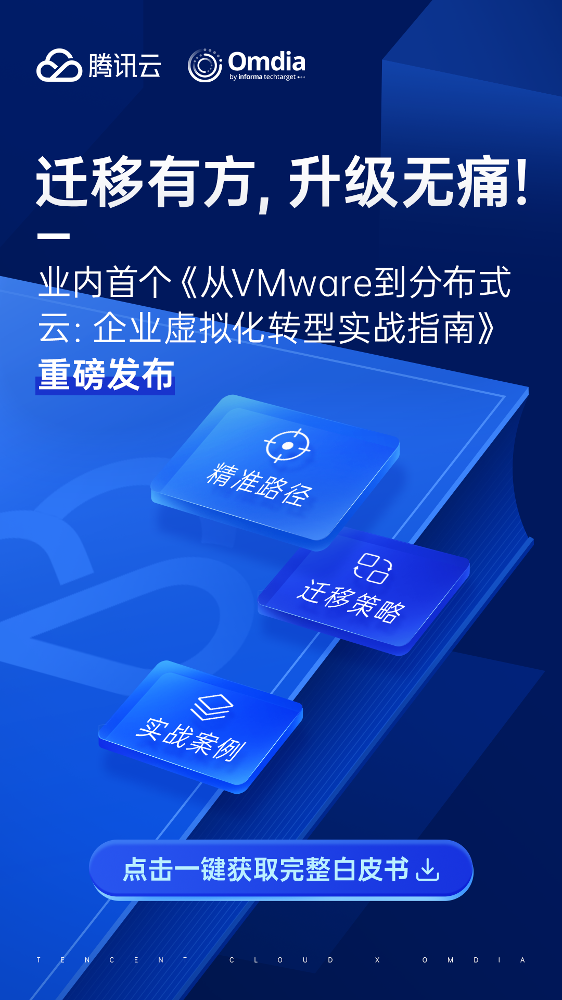

# 干货报告｜业内首个！《从VMware到分布式云：企业虚拟化转型实战指南》重磅发布

> 公众号: 腾讯云出海服务
> 发布时间: 2025-07-03 16:31
> 原文链接: https://mp.weixin.qq.com/s/hvYHV_VPlRZsxsazNIcG4g

---
近日，腾讯云联名国际权威技术研究机构Omdia发布业内首个《从VMware到分布式云：企业虚拟化转型实战指南》。该指南基于国际权威调研机构Omdia的全球调研及腾讯云多年技术积淀，为企业提供从虚拟化转型到全栈云升级，以及到云原生演进的完整路径，并同时提供迁移策略与实战案例参考。

**Broadcom收购触发行业变局，73%企业加速迁移计划**

根据Omdia的调查显示，VMware在过去20年间一直是软件虚拟化市场的主导厂商。然而，该公司于2023年被博通收购，带来了一系列连锁反应。博通对VMware的定价策略、产品组合及合作伙伴网络进行了重大调整，比如：终止永久许可、服务目录不全，且提高许可证最低核心数量门槛，造成综合成本上升等。

VMware客户对此反应强烈，这些问题正在倒逼全球企业寻找更优解。73%的VMware客户正在考虑未来三年内寻找VMware以外的解决方案。

**精准路径：“平替-升级-演进”三重路径，覆盖从基础架构替换到云原生转型的全场景**

腾讯云通过分布式云(CDC+CDZ)与专有云(TCE+TCS) ，为客户提供“平替-升级-演进”多元迁移与升级选择，覆盖从基础架构替换到云原生转型的全场景，满足客户在VMware迁移场景中实现对敏捷高效、安全可靠、持续演进，以及更低TCO的核心诉求。

场景一：IaaS层替换：兼容vSphere/vSAN操作逻辑，支持5000vCPU规模下TCO降低30%。

场景二：从IaaS升级为全栈云：面向中大型企业数字化转型，方案整合IaaS/PaaS/安全等200+云服务。

场景三：从VMware到云原生演进：从基础设施到应用层全面容器化，百万级节点管理经验。

**迁移策略：“评估-规划-实施-验收”迁移保障，确保业务连续性**

在迁移保障层面，腾讯云发布全维度迁移工具链，涵盖热迁移（go2tencentcloud）、数据同步（DTS）、容灾演练等20余种工具，通过"评估-规划-实施-验收"四阶方法论，可以帮助客户轻松从VMware环境平滑迁移到分布式云(CDC+CDZ)与专有云(TCE+TCS)环境中，最小程度影响业务的正常运行。

**实战案例：海内外客户VMware加速迁移与升级首选**

《指南》还介绍了分布式云(CDC+CDZ)与专有云(TCE+TCS)如何助力海内外不同行业客户轻松实现VMware迁移与升级，为同行业客户提供参考与借鉴。

如：

专有云TCE助力澳门某大学实现50个VMware节点平滑迁移，构建起支撑教研系统与实验平台的多租户环境；助力某城市商业银行构建全栈云能力，8小时内完成130套系统迁移，并通过等保三级认证。

云原生平台TCS助力太平洋保险完成80%系统微服务化改造，资源利用率提升30%。

分布式云CDC（本地专用集群）为美的巴西工厂的机房中提供了本地化、低延时的云服务，实现海外与国内云平台统一运维管理。

分布式云CDZ（专属可用区）助力马来西亚GRM公司快速搭建自主可控的云平台，满足了国家对数据本地化的要求。

**欢迎免费下载阅读，更多详情⬇️⬇️⬇️**

**让VMware迁移有方，升级无痛****！**

**-END-**

#

# ①[游族网络与腾讯云达成战略合作，共同推动游戏行业技术发展](http://mp.weixin.qq.com/s?__biz=Mzg5NjgyNDMyOQ==&mid=2247486965&idx=1&sn=259d9dc31bdb5557c84c438d5ed4303e&chksm=c07a6893f70de185b19befe5a8b6384c3734295d3a74ad458bda2fbae2dc19ed39f2d321c87c&scene=21#wechat_redirect)

#

# ②[亚思未来与腾讯云达成战略合作，共建东南亚AI直播电商平台](http://mp.weixin.qq.com/s?__biz=Mzg5NjgyNDMyOQ==&mid=2247486959&idx=1&sn=9c59c8343e957885e803881c40cae376&chksm=c07a6889f70de19fc95a008098f11710ca2b9eb9e86b7307bdf5adba67af636f8847ef6bfd32&scene=21#wechat_redirect)

#

# ③[XTransfer与腾讯云达成战略合作 助力外贸数字化转型](http://mp.weixin.qq.com/s?__biz=Mzg5NjgyNDMyOQ==&mid=2247486953&idx=1&sn=f51c4e85f210fde0ff413e0652ddefee&chksm=c07a688ff70de1994fc0b7fc915f8256347c16af547cd1ce8acca570d5acf0a3f4ae297353ca&scene=21#wechat_redirect)

**关注我，及时获取互联网出海相关的行业趋势、云解决方案、实践案例等最新资讯**
**扫码即可获得**
**2024年游戏云案例实践及解决方案手册**

