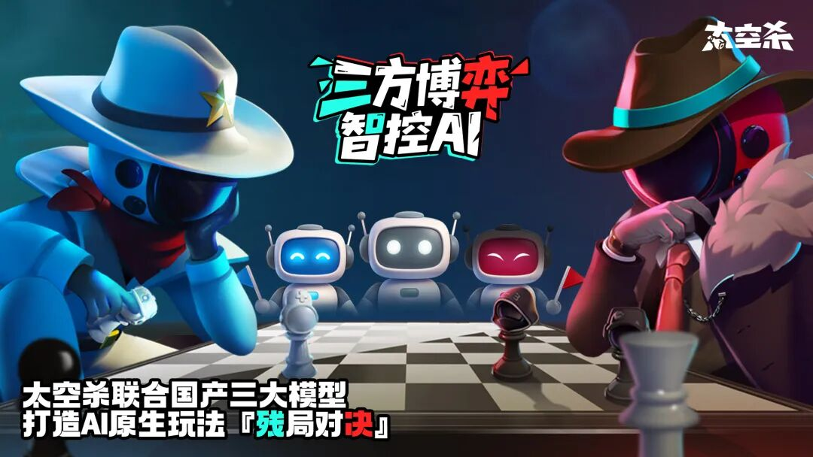
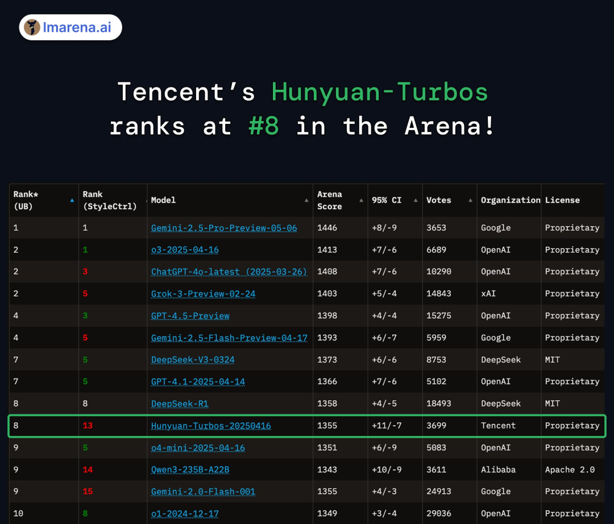

# 《太空杀》革新AI原生玩法！腾讯混元大模型驱动“AI残局对决”

> 公众号: 腾讯云出海服务
> 发布时间: 2025-07-04 15:31
> 原文链接: https://mp.weixin.qq.com/s/4BbTcgTAkWc4My9L6ftRmA

---

随着大模型在游戏行业中的应用越来越多，不断提升着玩家们的游戏体验以及游戏开发者们的研发效率。

近日，巨人网络旗下社交推理游戏《太空杀》推出全新AI原生玩法“残局对决”。此次更新深度应用了腾讯混元大模型领先的逻辑推理的能力，首次在游戏中实现“多用户与AI智能体混合对抗”三方动态对抗的混合竞技模式。这不仅为全球两亿玩家带来全新的策略对抗体验，也标志着国产大模型在游戏场景应用的重大突破。

相较传统人机对抗和AI陪玩模式，“残局对决”在AI玩法创新上实现了新突破。该玩法基于PvPvE（Player vs Player vs Environment）架构，构建了一个“真人玩家 vs AI智能体 vs 真人玩家”的三方智能竞技格局，每局游戏由2名真人玩家分别扮演对立阵营的“内鬼”与“船员”，并接入由混元大模型驱动的多名AI玩家参与对局，实现“玩家挑战AI”到“玩家操控AI对抗”的玩法升级。

巨人网络是一家用创新驱动的互联网企业，坚持自主研发，多次以创新推动行业发展，并且持续探索AI原生游戏玩法，通过提供有核心价值的产品或服务，让用户享受创新带来的便利。作为拥有2亿用户的社交推理游戏代表作，《太空杀》是业内最早深耕AI原生玩法的游戏产品，至今已陆续推出“AI推理小剧场”、“AI残局挑战”、“侦探剧场”、“内鬼挑战”等多个AI原生玩法。

此前《太空杀》接入混元大模型推出的“内鬼挑战”玩法，上线一个月内积累近90万次对局，生成超700万个由混元驱动的AI玩家。腾讯混元大模型依靠其快思考以及逻辑推理能力，让传统NPC突破固定行为逻辑限制，具备更强的拟人化交互与决策能力，让NPC达到高度拟人的智能度。玩家普遍反馈AI的逻辑性强，很聪明，会伪装、指控、反制还会抱团一同讨论。

腾讯混元是由腾讯全链路自研的万亿参数大模型，新一代快思考模型 Turbo S相较以往吐字速度提升1倍，首字时延降低 44%。近期，腾讯混元TurboS在全球公认的权威大语言模型评测平台Chatbot Arena全球评测中跻身前八，国内仅次于DeepSeek，代码、数学等理科能力，混元 TurboS 也进入全球前十。混元也在不断通过架构优化，大幅降低部署成本，帮助更多企业与开发者以更低门槛使用高效AI大模型。

腾讯云作为国内90%以上头部游戏厂商的首选云服务商，为游戏行业提供了丰富的解决方案。在游戏智能NPC领域，混元大模型为NPC赋予不同的思想个性、社交关系等人类属性，使得玩家的体验更加真实。在游戏3D美术创作领域，得益于混元3D的技术发展，腾讯云还发布了面向创作者的3D AI创作引擎，重塑游戏传统3D生产链路，实现几何、拓扑、纹理及绑骨蒙皮的AI全自动化驱动。未来的游戏创作会更多地结合大语言模型以及多模态生成模型，为玩家和开发者提供更大的想象和应用空间。

**-END-**

#

# ①[游族网络与腾讯云达成战略合作，共同推动游戏行业技术发展](http://mp.weixin.qq.com/s?__biz=Mzg5NjgyNDMyOQ==&mid=2247486965&idx=1&sn=259d9dc31bdb5557c84c438d5ed4303e&chksm=c07a6893f70de185b19befe5a8b6384c3734295d3a74ad458bda2fbae2dc19ed39f2d321c87c&scene=21#wechat_redirect)

#

# ②[亚思未来与腾讯云达成战略合作，共建东南亚AI直播电商平台](http://mp.weixin.qq.com/s?__biz=Mzg5NjgyNDMyOQ==&mid=2247486959&idx=1&sn=9c59c8343e957885e803881c40cae376&chksm=c07a6889f70de19fc95a008098f11710ca2b9eb9e86b7307bdf5adba67af636f8847ef6bfd32&scene=21#wechat_redirect)

#

# ③[XTransfer与腾讯云达成战略合作 助力外贸数字化转型](http://mp.weixin.qq.com/s?__biz=Mzg5NjgyNDMyOQ==&mid=2247486953&idx=1&sn=f51c4e85f210fde0ff413e0652ddefee&chksm=c07a688ff70de1994fc0b7fc915f8256347c16af547cd1ce8acca570d5acf0a3f4ae297353ca&scene=21#wechat_redirect)

****关注我，及时获取互联网出海相关的行业趋势、云解决方案、实践案例等最新资讯****
**扫码即可获得**
**2024年游戏云案例实践及解决方案手册**