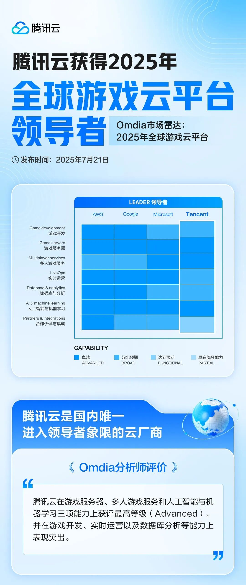
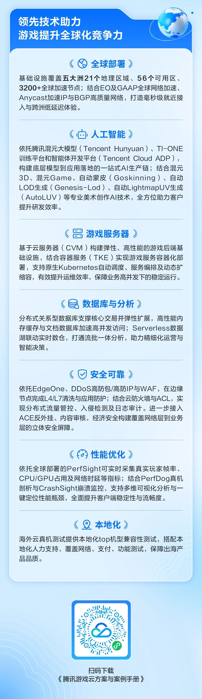

# 腾讯游戏云：入选全球「Leader」象限，中国唯一

> 公众号: 腾讯云出海服务
> 发布时间: 2025-08-06 11:37
> 原文链接: https://mp.weixin.qq.com/s/qsZ55Y539QaaXxxaoALFdQ

---

全球四强，中国唯一！

刚刚，国际权威机构 Omdia 发布《2025 全球游戏云平台市场雷达》报告，腾讯云首次跻身「Leader」象限（是今年唯一入选的中国云厂商，此前曾入选亚太及太平洋地区游戏云「Leader」象限），与 AWS、Google和Microsoft 并列成为全球四强。

其中，Omdia今年首次将「人工智能与机器学习」列为新的评估维度，认为AI将成为未来5年驱动游戏市场增长的核心引擎。而在这门全新的「评价科目」上，腾讯云拿到了最高等级「Advanced」的评价。

这意味着腾讯云在游戏领域的AI应用，已经处于全球领先水准。背后，是腾讯云依托腾讯混元大模型等，打造的一系列面向游戏场景的AI创作平台和工具，让AI真正走入游戏开发全流程——

● **混元3D生成系列模型：**AI 3D 生成可以让游戏设计师用文字或参考图快速生成角色、道具或完整场景，大幅提速降本。比如，混元3D v2.5支持4K高清纹理和细粒度bump凹凸贴图；世界人工智能大会发布并开源的混元3D世界模型 1.0，可以生成360°都有内容的3D世界，为游戏创作带来全新可能；

● **混元游戏视觉生成平台：**可以为美术设计师提供一整套AI工具，快速生成符合创作意图的高质量游戏素材或概念草案，真正实现创作闭环。流程压缩、节奏提速，效率最高可提升数十倍；

……

除了人工智能与机器学习，腾讯云还拿到了游戏服务器、多人游戏服务维度的最高等级「Advanced」，其余领域也表现不俗。

Omdia评价腾讯云游戏服务器解决方案为业内最先进之一，拥有覆盖 21 个区域、56 个可用区的全球数据中心网络。同时，腾讯云提供全面的多人游戏服务，包括聊天、语音、排行榜及反作弊等功能。（参考阅读：**[腾讯游戏云：进入全球「领导者象限」](https://mp.weixin.qq.com/s?__biz=MjM5MDgwMzc4MA==&mid=2654902456&idx=1&sn=3c485cd25d1bd4c195f24bb574e6f3ea&scene=21#wechat_redirect)**）

这次入选「Leader」阵营，对我们是一次重要的鼓励，更是一个全新的起点——

接下来，我们还会继续打磨技术、优化体验，让游戏开发更省心、更安心。同时，我们也希望遇到更多志同道合的伙伴，一起把游戏做得更好。

感谢认可，也欢迎感兴趣的伙伴，随时来聊。

**-END-**

#

# ①[游族网络与腾讯云达成战略合作，共同推动游戏行业技术发展](http://mp.weixin.qq.com/s?__biz=Mzg5NjgyNDMyOQ==&mid=2247486965&idx=1&sn=259d9dc31bdb5557c84c438d5ed4303e&chksm=c07a6893f70de185b19befe5a8b6384c3734295d3a74ad458bda2fbae2dc19ed39f2d321c87c&scene=21#wechat_redirect)

#

# ②[亚思未来与腾讯云达成战略合作，共建东南亚AI直播电商平台](http://mp.weixin.qq.com/s?__biz=Mzg5NjgyNDMyOQ==&mid=2247486959&idx=1&sn=9c59c8343e957885e803881c40cae376&chksm=c07a6889f70de19fc95a008098f11710ca2b9eb9e86b7307bdf5adba67af636f8847ef6bfd32&scene=21#wechat_redirect)

#

# ③[XTransfer与腾讯云达成战略合作 助力外贸数字化转型](http://mp.weixin.qq.com/s?__biz=Mzg5NjgyNDMyOQ==&mid=2247486953&idx=1&sn=f51c4e85f210fde0ff413e0652ddefee&chksm=c07a688ff70de1994fc0b7fc915f8256347c16af547cd1ce8acca570d5acf0a3f4ae297353ca&scene=21#wechat_redirect)

****关注我，及时获取互联网出海相关的行业趋势、云解决方案、实践案例等最新资讯****
**扫码即可获得**
**2024年游戏云案例实践及解决方案手册**