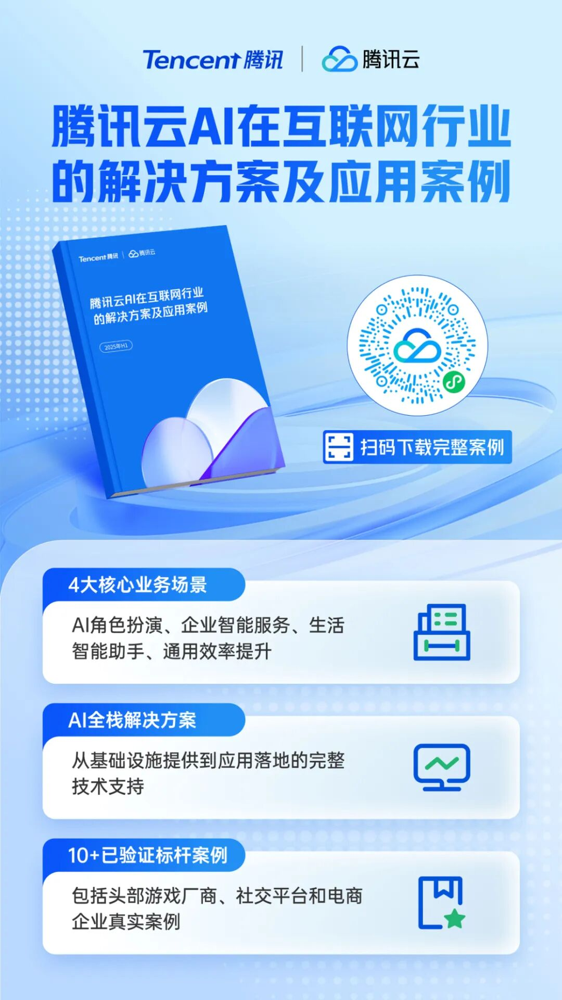
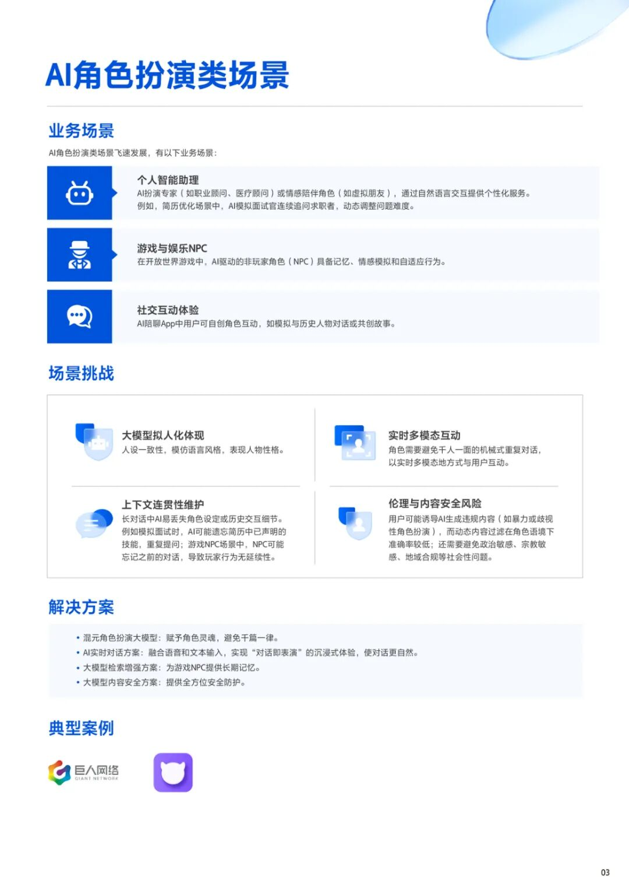
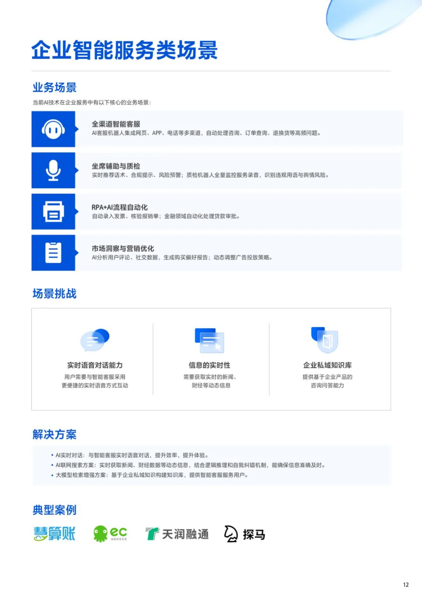
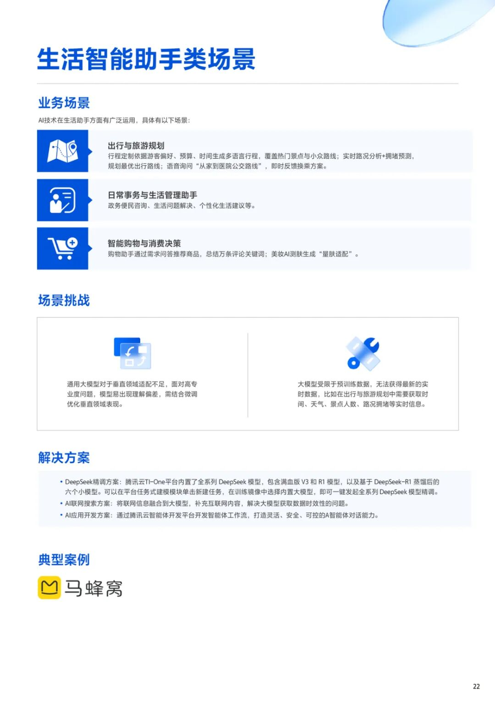
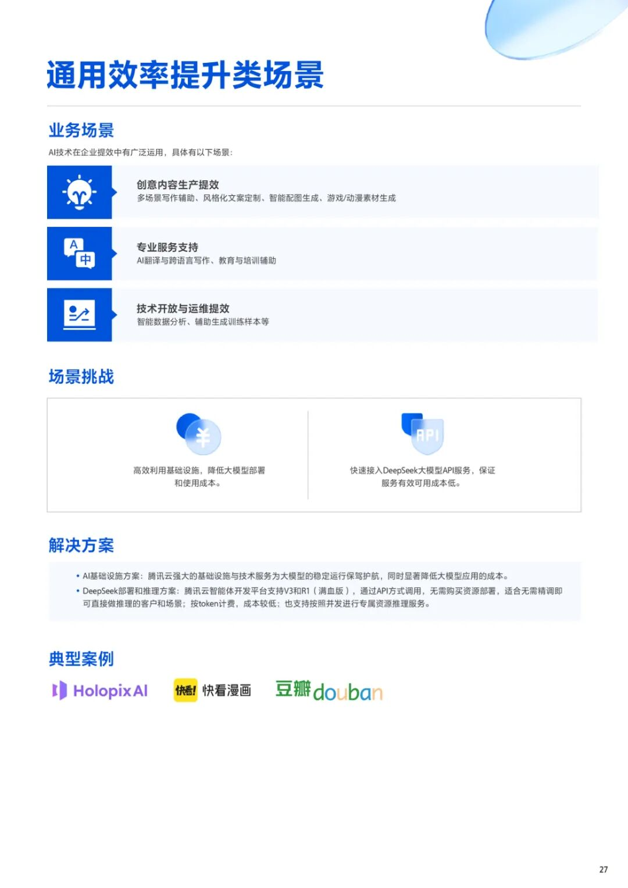

# 干货下载｜AI落地难？互联网行业10+标杆企业验证方案速领→

> 公众号: 腾讯云出海服务
> 发布时间: 2025-08-08 16:35
> 原文链接: https://mp.weixin.qq.com/s/sOqpu6gyox3qr61EBWZ3fA

---

在数字化转型浪潮下，AI技术正深刻改变互联网行业的运营模式。然而，许多企业在AI落地过程中仍面临 “技术门槛高、场景适配难、效果难量化” 等挑战。腾讯云基于长期行业实践，推出《腾讯云AI在互联网行业的解决方案及案例应用》，涵盖AI角色扮演、企业智能服务、生活智能助手、通用效率提升四大场景，提供10+已验证的实战方案，助力企业高效实现智能化升级。

【手册核心亮点抢先看】

腾讯云最新发布《腾讯云AI在互联网行业的解决方案及应用案例》

- 4大核心业务场景：AI角色扮演、企业智能服务、生活智能助手、通用效率提升

- AI全栈解决方案：从基础设施提供到应用落地的完整技术支持

- 10+已验证标杆案例：包括头部游戏厂商、社交平台和电商企业真实案例

【四大场景深度解析】

立即点击下方链接👇👇👇

免费获取《腾讯云互联网行业AI方案与案例手册》

**-END-**

#

# ①[游族网络与腾讯云达成战略合作，共同推动游戏行业技术发展](http://mp.weixin.qq.com/s?__biz=Mzg5NjgyNDMyOQ==&mid=2247486965&idx=1&sn=259d9dc31bdb5557c84c438d5ed4303e&chksm=c07a6893f70de185b19befe5a8b6384c3734295d3a74ad458bda2fbae2dc19ed39f2d321c87c&scene=21#wechat_redirect)

#

# ②[亚思未来与腾讯云达成战略合作，共建东南亚AI直播电商平台](http://mp.weixin.qq.com/s?__biz=Mzg5NjgyNDMyOQ==&mid=2247486959&idx=1&sn=9c59c8343e957885e803881c40cae376&chksm=c07a6889f70de19fc95a008098f11710ca2b9eb9e86b7307bdf5adba67af636f8847ef6bfd32&scene=21#wechat_redirect)

#

# ③[XTransfer与腾讯云达成战略合作 助力外贸数字化转型](http://mp.weixin.qq.com/s?__biz=Mzg5NjgyNDMyOQ==&mid=2247486953&idx=1&sn=f51c4e85f210fde0ff413e0652ddefee&chksm=c07a688ff70de1994fc0b7fc915f8256347c16af547cd1ce8acca570d5acf0a3f4ae297353ca&scene=21#wechat_redirect)

****关注我，及时获取互联网出海相关的行业趋势、云解决方案、实践案例等最新资讯****
**扫码即可获得**
**2024年游戏云案例实践及解决方案手册**