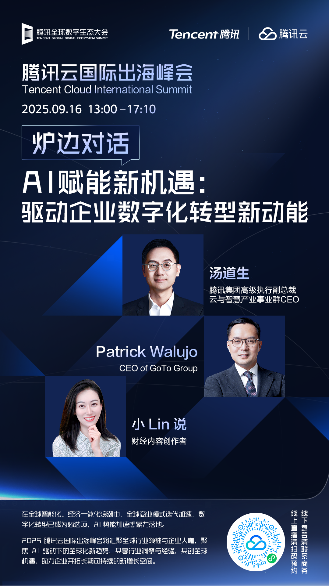

# 【直播报名】炉边对话 | AI赋能新机遇：驱动企业数字化转型新动能

> 公众号: 腾讯云出海服务
> 发布时间: 2025-09-04 15:59
> 原文链接: https://mp.weixin.qq.com/s/Eny3dN9ILNxdoDMS8zsNug

---

***活动介绍***

在全球智能化、经济一体化浪潮中，AI技术正成为推动全球企业转型的核心动力。AI技术也正深刻地重塑各行各业，为企业带来前所未有的机遇与挑战。面对不断变化的国际竞争环境，如何借助AI赋能业务，成为驱动数字化转型的新动能，成为企业实现持续成长的关键议题。

腾讯云国际出海峰会炉边对话环节，以“AI赋能新机遇：驱动企业数字化转型新动能”为话题，共同探讨AI如何作为核心引擎，为企业数字化转型注入全新动能，并赋予企业可持续发展的新机遇。

我们诚挚地邀请您云端参会，共同聆听精彩内容，探索AI时代下企业发展的更多可能。欢迎扫码预约直播，期待与您线上相见。

***对话嘉宾阵容***

**-END-**

#

# ①[腾讯游戏云：入选全球「Leader」象限，中国唯一](https://mp.weixin.qq.com/s?__biz=Mzg5NjgyNDMyOQ==&mid=2247487711&idx=1&sn=e95a076e94b67a7221a190cd3d4eb7b6&scene=21#wechat_redirect)

#

# ②[腾讯云助力识季打造内部办公桌面智能助手 人工服务成本降低40%](https://mp.weixin.qq.com/s?__biz=Mzg5NjgyNDMyOQ==&mid=2247487706&idx=1&sn=956e763d01bb134b409cc2310158e05b&scene=21#wechat_redirect)

#

# ③[《太空杀》革新AI原生玩法！腾讯混元大模型驱动“AI残局对决”](https://mp.weixin.qq.com/s?__biz=Mzg5NjgyNDMyOQ==&mid=2247487697&idx=1&sn=27ca8eadd10469970c4dad164512463b&scene=21#wechat_redirect)

****关注我，及时获取互联网出海相关的行业趋势、云解决方案、实践案例等最新资讯****