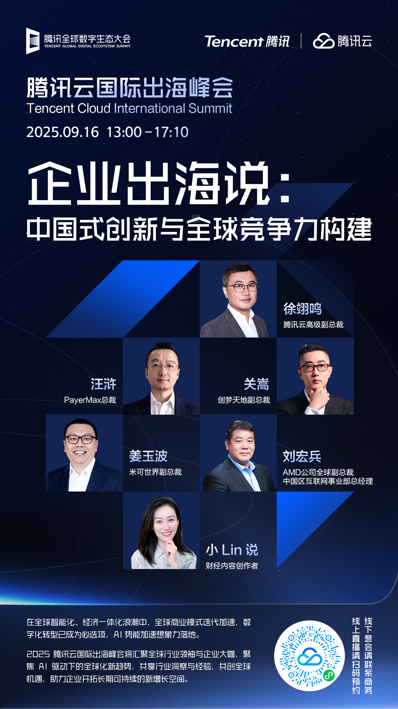

# 【直播报名】企业出海说：中国式创新与全球竞争力构建

> 公众号: 腾讯云出海服务
> 发布时间: 2025-09-05 12:00
> 原文链接: https://mp.weixin.qq.com/s/NwbGTdYGXKgH9AIMZ9oGVA

---

***活动介绍***

伴随全球智能化、经济一体化浪潮深入发展，中国企业正以独特的创新基因和敏捷模式，重新定义国际竞争格局。从“数字化出海”到“出海数字化”，从产品输出到技术与品牌的双重赋能，中国企业正在全球市场展现出前所未有的创新与活力。

腾讯云国际出海峰会企业出海说环节将以“中国式创新与全球竞争力构建”为主题，聚焦AI技术驱动下的全球化新趋势，共同探讨中国企业出海的战略选择与实战经验。

峰会还将围绕AI赋能业务全球化、数字化基础设施构建、企业本地化运营等话题，分享行业洞察与前瞻思考，助力企业把握国际市场新机遇，拓展更广阔的发展空间。

我们诚挚地邀请您云端参会，共同聆听精彩内容，探索企业出海的新可能。欢迎扫码预约直播，期待与您线上相见。

***圆桌嘉宾阵容***

**-END-**

#

# ①[腾讯游戏云：入选全球「Leader」象限，中国唯一](https://mp.weixin.qq.com/s?__biz=Mzg5NjgyNDMyOQ==&mid=2247487711&idx=1&sn=e95a076e94b67a7221a190cd3d4eb7b6&scene=21#wechat_redirect)

#

# ②[腾讯云助力识季打造内部办公桌面智能助手 人工服务成本降低40%](https://mp.weixin.qq.com/s?__biz=Mzg5NjgyNDMyOQ==&mid=2247487706&idx=1&sn=956e763d01bb134b409cc2310158e05b&scene=21#wechat_redirect)

#

# ③[《太空杀》革新AI原生玩法！腾讯混元大模型驱动“AI残局对决”](https://mp.weixin.qq.com/s?__biz=Mzg5NjgyNDMyOQ==&mid=2247487697&idx=1&sn=27ca8eadd10469970c4dad164512463b&scene=21#wechat_redirect)

****关注我，及时获取互联网出海相关的行业趋势、云解决方案、实践案例等最新资讯****