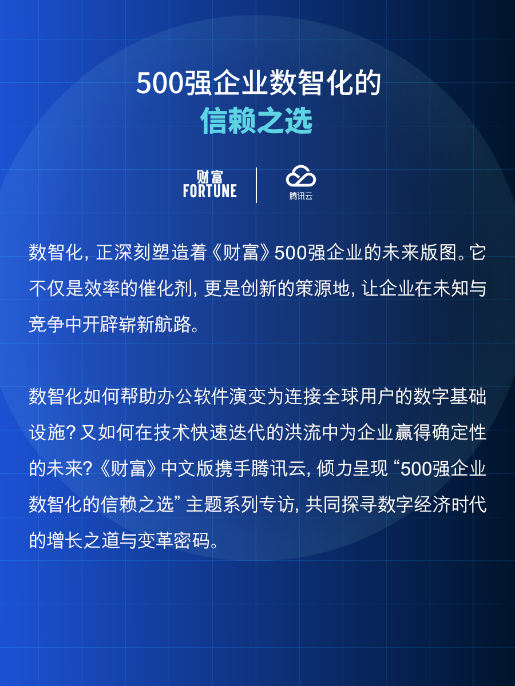
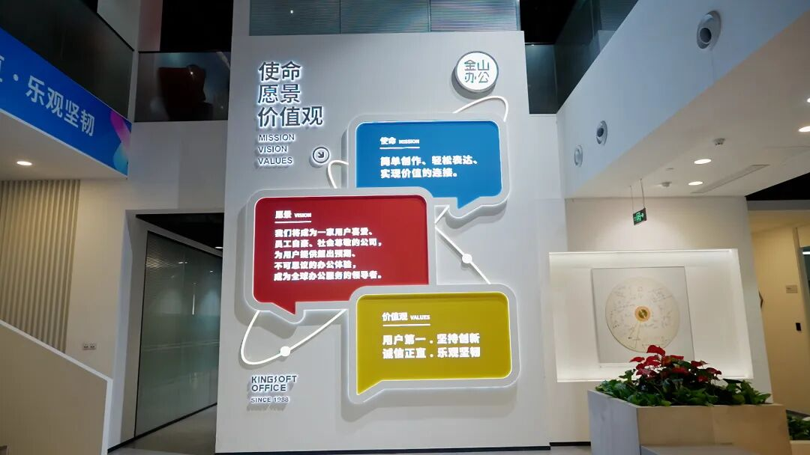
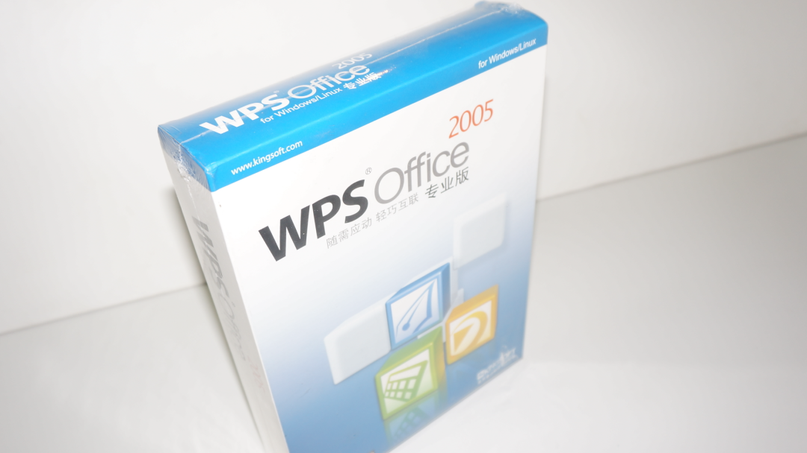
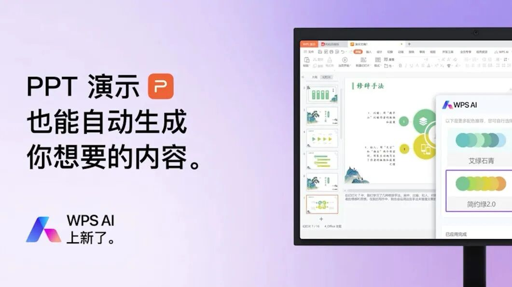
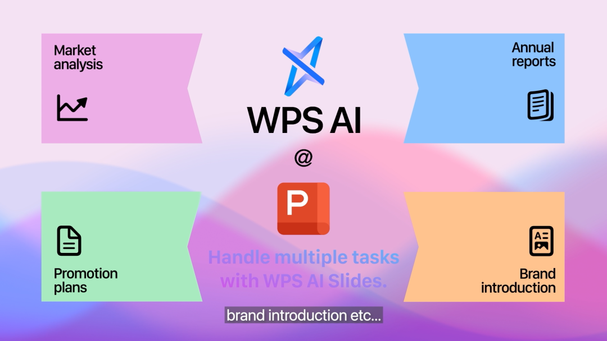
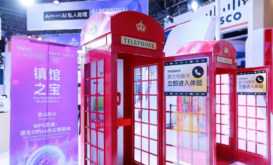
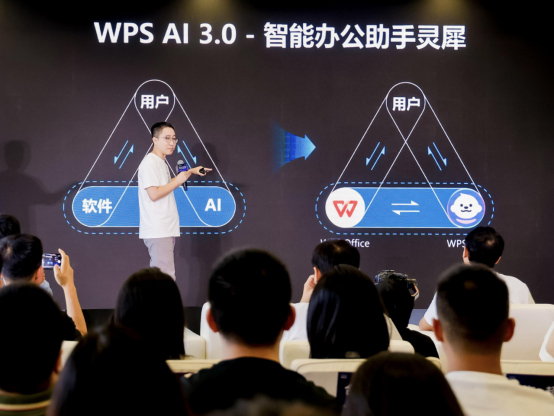
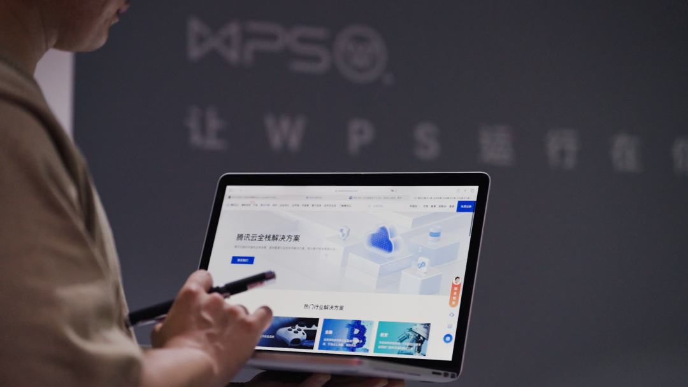
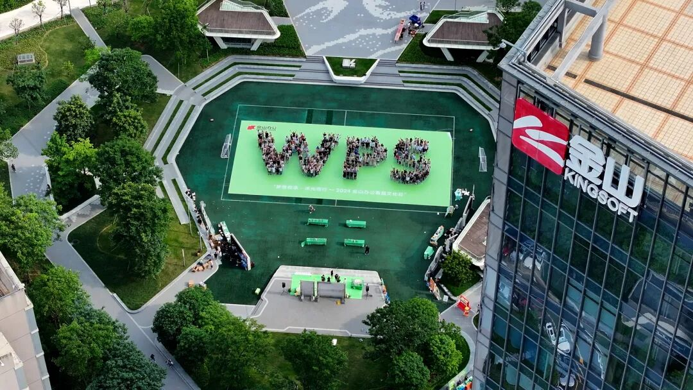
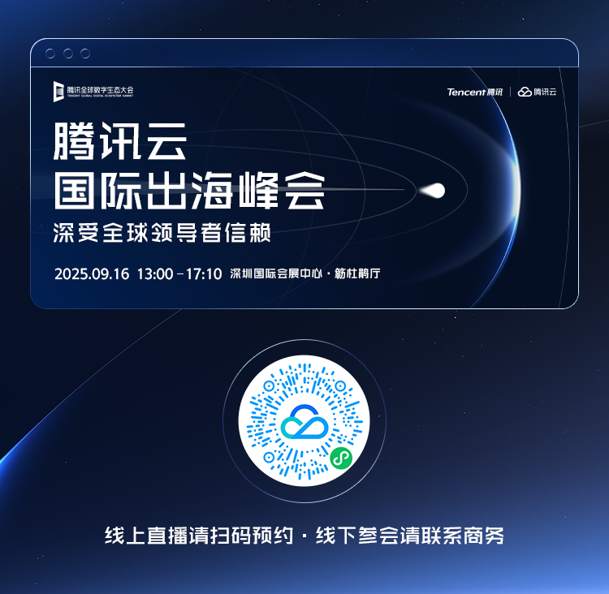

# 从WPS1.0到WPS灵犀，不变的是用户优先——《财富》专访金山办公CEO章庆元

> 公众号: 腾讯云出海服务
> 发布时间: 2025-09-06 12:04
> 原文链接: https://mp.weixin.qq.com/s/NC4PNQJ1V9-1t_tWB83p2g

---

1865年，刚刚就任丹麦皇家聋人学院校长的拉斯姆斯·马林-汉森（Rasmus Malling-Hansen）在繁忙的工作之余，发明了一台名为“汉森写作球”的机器。作为人类历史上第一台商业化的打字机，尽管汉森写作球为拉斯姆斯校长带来了无数财富，但也有人说，它的诞生，只是这位伟大的教育家希望能够用文字来帮助自己的特殊学生们更好地融入世界。

100多年后，施乐公司的员工查尔斯·西蒙尼（Charles Simonyi）开发出了实际上第一款可视化的文本编辑软件Bravo，并在跳槽到微软后，带领团队主导研发了大名鼎鼎的Microsoft Word。在数千年前人类第一次发明纸张之后，书写和阅读终于不再囿于现实载体，承载于语言和文字之上的人类文明的连接，变得愈发频繁与紧密。

“金山办公的使命是简单创作、轻松表达、实现价值的连接。”面对镜头，金山办公CEO章庆元的话语坚定而有力。

金山办公CEO章庆元

技术立业，用户第一

1988年，从国防科学技术大学毕业四年的求伯君，终于下定了决心，要南下到繁华的港岛去闯荡一番。在那里，求伯君与金山办公完成了第一次握手。

一年后，求伯君写下12万行代码，为金山办公开发出了WPS1.0。作为中国人独立自主研发的中文字处理器，WPS1.0的诞生比Word for Windows还要早上一年。此后，金山办公发售了更适合中国用户与中国市场的WPS97，大获成功。

“我记得我刚来金山办公的时候，墙上挂着一句Slogan（口号）——‘让我们的软件运行在每一台电脑上面’。”章庆元告诉《财富》（中文版），“我加入金山办公已经25年，这25年来我觉得我们最喜欢的、最首要关注的还是用户的体验。对我们来说，用户数量可能会比各方面的商业利益排得更靠前一点。”

金山办公的使命、愿景及价值观

这不是章庆元的信口之言。1996年，已经占据中文办公市场半壁江山的WPS选择接受微软抛来的橄榄枝，与Word互相兼容格式。2005年，WPS Office 2005版本发布。该版本全面重写了所有代码，从底层架构上实现了与Microsoft Office全套办公软件在文件格式、用户界面及二次开发接口上的高度兼容。同时，WPS宣布个人版产品完全免费，不仅为中国无数个人用户带来了免费且易用的办公软件服务，更标志着其向互联网产品转型的正式开启。

WPS Office 2005版本

“在我看来，这是金山办公历史上最重要的转折点之一。”章庆元说，“积极拥抱互联网技术为金山办公带来了目前最大的一块收入，即WPS个人版的收入。我们比较庆幸的是，至少在过去30多年间，金山办公一直航行在行业发展的大潮中，我们一直与时俱进，也算是抓住了每一次机会，然后积极地改变自己，去拥抱新时代带来的技术变革。我们有时候自己说每隔几年我们就会折腾一次，每隔几年就会变化一次。刚开始搞互联网，移动互联网又来了，移动互联网搞得七七八八的时候，正觉得歇一口气的时候，AI时代又来了。时代在变化，金山办公人的思维也一直在变化。”

积极求变中，金山办公的辛勤耕耘终于收获了硕果。2024年底，WPS Office for PC在国内市场的日活跃设备数已经突破1亿，正式开启国产办公软件的新篇章，与此同时，积极拥抱移动互联网技术的WPS，在移动端的市占率已经悄然攀升至90%以上。

“每一家成功的企业，都会有一个筚路蓝缕的开端，同时又会有一个不断创新、与时俱进、审时度势的过程。”章庆元说。

AI，办公模式的下一次生产力革命

当《财富》（中文版）问起金山办公的下一步技术重心会转向何处时，章庆元显然胸有成竹：“未来几年，我们觉得AI技术可能会在办公软件行业带来更颠覆性的变革。”

无独有偶，办公软件市场的两大巨头，都同时盯上了AI技术。2016年，微软找到了还处于初创期的OpenAI，为其注资10亿美元，共同研发AI技术。六年后，OpenAI发布了全新聊天机器人ChatGPT，微软则于2023年3月基于GPT-4模型推出了Copilot功能，支持文档生成、演示文稿创作及数据分析等功能，通过侧边栏形式提供智能辅助。

作为技术路线出身的CEO，章庆元对AI技术有着相当高的期待：“我自己觉得，AI最核心的、最颠覆性的能力还是它的形态和理解能力。它跟过去的几次技术跃迁，比如说移动互联网完全不一样。我们人类是碳基生命，而AI被称为硅基生命也不为过，虽然这是一个硅基生命，但它具有一定智能的时候，其实这个层面上的技术跃迁，对人类社会带来的影响会是非常深远的。”

当《财富》（中文版）问及AI会具体为办公软件行业带来哪些革新时，章庆元和我们聊起了帕累托法则（二八定律）：“软件行业通常认为，80%的用户只会使用20%的功能。在过去，我们不能只为WPS Office开发20%的功能，因为剩下的80%的需求仍然存在。又因为不同的用户可能会在某些特定时刻使用到这80%繁杂功能中的一小部分，导致绝大多数用户需要为办公软件投入大量的学习成本。”

WPS AI

“但AI出现之后，我们终于看到了解决这一问题的曙光。”章庆元告诉《财富》（中文版），“AI会带来交互方式的革新。曾经，用户需要主动学习，需要适应计算机的机器语言和交互方式，才能熟练地掌握各项生产力工具；在AI技术发展成熟以后，该轮到机器主动学习人类的语言、文字和思维方式了。用户只需要告诉AI他需要什么，AI就会主动把作品呈递出来。”

“我觉得未来人类应该就把大部分精力花在自己的创新上面，只要我有创新的idea，制作过程就不再困扰任何创作者。”章庆元说。

基于这一判断，在章庆元的带领下，金山办公提出了“All in AI”战略。然而与他们的“老对手”，同时也是“老朋友”的微软不同，金山办公并未走上自主研发大模型的道路，而是选择把专业的事情交给专业的人。

WPS AI

“我们不做大模型。”章庆元的语气很坚定，“AI行业还处在快速迭代的发展期，城头变幻大王旗，今天还是这家最强，明天可能就是另外一家，而我们会永远选择市面上最好的合作伙伴。”

在访谈中，《财富》（中文版）了解到，金山办公内部即将举办一次AI编程大赛。这一比赛不限制参与人员的身份，但不允许参赛选手亲自编写代码，只能利用AI去实现代码功能。

“我们觉得这很有意义。”章庆元的脸上流露出一丝笑容，“我们希望公司所有的员工。都能够去使用各种行业里最好的模型，去研究大模型行业的实时进展。”

“最重要的是，我们可以不研发大模型，但我们要保持并且不断提高驾驭大模型的能力。我们希望能把大模型用到极致。”章庆元说。

在访谈结束后不久，2025世界人工智能大会期间，金山办公推出WPS AI 3.0——WPS灵犀，用户只需通过自然语言、多轮对话，即可完成文档创作、演示文稿生成及语音助手等功能。

WPS AI 3.0的发布标志着办公AI的能力已从工具升级为AI助理，办公正在走向人人都有AI助理的时代。WPS用户可以拥有好用的AI助理，以低使用门槛的人机交互模式，轻松地完成各项工作。

WPS灵犀获评世界人工智能大会“镇馆之宝"

发布会上，金山办公助理总裁田然现场演示：新发布的WPS灵犀集成AI写作、AI PPT、灵犀语音助手、WPS知识库等功能。用户仅需在WPS Office右侧对话框用口语提出需求，左侧文档即可实时完成修改，无需跳转第三方应用，全程保留图文混排、复杂表格等原始版式，并可在手机端通过语音与数百页文档“通话式”交互，几秒钟就能提炼关键信息。

金山办公助理总裁田然分享WPS AI 3.0的理念

毫无疑问的是，随着此次“发布即交付”，章庆元为我们描绘的WPS AI蓝图已然缓缓展开，WPS AI月活有望从目前的2000万迅速放大，进一步巩固中国AI办公应用全球领先地位。

云上基底助力金山办公再次跃迁

在访谈中，《财富》（中文版）感受到，金山办公对技术的尊重是其与生俱来的信条。既然选择了不亲自下场，逐鹿AI行业，那么就一定要选择一个专业的合作伙伴。

金山办公选择了腾讯云。

“腾讯云一直是我们合作伙伴。”章庆元告诉《财富》（中文版），“WPS从很早开始就一直注重为用户提供云服务。用户在使用WPS时，创作的内容会实时同步到云端，避免用户因为忘记保存或机器突发状况而丢失他们的工作进度，这是WPS的优势之一。”

在过去，金山办公也曾经自己搭建过IDC机房，试图通过自建网络来满足用户的云服务需求。“后来我们发现，这个事情还不如交给别人去做，用别人的服务会更好。”章庆元说。

“基于在云基建上的经验，我们自己也不做大模型。我们会用腾讯云的IDC云服务存储，包括他们的AI服务。多年以来，腾讯云为我们提供了非常好的服务，从技术上来说，腾讯云非常专业；从服务上来说，腾讯云非常负责。在腾讯云的支持下，无论是云服务，还是AI大模型，我们都能为用户提供相当不错的服务。”

WPS使用腾讯云全栈解决方案

从2025年开始，金山办公开始将市场重心转向海外。“我们很早就开始做全球化了。”章庆元告诉《财富》（中文版），“2007年，我们开始国际化进程，进入日本市场。但之前都是小打小闹，从今年开始，金山办公会真正把目标转向全球化。我们希望给全球的用户提供统一的产品，跟中国市场应该做到同一水平。而想要将全球用户通过WPS连接在一起，要解决各个地区的差异的问题，法律法规的问题，需要有更长期的、更有耐心的投入才行。腾讯云多年来的全球化经验也对我们有所帮助。”

在采访中，《财富》（中文版）得知，金山办公同样正在研发基于H5技术的云原生办公套件。“无论是云技术，还是AI技术，金山办公都在接触，在探索。”章庆元说，“我们还处在探索期，没有找到一个非常通用的标准来帮助我们进行下一次跃迁。但技术在不断进化，金山办公也会随着它一起不断的进化，并保持我们的领先优势，而腾讯云无疑是我们进步道路上的好伙伴。”

后记

两百多年来，人类每一次把技术扎进日常办公场景的尝试，都是在重新定义“连接”的含义：让文字跨越纸张与地域，让创意不再受限于工具，让每一个微小个体都能平等地参与到文明的进程之中。

今天，当AI让机器开始“说人话”、当云把算力变成随取随用的公共资源，金山办公再次选择与时间做朋友：不自造大模型，却练就驾驭大模型的能力；不重复建设重资产，而是把云与AI的底座交给最可信赖的伙伴——腾讯云。

《财富》相信，在通往全球化的下一程里，WPS的故事仍将续写。它不再只是中国人自己的办公软件，而是一套可以被世界共享的数字基础设施；它所承载的，也不再仅仅是文字与表格，而是人类用技术互相理解的共同语言。就像160年前那台为了“让学生更好地融入世界”而诞生的打字机一样，今天的金山办公，依旧在用技术的温度，让世界听见更多人的声音。

\*特刊 | 文中相关数据内容均来源于采访与公开信息资料，未经允许不得转载。

**-END-**

#

# ①[游族网络与腾讯云达成战略合作，共同推动游戏行业技术发展](http://mp.weixin.qq.com/s?__biz=Mzg5NjgyNDMyOQ==&mid=2247486965&idx=1&sn=259d9dc31bdb5557c84c438d5ed4303e&chksm=c07a6893f70de185b19befe5a8b6384c3734295d3a74ad458bda2fbae2dc19ed39f2d321c87c&scene=21#wechat_redirect)

#

# ②[亚思未来与腾讯云达成战略合作，共建东南亚AI直播电商平台](http://mp.weixin.qq.com/s?__biz=Mzg5NjgyNDMyOQ==&mid=2247486959&idx=1&sn=9c59c8343e957885e803881c40cae376&chksm=c07a6889f70de19fc95a008098f11710ca2b9eb9e86b7307bdf5adba67af636f8847ef6bfd32&scene=21#wechat_redirect)

#

# ③[XTransfer与腾讯云达成战略合作 助力外贸数字化转型](http://mp.weixin.qq.com/s?__biz=Mzg5NjgyNDMyOQ==&mid=2247486953&idx=1&sn=f51c4e85f210fde0ff413e0652ddefee&chksm=c07a688ff70de1994fc0b7fc915f8256347c16af547cd1ce8acca570d5acf0a3f4ae297353ca&scene=21#wechat_redirect)

****关注我，及时获取互联网出海相关的行业趋势、云解决方案、实践案例等最新资讯****

2025腾讯云国际出海峰会将汇聚全球行业领袖与企业大咖，聚焦AI驱动下的全球化新趋势，共享行业洞察与经验，共创全球机遇，助力企业开拓长期可持续的新增长空间。

立即锁定直播，获取前沿洞察，赋能企业迈向智能新时代！

